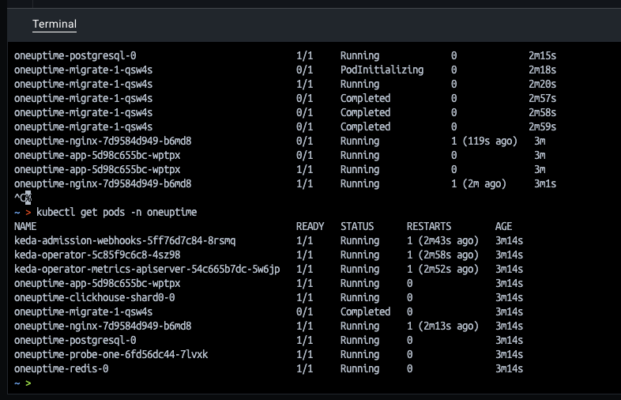
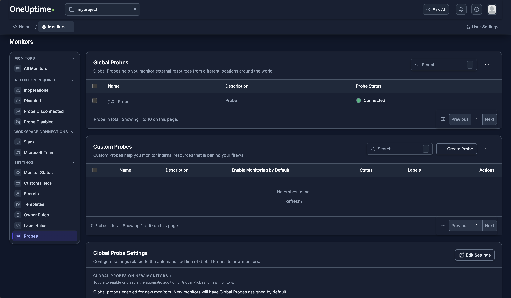

# Kubernetes Üzerinde Dağıtık OneUptime İzleme Mimarisi — Kurulum Adımları

## Ön Koşullar

Aşağıdaki araçların kurulu olduğunu doğrula:

```bash
docker --version
minikube version
kubectl version --client
helm version
```

---

## Aşama 1: K8s Cluster'ının Hazırlanması

### 1.1 — (Gerekirse) Önceki cluster'ı temizle

```bash
minikube delete --all
```

### 1.2 — 2 node'lu cluster'ı yeterli kaynakla başlat

```bash
minikube start --nodes 2 --memory=8192 --cpus=4
```

> `--memory` ve `--cpus` parametreleri, TLS handshake timeout gibi kaynak yetersizliğinden kaynaklanan hataları önlemek için eklendi.

### 1.3 — Doğrulama

```bash
kubectl get nodes
```

Her iki node'un da `STATUS` sütununda `Ready` olduğunu doğrula:

```
NAME           STATUS   ROLES           AGE   VERSION
minikube       Ready    control-plane   ...   v1.35.1
minikube-m02   Ready    <none>          ...   v1.35.1
```

Node isimleri sizde farklı olabilir , bizim nodelarımız minikube ve minikube-m02 olduğu için  komutları ona göre gireceğiz.
Sizde farklıysa komutlarınızı ona  göre girin lütfen.

---

## Aşama 2: Node Etiketleme (Labeling)

### 2.1 — Node'ları etiketle


```bash
kubectl label nodes minikube app=oneuptime-core
kubectl label nodes minikube-m02 app=oneuptime-probe
```

### 2.2 — Doğrulama

```bash
kubectl get nodes --show-labels
```

Her iki node'un LABELS sütununda ilgili etiketi (`app=oneuptime-core` / `app=oneuptime-probe`) görmen lazım. **Bu çıktı teslim dokümanına eklenecek çıktılardan biridir.**

---

## Aşama 3: OneUptime Ana Sisteminin Kurulumu (Node 1)

### 3.1 — Helm repo'sunu ekle

```bash
helm repo add oneuptime https://helm-chart.oneuptime.com/
helm repo update
```

> **Not:** `https://oneuptime.github.io/oneuptime-helm` adresi **yanlıştır** (404 verir). Doğru adres yukarıdaki gibidir.

### 3.2 — Namespace oluştur

```bash
kubectl create namespace oneuptime
```

### 3.3 — Chart'ın varsayılan değerlerini incele (opsiyonel ama önerilir)


```bash
helm show values oneuptime/oneuptime > default-values.yaml
grep -n "nodeSelector" default-values.yaml
```


Bu, `nodeSelector` alanlarının chart içinde tam olarak hangi yapıda (örn. `postgresql.primary.nodeSelector`, `redis.master.nodeSelector`) olduğunu görmeni sağlar.

### 3.4 — `values.yaml` dosyasını oluştur

Bu dosya; ana bileşenleri Node 1'e sabitler, ağır/gereksiz bileşenleri (ClickHouse, KEDA) kapatır, PostgreSQL kaynaklarını kısıtlar ve doğru host/port ayarını yapar.

```bash
cat > values.yaml << 'EOF'
host: "localhost:8080"
httpProtocol: http

# 1. Nginx Bloğu
nginx:
  nodeSelector:
    app: oneuptime-core

# 2. PostgreSQL Bloğu
postgresql:
  primary:
    nodeSelector:
      app: oneuptime-core

# 3. ClickHouse Bloğu
clickhouse:
  nodeSelector:
    app: oneuptime-core
  enabled: false

# 4. Redis Bloğu
redis:
  master:
    nodeSelector:
      app: oneuptime-core

# 5. App ve Worker Blokları
app:
  nodeSelector:
    app: oneuptime-core

worker:
  nodeSelector:
    app: oneuptime-core

# 6. Veritabanı Migrasyon Job'ı
migrate:
  nodeSelector:
    app: oneuptime-core

# 7. Varsayılan (Default) Probe
probes:
  one:
    # ... mevcut diğer ayarlar (name, description vb.) ...
    nodeSelector:
      app: oneuptime-core


EOF
```

### 3.5 — Kurulumu yap

```bash
helm install oneuptime oneuptime/oneuptime -n oneuptime -f values.yaml
```

Beklenen çıktı: `STATUS: deployed`

### 3.6 — Pod'ların çalıştığını doğrula



> Not: Burda gördüğünüz üzere podların ayağa kalkması internet hızınıza da bağlı olarak birkaç dakika alabilir.

```bash
kubectl get pods -n oneuptime -o wide
```

`NODE` sütununda tüm pod'ların `minikube` (Node 1) üzerinde olduğunu doğrula. **Bu çıktı teslim dokümanına eklenecek çıktılardan biridir.**

---

## Aşama 4: İkinci Probe Ajanının Kurulumu (Node 2)

### 4.1 — Arayüze eriş (port-forward)

Servisi doğrula:

```bash
kubectl get svc -n oneuptime oneuptime-nginx
```

Yeni bir terminal sekmesinde (bu terminal açık kalacak, arka planda çalışır):

```bash
kubectl port-forward svc/oneuptime-nginx 8080:80 -n oneuptime
```

Tarayıcıdan git:

```
http://localhost:8080
```

bu sayfa default olarak açıklacaktır fakat regiser olmak için şu linke gidin.

```
http://localhost:8080/accounts/register

```

### 4.2 — Hesap oluştur / giriş yap

Register ekranından yeni bir hesap oluştur, giriş yap.

> Not: `values.yaml` içindeki `host: "localhost:8080"` ayarı sayesinde Register/Login sırasında "Network Error" alınmaz.
> Not: localden gireceğimiz için http protokolünü http olarak belirliyoruz `values.yaml` dosyası içerisinde.

### 4.3 — Probe Key'i al

- **Project → Products -> Monitor -> probes**
- **Monitor sayfasında soldaki sidebar ın en altında probes sekmesi olacak**
- **"Add Probe"** butonuna tıkla
- İsim ver: `External-Probe-Node2`
- Oluştur, **Probe Key**'i kopyala
  

### 4.4 — `probe2-values.yaml` dosyasını oluştur

Arayüzden alınan gerçek Probe Key ile:

```bash
cat > probe2-values.yaml << 'EOF'
probes:
  two:
    name: "External-Probe-Node2"
    description: "Probe 2 on Node 2"
    enabled: true
    monitoringWorkers: 3
    monitorFetchLimit: 10
    key: "31a53a30-4ce1-4963-b5e9-a634e72a81b7" //bu sizin sistemden aldıgınız probe key olacak.
    replicaCount: 1
    ports:
      http: 3874
    nodeSelector:
      app: oneuptime-probe
EOF
```

### 4.5 — Upgrade ile ikinci probe'u ekle

```bash
helm upgrade oneuptime oneuptime/oneuptime -n oneuptime -f values.yaml -f probe2-values.yaml
```

> Her iki values dosyası da **birlikte** verilmeli, yoksa `values.yaml`'daki ayarlar (clickhouse kapalı, node yerleşimi vb.) sıfırlanır.

### 4.6 — Doğrulama

```bash
kubectl get pods -n oneuptime -o wide
```

`oneuptime-probe-two-...` isimli yeni pod'un `NODE` sütununda `minikube-m02` (Node 2) yazdığını doğrula.

**Sonuç (gerçekleşen çıktı):**

```
NAME                                               READY   STATUS    RESTARTS   AGE   NODE
oneuptime-probe-one-77f6b787b7-gx9r8               1/1     Running   0          47s   minikube
oneuptime-probe-two-57c685c7ff-wqmhf               1/1     Running   0          71s   minikube-m02
```

✅ `probe-one` → Node 1, `probe-two` → Node 2. Görev gereksinimi (Aşama 4, madde 3) karşılandı.

---

## Aşama 5: Çapraz İzleme (Cross-Monitoring) Konfigürasyonu

### 5.1 — Arayüzden her iki probe'un da Online olduğunu doğrula

Dashboard → **Probes** sayfası (`http://localhost:8080/dashboard/<proje-id>/settings/probes`):

- `Probe` (Node 1, default) → **Connected/Online** ✅
- `External-Probe-Node2` (Node 2) → **Connected/Online** ✅

### 5.2 — Node 2'de izlenecek basit bir hedef oluştur

```bash
kubectl run nginx-target --image=nginx --overrides='{"spec": {"nodeSelector": {"app": "oneuptime-probe"}}}' -n oneuptime
kubectl expose pod nginx-target --port=80 --name=nginx-target-svc -n oneuptime
```

**Doğrulama:**

```bash
kubectl get pods -n oneuptime -o wide | grep nginx-target
kubectl get svc -n oneuptime nginx-target-svc
```

`nginx-target` pod'unun `NODE` sütununda `minikube-m02` (Node 2) yazdığı doğrulandı.

### 5.3 — Monitor 1'i oluştur: Node 1'deki probe → Node 2'yi izlesin

Dashboard → **Monitors → Create Monitor**:

| Alan         | Değer                                                 |
| ------------ | ----------------------------------------------------- |
| Monitor Type | Website                                               |
| Monitor Name | `Node2-Nginx-Health-Check`                            |
| URL          | `http://nginx-target-svc.oneuptime.svc.cluster.local` |
| Probe        | **Probe** (Node 1, default)                           |

✅ Bu monitor, **Node 1'deki probe'un Node 2'yi ağ üzerinden izlemesini** sağlar.

### 5.4 — Monitor 2'yi oluştur: Node 2'deki probe → Node 1'i izlesin

Dashboard → **Monitors → Create Monitor**:

| Alan         | Değer                                                               |
| ------------ | ------------------------------------------------------------------- |
| Monitor Type | Website                                                             |
| Monitor Name | `Node1-App-Health-Check`                                            |
| URL          | `http://oneuptime-app.oneuptime.svc.cluster.local:3002/status/live` |
| Probe        | **External-Probe-Node2**                                            |

✅ Bu monitor, **Node 2'deki probe'un Node 1'deki ana sistemi izlemesini** sağlar.

> Not: `/status/live` endpoint'i, chart'ın kendi `startupProbe`/`livenessProbe` tanımlarında zaten kullanılan health-check yoludur (bkz. Aşama 3'teki OOM/probe log analizinde görülen `Get "http://.../status/live"` isteği), bu yüzden ana sistemin sağlık durumunu izlemek için doğru path budur.

### 5.5 — Doğrulama

Her iki Monitor'ün detay sayfasına girildi:

- **Status**: `Operational` / `Online`
- **Monitor Events / Logs** sekmesinde başarılı check kayıtları görüldü

✅ Çapraz izleme topolojisi tamamlandı: Node 1 ↔ Node 2 karşılıklı olarak birbirini izliyor.

---

## Proje Sonucu — Özet

| Gereksinim                                             | Durum         |
| ------------------------------------------------------ | ------------- |
| 2 node'lu Kubernetes cluster (minikube)                | ✅ Tamamlandı |
| Node etiketleme (`oneuptime-core` / `oneuptime-probe`) | ✅ Tamamlandı |
| Ana sistem + default probe → Node 1                    | ✅ Tamamlandı |
| İkinci (external) probe → Node 2                       | ✅ Tamamlandı |
| Her iki probe "Online"                                 | ✅ Tamamlandı |
| Çapraz izleme (Node 1 ↔ Node 2)                        | ✅ Tamamlandı |

---

## Teslim Beklentileri (Çıktılar)

1. **Terminal Çıktıları:**
   - `kubectl get nodes --show-labels`
   - `kubectl get pods -n oneuptime -o wide`
2. **Arayüz Ekran Görüntüleri:**
   - Her iki probe'un "Online" olarak listelendiği ekran (Probes sayfası)
   - `Node2-Nginx-Health-Check` ve `Node1-App-Health-Check` monitörlerinin detay/metrik sayfaları
3. **Karşılaşılan Sorunlar ve Çözümleri** (bkz. aşağıdaki bölüm)

---

## Karşılaşılan Sorunlar ve Çözümleri (Troubleshooting Notları)

| Sorun | Sebep | Çözüm |
| ----- | ----- | ----- |

| Pod'lar `CrashLoopBackOff` / `CreateContainerConfigError` | ClickHouse ve bu görev için gereksiz, kaynak tüketip zincirleme hatalara yol açıyordu | `clickhouse.enabled: false`, `keda.enabled: false` ile devre dışı bırakıldı |

| `net/http: TLS handshake timeout` | Host makine (Docker Desktop) kaynak yetersizliği / CPU baskısı | Docker Desktop kaynakları arttırıldı, `minikube start --memory=8192 --cpus=4` ile cluster daha fazla kaynakla başlatıldı |

| `Request failed to http://localhost/identity/signup. Network Error` | Chart'ın `host` değeri portsuz (`localhost`) iken uygulamaya `:8080`'den erişiliyordu | `values.yaml`'a `host: "localhost:8080"` ve `httpProtocol: http` eklendi |

| Namespace/pod'lar silinmiyor / cluster tamamen bozuldu | Birikmiş crashloop'lar ve kaynak sıkıntısı | `minikube delete --all` ile temiz sıfırlama, ardından yeterli kaynakla (`--memory=10240 --cpus=4`) yeniden kurulum |

| `oneuptime-migrate` job'u `OOMKilled` | `NODE_OPTIONS=--max-old-space-size=8096` (8GB) sabit kodlanmış, chart values'tan değiştirilemiyor; node'un toplam fiziksel belleği bu yükü kaldıramadı | Docker Desktop belleği arttırıldı, `minikube start --memory=8192` ile her node'a daha fazla fiziksel bellek verildi; migrate job birkaç retry sonrası (`backoffLimit: 6`) başarıyla tamamlandı |

| `app` / `nginx` pod'ları rolling update sırasında `OOMKilled` | Rolling update esnasında eski+yeni pod aynı anda ayakta kalıp bellek talebi geçici olarak ikiye katlandı | Pod'lar otomatik olarak yeniden başlayıp (`RESTARTS` sayacı arttı) kendini toparladı; kalıcı çözüm olarak node bellek kapasitesinin arttırılması önerildi |

> **Not:** `minikube delete --all` sadece cluster'ı (container, node, pod) siler; `values.yaml` gibi yerel dosyalar diskte kalır ve yeniden kurulumda aynen kullanılabilir.

> **Öğrenilen genel ders:** Bu chart'ın schema validasyonu (`values.schema.json`) oldukça katı — `env`/`NODE_OPTIONS` gibi bazı alanlar hiçbir serviste değiştirilebilir değil, sadece , `nodeSelector`, `tolerations`, `affinity` gibi standart Kubernetes alanları override edilebiliyor. Bu yüzden bellek sorunlarında container içi ayarları değiştirmek yerine, node'un toplam fiziksel kaynağını arttırmak en güvenilir çözüm oldu.
