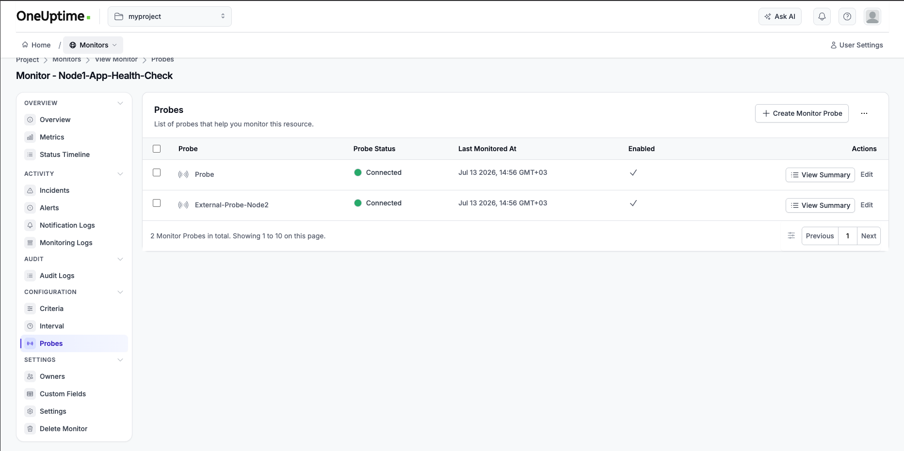
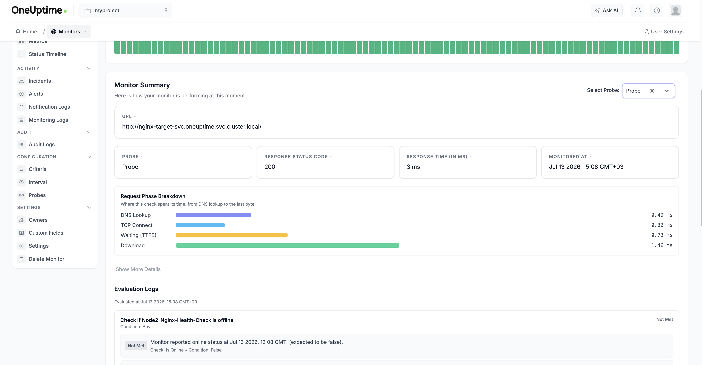
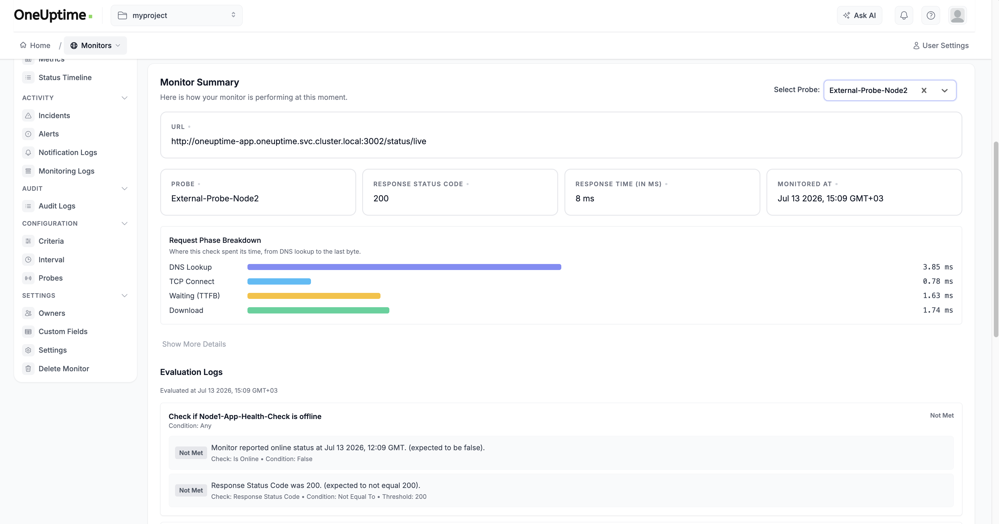

# Distributed OneUptime Monitoring on Kubernetes

A hands-on implementation of a two-node Kubernetes cluster running OneUptime, configured so that the core system and its default probe live on Node 1, an external probe lives on Node 2, and each node cross-monitors the other over the network.

---

## Table of Contents

1. [Prerequisites](#1-prerequisites)
2. [Phase 1 — Provisioning the Cluster](#phase-1--provisioning-the-cluster)
3. [Phase 2 — Node Labeling](#phase-2--node-labeling)
4. [Phase 3 — Installing the OneUptime Core System (Node 1)](#phase-3--installing-the-oneuptime-core-system-node-1)
5. [Phase 4 — Deploying the Second Probe (Node 2)](#phase-4--deploying-the-second-probe-node-2)
6. [Phase 5 — Cross-Monitoring Configuration](#phase-5--cross-monitoring-configuration)
7. [Project Summary](#project-summary)
8. [Deliverables Checklist](#deliverables-checklist)
9. [Troubleshooting Log](#troubleshooting-log)

---

## 1. Prerequisites

Confirm the following tools are installed locally before starting:

```bash
docker --version
minikube version
kubectl version --client
helm version
```

---

## Phase 1 — Provisioning the Cluster

### 1.1 Clean up any previous cluster (if applicable)

```bash
minikube delete --all
```

### 1.2 Start a two-node cluster with sufficient resources

```bash
minikube start --nodes 2 --memory=8192 --cpus=4
```

> The `--memory` and `--cpus` flags are set explicitly to avoid resource-starvation symptoms such as `TLS handshake timeout` on the API server, which can occur on default (lightweight) minikube profiles.

### 1.3 Verify

```bash
kubectl get nodes
```

Both nodes should report `Ready`:

```
NAME           STATUS   ROLES           AGE   VERSION
minikube       Ready    control-plane   ...   v1.35.1
minikube-m02   Ready    <none>          ...   v1.35.1
```

> Node names may differ on your machine. This guide assumes `minikube` and `minikube-m02`; substitute your own node names in every command below if they differ.

---

## Phase 2 — Node Labeling

### 2.1 Label each node by role

```bash
kubectl label nodes minikube app=oneuptime-core
kubectl label nodes minikube-m02 app=oneuptime-probe
```

### 2.2 Verify

```bash
kubectl get nodes --show-labels
```

Confirm each node carries the correct label in the `LABELS` column. **This output is one of the required deliverables.**

---

## Phase 3 — Installing the OneUptime Core System (Node 1)

### 3.1 Add the Helm repository

```bash
helm repo add oneuptime https://helm-chart.oneuptime.com/
helm repo update
```

### 3.2 Create the namespace

```bash
kubectl create namespace oneuptime
```

### 3.3 Inspect the chart's default values (optional, but recommended)

```bash
helm show values oneuptime/oneuptime > default-values.yaml
grep -n "nodeSelector" default-values.yaml
```

This reveals the exact structure each `nodeSelector` field expects (e.g. `postgresql.primary.nodeSelector`, `redis.master.nodeSelector`), which varies by sub-component.

### 3.4 Build `values.yaml`

This file pins the core components to Node 1, disables heavy/unnecessary components (ClickHouse, KEDA), and sets the correct host/port so the local dashboard can be reached.

```bash
cat > values.yaml << 'EOF'
host: "localhost:8080"
httpProtocol: http

# Disable components that are unnecessary for this exercise
clickhouse:
  enabled: false

keda:
  enabled: false

# Pin core components to Node 1
nginx:
  nodeSelector:
    app: oneuptime-core

postgresql:
  primary:
    nodeSelector:
      app: oneuptime-core

redis:
  master:
    nodeSelector:
      app: oneuptime-core

app:
  nodeSelector:
    app: oneuptime-core

worker:
  nodeSelector:
    app: oneuptime-core

migrate:
  nodeSelector:
    app: oneuptime-core

probes:
  one:
    nodeSelector:
      app: oneuptime-core
EOF
```

### 3.5 Install the chart

```bash
helm install oneuptime oneuptime/oneuptime -n oneuptime -f values.yaml
```

Expected output: `STATUS: deployed`

### 3.6 Confirm pods are running

```bash
kubectl get pods -n oneuptime -w
```

> Pod startup can take a few minutes depending on your internet connection (large images need to be pulled). This is a good moment for a coffee break.

```bash
kubectl get pods -n oneuptime -o wide
```

Confirm every pod's `NODE` column reads `minikube` (Node 1). **This output is one of the required deliverables.**

---

## Phase 4 — Deploying the Second Probe (Node 2)

### 4.1 Access the dashboard via port-forward

Verify the service:

```bash
kubectl get svc -n oneuptime oneuptime-nginx
```

In a **separate terminal tab** (this one will stay open, running in the foreground):

```bash
kubectl port-forward svc/oneuptime-nginx 8080:80 -n oneuptime
```

Open in your browser:

```
http://localhost:8080
```

To register directly, navigate to:

```
http://localhost:8080/accounts/register
```

### 4.2 Create an account / sign in

Register a new account from the sign-up screen and log in.

> `host: "localhost:8080"` and `httpProtocol: http` in `values.yaml` are what prevent a `Network Error` during registration — if you see one, double-check these two fields.

### 4.3 Retrieve the Probe Key

- Navigate to **Project → Products → Monitor → Probes** (the "Probes" tab sits at the bottom of the Monitor sidebar)
- Click **"Add Probe"**
- Name it `External-Probe-Node2`
- Create it, then copy the generated **Probe Key**

### 4.4 Create `probe2-values.yaml`

Using the real key retrieved from the dashboard:

```bash
cat > probe2-values.yaml << 'EOF'
probes:
  two:
    name: "External-Probe-Node2"
    description: "Probe 2 on Node 2"
    enabled: true
    monitoringWorkers: 3
    monitorFetchLimit: 10
    key: ""   # leave blank — the chart self-registers the probe automatically
    replicaCount: 1
    ports:
      http: 3874
    nodeSelector:
      app: oneuptime-probe
EOF
```

> **Important:** leave `key` blank, exactly like `probes.one`. Manually copying a key generated via the dashboard's "Create Probe" button creates a *Custom Probe* record — a different registration path that will collide with the chart's own auto-registration flow and produce an `already exists` error on boot. Letting the field stay empty allows the probe pod to self-register cleanly, the same way the default probe does.

### 4.5 Upgrade the release to add the second probe

```bash
helm upgrade oneuptime oneuptime/oneuptime -n oneuptime -f values.yaml -f probe2-values.yaml
```

> Both values files must be supplied together — omitting `values.yaml` would reset previously applied settings (disabled components, node placement, etc.).

### 4.6 Verify placement

```bash
kubectl get pods -n oneuptime -o wide
```

Confirm the new `oneuptime-probe-two-...` pod's `NODE` column reads `minikube-m02` (Node 2).

**Actual result:**

```
NAME                                    READY   STATUS    RESTARTS   AGE   NODE
oneuptime-probe-one-77f6b787b7-gx9r8    1/1     Running   0          47s   minikube
oneuptime-probe-two-57c685c7ff-wqmhf    1/1     Running   0          71s   minikube-m02
```

✅ `probe-one` → Node 1, `probe-two` → Node 2. This satisfies the Phase 4 placement requirement.

---

## Phase 5 — Cross-Monitoring Configuration

### 5.1 Confirm both probes report Online

Dashboard → **Probes** page:

- `Probe` (Node 1, default) → **Connected/Online** ✅
- `External-Probe-Node2` (Node 2) → **Connected/Online** ✅

The screenshot below (taken from a monitor's **Probes** tab) confirms both probes are registered and connected:


*Both the default probe (Node 1) and External-Probe-Node2 (Node 2) report "Connected".*

### 5.2 Create a lightweight target on Node 2

```bash
kubectl run nginx-target --image=nginx --overrides='{"spec": {"nodeSelector": {"app": "oneuptime-probe"}}}' -n oneuptime
kubectl expose pod nginx-target --port=80 --name=nginx-target-svc -n oneuptime
```

**Verify:**

```bash
kubectl get pods -n oneuptime -o wide | grep nginx-target
kubectl get svc -n oneuptime nginx-target-svc
```

Confirm `nginx-target`'s `NODE` column reads `minikube-m02` (Node 2).

### 5.3 Create Monitor 1: Node 1's probe → watches Node 2

Dashboard → **Monitors → Create Monitor**:

| Field | Value |
|---|---|
| Monitor Type | Website |
| Monitor Name | `Node2-Nginx-Health-Check` |
| URL | `http://nginx-target-svc.oneuptime.svc.cluster.local` |
| Probe | **Probe** (Node 1, default) |

✅ This monitor lets **Node 1's probe check Node 2's reachability** over the network.

Once the check runs, the monitor's summary confirms the probe used and a successful response:


*`Node2-Nginx-Health-Check` — served by "Probe" (Node 1), HTTP 200 in 3 ms against `nginx-target-svc`.*

### 5.4 Create Monitor 2: Node 2's probe → watches Node 1

Dashboard → **Monitors → Create Monitor**:

| Field | Value |
|---|---|
| Monitor Type | Website |
| Monitor Name | `Node1-App-Health-Check` |
| URL | `http://oneuptime-app.oneuptime.svc.cluster.local:3002/status/live` |
| Probe | **External-Probe-Node2** |

✅ This monitor lets **Node 2's probe check the core system's health** on Node 1.

> `/status/live` is the same health-check path already used internally by the chart's `startupProbe`/`livenessProbe` definitions (confirmed during earlier OOM/probe log analysis), making it the correct endpoint for verifying the core system's health.

The monitor summary below confirms it is served by `External-Probe-Node2` and receiving a healthy response from Node 1:


*`Node1-App-Health-Check` — served by "External-Probe-Node2" (Node 2), HTTP 200 in 8 ms against the core app's `/status/live` endpoint.*

### 5.5 Final verification

Both monitors were opened individually and confirmed:

- **Status**: `Operational` / `Online`
- **Monitor Events / Evaluation Logs** show successful, passing checks

✅ The cross-monitoring topology is complete: Node 1 and Node 2 monitor each other bidirectionally, exactly as required.

---

## Project Summary

| Requirement | Status |
|---|---|
| Two-node Kubernetes cluster (minikube) | ✅ Done |
| Node labeling (`oneuptime-core` / `oneuptime-probe`) | ✅ Done |
| Core system + default probe → Node 1 | ✅ Done |
| Second (external) probe → Node 2 | ✅ Done |
| Both probes report Online | ✅ Done |
| Cross-monitoring (Node 1 ↔ Node 2) | ✅ Done |

---

## Deliverables Checklist

1. **Terminal output:**
   - `kubectl get nodes --show-labels`
   - `kubectl get pods -n oneuptime -o wide`
2. **Dashboard screenshots:**
   - Both probes listed as "Online" (Probes page) — see [5.1](#51-confirm-both-probes-report-online)
   - `Node2-Nginx-Health-Check` and `Node1-App-Health-Check` monitor detail/summary pages — see [5.3](#53-create-monitor-1-node-1s-probe--watches-node-2) and [5.4](#54-create-monitor-2-node-2s-probe--watches-node-1)
3. **Issues encountered and resolutions** — see below

---

## Troubleshooting Log

| Issue | Root Cause | Resolution |
|---|---|---|
| Pods stuck in `CrashLoopBackOff` / `CreateContainerConfigError` | ClickHouse and KEDA are unnecessary for this exercise and were consuming resources, triggering cascading failures | Disabled via `clickhouse.enabled: false` and `keda.enabled: false` |
| `net/http: TLS handshake timeout` | Host machine (Docker Desktop) resource starvation / CPU pressure | Increased Docker Desktop's allocated resources; started the cluster with `minikube start --memory=8192 --cpus=4` |
| `Request failed to http://localhost/identity/signup. Network Error` | Chart's `host` value was portless (`localhost`) while the app was accessed on `:8080` | Added `host: "localhost:8080"` and `httpProtocol: http` to `values.yaml` |
| Namespace/pods refuse to delete cleanly / cluster becomes unusable | Accumulated crash loops and resource exhaustion | Full reset via `minikube delete --all`, followed by a clean install with adequate resources |
| `oneuptime-migrate` job `OOMKilled` | The chart hard-codes `NODE_OPTIONS=--max-old-space-size=8096` (an 8 GB heap ceiling); this value cannot be overridden through `values.yaml` (no `env` field is exposed for this job), and total node memory was insufficient | Increased Docker Desktop's memory allocation and started nodes with `--memory=8192`; the migration job completed successfully after a few automatic retries (`backoffLimit: 6`) |
| `app` / `nginx` pods `OOMKilled` during rolling updates | During a rolling update, the old and new pod briefly coexist, temporarily doubling memory demand | Pods self-healed automatically (restart count increased); the durable fix is provisioning enough node memory headroom, and/or switching `deployment.updateStrategy` to a Recreate-equivalent (`maxSurge: 0`, `maxUnavailable: "100%"`) to avoid the overlap entirely |
| Second probe stuck `Disconnected`, log shows `Probe registration failed: ... already exists` | The probe's `key` field was populated with a key copied from the dashboard's "Create Probe" button — that flow creates a *Custom Probe* record, a separate registration path from the chart's own auto-registration mechanism, causing an ID collision | Removed the conflicting database row directly via `psql`, then redeployed with `probes.two.key` left blank so the pod self-registers exactly like the default probe |
| Docker Hub `ImagePullBackOff` after repeated cluster rebuilds | Numerous full teardown/rebuild cycles (`minikube delete --all`) re-pulled every image from scratch each time, approaching Docker Hub's anonymous pull rate limit | Preferred `minikube stop` / `minikube start` (preserves the image cache) over `delete --all` for routine restarts; authenticated with `docker login` to raise the rate limit when a full rebuild was unavoidable |

> **Note:** `minikube delete --all` only removes the cluster (containers, nodes, pods); local files such as `values.yaml` remain on disk and can be reused as-is on the next install.

> **General lesson learned:** This chart's schema validation (`values.schema.json`) is strict — fields like `env`/`NODE_OPTIONS` are not exposed for override on any service; only standard Kubernetes fields such as `resources`, `nodeSelector`, `tolerations`, and `affinity` can be customized. As a result, the most reliable way to resolve memory-related failures was to increase the node's total physical resources rather than attempting to tune in-container settings that the chart does not expose.