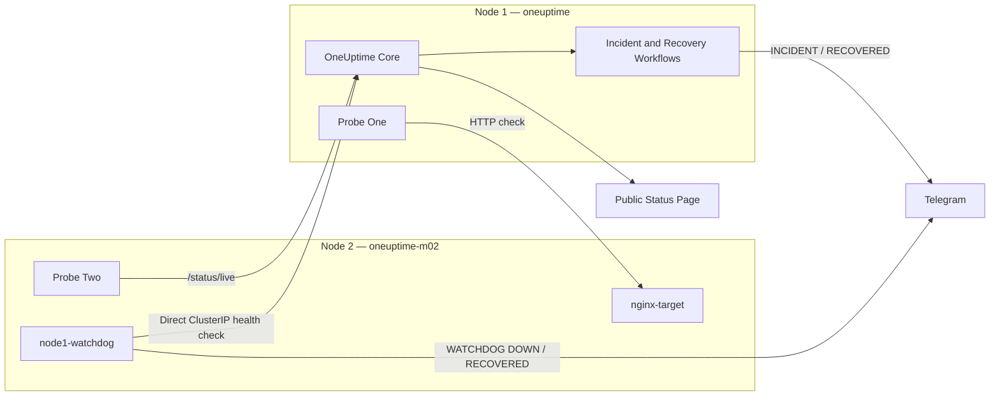
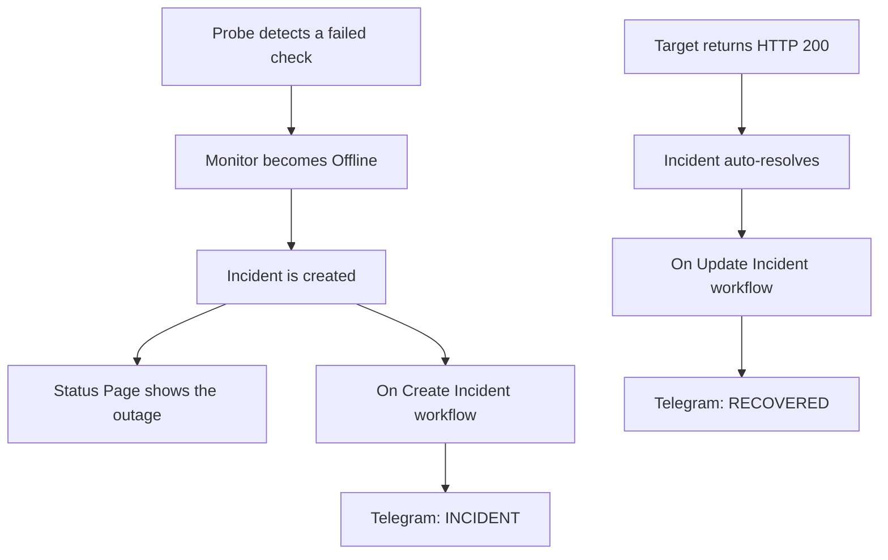

# OneUptime Cross-Node Monitoring and Incident Automation

> **Start with the installation guide:** [Setting Up Distributed OneUptime Monitoring on Kubernetes](SETTING_UP.md)

Local dashboard address:

```text
https://oneuptime.furkan.test
```

After the cluster starts, run `./scripts/port-forward-https.sh` in a separate
terminal. Entering only `oneuptime.furkan.test` in the browser is also supported;
HTTP port 80 redirects permanently to HTTPS port 443.

This project is a two-node Kubernetes reliability lab built around a self-hosted
OneUptime deployment. It demonstrates cross-node service monitoring, public
status communication, automatic incident lifecycle management, Telegram
notifications, and an independent failure-detection path for outages that can
disable OneUptime itself.

The implementation has been validated with OneUptime `12.0.6` on a dedicated
two-node Minikube profile named `oneuptime`.

## Project Goals

The project addresses two related reliability questions:

1. Can a service on one Kubernetes node detect a failure on the other node?
2. Can operators still receive an alert when the monitoring platform itself is
   unavailable?

To answer both, the cluster uses two OneUptime probes for cross-monitoring and a
separate watchdog on Node 2 for monitoring the OneUptime Core application on
Node 1.

## Architecture

| Location | Main workloads | Responsibility |
|---|---|---|
| Node 1 — `oneuptime` | OneUptime Core, ClickHouse, PostgreSQL, Redis, KEDA, Runner, Probe One | Hosts the monitoring platform and checks the Node 2 Nginx target |
| Node 2 — `oneuptime-m02` | Probe Two, Nginx target, independent watchdog | Checks OneUptime Core and provides an out-of-band Core failure alert path |

The node labels make placement explicit:

```text
oneuptime       app=oneuptime-core
oneuptime-m02   app=oneuptime-probe
```


```mermaid
flowchart LR
    TG[Telegram]
    SP[Public Status Page]

    subgraph N1[Node 1 — oneuptime]
        CORE[OneUptime Core]
        P1[Probe One]
        WF[Incident and Recovery Workflows]
    end

    subgraph N2[Node 2 — oneuptime-m02]
        P2[Probe Two]
        NG[nginx-target]
        WD[node1-watchdog]
    end

    P1 -->|HTTP check| NG
    P2 -->|/status/live| CORE
    CORE --> SP
    CORE --> WF
    WF -->|INCIDENT / RECOVERED| TG
    WD -->|Direct ClusterIP health check| CORE
    WD -->|WATCHDOG DOWN / RECOVERED| TG
```

## Cross-Monitoring Model

Two HTTP monitors provide bidirectional coverage:

| Monitor | Executing probe | Target |
|---|---|---|
| `Node2-Nginx-Health-Check` | Probe One on Node 1 | `http://nginx-target-svc.oneuptime.svc.cluster.local` |
| `Node1-App-Health-Check` | Probe Two on Node 2 | `http://oneuptime-app.oneuptime.svc.cluster.local:3002/status/live` |

The `nginx-target` pod is a deliberately simple test workload. It is deployed
manually with `kubectl` and is not part of the OneUptime Helm release. This makes
it suitable for controlled failure and recovery exercises without modifying the
monitoring platform.

For a detailed explanation of Kubernetes service discovery and the request path
between nodes, see
[Cross-Monitoring Traffic](docs/tr/genel-mimari/CROSS_MONITORING_TRAFFIC.md).

## Status and Incident Management

Both monitors are published on a local, password-free Status Page named
`OneUptime Cross-Monitoring Status` under the `Cross-Monitoring Services` group.
The page displays current health, uptime history, and public incidents.

Monitor failures are evaluated with the following rule:

```text
Is Online = False OR Response Status Code != 200
```

The failure behavior is intentionally different for each monitored resource:

| Resource | Incident severity | Incident title |
|---|---|---|
| Node 1 OneUptime Core | Critical | `[Cross-Monitoring] Node 1 OneUptime Core erişilemiyor` |
| Node 2 Nginx target | Major | `[Cross-Monitoring] Node 2 Nginx Target erişilemiyor` |

When the target returns HTTP `200`, its monitor becomes Operational again and
the associated incident is automatically resolved.

## Telegram Workflow Automation

Two imported OneUptime workflows automate the incident notification lifecycle:

- `Cross-Monitoring Incident → Telegram` runs when an incident is created.
- `Cross-Monitoring Recovery → Telegram` runs when an incident is updated to a
  resolved state.

Both workflows first restrict processing to incident titles beginning with
`[Cross-Monitoring]`. Telegram credentials are selected from secret OneUptime
Global Variables rather than embedded in workflow definitions.


```mermaid
flowchart TD
    F[Probe detects a failed check]
    M[Monitor becomes Offline]
    I[Incident is created]
    S[Status Page shows the outage]
    W1[On Create Incident workflow]
    T1[Telegram: INCIDENT]
    R[Target returns HTTP 200]
    A[Incident auto-resolves]
    W2[On Update Incident workflow]
    T2[Telegram: RECOVERED]

    F --> M --> I
    I --> S
    I --> W1 --> T1
    R --> A --> W2 --> T2
```

The importable workflow definitions are stored in:

- [Incident workflow JSON](workflows/oneuptime-incident-telegram-workflow.json)
- [Recovery workflow JSON](workflows/oneuptime-recovery-telegram-workflow.json)

## Independent Core Watchdog

A OneUptime workflow cannot be treated as the only alerting path for a complete
OneUptime Core outage: if Core is unavailable, incident evaluation and workflow
execution may also be unavailable.

The [Node 1 watchdog](node1-watchdog.yaml) therefore runs independently on Node
2 and checks the Core live endpoint every 30 seconds. It uses the
`ONEUPTIME_APP_SERVICE_HOST` ClusterIP environment variable instead of cluster
DNS for the Core target and uses independent external DNS resolvers for the
Telegram API.

Its state machine is designed to prevent alert noise:

- Three consecutive failures change the state to `DOWN` and send
  `[WATCHDOG] DOWN`.
- Additional failures are suppressed while the state remains `DOWN`.
- Two consecutive successful checks return the state to `UP` and send
  `[WATCHDOG] RECOVERED`.

Telegram values are loaded from the `oneuptime-watchdog-telegram` Kubernetes
Secret. The manifest contains no real token or Chat ID.

## Validated Failure Scenarios

### Node 2 Nginx outage

The manually managed `nginx-target` pod was removed while its Service remained
in place. The observed lifecycle was:

```text
Nginx endpoint unavailable
→ Probe One detects failure
→ Node 2 monitor becomes Offline
→ Major incident appears on the Status Page
→ Telegram receives [INCIDENT]
→ Nginx pod is recreated on Node 2
→ Monitor becomes Operational
→ Incident auto-resolves
→ Telegram receives [RECOVERED]
```

### Node 1 OneUptime Core outage

The `oneuptime-app` Deployment was safely scaled to zero without stopping the
Minikube control-plane node. The Node 2 watchdog sent `[WATCHDOG] DOWN` after its
failure threshold. After the Deployment was restored to one replica, the
watchdog sent `[WATCHDOG] RECOVERED` following two successful checks.

These tests confirm both the platform-managed incident path and the independent
fallback path.

## Configuration Strategy

The Helm configuration is intentionally split into two phases:

| File | Purpose |
|---|---|
| [`values.yaml`](values.yaml) | Base installation: OneUptime Core, dependencies, Runner, and Probe One |
| [`probe2-values.yaml`](probe2-values.yaml) | Second-stage overlay for Probe Two after a fresh Probe Key is generated |
| [`all.yaml`](all.yaml) | Final merged reference snapshot of the two values files |

The normal deployment sequence uses `values.yaml` first. After the dashboard is
available, a new Probe Two record and key are created, and Helm is upgraded with
both `values.yaml` and `probe2-values.yaml`.

Probe keys, Telegram tokens, Chat IDs, and rendered Kubernetes Secret values
must never be committed to the repository.

## Documentation

| Document | Purpose |
|---|---|
| [Setting Up the Project](SETTING_UP.md) | Complete Minikube, Helm, probe, and cross-monitoring installation guide |
| [Local HTTPS and TLS](docs/tr/kurulum/LOCAL_HTTPS.md) | Trusted localhost certificate, TLS proxy, and HTTPS port-forward guide |
| [Local DNS, TLS, and Application Traffic](docs/tr/kurulum/LOCAL_DNS_TLS_TRAFFIC.md) | End-to-end browser, hosts resolution, port-forward, TLS proxy, Service DNS, and application traffic flow |
| [LAN-only Status Page](docs/tr/kurulum/LAN_STATUS_PAGE.md) | Expose only the selected public Status Page to devices on the same Wi-Fi network |
| [LAN Status Page Implementation Log](docs/tr/trouble-shooting/LAN_STATUS_PAGE_UYGULAMA_GUNLUGU.md) | Chronological commands, outputs, decisions, proxy internals, DNS tests, and end-to-end traffic flow |
| [TLS Certificate Monitor Troubleshooting Log](docs/tr/trouble-shooting/TLS_CERTIFICATE_MONITOR_PROBE_ONE_UYGULAMA_GUNLUGU.md) | Probe hostname diagnosis, ClusterIP/SNI tests, host alias rollout, outputs, and technical decisions |
| [Operational Guide](docs/tr/instructions/README.md) | End-to-end Status Page, incident, workflow, Telegram, watchdog, and testing overview |
| [Stages 1–14](docs/tr/instructions/01-13-uygulama-sirasi.md) | Ordered implementation and acceptance sequence |
| [Cross-Monitoring Traffic](docs/tr/genel-mimari/CROSS_MONITORING_TRAFFIC.md) | Kubernetes DNS names, Services, endpoints, and inter-node traffic flow |
| [Minikube Start and Stop](docs/tr/kurulum/MINIKUBE_START_STOP.md) | Safe lifecycle operations for the dedicated `oneuptime` profile |
| [Linux Environment and Minikube Node Guide](docs/tr/linux/LINUX_ORTAMI_VE_MINIKUBE_NODE_REHBERI.md) | Turkish beginner-to-deep guide to Linux paths, permissions, processes, namespaces, cgroups, container layers, and Kubernetes storage |

The detailed operational documentation includes numbered UI evidence and
sanitized expected terminal output. No live Telegram credentials are included.

## Repository Layout

```text
.
├── README.md
├── SETTING_UP.md
├── values.yaml
├── probe2-values.yaml
├── probe-one-host-alias.yaml
├── all.yaml
├── node1-watchdog.yaml
├── k8s/local-tls/
│   ├── kustomization.yaml
│   ├── nginx.conf
│   └── proxy.yaml
├── k8s/lan-status/
│   ├── kustomization.yaml
│   ├── nginx.conf
│   └── proxy.yaml
├── scripts/
│   ├── setup-local-https.sh
│   ├── port-forward-https.sh
│   └── port-forward-status-page-lan.sh
├── workflows/
│   ├── oneuptime-incident-telegram-workflow.json
│   └── oneuptime-recovery-telegram-workflow.json
└── docs/tr/
    ├── genel-mimari/
    │   └── CROSS_MONITORING_TRAFFIC.md
    ├── kurulum/
    │   ├── LAN_STATUS_PAGE.md
    │   ├── LOCAL_HTTPS.md
    │   ├── LOCAL_DNS_TLS_TRAFFIC.md
    │   ├── TLS_CERTIFICATE_MONITOR_PROBE_ONE.md
    │   └── MINIKUBE_START_STOP.md
    ├── trouble-shooting/
    │   ├── LAN_STATUS_PAGE_UYGULAMA_GUNLUGU.md
    │   └── TLS_CERTIFICATE_MONITOR_PROBE_ONE_UYGULAMA_GUNLUGU.md
    └── instructions/
        ├── README.md
        ├── 01-13-uygulama-sirasi.md
        ├── 01-telegram-botu-ve-chat-id.md
        ├── ...
        ├── 13-son-kabul-kontrolleri.md
        └── 14-tls-certificate-monitor.md
```

## Security Notes

- Store OneUptime workflow credentials as secret Global Variables.
- Store watchdog credentials in a Kubernetes Secret referenced through
  `secretKeyRef`.
- Never publish `kubectl get secret ... -o yaml` output.
- Treat Base64-encoded Kubernetes Secret data as sensitive; Base64 is not
  encryption.
- Revoke and rotate a Telegram bot token immediately if it is exposed in chat,
  Git history, logs, or screenshots.
- Review documentation images for usernames, project identifiers, tokens, and
  Chat IDs before publishing them.

## Project Outcome

The resulting environment provides a complete local reliability demonstration:
cross-node health checks, public service status, automatic incident creation and
resolution, workflow-driven Telegram notifications, and a separate watchdog
that continues to alert when the monitoring application itself is unavailable.
