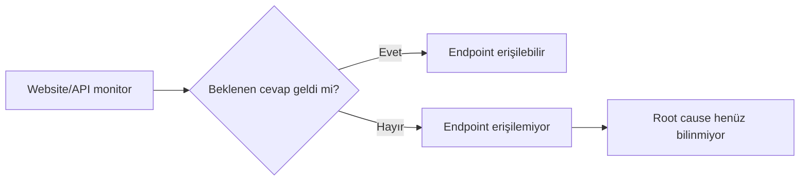
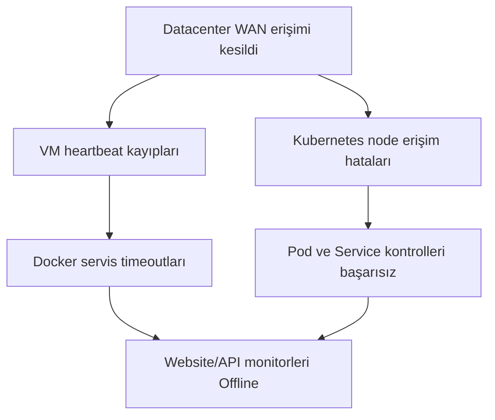
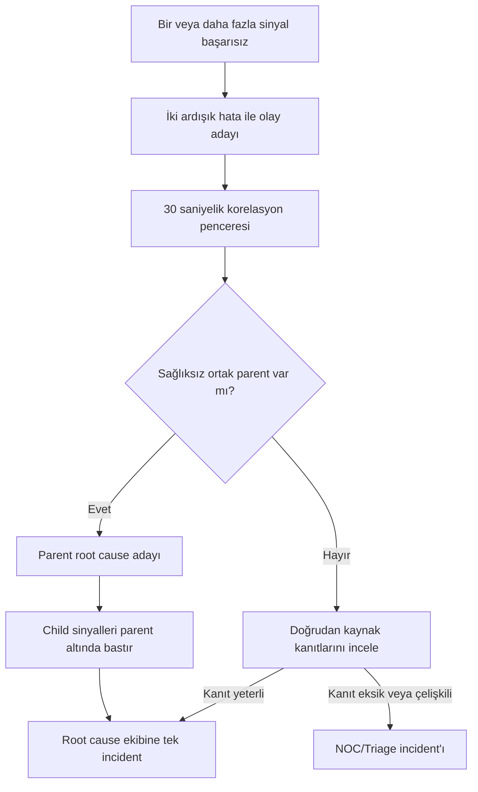

# Aşama 1 — Sorun Tanımı ve Hedefler

## Amaç

Bu aşama, mevcut endpoint odaklı izleme yaklaşımının neden tek başına root cause
analizi yapamadığını açıklar. Tasarlanacak sistemin çözmesi gereken problemi,
kapsam sınırlarını ve başarı ölçütlerini belirler.

Bu belge bir ürün yapılandırması tarif etmez. Hedef, sonraki mimari kararlar için
ortak ve ölçülebilir bir problem tanımı oluşturmaktır.

## 1.1 Mevcut yaklaşım neyi kanıtlıyor?

Bir website veya API monitorü belirli aralıklarla hedefe istek gönderir ve şu
gibi sonuçları gözlemler:

- DNS çözümlemesi başarılı mı?
- TCP bağlantısı kurulabiliyor mu?
- TLS görüşmesi tamamlanıyor mu?
- HTTP cevabı geliyor mu?
- Beklenen status code, header veya response body alınıyor mu?
- İstek kabul edilen sürede tamamlanıyor mu?

Örneğin bir health endpoint'inden HTTP `200` bekleniyorsa ve cevap alınamıyorsa
monitor doğru biçimde **erişilebilirlik sorunu** tespit etmiş olur. Ancak bu
sonuç, arızanın başladığı katmanı tek başına göstermez.



`Endpoint erişilemiyor` bir gözlemdir. `Uygulama kodu çöktü`, `pod OOMKilled
oldu` veya `datacenter erişilemiyor` ise ayrı kanıtlar gerektiren neden
iddialarıdır.

## 1.2 Tek bir endpoint hatasının olası nedenleri

Aynı HTTP kontrol hatası farklı katmanlardan kaynaklanabilir:

| Katman | Olası olay | Gerekli ek kanıt örnekleri |
|---|---|---|
| Monitoring | Probe veya agent durdu | Probe heartbeat, son başarılı gönderim, başka vantage point sonucu |
| Datacenter | Tesis veya genel erişim kesildi | İki public IP, site heartbeat ve bağımsız lokasyon sonuçları |
| Network | WAN, firewall, routing veya DNS sorunu | Yol, DNS, port, paket kaybı ve farklı network zone sonuçları |
| Compute | Fiziksel host, VM veya Kubernetes node arızası | Host/VM heartbeat, node condition, işletim sistemi metrics |
| Runtime | Kubelet, container runtime veya Docker daemon sorunu | Runtime health, events ve daemon durumu |
| Workload | Pod/container durdu veya yeniden başladı | Lifecycle state, exit code, termination reason, restart count |
| Kaynak | Bellek veya disk baskısı oluştu | OOM olayı, bellek limiti, node/host pressure ve disk metrics |
| Service discovery | Service endpoint kayboldu | EndpointSlice, selector, target/port ve backend üyeliği |
| Uygulama | Kod exception veya yanlış response üretildi | HTTP 5xx, exception logu, trace ve uygulama metriği |
| Bağımlılık | Database veya başka servis erişilemiyor | Dependency health, connection error, trace ve timeout zinciri |

Website monitorü bu nedenlerin sonucu olarak kırmızıya dönebilir; fakat hangi
satırın gerçek neden olduğunu kendi başına belirleyemez.

## 1.3 Semptom ile root cause arasındaki fark

### Semptom

Semptom, kullanıcı veya alt kaynak üzerinde görülen bozulmadır. Aşağıdaki
gözlemler semptom olabilir:

- Website monitorünün timeout vermesi
- API'nin HTTP `500` döndürmesi
- Podun `Ready=False` olması
- Container'ın bağlantı kabul etmemesi
- Bir database bağlantısının başarısız olması
- Aynı veri merkezindeki çok sayıda servisin aynı anda Offline görünmesi

### Root cause

Root cause, semptom zincirini başlatan ve müdahale edildiğinde ilgili semptomları
ortadan kaldırması beklenen en üst, kanıtlanabilir nedendir.

Örneğin bir veri merkezinin ortak WAN bağlantısı kesildiğinde aşağıdakilerin
tamamı aynı anda gözlenebilir:



Bu örnekte website, API, pod ve VM hataları gerçek gözlemlerdir; fakat bağımsız
kök nedenler değildir. Müdahale edilmesi gereken ortak neden WAN erişimidir.

## 1.4 Alarm fırtınası problemi

Her monitorün doğrudan incident oluşturduğu bir sistemde ortak parent arızası şu
sonuca yol açabilir:

```text
1 datacenter kesintisi
→ çok sayıda VM monitorü başarısız
→ çok sayıda Kubernetes node/pod monitorü başarısız
→ çok sayıda Docker container monitorü başarısız
→ bütün website ve API monitorleri başarısız
→ her servis için ayrı incident
→ ilgisiz uygulama ekiplerinin çağrılması
```

Bu davranışın operasyonel zararları şunlardır:

- Gerçek kök neden, çok sayıdaki child alarm arasında görünmez hale gelir.
- Uygulama ekipleri kendi kontrol alanlarının dışındaki olaylarla meşgul olur.
- Aynı arıza için paralel ve çelişkili müdahaleler başlar.
- Incident sayısı gerçek olay sayısını yansıtmaz.
- Mean Time to Acknowledge ve Mean Time to Resolve ölçümleri yanıltıcı olur.
- Aynı açıklamalar ve durum güncellemeleri birçok incident'a ayrı ayrı yazılır.
- Operatörler zamanla alarmları önemsememeye başlar.

Amaç child sinyalleri yok saymak değildir. Child sinyaller root cause'u
doğrulayan **etki kanıtı** olarak saklanmalı; fakat her biri ayrı ekip
yönlendirmesi üretmemelidir.

## 1.5 Hedeflenen olay akışı

Yeni modelde ham monitor sonucu ile incident oluşturma arasında bir korelasyon
ve yönlendirme kararı bulunur:



Bu akış aşağıdaki ilkeleri uygular:

1. Monitor hatası hemen belirli bir ekibin hatası sayılmaz.
2. Aynı zaman aralığındaki parent ve sibling sinyalleri birlikte incelenir.
3. Parent arızası kanıtlanırsa child incident'lar bastırılır.
4. Root cause için yeterli kanıt varsa ilgili ekip owner olur.
5. Kanıt yetersiz veya çelişkiliyse bütün ekipler çağrılmaz; olay NOC/Triage'a
   gider.
6. Bütün kanıtlar ve bastırılmış semptomlar tek incident timeline'ında korunur.

## 1.6 Datacenter örneği

Her veri merkezinin iki public IP üzerinden TCP erişimi izlendiğini varsayalım.
İki public IP'nin kaybı önemli bir sinyaldir; fakat tek başına fiziksel veri
merkezinin çöktüğünü kesinleştirmez.

| Dış IP1 | Dış IP2 | İç site heartbeat | Yorum | Incident sahibi |
|---|---|---|---|---|
| Sağlıklı | Sağlıklı | Sağlıklı | `Healthy` | Incident yok |
| Hatalı | Sağlıklı | Sağlıklı | Yedeklilik kaybı, `Degraded` | Network |
| Sağlıklı | Hatalı | Sağlıklı | Yedeklilik kaybı, `Degraded` | Network |
| Hatalı | Hatalı | Sağlıklı | Dış erişim veya edge network sorunu | Network |
| Hatalı | Hatalı | Hatalı | Datacenter `Down` adayı | Infra/Platform + Network |
| Çelişkili | Çelişkili | Veri yok | Root cause belirsiz | NOC/Triage |

Datacenter `Down` doğrulandığında:

- Tek P1 parent incident oluşturulur.
- Infra/Platform ve Network birlikte owner olur.
- Koordinasyonu Infra/Platform yürütür.
- Aynı datacenter altındaki VM, node, pod, Docker, website ve API hataları parent
  incident'a etkilenen kaynak veya semptom olarak bağlanır.
- Application ekiplerine bağımsız incident atanmaz.

## 1.7 Kubernetes ve VM/Docker için ortak problem

Runtime farklı olsa da iki pilotta çözülmesi gereken mantık aynıdır.

### Kubernetes örneği

```text
API başarısız
→ Service endpoint var mı?
→ Pod çalışıyor ve Ready mi?
→ Pod OOMKilled veya CrashLoop durumunda mı?
→ Node Ready mi?
→ Datacenter ve network parent'ları sağlıklı mı?
```

### VM/Docker örneği

```text
API başarısız
→ Container çalışıyor mu?
→ Docker daemon sağlıklı mı?
→ VM heartbeat ve kaynakları sağlıklı mı?
→ Datacenter ve network parent'ları sağlıklı mı?
```

Her iki akışta da parent katmanlar sağlıklı, runtime çalışır durumda ve güçlü
uygulama kanıtı mevcutsa Application ekibi owner olabilir. OOM, runtime,
deployment/config ve compute olayları seçilen sahiplik modeline göre
Infra/Platform'a yönlendirilir.

## 1.8 Ekip yönlendirme hedefi

İlk mimari için ekip sınırları şöyledir:

| Olay sınıfı | Owner |
|---|---|
| Datacenter Down | Infra/Platform + Network; koordinasyon Infra/Platform |
| WAN, routing, firewall, DNS, load balancer veya network path | Network |
| VM/OS, Kubernetes node/runtime, Docker daemon, OOM, deployment/config, database veya storage | Infra/Platform |
| Parent ve runtime sağlıklı, kod/log/trace/HTTP 5xx ile kanıtlanan hata | Application |
| Eksik veya çelişkili kanıt | NOC/Triage |
| Parent incident'ın alt semptomları | Ayrı owner yok; parent altında suppressed |

Bu aşamada owner ile bildirim kanalı birbirinden ayrılır. Bir ekibin incident
sahibi olması; telefon, e-posta veya sohbet mesajının nasıl gönderileceğine dair
karar verildiği anlamına gelmez.

## 1.9 Öncelik modeli

Bildirim kanallarından bağımsız olarak olayların operasyonel etkisi üç seviyede
ifade edilir:

| Öncelik | Genel anlam | Örnek |
|---|---|---|
| P1 | Geniş etki veya monitoring plane kaybı | Datacenter Down, birincil monitoring sistemi erişilemez |
| P2 | Tek compute/runtime veya kritik servis kesintisi | Kubernetes node kaybı, VM veya Docker daemon kesintisi |
| P3 | Servis tamamen kesilmeden yedeklilik veya kapasite azalması | Public IP çiftinden birinin kaybı |

Her P1 olayından sonra kalıcı RCA/problem kaydı açılması beklenir. Aynı
fingerprint ile 30 gün içinde tekrarlayan P2 olayları da zorunlu RCA kapsamına
girer. Teknik incident sağlık geri geldiğinde çözülebilir; problem kaydı neden ve
önleyici aksiyon tamamlanana kadar açık kalır.

## 1.10 Kapsam dışı kararlar

Bu mimari aşamasında aşağıdaki kararlar alınmayacaktır:

- Telefon, SMS, e-posta, Telegram, Slack, Teams veya ticket kanalı seçimi
- Ürün lisansı veya ürünler arası satın alma kararı
- Gerçek agent ve collector kurulum komutları
- Kubernetes manifestleri ve Docker Compose dosyaları
- Uygulama kodunda instrumentation değişikliği
- Otomatik remediation veya self-healing
- ML/AIOps tabanlı olasılık modeli
- Gerçek production datacenter veya network kesintisi

## 1.11 Başarı kriterleri

Tasarlanacak sistem aşağıdaki sonuçları üretebiliyorsa mimari hedeflerine ulaşmış
sayılacaktır.

### Korelasyon

- [ ] Tek fiziksel veya ortak ağ arızası için tek parent incident oluşuyor.
- [ ] Child website, API, pod, container ve VM sinyalleri kaybolmadan parent'a
      bağlanıyor.
- [ ] Aynı root cause için yinelenen incident oluşmuyor.
- [ ] İlişkisiz iki arıza yanlışlıkla tek incident altında birleştirilmiyor.
- [ ] Parent child'tan daha geç bulunursa önceki child incident audit iziyle
      parent'a bağlanabiliyor.

### Root cause kalitesi

- [ ] Incident, `Confirmed`, `Probable` veya `Unknown` güven seviyesine sahip.
- [ ] Her root cause kararı dayandığı sinyalleri ve zaman çizelgesini gösteriyor.
- [ ] Görünürlük boşluğu bulunan katmanda kesin neden iddiası yapılmıyor.
- [ ] Website/API hatası tek başına uygulama hatası sayılmıyor.

### Sahiplik

- [ ] Datacenter incident'ı yalnız Infra/Platform ve Network'e atanıyor.
- [ ] Parent incident aktifken Application ekiplerine child incident gitmiyor.
- [ ] Uygulama incident'ı yalnız parent/runtime sağlığı ve uygulama kanıtı
      birlikte doğrulandığında Application'a atanıyor.
- [ ] Belirsiz olay bütün ekiplere değil NOC/Triage'a yönlendiriliyor.

### Yaşam döngüsü

- [ ] İki ardışık hata olay adayını oluşturuyor.
- [ ] Parent kanıtları 30 saniyelik korelasyon penceresinde değerlendiriliyor.
- [ ] Teknik incident ancak beş dakikalık kararlı iyileşmeden sonra çözülüyor.
- [ ] Recovery sonrasında bozuk kalmaya devam eden child kaynak bağımsız olarak
      yeniden değerlendiriliyor.
- [ ] Flapping sırasında aynı fingerprint için yeni incident yağmuru oluşmuyor.

### Pilot

- [ ] Bir Kubernetes node → pod → Service → API zinciri modellenebiliyor.
- [ ] Bir VM → Docker daemon → container → API zinciri modellenebiliyor.
- [ ] Güvenli fault injection senaryoları gerçek datacenter kapatılmadan
      uygulanabiliyor.
- [ ] Birincil izleme sisteminin kesintisi farklı lokasyondaki ikinci izleme
      sistemi tarafından fark edilebiliyor.

## 1.12 Bu aşamanın çıktısı

Bu belgeyle aşağıdaki kararlar sabitlenmiştir:

- Website/API hatası root cause değil, başlangıç sinyalidir.
- Parent-child topolojisi incident kararının zorunlu girdisidir.
- Alt monitorler çalışmaya devam eder; yalnız gereksiz incident ve ekip
  yönlendirmesi bastırılır.
- İlk pilot bir Kubernetes ve bir VM/Docker zinciriyle sınırlıdır.
- Korelasyon deterministik ve açıklanabilir olacaktır.
- Root cause belirlenemezse olay NOC/Triage'a gider.
- Bildirim kanalları sonraki bir tasarım aşamasına bırakılmıştır.

## Gezinme

- Önceki: [Genel Mimari Dokümantasyon İndeksi](README.md)
- Sonraki: [Aşama 2 — Katmanlı Kaynak Topolojisi](02-katmanli-kaynak-topolojisi.md)

