# Aşama 2 — Katmanlı Kaynak Topolojisi

## Amaç

Bu aşama, ham monitor sinyallerinin hangi kaynağa ve hangi üst bağımlılığa ait
olduğunu gösterecek ortak topoloji modelini tanımlar. Model hem Kubernetes
ortamlarını hem de Kubernetes bulunmayan VM/Docker ortamlarını aynı korelasyon
mantığına bağlar.

Bir kaynağın topolojide bulunması, onun için mutlaka telemetri alındığı anlamına
gelmez. Sağlığı doğrudan gözlenemeyen katmanlar `Visibility Gap` olarak
işaretlenir ve bu katmanlar hakkında kesin root cause kararı verilmez.

## 2.1 Topoloji neden zorunludur?

Zaman yakınlığı tek başına iki alarmın aynı olaydan kaynaklandığını kanıtlamaz.
İki servis aynı dakika içinde bozulabilir fakat farklı veri merkezlerinde ve
farklı altyapılarda çalışıyor olabilir. Tersine, aynı veri merkezindeki yüz
servis ortak WAN arızası nedeniyle aynı anda erişilemez hale gelebilir.

Korelasyon motorunun aşağıdaki soruları cevaplayabilmesi için kaynaklar arasında
açık ilişkiler bulunmalıdır:

- Bu endpoint hangi servis tarafından sunuluyor?
- Servis hangi pod, container veya process üzerinde çalışıyor?
- Workload hangi node veya VM üzerinde?
- Compute kaynağı hangi network zone ve datacenter içinde?
- Kaynağın çalışması için zorunlu parent'lar hangileri?
- Hangi bağımlılıklar yedekli, hangileri tek hata noktası?
- Bir parent bozulursa hangi child incident'lar bastırılmalı?
- İki başarısız sinyal gerçekten aynı failure domain'i paylaşıyor mu?

Topoloji olmadan sistem yalnızca benzer zamanda oluşan alarmları gruplayabilir.
Topolojiyle birlikte ise neden-sonuç yönünü değerlendirebilir.

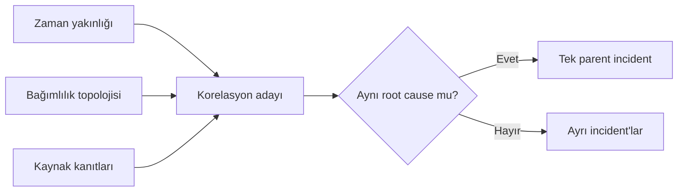

## 2.2 Genel katman modeli

Bütün kaynaklar aşağıdaki mantıksal katmanlardan uygun olanlara yerleştirilir:

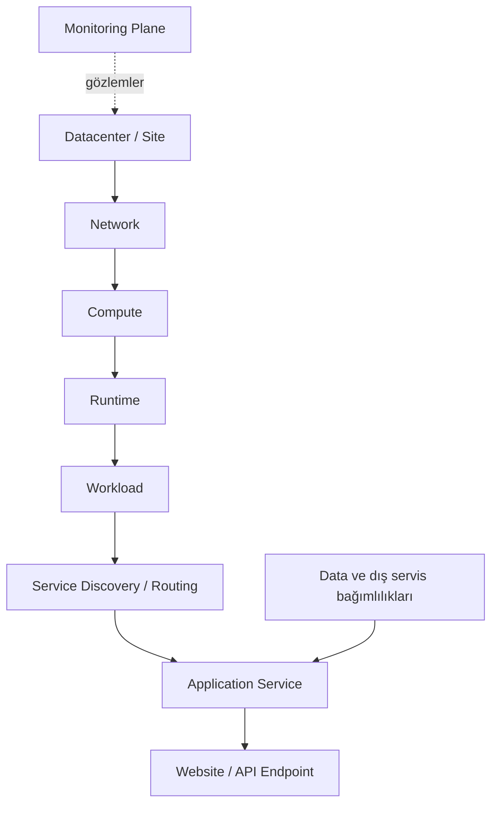

| Katman | Sorumluluğu | Kaynak örnekleri |
|---|---|---|
| Monitoring Plane | Sağlık verisini toplamak, değerlendirmek ve incident üretmek | Birincil/ikincil OneUptime, probe, agent, collector |
| Datacenter/Site | Ortak fiziksel lokasyon ve tesis failure domain'i | DC10, DC32, test site |
| Network | Dış ve iç iletişim yolu | Public IP, WAN, edge, firewall, DNS, load balancer, VLAN/zone |
| Compute | İş yükünün çalıştığı işlem kaynağı | Fiziksel host, hypervisor guest VM, Kubernetes node |
| Runtime | Workload'u yöneten çalışma katmanı | Kubelet/container runtime, Docker daemon |
| Workload | Uygulama prosesini taşıyan birim | Pod, container, systemd process |
| Discovery/Routing | İsteği uygun workload'a yönlendiren katman | Kubernetes Service/EndpointSlice, reverse proxy, local port mapping |
| Application Service | İş açısından izlenen mantıksal servis | Sipariş API, kimlik servisi, pilot test servisi |
| Endpoint | Kullanıcı veya monitorün gözlediği uç | HTTP health, API operation, TCP port |
| Data/External Dependency | Uygulamanın çağırdığı bağımlılık | Database, cache, storage, mesaj kuyruğu, harici API |

Her gerçek kaynak bütün satırlara sahip olmak zorunda değildir. Örneğin basit bir
VM servisi reverse proxy kullanmıyorsa Docker portu doğrudan Application Service
katmanına bağlanabilir. Ancak atlanan katmanın olmadığı açıkça belirtilmeli;
bilinmediği için modelden çıkarılmamalıdır.

## 2.3 Parent, child ve sibling ilişkileri

### Parent resource

Bir kaynağın çalışması veya gözlenebilmesi için gerekli üst kaynaktır. Örneğin:

- Kubernetes node, podun compute parent'ıdır.
- Docker daemon, container'ın runtime parent'ıdır.
- Datacenter, içindeki network zone ve compute kaynaklarının lokasyon
  parent'ıdır.
- Service, HTTP endpoint'in routing parent'ı olabilir.

### Child resource

Parent arızasından etkilenebilen alt kaynaktır. Bir child'ın başarısız olması
parent'ın da başarısız olduğunu kanıtlamaz. Ancak parent arızası doğrulanmışsa
child hatasının semptom olma ihtimali yüksektir.

### Sibling resource

Aynı doğrudan parent'ı paylaşan kaynaklardır. Birden fazla sibling aynı anda
bozulduğunda ortak parent güçlü bir root cause adayı olur.

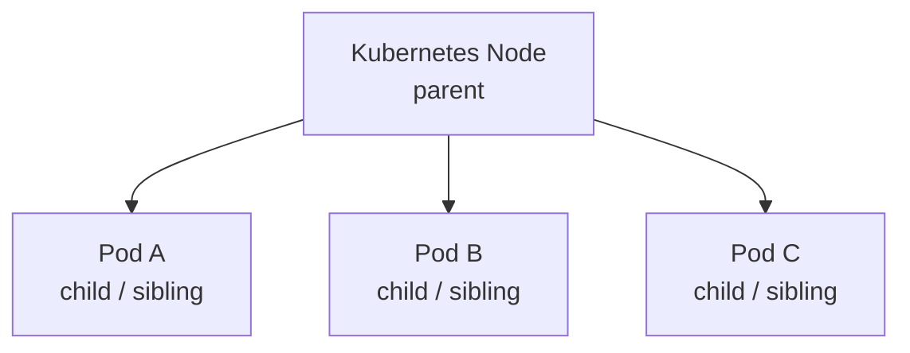

Örneğin yalnız Pod A arızalıysa Pod A'nın kendi lifecycle ve uygulama kanıtları
incelenir. Aynı node üzerindeki Pod A, B ve C birlikte kaybolmuş ve node da
`NotReady` olmuşsa node parent incident'ı öncelik kazanır.

## 2.4 Bağımlılık türleri

Her ilişki aynı güçte değildir. Topolojide en az üç bağımlılık türü
tanımlanmalıdır.

### 2.4.1 Hard dependency

Child kaynağın çalışması için zorunlu bağımlılıktır. Parent'ın arızası child'ın
çalışmasını doğrudan engeller.

Örnekler:

- Pod → üzerinde çalıştığı Kubernetes node
- Container → Docker daemon ve VM
- Endpoint → onu sunan tek Service/backend grubu
- Uygulama → zorunlu ve yedeksiz database
- Datacenter içindeki servis → datacenter'ın ortak enerji veya erişim altyapısı

Hard parent arızası doğrulandığında child hataları parent incident altında
bastırılabilir.

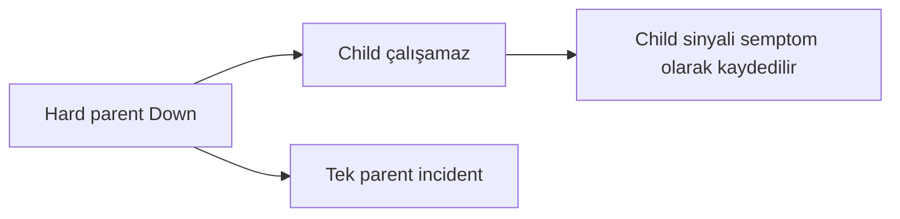

### 2.4.2 Soft dependency

Kaybı servisi tamamen durdurmayan fakat performans, özellik veya gözlemlenebilirlik
kaybı oluşturan bağımlılıktır.

Örnekler:

- Opsiyonel bir raporlama servisi
- Kullanıcı isteğini engellemeyen telemetry exporter
- Uygulamanın bazı fonksiyonlarında kullanılan harici entegrasyon
- Ana akışı durdurmayan cache

Soft dependency arızası, child servisin otomatik olarak `Down` kabul edilmesine
neden olmaz. Etki kanıtı varsa child `Degraded` olabilir; bağımlılığın kendi
incident'ı ayrıca yönetilir.

### 2.4.3 Redundant dependency

Aynı işlevi sağlayan birden fazla bağımlılıktan biridir. Tek üyenin kaybında
servis yedek üzerinden devam edebilir.

Örnekler:

- Datacenter'ın iki public IP'sinden biri
- İki WAN linkinden biri
- Bir Service arkasındaki çok sayıdaki poddan biri
- Replikalı database üyelerinden biri
- Aktif/pasif load balancer çifti

Tek redundant üye kaybı doğrudan servis `Down` sonucu üretmez. Kapasite veya
yedeklilik azaldığı için `Degraded` ve çoğunlukla P3 değerlendirmesi yapılır.
Ancak çalışan son üye de kaybolursa grubun ortak işlevi `Down` olur.

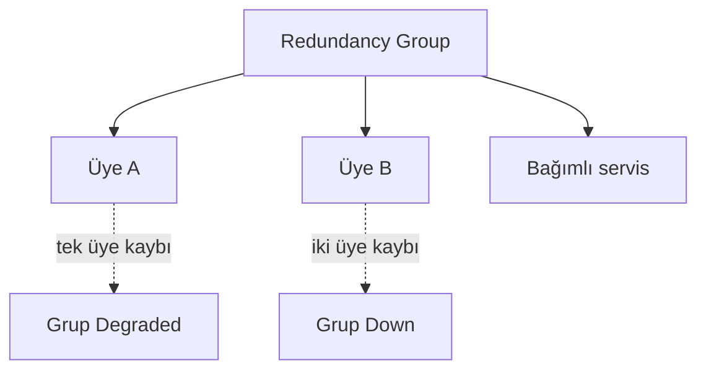

## 2.5 Bağımlılık yönü ve etki yönü

Topolojide iki yön birbirine karıştırılmamalıdır:

- **Dependency yönü:** Child hangi parent'a ihtiyaç duyuyor?
- **Impact yönü:** Parent arızası hangi child kaynakları etkileyebilir?

Katalog ilişkisi `child depends on parent` biçiminde tutulabilir; root cause
araması child'dan parent'a doğru, etki hesabı ise parent'tan child'a doğru
yürütülür.

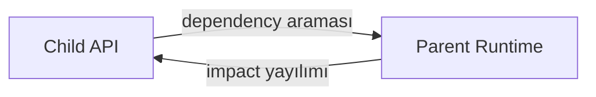

Bu yön ayrımı şu iki hatayı önler:

1. Bir child hatasından hareketle parent'ın otomatik olarak Down ilan edilmesi
2. Parent incident sırasında etkilenmesi mümkün olmayan kaynakların yanlışlıkla
   bastırılması

## 2.6 Failure domain kavramı

Failure domain, tek bir arızanın birlikte etkileyebileceği kaynak grubudur.
Korelasyon yalnız kaynak adı veya zamana değil failure domain üyeliğine de
bakmalıdır.

Örnek failure domain'ler:

- Datacenter
- WAN veya edge bağlantısı
- Network zone/VLAN
- Fiziksel host veya hypervisor node
- VM
- Kubernetes cluster
- Kubernetes node
- Docker daemon
- Load balancer/backend pool
- Database cluster

İki servis aynı datacenter'da fakat farklı Kubernetes cluster'larında olabilir.
Datacenter arızasında birlikte etkilenebilirler; tek bir Kubernetes node
arızasında ise yalnız o node'un child kaynakları etkilenmelidir.

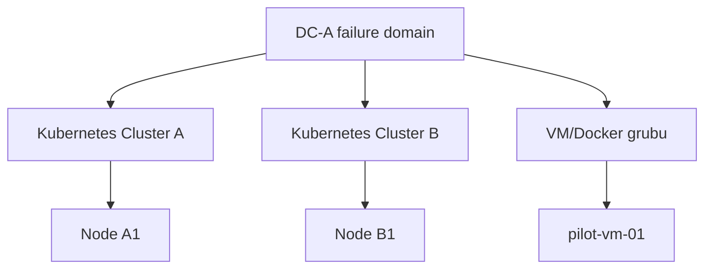

`DC-A Down` bütün alt dalları etkileyebilir. `Node A1 Down` ise Cluster B ve VM
dalındaki incident'ları bastırmamalıdır.

## 2.7 Monitoring plane topolojisi

Monitoring plane, izlediği kaynaklardan bağımsız bir katman olarak modellenir.
Bir monitor sonucunun yokluğu hedefin arızası kadar monitor altyapısının
arızasından da kaynaklanabilir.

Hedef modelde iki ayrı izleme failure domain'i bulunur:

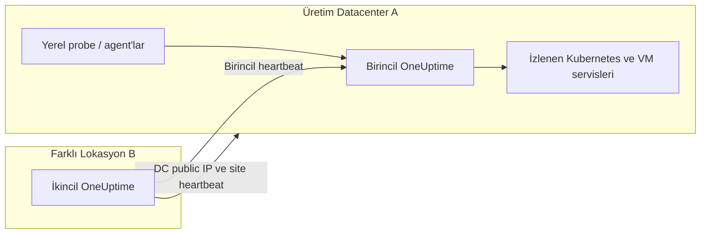

İkincil OneUptime uygulama, VM ve Kubernetes monitorlerinin tamamını kopyalamaz.
Yalnız birincil monitoring plane ile onun datacenter erişimini gözler. Böylece
iki platformun aynı servis olayı için çift incident üretmesi önlenir.

Monitoring plane bağımlılıkları üretim servis ağacının içine child olarak
yerleştirilmemelidir. Aksi halde birincil OneUptime arızası bütün üretim
servislerini teknik olarak `Down` ilan edebilir. Bu durumda doğru yorum:

```text
Üretim servislerinin gerçek sağlığı bilinmiyor
Monitoring plane erişilemiyor
İkincil sistem monitoring-plane incident'ı oluşturuyor
```

Seçilen pilot politikasında agent/probe NoData alt hedeflerin görünümünü
`Down/NoData` yapabilir; fakat her hedef için incident oluşturmak yerine tek
telemetry-source parent incident'ı açılır.

## 2.8 Datacenter ve network topolojisi

Datacenter yalnız iki public IP monitorünün adı değildir. Aşağıdaki farklı
kaynakların mantıksal parent'ıdır:

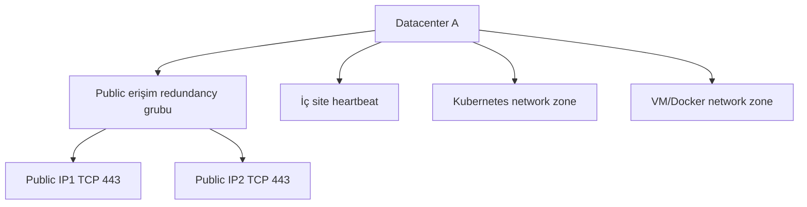

Bu modelde:

- Public IP1 veya IP2 tek başına kaybolursa redundancy grubu `Degraded` olur.
- İki IP de kayıp fakat iç heartbeat sağlıklıysa edge/WAN sorunu root cause
  adayıdır.
- İki IP ve iç heartbeat birlikte kayıpsa Datacenter Down olasılığı güçlenir.
- İç heartbeat NoData ise fiziksel datacenter arızası kesinleştirilmez;
  NOC/Triage değerlendirmesi gerekir.

Public IP monitorleri, iç site heartbeat ve monitoring-plane heartbeat farklı
vantage point'lerden gelmelidir. Aynı probe ile ölçülen üç başarısızlık üç
bağımsız kanıt değildir.

## 2.9 Kubernetes bağımlılık ağacı

Pilot Kubernetes zinciri aşağıdaki kaynakları içerir:

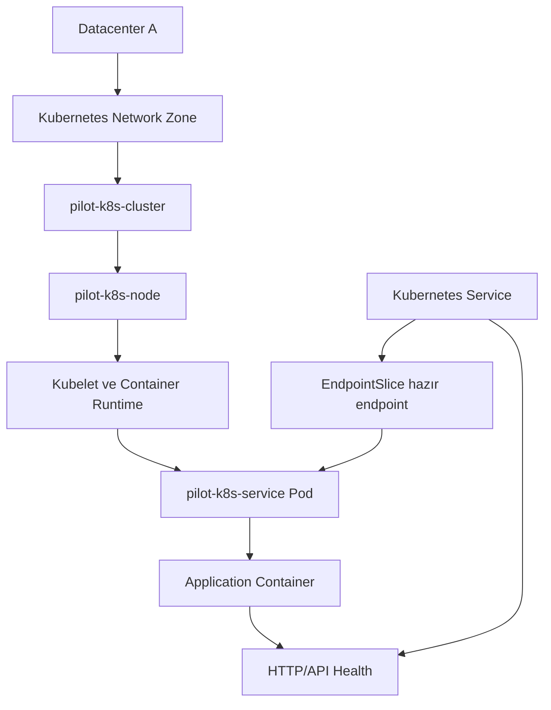

### Doğrudan parent ilişkileri

| Child | Parent | Tür | Gerekçe |
|---|---|---|---|
| `pilot-k8s-cluster` | Datacenter ve network zone | Hard | Cluster erişimi ortak site ve ağ yoluna bağlıdır |
| `pilot-k8s-node` | Cluster/network/compute | Hard | Node ilgili failure domain içinde çalışır |
| Kubelet/runtime | `pilot-k8s-node` | Hard | Runtime node işletim sistemine bağlıdır |
| Pod | Node ve runtime | Hard | Pod bu compute/runtime üzerinde çalışır |
| Container | Pod ve runtime | Hard | Container pod sandbox ve runtime'a bağlıdır |
| EndpointSlice üyeliği | Pod readiness | Hard | Hazır olmayan pod backend olarak kullanılmaz |
| Service/API | Backend endpoint grubu | Redundant veya Hard | Replica sayısına göre tek ya da çok backend olabilir |

### Önemli modelleme kuralı

Kubernetes Service belirli tek bir podun parent'ı değildir. Service, bir backend
grubunu temsil eder. Bir pod kaybolduğunda başka hazır podlar varsa Service
çalışmaya devam edebilir. Bu nedenle pod → Service ilişkisi doğrudan hard
dependency olarak modellenmemelidir.

Doğru yaklaşım:

```text
Service
→ Backend/Endpoint redundancy grubu
→ Bir veya daha fazla hazır pod
```

Tek replica pilotunda son endpoint kaybolursa Service/API `Down` olur. Çok
replicalı gerçek ortamda tek pod kaybı yalnız kapasite azalması veya `Degraded`
durumu oluşturabilir.

## 2.10 VM ve Docker bağımlılık ağacı

Pilot VM/Docker zinciri aşağıdaki kaynakları içerir:

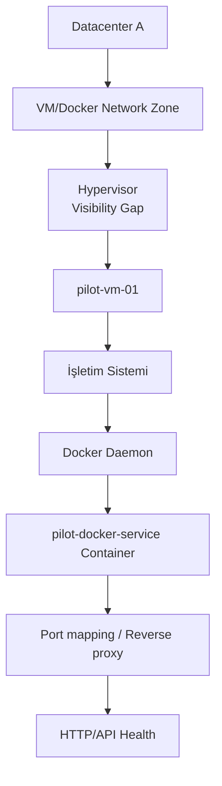

### Doğrudan parent ilişkileri

| Child | Parent | Tür | Gerekçe |
|---|---|---|---|
| `pilot-vm-01` | Hypervisor | Hard, görünürlük boşluklu | VM fiziksel sanallaştırma platformuna bağlıdır fakat pilotta API kanıtı yoktur |
| İşletim sistemi | VM | Hard | OS, VM compute kaynağı üzerinde çalışır |
| Docker daemon | VM/OS | Hard | Container runtime host işletim sistemine bağlıdır |
| Container | Docker daemon | Hard | Container daemon olmadan yönetilemez ve çalıştırılamaz |
| Port/reverse proxy | Container veya backend grubu | Hard/Redundant | Gerçek deployment şekline göre belirlenir |
| HTTP/API | Uygulama container'ı ve routing | Hard | Endpoint bu zincir üzerinden sunulur |

Hypervisor telemetrisi bulunmadığı için `VM heartbeat lost` olayı şu sonucu
veremez:

```text
Confirmed: fiziksel host çöktü
```

Doğru sonuç aşağıdakilerden biridir:

```text
Confirmed: VM/OS heartbeat kayıp
Probable: compute veya network katmanı
Unknown: hypervisor görünürlüğü yok
Owner: NOC/Triage veya eldeki diğer kanıta göre Infra/Platform
```

## 2.11 Uygulama ve veri bağımlılıkları

Uygulamanın çalıştığı runtime sağlıklı olsa bile zorunlu bir dependency
arızalanabilir. Bu nedenle topoloji yalnız altyapı zinciriyle bitmemelidir.

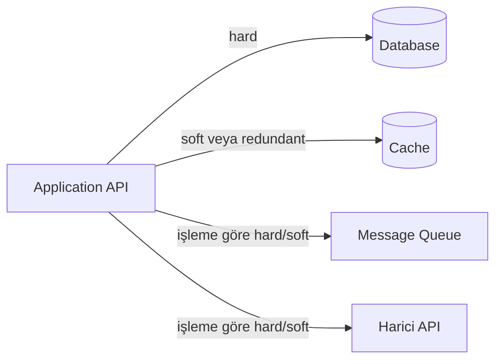

Bağımlılık türü servis adına göre varsayılmamalıdır. Aynı cache bir uygulama için
opsiyonelken başka bir uygulama için kritik session store olabilir. Tür, servis
sahibi ve Infra/Platform tarafından katalogda açıkça belirlenmelidir.

Seçilen sahiplik modelinde database ve storage incident'ları Infra/Platform
alanındadır. Uygulama yalnız database erişim hatası gösteriyorsa fakat database
sağlık kanıtı yoksa kesin kod hatası ilan edilmez.

## 2.12 Çoklu parent ilişkileri

Bir child aynı anda birden fazla parent'a bağlı olabilir. Örneğin bir API:

- Datacenter erişimine,
- Network zone'a,
- Kubernetes Service'e,
- Hazır backend grubuna,
- Database'e,
- Kimlik servisine

bağlı olabilir.

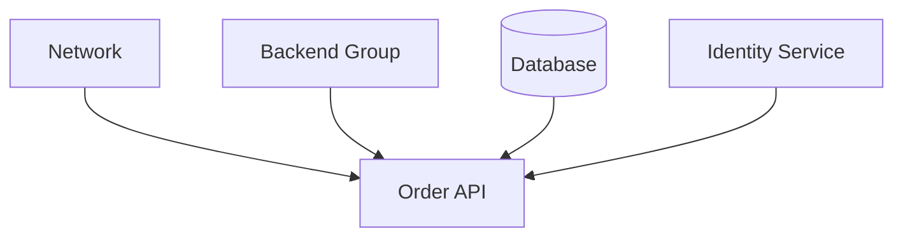

Korelasyon, ilk sağlıksız parent'ı rastgele root cause seçmemelidir. Şunlar
değerlendirilmelidir:

- Parent gerçekten aynı failure domain içinde mi?
- Parent hatası child hatasından önce veya aynı korelasyon penceresinde mi?
- Parent sinyali bağımsız bir kaynaktan doğrulanmış mı?
- Parent arızasının child semptomunu üretmesi teknik olarak mümkün mü?
- Başka sibling kaynaklar aynı parent altında etkilenmiş mi?

Birden fazla parent aynı anda sağlıksızsa incident güven seviyesi `Probable` veya
`Unknown` olabilir ve NOC/Triage gerekebilir.

## 2.13 Topoloji üzerinde sağlık yayılımı

Parent'ın durumu child'ın gözlenen durumunu değiştirmez; child monitor sonucu
saklanmaya devam eder. Topoloji yalnız incident kararını ve açıklamayı etkiler.

Örnek:

```text
Datacenter: Down
Kubernetes node: Down
Pod: Down
API: Down
```

Bu dört sağlık sonucu korunur. Incident görünümü ise şöyle olur:

```text
Parent incident: Datacenter Down
Owner: Infra/Platform + Network
Affected resources:
  - Kubernetes node
  - Pod
  - API
Suppressed child incidents: 3
```

Bu ayrım iki fayda sağlar:

1. Etki alanı ve hangi kaynakların gerçekten başarısız olduğu kaybolmaz.
2. Aynı olay için ayrı ekip yönlendirmeleri ve yinelenen incident'lar oluşmaz.

## 2.14 Topoloji doğruluk kuralları

Bir topoloji yanlışsa korelasyon da yanlış olur. Pilot katalog aşağıdaki
kurallara uymalıdır:

- Her kaynak kararlı ve benzersiz bir `resource_id` değerine sahip olmalıdır.
- Her child'ın doğrudan parent'ları açıkça belirtilmelidir.
- İlişkinin `hard`, `soft` veya `redundant` türü yazılmalıdır.
- Kaynağın datacenter, environment ve network zone üyeliği bulunmalıdır.
- Silinmiş workload ilişkileri katalogdan temizlenmelidir.
- Replica ve backend grupları tek pod gibi modellenmemelidir.
- Gözlenemeyen katmanlar sağlıklı varsayılmamalı; `Visibility Gap` olarak
  işaretlenmelidir.
- Birden fazla adla görünen aynı fiziksel/mantıksal kaynak tek kimliğe
  eşlenmelidir.
- Topoloji değişikliklerinin kim tarafından ve ne zaman yapıldığı izlenmelidir.

## 2.15 Pilot için başlangıç kaynak ağacı

İki pilotun ilk manuel katalog ağacı aşağıdaki gibi olacaktır:

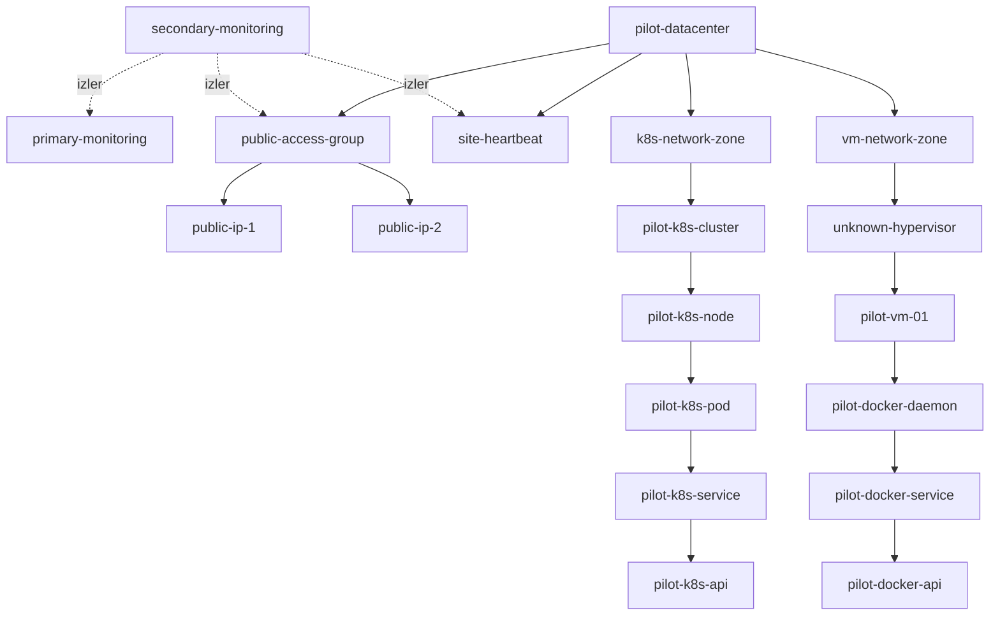

Bu şema mantıksal özettir. Service ile Pod arasındaki gerçek backend/EndpointSlice
grubu ve Kubernetes runtime ayrıntıları katalog dokümanında ayrı kaynaklar olarak
tanımlanacaktır.

## 2.16 Topolojinin cevaplaması gereken örnekler

| Gözlem | Topoloji sayesinde sorulacak soru | Beklenen yaklaşım |
|---|---|---|
| Kubernetes API Down | Node, runtime, pod ve Service parent'ları sağlıklı mı? | En üst sağlıksız ve kanıtlı parent incelenir |
| Pod OOMKilled | Aynı node'da genel memory pressure var mı? | Sahiplik politikası gereği Infra/Platform; sibling etkisi kaydedilir |
| VM API Down | VM heartbeat ve Docker daemon sağlıklı mı? | Sağlıklıysa app kanıtı, değilse parent incident |
| Bütün DC endpoint'leri Down | Ortak public erişim ve site heartbeat nasıl? | Tek DC veya Network parent incident'ı |
| Tek public IP Down | Redundancy grubunda başka üye sağlıklı mı? | `Degraded`, Network, child servisler Down olmaz |
| Probe heartbeat kayıp | Hedefler mi yoksa gözlem kaynağı mı kayıp? | Tek telemetry-source incident, child incident suppression |
| İki farklı DC'de iki API Down | Ortak parent gerçekten var mı? | Zaman yakınlığına rağmen ayrı incident kalabilir |

## 2.17 Bu aşamanın çıktısı

Bu belgeyle aşağıdaki kararlar sabitlenmiştir:

- Kubernetes ve VM/Docker kaynakları ortak katman modeline bağlanacaktır.
- Korelasyon yalnız zamana değil parent-child topolojisine dayanacaktır.
- Bağımlılıklar `hard`, `soft` ve `redundant` olarak ayrılacaktır.
- Root cause araması child'dan parent'a, etki hesabı parent'tan child'a
  yürütülecektir.
- Service/backend grupları tek pod gibi modellenmeyecektir.
- Monitoring plane üretim servislerinden ayrı failure domain olarak tutulacaktır.
- İkincil OneUptime yalnız birincil monitoring plane ve site erişimini
  gözleyecektir.
- Hypervisor pilotta görünürlük boşluğu olarak kaydedilecektir.
- Child sağlık sonuçları saklanacak, yalnız incident ve ekip yönlendirmesi
  bastırılacaktır.

## Gezinme

- Önceki: [Aşama 1 — Sorun Tanımı ve Hedefler](01-sorun-tanimi-ve-hedefler.md)
- İndeks: [Genel Mimari Dokümantasyon İndeksi](README.md)
- Sonraki: [Aşama 3 — Servis Kataloğu ve Sahiplik Modeli](03-servis-katalogu-ve-sahiplik-modeli.md)

