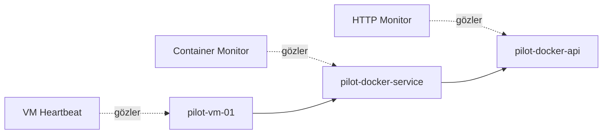
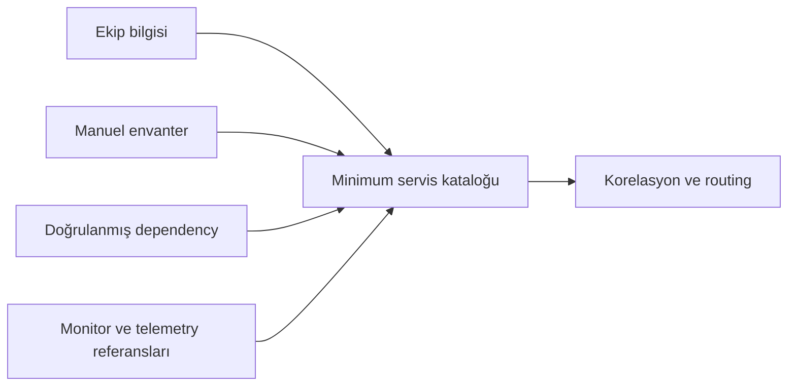
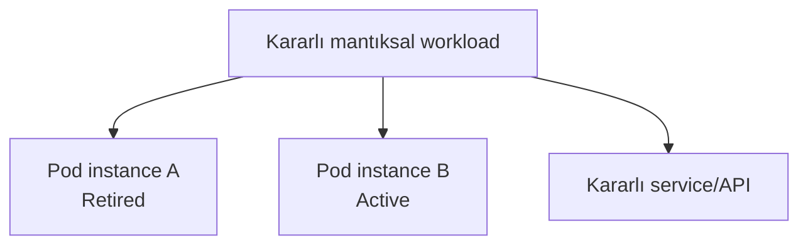
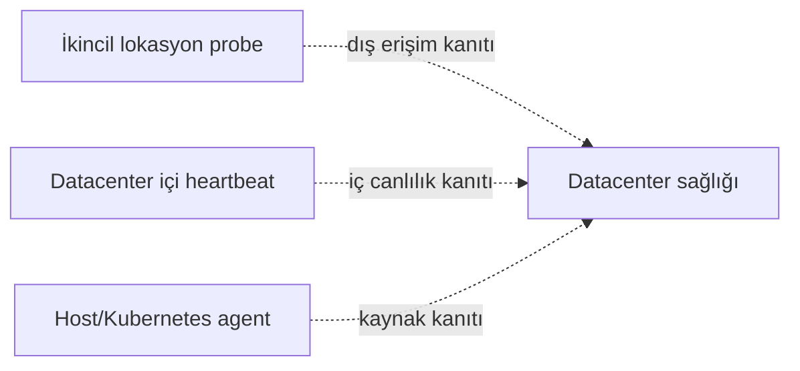
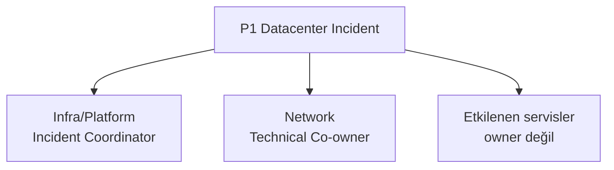
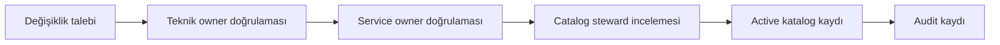

# Aşama 3 — Servis Kataloğu ve Sahiplik Modeli

## Amaç

Bu aşama, otomatik CMDB bulunmayan pilot ortamda root cause korelasyonu için
gerekli minimum servis kataloğunu ve ekip sahipliği modelini tanımlar.

Katalog yalnız bir envanter listesi değildir. Her kaynağın:

- Hangi datacenter ve environment içinde bulunduğunu,
- Hangi parent kaynaklara bağlı olduğunu,
- Hangi kaynakları etkileyebileceğini,
- Sağlığının hangi sinyallerle gözlendiğini,
- Teknik sorumluluğunun hangi ekipte olduğunu,
- Sağlık verisindeki görünürlük boşluklarını

açıklayan ortak doğruluk kaynağıdır.

Bu belgede tanımlanan kayıtlar kavramsaldır. Herhangi bir CMDB ürünü, veritabanı
şeması, API, OneUptime ayarı veya çalıştırılabilir konfigürasyon oluşturulmaz.

## 3.1 Neden monitor listesi servis kataloğu değildir?

Bir monitor listesi genellikle şunları bilir:

- Kontrol edilen URL, IP veya kaynak
- Kontrol aralığı
- Başarı ve hata kriteri
- Son sağlık durumu

Root cause korelasyonu için ise aşağıdaki bilgiler de gerekir:

- Monitorün temsil ettiği gerçek kaynak
- Kaynağın parent ve child ilişkileri
- Kaynağın failure domain'i
- Aynı kaynağı gözleyen diğer monitor ve agent'lar
- Kaynağın redundant grubunun bulunup bulunmadığı
- Teknik owner ve incident routing politikası
- Kaynak adı değişse bile kullanılacak kararlı kimlik

Örneğin aşağıdaki üç monitor aynı gerçek servisin farklı belirtilerini izliyor
olabilir:

```text
HTTP health monitor
Container memory monitor
VM heartbeat monitor
```

Bu monitorlerin birbirleriyle ilişkisi yalnız isimlerinden tahmin edilirse
yanlış korelasyon oluşabilir. Katalog, üçünü aynı kaynak zincirine açıkça bağlar.



## 3.2 Pilot katalog yaklaşımı

Kuruluşta bugün merkezi bir CMDB bulunmadığı için pilotta **minimum manuel
katalog** kullanılacaktır.

Bu yaklaşımın ilkeleri:

1. Yalnız iki pilot zinciri için gerekli kaynaklar kaydedilir.
2. İlişkiler ekiplerle birlikte doğrulanır; monitor adlarından otomatik tahmin
   edilmez.
3. Katalog, korelasyon kararının doğruluk kaynağıdır.
4. OneUptime veya başka bir izleme ürünündeki kaynak kimlikleri kataloğa referans
   olarak eklenebilir; katalog kimliğinin yerine geçmez.
5. Kubernetes ve Docker gibi dinamik ortamlardaki geçici instance'lar ile
   kararlı mantıksal servisler birbirinden ayrılır.
6. Pilot başarılı olduktan sonra discovery ve gerçek CMDB entegrasyonu
   değerlendirilebilir.



## 3.3 Kaynak kaydı için zorunlu alanlar

Her katalog kaydı aşağıdaki minimum alanlara sahip olmalıdır.

| Alan | Zorunlu | Açıklama |
|---|---:|---|
| `resource_id` | Evet | Kaynak silinip yeniden oluşmadıkça değişmeyen benzersiz katalog kimliği |
| `display_name` | Evet | İnsanların arayüzde okuyacağı kaynak adı |
| `resource_type` | Evet | Datacenter, network zone, VM, node, runtime, workload, service, endpoint gibi tür |
| `environment` | Evet | Pilot, test, staging veya production gibi ortam |
| `datacenter_id` | Uygunsa | Kaynağın fiziksel/mantıksal site üyeliği |
| `network_zone_id` | Uygunsa | Kaynağın ağ failure domain'i |
| `lifecycle_state` | Evet | Draft, Active, Stale veya Retired |
| `criticality` | Evet | İş etkisi ve öncelik değerlendirmesinde kullanılacak kritiklik |
| `technical_owner_team` | Evet | Kaynağın teknik işletiminden sorumlu ekip |
| `service_owner_team` | Uygunsa | İşlev veya uygulama servisinden sorumlu ekip |
| `triage_team` | Evet | Kanıt yetersizse olayı ilk değerlendirecek ekip |
| `visibility_state` | Evet | Observed, Partially Observed veya Visibility Gap |
| `monitor_refs` | Uygunsa | Kaynağı izleyen monitorlerin harici kimlikleri |
| `telemetry_source_refs` | Uygunsa | Agent, probe veya collector kimlikleri |
| `runbook_ref` | Uygunsa | İnsan müdahalesi gereken durumda kullanılacak rehber |
| `created_at` | Evet | Kaydın oluşturulma zamanı |
| `reviewed_at` | Evet | İlişki ve sahipliklerin son doğrulandığı zaman |
| `reviewed_by` | Evet | Son doğrulamayı yapan kişi veya ekip |

Gerçek IP, credential veya hassas erişim bilgileri servis kataloğuna zorunlu alan
olarak eklenmez. Monitor sistemi bu ayrıntıları kendi güvenli yapılandırmasında
tutabilir; katalog yalnız gerekli referansları taşır.

## 3.4 Kararlı kaynak kimliği

`resource_id`, korelasyon fingerprint'inin ve geçmiş incident ilişkilerinin
temelidir. Görünen ad ile aynı şey değildir.

Örnek kararlı kimlik biçimleri:

```text
dc:pilot-datacenter
network-zone:pilot-datacenter:k8s
k8s-cluster:pilot-k8s-cluster
k8s-node:pilot-k8s-cluster:pilot-k8s-node
k8s-workload:pilot-k8s-cluster:pilot:pilot-k8s-service
k8s-service:pilot-k8s-cluster:pilot:pilot-k8s-service
endpoint:pilot-k8s-service:health
vm:pilot-datacenter:pilot-vm-01
docker-daemon:pilot-vm-01
docker-service:pilot-vm-01:pilot-docker-service
endpoint:pilot-docker-service:health
```

Bu örnekler komut değildir; isimlendirme modelini gösterir.

Kimlik kuralları:

- Küçük harf ve tutarlı ayraç kullanılmalıdır.
- Ortam ve scope, aynı adlı kaynakları ayıracak kadar kimlikte bulunmalıdır.
- IP adresi tek başına kaynak kimliği yapılmamalıdır; IP değişebilir.
- Kubernetes pod UID'si mantıksal workload kimliğinin yerine kullanılmamalıdır.
- Container ID, Docker servisinin kalıcı kimliği yapılmamalıdır.
- Görünen ad değiştiğinde mümkünse `resource_id` korunmalıdır.
- Gerçekten farklı bir kaynak oluşturulduğunda eski kimlik yeniden
  kullanılmamalıdır.

## 3.5 Mantıksal kaynak ile çalışma instance'ı

Kubernetes podları ve Docker container'ları yeniden oluşturulduğunda teknik
instance kimlikleri değişir. Buna karşılık kullanıcının izlediği servis aynı
kalabilir.



Katalog iki kimlik seviyesini ayırmalıdır:

| Seviye | Örnek | Kullanım |
|---|---|---|
| Mantıksal kaynak | `k8s-workload:...:pilot-k8s-service` | Sahiplik, dependency, incident geçmişi ve SLO |
| Runtime instance | Pod UID veya container ID | Belirli lifecycle olayı, log, metric ve kanıt |

Bir pod yeniden oluşturulduğunda yeni instance eski incident'ın kanıtlarıyla
karışmamalı; fakat aynı mantıksal workload ve servis geçmişine bağlanmalıdır.

Pilot manuel katalogda her geçici pod veya container için sürekli insan eliyle
kayıt açılması beklenmez. Kararlı workload/service kaydı manuel tutulur;
instance kimliği telemetry olayının üzerinde referans olarak taşınır.

## 3.6 Kaynak türleri sözlüğü

Pilot boyunca aşağıdaki kontrollü kaynak türleri kullanılacaktır:

| `resource_type` | Açıklama | Örnek |
|---|---|---|
| `monitoring_plane` | İzleme ve incident değerlendirme platformu | `primary-monitoring` |
| `telemetry_source` | Probe, agent veya collector | `pilot-k8s-agent` |
| `datacenter` | Ortak site failure domain'i | `pilot-datacenter` |
| `redundancy_group` | Aynı işlevi sağlayan yedekli üye grubu | `public-access-group` |
| `network_endpoint` | Public IP/TCP veya başka ağ erişim noktası | `public-ip-1` |
| `site_heartbeat` | Site içinden bağımsız canlılık sinyali | `site-heartbeat` |
| `network_zone` | Kubernetes veya VM ağ failure domain'i | `k8s-network-zone` |
| `hypervisor` | VM'nin compute parent'ı | `unknown-hypervisor` |
| `vm` | Sanal makine ve host işletim kapsamı | `pilot-vm-01` |
| `kubernetes_cluster` | Kubernetes cluster | `pilot-k8s-cluster` |
| `kubernetes_node` | Kubernetes worker/control-plane node | `pilot-k8s-node` |
| `runtime` | Kubelet/container runtime veya Docker daemon | `pilot-docker-daemon` |
| `workload` | Deployment, Podman/Docker service veya mantıksal workload | `pilot-k8s-service-workload` |
| `runtime_instance` | Belirli pod/container instance'ı | Geçici pod UID |
| `backend_group` | Service veya proxy arkasındaki hazır backend grubu | `pilot-k8s-backends` |
| `service` | Mantıksal uygulama servisi | `pilot-k8s-service` |
| `endpoint` | HTTP/API/TCP uç noktası | `pilot-k8s-api` |
| `data_dependency` | Database, storage, cache veya queue | Pilot dışında referans |
| `external_dependency` | Kurum dışı API/SaaS | Pilot dışında referans |

Serbest metinle yeni tür açmak yerine sözlük kontrollü biçimde
genişletilmelidir. Aynı türün `vm`, `virtual-machine` ve `server` gibi üç farklı
adla tutulması routing kurallarını belirsizleştirir.

## 3.7 Dependency kayıt şeması

Kaynaklar arası ilişki ayrı bir dependency kaydı olarak düşünülmelidir.

| Alan | Açıklama |
|---|---|
| `dependency_id` | İlişkinin benzersiz kimliği |
| `child_resource_id` | Çalışması parent'a bağlı kaynak |
| `parent_resource_id` | Üst bağımlılık |
| `dependency_type` | Hard, soft veya redundant |
| `failure_domain_type` | Datacenter, network, compute, runtime, service veya data |
| `suppression_policy` | Parent Down iken child incident'ın bastırılıp bastırılmayacağı |
| `impact_description` | Parent kaybının child üzerindeki beklenen etkisi |
| `evidence_required` | Parent arızasının hangi kanıtlarla kabul edileceği |
| `valid_from` | İlişkinin başladığı zaman |
| `valid_until` | Kaldırıldıysa ilişki bitiş zamanı |
| `reviewed_at` | Son doğrulama zamanı |

### Örnek dependency kayıtları

| Child | Parent | Tür | Suppression | Açıklama |
|---|---|---|---|---|
| `pilot-k8s-node` | `pilot-k8s-cluster` | Hard | Evet | Node cluster ve ortak kontrol/ağ kapsamındadır |
| `pilot-k8s-workload` | `pilot-k8s-node` | Hard | Evet | Pilot workload tek node üzerinde çalışır |
| `pilot-k8s-api` | `pilot-k8s-backends` | Hard | Evet | Hazır backend yoksa API sunulamaz |
| `pilot-vm-01` | `unknown-hypervisor` | Hard | Yalnız parent kanıtlıysa | Hypervisor sağlık telemetrisi pilotta yoktur |
| `pilot-docker-service` | `pilot-docker-daemon` | Hard | Evet | Runtime olmadan container yönetilemez |
| `public-access-group` | `public-ip-1` | Redundant | Hayır | Diğer public IP çalışabilir |
| `public-access-group` | `public-ip-2` | Redundant | Hayır | Diğer public IP çalışabilir |

Hypervisor ilişkisindeki `Yalnız parent kanıtlıysa` ifadesi önemlidir. Topolojide
parent olması, telemetri bulunmadan onun arızalı ilan edilmesine izin vermez.

## 3.8 Monitor ve telemetry eşleme kayıtları

Bir kaynak birden fazla sinyalle izlenebilir. Monitor ve telemetry referansları
kaynak kaydından ayrı eşleme olarak tutulabilir.

| Alan | Açıklama |
|---|---|
| `signal_binding_id` | Eşlemenin kimliği |
| `resource_id` | Sinyalin temsil ettiği katalog kaynağı |
| `source_system` | OneUptime veya başka kaynak sistem |
| `external_resource_id` | Kaynak sistemdeki monitor/agent kimliği |
| `signal_family` | Availability, metric, event, log, trace veya heartbeat |
| `vantage_point` | Dış lokasyon, site içi, node, VM veya agent |
| `expected_interval` | Sinyalin beklenen üretim sıklığı |
| `freshness_limit` | Sinyalin NoData sayılacağı üst süre |
| `authoritative_for` | Bu sinyalin kanıt sayıldığı sağlık özelliği |
| `enabled` | Korelasyonda kullanılıp kullanılmayacağı |

Örnek:

| Kaynak | Sinyal ailesi | Vantage point | Kanıtladığı şey |
|---|---|---|---|
| `public-ip-1` | TCP availability | İkincil lokasyon | Dış TCP 443 erişimi |
| `site-heartbeat` | Heartbeat | Datacenter içi | Site içindeki telemetry kaynağının merkezle iletişimi |
| `pilot-k8s-node` | Metric/event | Kubernetes agent | Node condition ve kaynak baskısı |
| `pilot-k8s-api` | HTTP/API | Farklı node veya zone | Kullanıcıya yakın servis davranışı |
| `pilot-vm-01` | Host heartbeat/metric | VM agent | VM/OS canlılığı ve kaynakları |
| `pilot-docker-service` | Docker event/metric/log | Docker agent | Container lifecycle ve runtime durumu |

Farklı monitorlerin aynı `resource_id` değerine bağlanması, bunların ayrı
incident üretmesi gerektiği anlamına gelmez. Bunlar aynı olay için farklı kanıt
kanallarıdır.

## 3.9 Vantage point kimliği

Bir sinyalin bağımsız kanıt sayılabilmesi için nereden üretildiği bilinmelidir.
Aynı probe tarafından aynı ağ yoluyla yapılan üç kontrol üç bağımsız kanıt
değildir.

Katalogda veya signal binding kaydında şu bilgiler bulunmalıdır:

- Lokasyon veya datacenter
- Network zone
- Probe/agent kimliği
- Birincil monitoring plane'e bağımlı olup olmadığı
- Hedefe iç ağdan mı dış ağdan mı ulaştığı



Bu üç sinyal farklı hata alanlarına sahipse birlikte daha güçlü kanıt üretir.

## 3.10 Görünürlük durumları

Her katalog kaynağı aşağıdaki görünürlük durumlarından birine sahip olmalıdır:

| Durum | Anlamı | Root cause etkisi |
|---|---|---|
| `Observed` | Sağlık ve kimlik için doğrudan, güncel telemetri var | Uygun kanıtla Confirmed neden olabilir |
| `Partially Observed` | Yalnız bazı sağlık boyutları gözleniyor | En fazla kanıtlanan alt özellik kesinleştirilebilir |
| `Visibility Gap` | Kaynak biliniyor fakat sağlık telemetrisi yok | Tek başına Confirmed root cause olamaz |
| `Telemetry Stale` | Daha önce sinyal vardı fakat freshness sınırı aşıldı | Hedef sağlığı ile telemetry kaybı ayrılmalıdır |

Pilot hypervisor kaydı:

| Alan | Değer |
|---|---|
| `resource_id` | `hypervisor:pilot-datacenter:unknown-hypervisor` |
| `display_name` | `Pilot VM Hypervisor — Visibility Gap` |
| `resource_type` | `hypervisor` |
| `visibility_state` | `Visibility Gap` |
| `technical_owner_team` | Infra/Platform |
| `monitor_refs` | Yok |
| Root cause kuralı | Doğrudan sağlık kanıtı olmadan Confirmed seçilemez |

Bu kayıt, bilinmeyen katmanın yok sayılmasını engeller. Aynı zamanda operatöre
VM heartbeat kaybının fiziksel host, VM, OS veya network kaynaklı olabileceğini
hatırlatır.

## 3.11 Lifecycle durumları

Katalog kayıtlarının zaman içinde yönetilmesi gerekir.

| Durum | Anlamı | Korelasyonda kullanım |
|---|---|---|
| `Draft` | Kaynak veya ilişkiler henüz doğrulanmadı | Otomatik suppression için kullanılmaz |
| `Active` | Sahiplik ve dependency doğrulandı | Korelasyon ve routing için kullanılabilir |
| `Stale` | Gözden geçirme süresi doldu veya discovery ile çelişiyor | Suppression kararı ihtiyatlı verilir; NOC incelemesi gerekebilir |
| `Retired` | Kaynak artık hizmette değil | Yeni olaylarda kullanılmaz, geçmiş audit için saklanır |

Bir kayıt silinmek yerine `Retired` yapılırsa eski incident ve RCA kayıtlarındaki
referanslar bozulmaz.

## 3.12 Kritiklik alanı

Kaynak kritiklik değeri tek başına incident önceliği değildir. Incident önceliği
gerçek etki, kapsam ve redundancy durumuyla birlikte hesaplanır.

Pilot için aşağıdaki sınıflar yeterlidir:

| Kritiklik | Tanım |
|---|---|
| `Critical` | Kaybı geniş kullanıcı veya monitoring-plane etkisi oluşturabilir |
| `High` | Kritik işlevi etkiler fakat failure domain sınırlıdır |
| `Medium` | Pilot veya yedekli servis; etkisi sınırlı olabilir |
| `Low` | Bilgilendirme veya destekleyici kaynak |

Örnek olarak tek public IP `Critical` bir datacenter'ın parçası olsa bile
redundant üye olduğundan tek başına kaybı P3 olabilir. Son public IP de
kaybolduğunda etki büyür.

## 3.13 Sahiplik kavramları

Sahiplik tek bir alan değildir. Farklı sorumluluklar açıkça ayrılmalıdır.

| Sahiplik türü | Soru | Kullanım |
|---|---|---|
| Technical owner | Kaynağın altyapı ve çalışma sağlığını kim yönetiyor? | Root cause routing |
| Service owner | Servisin işlevi ve kod davranışından kim sorumlu? | Uygulama kanıtında routing ve etki bilgisi |
| Triage owner | Kanıt yetersizse ilk incelemeyi kim yapıyor? | `Unknown` olaylar |
| Incident coordinator | Birden fazla ekipli olayda koordinasyonu kim yürütüyor? | P1 ve ortak sahipli incident |
| Catalog steward | Kaynak ve dependency bilgisini kim güncel tutuyor? | Veri kalitesi ve periyodik review |

Bir Application ekibinin service owner olması, parent datacenter arızasında
incident owner olacağı anlamına gelmez. Servis etkilenmiş kaynak olarak görünür;
teknik incident parent'ın sorumlu ekiplerine yönlendirilir.

## 3.14 Ekip domain'leri

Pilot sahiplik modeli dört ekip domain'i kullanır.

### NOC/Triage

Sorumlulukları:

- Kanıtı eksik veya çelişkili incident'ları değerlendirmek
- Yanlış veya stale katalog ilişkisini fark etmek
- Görünürlük boşluğu bulunan olayda ilk koordinasyonu yapmak
- Yeterli kanıt toplandığında incident'ı doğru teknik ekibe devretmek
- Root cause güven seviyesini ve devir gerekçesini timeline'a yazmak

NOC/Triage, bütün incident'ların zorunlu ilk sahibi değildir. Kanıt yeterliyse
incident doğrudan ilgili teknik ekibe yönlendirilebilir.

### Network

Sorumluluk alanları:

- WAN ve internet çıkışı
- Routing ve bağlantı yolları
- Firewall ve ağ erişim politikaları
- DNS altyapısı
- Load balancer ve edge erişimi
- Network zone/VLAN
- Public IP ve bağlantı yedekliliği

### Infra/Platform

Bu pilotta birleşik domain olarak aşağıdakilerden sorumludur:

- Datacenter ve compute katmanı
- Fiziksel/sanal sunucu kapsamı
- VM ve işletim sistemi
- Kubernetes cluster, node ve runtime
- Docker daemon ve container runtime
- OOM ve genel kaynak yönetimi
- Deployment ve runtime configuration
- Database ve storage
- Monitoring agent/probe çalışma sağlığı

Seçilen politikaya göre workload tek başına limitini aşsa bile OOM olayı
Infra/Platform'a yönlendirilir. Uygulama ekibi etkilenmiş servis sahibi olarak
kaydedilebilir fakat incident'ın teknik owner'ı olmaz.

### Application

Sorumluluk alanı, altyapı ve runtime parent'ları sağlıklı iken uygulama
kanıtlarıyla doğrulanan davranışlardır:

- Kod exception
- Beklenmeyen HTTP 5xx
- Hatalı iş kuralı veya response içeriği
- Trace üzerinde uygulama span hatası
- Uygulama prosesinin kendi mantıksal hatası

Yalnız HTTP monitorünün kırmızı olması Application sahipliği için yeterli
değildir.

## 3.15 Kaynak türü için varsayılan sahiplik

| Kaynak veya olay | Technical owner | Service owner | Belirsizlikte |
|---|---|---|---|
| Datacenter | Infra/Platform + Network | Yok | NOC/Triage |
| Public erişim redundancy grubu | Network | Yok | NOC/Triage |
| Network zone, DNS, firewall, load balancer | Network | Uygunsa Application referansı | NOC/Triage |
| Hypervisor | Infra/Platform | Yok | NOC/Triage |
| VM/OS | Infra/Platform | Uygunsa Application | NOC/Triage |
| Kubernetes cluster/node/runtime | Infra/Platform | Uygunsa Application | NOC/Triage |
| Docker daemon | Infra/Platform | Uygunsa Application | NOC/Triage |
| Workload deployment/config | Infra/Platform | Application | NOC/Triage |
| Pod/container OOM | Infra/Platform | Application etkilenmiş kaynak | NOC/Triage |
| Database/storage | Infra/Platform | Uygunsa Application | NOC/Triage |
| Uygulama kodu/exception | Application | Application | NOC/Triage |
| Telemetry source | Infra/Platform | Yok | NOC/Triage |

Bu tablo varsayılan routing'i gösterir. Incident sırasında kanıtların hangi olay
sınıfına işaret ettiği ayrıca değerlendirilir.

## 3.16 Ortak sahiplik ve koordinasyon

Datacenter `Down` olayında hem Infra/Platform hem Network teknik owner olur.
Ancak tek bir koordinasyon sorumlusu bulunmalıdır.



Koordinasyon kuralları:

- Infra/Platform incident koordinasyonunu yürütür.
- Network kendi teknik bulgularını aynı timeline'a ekler.
- Ayrı Network ve Infra incident'ları açılmaz.
- Application servisleri `affected_resources` içinde gösterilir.
- Parent incident aktifken Application ekiplerine bağımsız child incident
  atanmaz.
- Root cause sonradan yalnız Network olarak kesinleşirse incident owner listesi
  güncellenebilir; yapılan değişiklik audit olarak korunur.

## 3.17 Sahiplik ile bildirim kanalının ayrılması

Bu dokümantasyon incident'ın kime ait olduğunu tanımlar; ekibe nasıl
ulaşılacağını tanımlamaz.

```text
Ownership kararı
≠ Bildirim kanalı
≠ On-call escalation yöntemi
```

Örneğin Network ekibinin owner olması gelecekte telefon, e-posta, chat veya
ticket seçeneklerinden hangisinin kullanılacağını belirlemez. Kanal politikası
ayrı bir aşamada seçilecektir.

Bu ayrım, mimarinin belirli bir mesajlaşma ürününe bağımlı hale gelmesini önler.

## 3.18 Pilot kaynak kataloğu

Aşağıdaki tablo pilotun başlangıç envanteridir. Değerler gerçek altyapı bilgisi
değil, dokümantasyonda kullanılacak genel örnek adlarıdır.

| `resource_id` kısa gösterim | Tür | Parent | Dependency | Technical owner | Görünürlük |
|---|---|---|---|---|---|
| `primary-monitoring` | Monitoring plane | Üretim DC | Hard | Infra/Platform | Observed |
| `secondary-monitoring` | Monitoring plane | Farklı lokasyon | Bağımsız failure domain | Infra/Platform | Observed |
| `pilot-datacenter` | Datacenter | Yok | Yok | Infra/Platform + Network | Partially Observed |
| `public-access-group` | Redundancy group | Pilot DC | Hard | Network | Observed |
| `public-ip-1` | Network endpoint | Public access group | Redundant | Network | Observed |
| `public-ip-2` | Network endpoint | Public access group | Redundant | Network | Observed |
| `site-heartbeat` | Telemetry source | Pilot DC | Hard evidence source | Infra/Platform | Observed |
| `k8s-network-zone` | Network zone | Pilot DC | Hard | Network | Partially Observed |
| `pilot-k8s-cluster` | Kubernetes cluster | DC/network | Hard | Infra/Platform | Observed |
| `pilot-k8s-node` | Kubernetes node | Cluster | Hard | Infra/Platform | Observed |
| `pilot-k8s-runtime` | Runtime | Node | Hard | Infra/Platform | Observed |
| `pilot-k8s-workload` | Workload | Node/runtime | Hard | Infra/Platform | Observed |
| `pilot-k8s-backends` | Backend group | Workload instances | Redundant/Hard | Infra/Platform | Observed |
| `pilot-k8s-service` | Service | Backend group | Hard | Infra/Platform | Observed |
| `pilot-k8s-api` | Endpoint | Service/application | Hard | Application | Observed |
| `vm-network-zone` | Network zone | Pilot DC | Hard | Network | Partially Observed |
| `unknown-hypervisor` | Hypervisor | Pilot DC | Hard | Infra/Platform | Visibility Gap |
| `pilot-vm-01` | VM/OS | Hypervisor | Hard | Infra/Platform | Observed |
| `pilot-docker-daemon` | Runtime | VM/OS | Hard | Infra/Platform | Observed |
| `pilot-docker-service` | Workload/service | Docker daemon | Hard | Infra/Platform | Observed |
| `pilot-docker-api` | Endpoint | Docker service | Hard | Application | Observed |

`pilot-k8s-api` ve `pilot-docker-api` için Application service owner olabilir.
Ancak endpoint'in incident owner'ı, root cause kanıtına göre Network,
Infra/Platform, Application veya NOC/Triage olabilir.

## 3.19 Pilot sahiplik matrisi

| Root cause kanıtı | Incident owner | Coordinator | Bastırılacak child incident'lar |
|---|---|---|---|
| Datacenter Down | Infra/Platform + Network | Infra/Platform | Aynı DC altındaki VM, node, runtime, workload ve endpoint |
| Dış erişim kayıp, iç heartbeat sağlıklı | Network | Network | Aynı network path'e bağlı dış endpoint semptomları |
| Kubernetes node NotReady | Infra/Platform | Infra/Platform | O node üzerindeki pod, backend ve API semptomları |
| Pod/container OOM | Infra/Platform | Infra/Platform | Aynı OOM olayından doğan endpoint semptomları |
| Docker daemon Down | Infra/Platform | Infra/Platform | O daemon altındaki container ve API semptomları |
| VM heartbeat kayıp, hypervisor görünmüyor | NOC/Triage veya ek kanıta göre Infra/Platform | NOC/Triage | Kesin parent bulunana kadar ilişkili semptomlar korelasyon penceresinde tutulur |
| Runtime sağlıklı, exception/trace ve HTTP 5xx | Application | Application | Aynı servis için yinelenen endpoint/log incident'ları |
| Probe/agent NoData | Infra/Platform | Infra/Platform | O telemetry source'a bağlı hedef incident'ları |
| Kanıtlar çelişkili | NOC/Triage | NOC/Triage | Kesin ilişki kurulana kadar gereksiz çoklu routing engellenir |

## 3.20 Katalog değişiklik süreci

Manuel katalog kontrolsüz bir belgeye dönüşmemelidir. Her değişiklik için basit
bir review akışı kullanılmalıdır.



Değişiklik gerektiren olaylar:

- Yeni servis veya altyapı kaynağı
- Servisin başka VM, node, cluster veya datacenter'a taşınması
- Replica veya backend modelinin değişmesi
- Yeni hard/soft/external dependency
- Owner ekip değişikliği
- Monitor/agent kimliği değişikliği
- Kaynağın hizmetten kaldırılması
- Incident sırasında yanlış dependency tespit edilmesi

## 3.21 Gözden geçirme sıklığı

Pilot için aşağıdaki minimum kontrol önerilir:

| Kontrol | Zaman |
|---|---|
| Pilot ilk aktivasyon | Bütün kayıtlar iki ekip tarafından doğrulanır |
| Planlı deployment/topoloji değişikliği | Değişiklik devreye girmeden önce veya aynı değişiklik kaydında |
| P1 sonrası | RCA sürecinde katalog ilişkileri tekrar doğrulanır |
| Tekrarlayan P2 sonrası | Fingerprint ve dependency doğruluğu kontrol edilir |
| Periyodik review | En geç 90 günde bir |
| Telemetry-discovery çelişkisi | Kayıt `Stale` yapılıp ilk fırsatta incelenir |

## 3.22 Katalog veri kalitesi kontrolleri

Pilot katalog aşağıdaki kontrollerden geçmelidir:

- [ ] Her Active kaynak benzersiz `resource_id` değerine sahip.
- [ ] Her endpoint bir service/workload parent'ına bağlı.
- [ ] Her workload bir runtime/compute parent'ına bağlı.
- [ ] Her compute kaynağı datacenter ve network zone ile ilişkilendirilmiş.
- [ ] Bütün dependency kayıtlarında tür belirtilmiş.
- [ ] Redundant grupların üyeleri ve minimum sağlıklı üye sayısı biliniyor.
- [ ] Her kaynakta technical owner bulunuyor.
- [ ] Her uygulama servisinde service owner bulunuyor.
- [ ] Belirsiz olaylar için NOC/Triage tanımlı.
- [ ] Visibility Gap kaynaklar açıkça işaretlenmiş.
- [ ] Monitor ve telemetry kaynakları doğru katalog kaynağına bağlanmış.
- [ ] Draft ve Stale ilişkiler otomatik suppression için kesin kanıt sayılmıyor.
- [ ] Retired kayıtlar yeni incident korelasyonunda kullanılmıyor.
- [ ] Gerçek credential veya hassas secret katalogda bulunmuyor.

## 3.23 Anti-pattern'ler

### Monitor adını sahiplik kuralı yapmak

`APP-`, `DB-` veya `NETWORK-` prefix'i faydalı olabilir fakat tek doğruluk kaynağı
olmamalıdır. Monitor yanlış adlandırıldığında incident yanlış ekibe gider.

### Her podu manuel kalıcı servis kabul etmek

Podlar yeniden oluşturulabilir. Sahiplik mantıksal workload/service üzerinde,
kanıt ise runtime instance üzerinde tutulmalıdır.

### Visibility Gap kaynağı sağlıklı varsaymak

Telemetri yokluğu sağlık kanıtı değildir. Hypervisor görünmüyorsa VM kaybının
kesin fiziksel nedeni söylenemez.

### Technical owner ile etkilenen ekibi karıştırmak

Datacenter incident'ında yüz uygulama servisi etkilenebilir. Bu, yüz Application
ekibinin incident owner olması gerektiği anlamına gelmez.

### Silinmiş kaynak kimliğini yeniden kullanmak

Eski incident geçmişi yeni kaynağa yanlış bağlanabilir. Retired kaynak kimliği
başka fiziksel veya mantıksal kaynak için kullanılmamalıdır.

### Dependency türünü belirtmemek

Tek public IP kaybı ile son çalışan backend kaybı aynı davranışı üretmemelidir.
Hard ve redundant ayrımı suppression ve priority kararları için zorunludur.

## 3.24 OneUptime ile ilişki

OneUptime içindeki monitor, host, Kubernetes, Docker ve incident kayıtları bu
katalogdaki kaynaklara `external_resource_id` ile bağlanabilir. Ancak aşağıdaki
varsayım yapılmayacaktır:

```text
OneUptime kaynak listesi otomatik olarak eksiksiz bir CMDB ve dependency graph'tır.
```

Pilot sırasında:

- OneUptime sinyal ve kaynak referanslarını sağlayabilir.
- Owner team ve incident kayıtları yönlendirme sonucunu taşıyabilir.
- Katalog ilişkileri ayrı ve ürün bağımsız biçimde belgelenir.
- OneUptime'ın native dependency suppression veya RCA desteği ayrıca
  doğrulanmadan var kabul edilmez.

Bu ayrım, tasarlanan modelin başka izleme veya incident ürünlerine taşınmasını da
kolaylaştırır.

## 3.25 Bu aşamanın çıktısı

Bu belgeyle aşağıdaki kararlar sabitlenmiştir:

- Pilot için minimum manuel servis kataloğu kullanılacaktır.
- Katalog, korelasyon topolojisinin doğruluk kaynağıdır.
- OneUptime ve diğer ürün kimlikleri katalog kimliğinin yerine geçmez; referans
  olarak bağlanır.
- Kararlı mantıksal kaynaklar ile geçici pod/container instance'ları ayrılır.
- Her dependency kaydında tür, suppression politikası ve gerekli kanıt bulunur.
- Hypervisor `Visibility Gap` olarak açıkça kaydedilir.
- Ekip domain'leri NOC/Triage, Network, Infra/Platform ve Application'dır.
- Datacenter incident'ında Infra/Platform ve Network ortak owner,
  Infra/Platform koordinatördür.
- OOM, deployment/config, VM/OS, Kubernetes, Docker, database ve storage
  Infra/Platform alanındadır.
- Application sahipliği yalnız güçlü uygulama kanıtında kullanılır.
- Owner seçimi bildirim kanalı seçiminden bağımsızdır.
- Katalog değişiklikleri review, lifecycle ve audit sürecine tabi olacaktır.

## Gezinme

- Önceki: [Aşama 2 — Katmanlı Kaynak Topolojisi](02-katmanli-kaynak-topolojisi.md)
- İndeks: [Genel Mimari Dokümantasyon İndeksi](README.md)
- Sonraki: [Aşama 4 — Sinyal ve Monitor Tasarımı](04-sinyal-ve-monitor-tasarimi.md)

