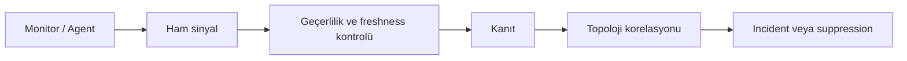
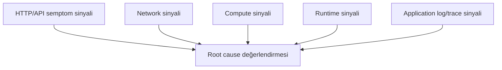
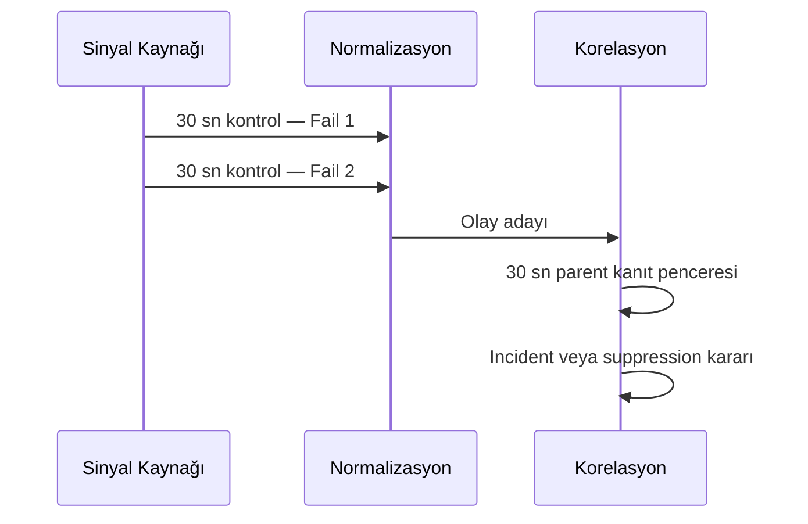
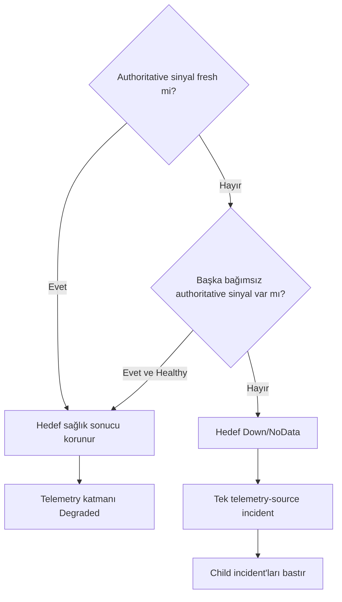
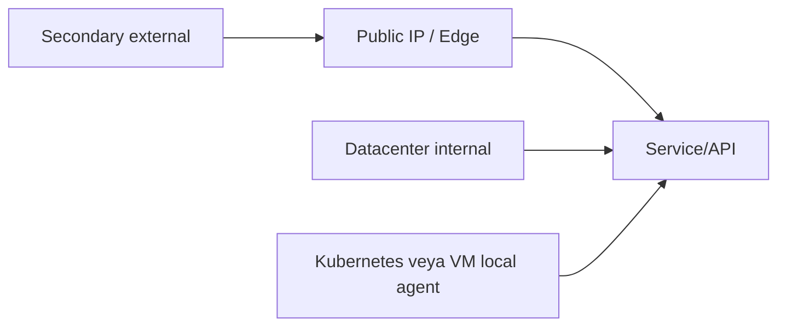
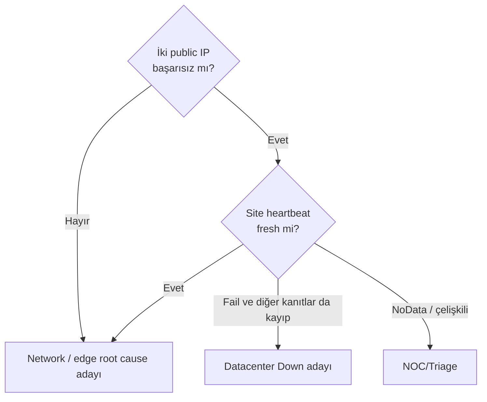
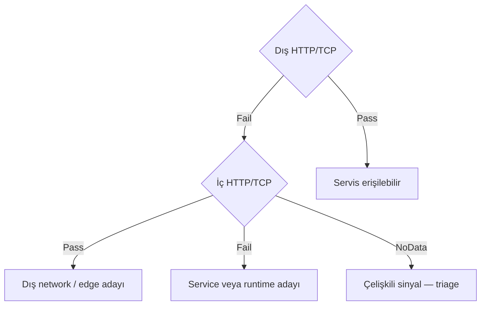
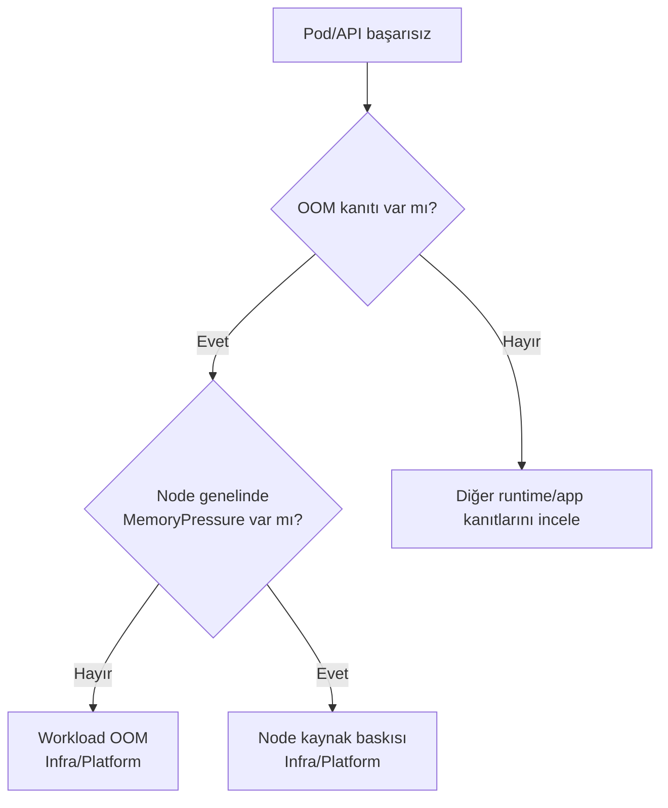
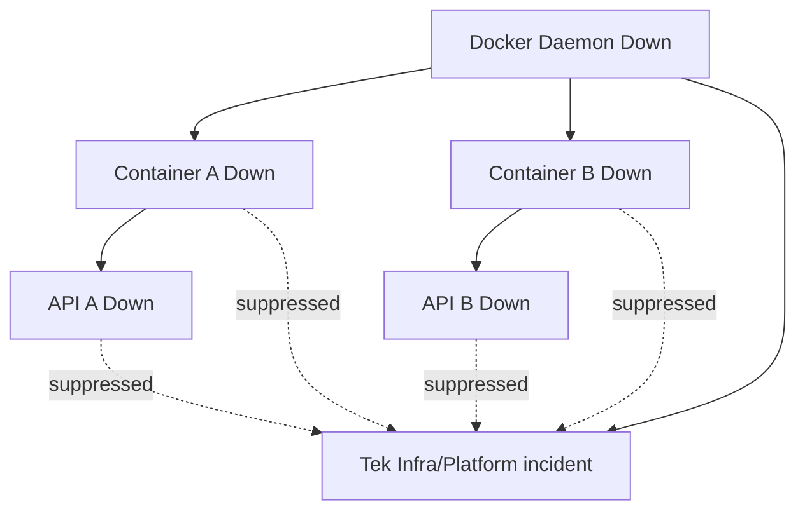
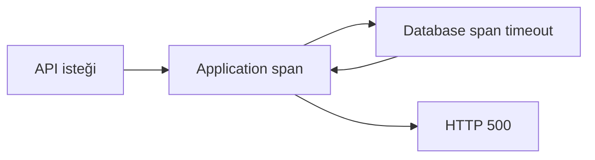

# Aşama 4 — Sinyal ve Monitor Tasarımı

## Amaç

Bu aşama, katmanlı topolojideki her kaynak için hangi sağlık sinyallerinin
toplanacağını, sinyalin nereden üretileceğini, neyi kanıtlayıp neyi
kanıtlayamayacağını ve kaynak durumunun nasıl ifade edileceğini tanımlar.

Amaç mümkün olan her metriği toplamak değildir. Incident kararını veya root cause
ayrımını değiştiren, sahibi belli ve operasyonel karşılığı bulunan sinyalleri
seçmektir.

Bu belge ürün kurulumu veya monitor oluşturma adımları içermez. Monitor türleri
mantıksal yetenek olarak açıklanır; daha sonra OneUptime veya başka bir izleme
sistemine eşlenebilir.

## 4.1 Monitor, sinyal, kanıt ve incident ayrımı

Bu dört kavram aynı şey değildir:

| Kavram | Tanım |
|---|---|
| Monitor | Belirli bir sağlık iddiasını düzenli veya olay bazlı değerlendiren kontrol |
| Sinyal | Monitor, agent, event, metric, log veya trace tarafından üretilen gözlem |
| Kanıt | Güvenilirliği ve kapsamı bilinen, root cause kararında kullanılabilecek sinyal |
| Incident | Korelasyon ve routing tamamlandıktan sonra insan müdahalesi için açılan kayıt |



Bir monitorün `Down` olması otomatik olarak ayrı incident oluşturması gerektiği
anlamına gelmez. Sinyal önce kaynak kataloğundaki `resource_id`, parent ilişkisi
ve vantage point ile değerlendirilir.

## 4.2 Monitor tasarım ilkeleri

### Tek monitor, tek temel iddia

Bir monitor mümkün olduğunca tek bir soruyu cevaplamalıdır:

- TCP portuna bağlantı kurulabiliyor mu?
- HTTP endpoint beklenen cevabı veriyor mu?
- Kubernetes node `Ready` mi?
- Pod sonlandırma nedeni `OOMKilled` mı?
- Docker daemon heartbeat gönderiyor mu?

Tek monitor içinde DNS, TCP, HTTP body, database ve uygulama davranışını tek
sonuca indirgemek hangi katmanın bozulduğunu gizler.

### Semptom ve neden monitorlerini birlikte kullanma

Endpoint monitorü kullanıcıya yakın semptomu, altyapı monitorleri olası nedeni
gösterir. Yalnız bir tarafın bulunması yeterli değildir.



### Monitorü doğru kaynağa bağlama

Her monitor veya telemetry binding tek bir birincil `resource_id` değerine
bağlanmalıdır. Aynı gözlem başka kaynaklar için etki kanıtı olabilir; ancak
monitor sahipliği belirsiz bırakılmamalıdır.

### Bağımsızlık derecesini kaydetme

Aynı agent içindeki üç kontrol, agent çöktüğünde birlikte kaybolur. Bunlar üç
bağımsız root cause kanıtı olarak sayılmamalıdır. Bağımsızlık için farklı
lokasyon, ağ yolu veya çalışma failure domain'i gerekir.

### Ölçülemeyen şeyi sağlıklı varsaymama

Hypervisor API'si yoksa hypervisor `Healthy` değildir; `Visibility Gap` olur.
Log gelmemesi de uygulamanın sağlıklı olduğunu kanıtlamaz.

### Sinyali aksiyonla ilişkilendirme

Toplanan her sinyal için şu sorular cevaplanmalıdır:

- Bu sinyal hangi kararı değiştirir?
- Hangi ekip bu kanıta göre hareket eder?
- Hangi runbook adımıyla doğrulanır?
- Sinyal kaybolursa hedef mi, telemetry kaynağı mı etkilenmiş sayılır?

Bu soruların hiçbirini cevaplamayan yüksek hacimli telemetry pilotun zorunlu
kapsamına alınmaz.

## 4.3 Sinyal aileleri

Pilot ortak olay modelinde aşağıdaki sinyal aileleri kullanılır:

| Sinyal ailesi | Üretim biçimi | Örnek | NoData yorumu |
|---|---|---|---|
| Availability | Aktif periyodik kontrol | TCP, HTTP, DNS | Beklenen kontrol sonucu gelmezse monitor kaynağı da incelenir |
| Heartbeat | Agent/probe tarafından düzenli push | VM veya site canlılığı | Freshness süresi aşılırsa telemetry kaybı veya hedef kaybı olabilir |
| Metric | Düzenli ölçüm | CPU, bellek, disk, restart count | Sürekli beklenen seri kesilirse stale sayılır |
| State | Güncel kaynak durumu | Node Ready, container running | Son güncel durum ve freshness birlikte kullanılır |
| Event | Değişiklik olduğunda üretilir | OOMKilled, container die, scheduling failure | Sessizlik normal olabilir; event için salt NoData üretilmez |
| Log | Uygulama/runtime kaydı | Exception, kernel OOM, daemon error | Log sessizliği sağlık kanıtı değildir |
| Trace | İstek zinciri | Hatalı application span, database timeout | Trafik yoksa trace yokluğu arıza değildir |
| Inventory | Periyodik discovery/metadata | Pod-node, container-host ilişkisi | Freshness aşılırsa topoloji Stale olabilir |

Event, log ve trace gibi seyrek sinyaller için “son 60 saniyede veri yok” sonucu
otomatik hata değildir. NoData yalnız düzenli üretilmesi beklenen kontrol,
heartbeat ve metric serilerinde kullanılmalıdır.

## 4.4 Normalize edilmiş sinyal kaydı

Farklı ürün ve agent'lardan gelen gözlemler korelasyondan önce ortak anlam
alanlarına çevrilmelidir.

| Alan | Açıklama |
|---|---|
| `signal_id` | Ham veya normalize edilmiş olayın benzersiz kimliği |
| `resource_id` | Servis kataloğundaki birincil kaynak |
| `runtime_instance_id` | Uygunsa pod UID veya container ID gibi geçici instance |
| `source_id` | Monitor, probe, agent veya collector kimliği |
| `signal_family` | Availability, heartbeat, metric, state, event, log, trace veya inventory |
| `assertion` | Sinyalin değerlendirdiği sağlık iddiası |
| `observed_at` | Kaynakta gözlemin oluştuğu zaman |
| `received_at` | Merkezi sistemin sinyali aldığı zaman |
| `vantage_point_id` | Kontrolün yapıldığı failure domain |
| `observed_state` | Pass, Fail, Degraded veya NoData |
| `value` | Ölçülen değer veya durum |
| `evidence_ref` | Log, event, trace veya ayrıntılı kanıt referansı |
| `freshness_state` | Fresh, Late veya Stale |
| `quality_flags` | Clock skew, partial data veya parse error gibi uyarılar |

Normalize edilmiş sinyal kaydı incident değildir. Korelasyon motoru aynı
`resource_id`, parent ilişkileri, zaman penceresi ve vantage point bilgisiyle
birden fazla kaydı birlikte değerlendirir.

## 4.5 Zaman ve freshness modeli

Pilot için düzenli sağlık kontrollerinin hedef aralığı 30 saniyedir.

### Aktif kontroller

- İlk başarısız sonuç geçici hata olarak kaydedilir.
- İkinci ardışık başarısız sonuç olay adayı oluşturur.
- Olay adayı yaklaşık 60 saniyede oluşur.
- Parent sinyallerini toplamak için ayrıca 30 saniyelik korelasyon penceresi
  kullanılır.

### Push heartbeat ve metric sinyalleri

- Beklenen gönderim aralığı katalogdaki `expected_interval` alanından alınır.
- Pilot varsayılanı 30 saniyedir.
- İki beklenen örnek kaçırılıp kısa ağ gecikmesi payı da aşıldığında sinyal
  `Stale` kabul edilir.
- Pilot için önerilen başlangıç freshness sınırı 75 saniyedir.
- Freshness, son ölçüm değerinden ayrı tutulur. On dakika önceki `Healthy`
  ölçümü güncel sağlık kanıtı değildir.

### Olay zamanları

`observed_at` ile `received_at` birlikte saklanır. Agent saati hatalıysa yalnız
kaynak zamanına güvenmek korelasyon sırasını bozabilir. Zaman senkronizasyonu
izlenmeli; belirgin clock skew varsa sinyale quality flag eklenmelidir.



## 4.6 Sağlık durumları

Monitorün ham sonucu ile katalog kaynağının birleşik durumu ayrıdır. Kaynak
seviyesinde dört temel durum kullanılır.

| Durum | Anlamı | Incident yorumu |
|---|---|---|
| `Healthy` | Gerekli sinyaller güncel ve başarı kriterleri sağlanıyor | Yeni incident yok |
| `Degraded` | Hizmet sürüyor fakat yedeklilik, kapasite veya bir sağlık boyutu azalmış | Etkiye göre P3 veya mevcut incident güncellemesi |
| `Down` | Güncel kanıt kaynağın beklenen işlevi sunamadığını gösteriyor | Korelasyon sonrası incident adayı |
| `Down/NoData` | Gerekli düzenli telemetry yok; seçilen politika hedefi Down gösteriyor fakat neden kanıtlanmamış | Tek telemetry-source incident ve child suppression |

`Down/NoData`, `Down` ile aynı kesinlikte root cause kanıtı değildir. Kullanıcıya
görünür durum Down olabilir; incident açıklaması telemetri kaybını açıkça
belirtmelidir.

Root cause güven seviyesi sağlık durumundan ayrı tutulur:

```text
Health State: Down/NoData
Root Cause Confidence: Unknown
Candidate Cause: telemetry source unavailable
```

## 4.7 Birleşik durum üretme kuralları

Bir kaynağın birden fazla sinyali varsa aşağıdaki sıra uygulanır:

1. Sinyallerin freshness durumu kontrol edilir.
2. Aynı sağlık iddiası için güncel ve authoritative sinyaller seçilir.
3. Bağımsız vantage point sonuçları karşılaştırılır.
4. Redundancy group üyeleri birlikte değerlendirilir.
5. Kaynağın kendi durumu hesaplanır.
6. Parent durumu incident korelasyonunda kullanılır; child'ın ham sağlık sonucu
   silinmez.

### Alternatif authoritative kaynak varsa

Bir agent kaybolmuş fakat aynı sağlık iddiasını bağımsız başka bir kaynak güncel
olarak doğruluyorsa hedef otomatik `Down/NoData` yapılmaz. Telemetry redundancy
azaldığı için hedef veya gözlem katmanı `Degraded` olabilir; kayıp agent için
ayrı telemetry-source değerlendirmesi yapılır.

### Bütün authoritative kaynaklar stale ise

Seçilen politika gereği hedef `Down/NoData` olur. Ancak her hedef için ayrı
incident açılmaz. Ortak agent veya probe kaybı tek parent incident olarak
Infra/Platform'a yönlendirilir; bağlı hedefler suppressed semptom olur.



## 4.8 Vantage point tasarımı

Vantage point, yalnız probe adı değil kontrolün failure domain'idir.

Pilot için üç temel bakış noktası bulunur:

| Vantage point | Konum | Temel sorusu |
|---|---|---|
| Secondary external | Birincil monitoring/DC dışındaki lokasyon | Datacenter public erişimi ve birincil monitoring plane dışarıdan ulaşılabilir mi? |
| Datacenter internal | İzlenen site içindeki bağımsız heartbeat/probe | Site içi sistemler yaşıyor ve dışarı veri gönderebiliyor mu? |
| Resource-local | Kubernetes node/cluster veya VM üzerindeki agent | Kaynağın runtime, lifecycle ve resource durumu nedir? |



### Bağımsızlık kontrol listesi

- [ ] Vantage point farklı bir lokasyonda veya failure domain'de mi?
- [ ] Aynı DNS resolver'a bağımlı mı?
- [ ] Aynı network path'i kullanıyor mu?
- [ ] Aynı OneUptime instance'ına bağlı mı?
- [ ] Aynı agent/probe process'i içinde mi?
- [ ] Aynı güç, hypervisor veya cluster failure domain'ini paylaşıyor mu?

Bu sorulardan çoğuna “evet” cevabı veriliyorsa sinyaller tamamen bağımsız
sayılmamalıdır.

## 4.9 Datacenter public erişim sinyalleri

Pilot datacenter için iki public IP üzerinden TCP `443` erişimi gözlenir. Bu
kontroller site dışındaki ikincil lokasyondan yapılmalıdır.

Her IP monitorü ayrı bir network endpoint kaynağına bağlanır:

| Monitor | Kaynak | İddia |
|---|---|---|
| Public IP1 TCP 443 | `public-ip-1` | Birinci dış erişim yolu TCP kabul ediyor |
| Public IP2 TCP 443 | `public-ip-2` | İkinci dış erişim yolu TCP kabul ediyor |

İki IP, `public-access-group` adlı redundant parent altında birlikte
değerlendirilir.

### Public erişim grubu durumu

| IP1 | IP2 | Grup durumu | Yorum |
|---|---|---|---|
| Pass | Pass | `Healthy` | İki dış erişim yolu çalışıyor |
| Fail | Pass | `Degraded` | Birinci yol kayıp, hizmet yedekli yoldan sürebilir |
| Pass | Fail | `Degraded` | İkinci yol kayıp, hizmet yedekli yoldan sürebilir |
| Fail | Fail | `Down` | Dış erişim grubu çalışmıyor; DC sonucu için iç heartbeat gerekir |
| NoData | NoData | `Down/NoData` | İkincil probe veya monitor sistemi de incelenmelidir |

Tek IP kaybı bütün website monitorlerinin bastırılmasına neden olmaz. Hizmet
diğer IP üzerinden erişilebiliyorsa yalnız yedeklilik kaybı vardır.

## 4.10 Site heartbeat sinyali

Site heartbeat, datacenter içindeki küçük ve bağımsız bir telemetry kaynağının
farklı lokasyondaki monitoring plane'e düzenli canlılık göndermesidir.

Heartbeat'in kanıtladığı şey:

```text
Site içindeki heartbeat kaynağı çalışıyor
ve
site ile ikincil monitoring lokasyonu arasında en az bir iletişim yolu var
```

Heartbeat'in tek başına kanıtlamadığı şeyler:

- Bütün fiziksel sunucuların sağlıklı olduğu
- Bütün Kubernetes cluster'larının çalıştığı
- Bütün VM ve uygulamaların erişilebilir olduğu
- Her iki public IP yolunun sağlıklı olduğu
- Datacenter enerji altyapısının tamamen normal olduğu

Heartbeat mümkünse birincil OneUptime ile aynı process, node, VM veya cluster
üzerinde çalışmamalıdır. Aksi halde monitoring plane kesintisi site heartbeat
kaybı gibi görünebilir.

## 4.11 Datacenter birleşik sağlık kuralı

Datacenter durumu public erişim grubu, site heartbeat ve monitoring plane
sonuçları birlikte değerlendirilerek üretilir.

| Public erişim grubu | Site heartbeat | Birincil monitoring | Datacenter durumu | Root cause adayı |
|---|---|---|---|---|
| Healthy | Fresh | Reachable | `Healthy` | Yok |
| Degraded | Fresh | Reachable | `Degraded` | Tek network yolu |
| Down | Fresh | Reachable veya içeriden sağlıklı | `Degraded` | Edge/WAN/Network |
| Down | Stale/Fail | Unreachable | `Down` adayı | Datacenter veya ortak site erişimi |
| NoData | Fresh | Reachable | `Degraded` | İkincil dış probe/monitoring sorunu |
| NoData | Stale | Unreachable | `Down/NoData` | Kanıt yetersiz; NOC/Triage |

İki public IP'nin kaybı datacenter'ı otomatik olarak fiziksel `Down` yapmaz. İç
heartbeat sağlıklıysa site çalışıyor fakat dış erişim bozulmuş olabilir.



## 4.12 Network sinyalleri

Network sorunu tek bir “ping başarısız” monitorüyle belirlenmemelidir. Ağın
farklı aşamalarını ayıran sinyaller gerekir.

| Sinyal | Gözlenen aşama | Kanıtladığı şey | Tek başına kanıtlamadığı şey |
|---|---|---|---|
| DNS resolve | İsim çözümleme | İlgili resolver beklenen adresi döndürüyor | Hedef TCP/HTTP sağlığı |
| TCP connect | L3/L4 erişim | Belirli IP/port bağlantı kabul ediyor | Uygulamanın doğru cevap verdiği |
| TLS handshake | Güvenli oturum | Sertifika ve TLS görüşmesi tamamlanıyor | API işlevi |
| HTTP request | Uygulama erişimi | Endpoint beklenen cevabı veriyor | Hatanın ağ mı kod mu olduğu |
| ICMP | Temel erişim sinyali | ICMP'ye izin verilen yolda yanıt var | TCP/HTTP servisinin çalıştığı |
| Path/route telemetry | Ağ yolu | Routing veya hop değişikliği | Uygulama sağlığı |
| Firewall/LB state | Ağ bileşeni | Policy/backend üyeliği ve cihaz sağlığı | Backend uygulama davranışı |
| Packet loss/latency | Yol kalitesi | Degradation ve ağ kalitesi | Tek başına root cause cihazı |

### DNS ile IP kontrolünü ayırma

Hostname üzerinden HTTP başarısız, doğrudan IP/TCP başarılıysa DNS root cause
adayı güçlenir. Hem hostname hem IP/TCP başarısızsa ortak ağ, hedef veya site
katmanı incelenir.

### İç ve dış yol karşılaştırması



## 4.13 Kubernetes cluster ve node sinyalleri

Pilot doğrudan bir node, workload ve API zincirine odaklanır. Cluster sinyalleri
node sonuçlarının bağlamı olarak kullanılır; tam control-plane HA testi pilot
kapsamında değildir.

### Node sinyal seti

| Sinyal | Aile | Sağlık iddiası | Root cause kullanımı |
|---|---|---|---|
| Node Ready condition | State | Kubelet node durumunu güncelleyebiliyor | `NotReady` node incident kanıtı |
| Node heartbeat freshness | Heartbeat | Node/kubelet düzenli durum gönderiyor | NoData ve node erişim ayrımı |
| MemoryPressure | State/metric | Node genelinde bellek baskısı var | Pod OOM bağlamı |
| DiskPressure | State/metric | Node disk baskısı altında | Scheduling/runtime sorunu bağlamı |
| PIDPressure | State/metric | Process kapasitesi baskı altında | Workload başlatma sorunu bağlamı |
| CPU/memory/filesystem | Metric | Node kaynak doygunluğu | Degradation ve kapasite kanıtı |
| Network errors/drops | Metric | Node ağ arayüzü sorunu | Network/runtime ayrımı |
| Kubelet/runtime health | Heartbeat/state | Node runtime servisleri çalışıyor | Runtime root cause kanıtı |
| Node events | Event | Eviction, reboot, taint veya runtime olayı | Timeline ve neden kanıtı |

Node `Ready` tek başına bütün podların sağlıklı olduğunu göstermez. Node
`NotReady` ise o node üzerindeki pod/API hatalarını açıklayabilecek güçlü parent
kanıtıdır.

## 4.14 Kubernetes workload, pod ve container sinyalleri

### Workload ve pod durumu

| Sinyal | Kanıt |
|---|---|
| Desired/available replica | Beklenen ve hazır workload kapasitesi |
| Pod phase | Pending, Running, Failed veya Unknown yaşam durumu |
| Ready condition | Podun Service backend olmaya hazır olup olmadığı |
| Restart count | Container'ın tekrar tekrar başladığına dair semptom |
| Scheduling event | Uygun node, kaynak veya policy sorunu |
| Termination reason | OOMKilled, Error, Completed gibi lifecycle nedeni |
| Exit code | Process sonlanma biçimi; tek başına her zaman root cause değildir |
| Container resource usage | Limit, request ve gerçek kullanım ilişkisi |
| cgroup/kernel OOM evidence | Bellek nedeniyle öldürülmeyi doğrulayan kanıt |

### OOM kanıtı

`ExitCode=137` tek başına kesin OOM kanıtı değildir; process başka bir nedenle
`SIGKILL` almış olabilir. `OOMKilled` termination reason, Kubernetes event,
container runtime veya kernel/cgroup bellek kanıtlarından biriyle
doğrulanmalıdır.

Seçilen sahiplik politikasında doğrulanmış bütün OOM olayları Infra/Platform'a
yönlendirilir. Node genelinde MemoryPressure bulunması olayın kapsamını ve
sibling etkisini değiştirir; ekip sahipliğini değiştirmez.



## 4.15 Kubernetes Service ve EndpointSlice sinyalleri

HTTP monitorü ile pod arasında routing katmanı bulunur. Bu katman ayrıca
izlenmelidir.

| Sinyal | Sağlık iddiası |
|---|---|
| Service mevcut | Mantıksal routing kaynağı tanımlı |
| Service port/target eşleşmesi | İstek doğru backend portuna yönlendirilebilir |
| Selector ile eşleşen pod sayısı | Service beklenen workload'u seçiyor |
| Ready endpoint sayısı | Trafik alabilecek backend sayısı |
| Toplam endpoint sayısı | Hazır olmayan backend dahil üyelik |
| Endpoint değişim olayı | Backend kaybı veya geri dönüş timeline'ı |
| İç Service HTTP kontrolü | Cluster içinden gerçek routing sonucu |

### Tek ve çok replica ayrımı

- Tek replica pilotunda hazır endpoint sayısının `0` olması Service/API için
  `Down` kanıtıdır.
- Çok replicalı ortamda bir endpoint kaybı, başka hazır endpoint varsa
  `Degraded` olabilir.
- Hazır endpoint sayısı beklenen minimumun altına düşmüş fakat sıfır değilse
  kapasite degradation değerlendirilir.
- Service varlığı tek başına çalışır backend bulunduğunu kanıtlamaz.

## 4.16 Kubernetes API ve uygulama sinyalleri

Pilot endpoint monitorü yalnız process canlılığını değil, seçilen kontrolün
anlamını açıkça belirtmelidir.

### Health endpoint seviyeleri

| Kontrol | Cevapladığı soru | Kullanım |
|---|---|---|
| Liveness | Process temel olarak çalışıyor mu? | Runtime yeniden başlatma ve process canlılığı |
| Readiness | Servis trafik almaya hazır mı? | Backend üyeliği ve bağımlılık hazırlığı |
| Functional/API | Belirli kullanıcı işlemi doğru çalışıyor mu? | Uygulama davranışı ve SLO |
| Dependency check | Database/cache gibi zorunlu bağımlılık erişilebilir mi? | Bağımlılık root cause ayrımı |

Tek bir `/status/live` cevabı bütün uygulama fonksiyonlarının sağlıklı olduğunu
kanıtlamaz. Liveness, readiness ve fonksiyonel API kontrolleri aynı anlama
geliyormuş gibi kullanılmamalıdır.

### Uygulama kanıt seti

Application ekibine doğrudan routing için aşağıdakilerin birlikte bulunması
beklenir:

- Datacenter ve network parent'ları güncel ve sağlıklı
- Kubernetes node/runtime sağlıklı
- Pod/container çalışıyor veya hatanın runtime kaynaklı olmadığı kanıtlı
- Service/EndpointSlice sağlıklı
- HTTP 5xx, yanlış response veya functional failure
- Aynı zaman aralığında exception logu, application span hatası veya benzer
  uygulama kanıtı

Yalnız HTTP timeout bu koşulu sağlamaz.

## 4.17 VM ve işletim sistemi sinyalleri

VM pilotunda host agent aşağıdaki düzenli sinyalleri sağlamalıdır:

| Sinyal | Sağlık iddiası | Not |
|---|---|---|
| Agent heartbeat | VM/OS ve agent iletişim kurabiliyor | Agent kaybı ile VM kaybı tek başına ayrılmaz |
| Uptime/boot ID | VM yeniden başladı mı? | Restart timeline'ı |
| CPU/load | İşlem kapasitesi ve saturation | Tek başına outage kanıtı değildir |
| Memory/paging | Bellek baskısı | OOM ve degradation bağlamı |
| Disk/filesystem | Alan ve I/O sağlığı | Container/log/runtime etkisi |
| Network interface | Hata, drop ve throughput | VM-local network kanıtı |
| Process/service state | Kritik OS servisleri çalışıyor mu? | Docker daemon bağlamı |
| Kernel/system log | OOM, I/O veya network hatası | Root cause kanıtı |

Hypervisor görünürlüğü olmadığı için VM heartbeat kaybında şu kontroller birlikte
değerlendirilir:

- Aynı network zone'daki diğer VM heartbeat'leri
- VM üzerindeki son kaynak ve kernel sinyalleri
- Docker agent freshness
- İç/dış TCP ve HTTP sonuçları
- Datacenter ve network parent durumu

Yalnız tek VM kayıpsa compute/VM adayı güçlenir; çok VM aynı anda kayıpsa ortak
network veya hypervisor olasılığı artar. Hypervisor kanıtı olmadığı sürece neden
`Confirmed hypervisor failure` olmaz.

## 4.18 Docker daemon ve container sinyalleri

### Docker daemon

| Sinyal | Sağlık iddiası |
|---|---|
| Daemon heartbeat/API | Docker runtime istek kabul ediyor |
| Daemon process/service state | İşletim sistemi servisi çalışıyor |
| Daemon logları | Runtime, storage veya network driver hatası |
| Container inventory freshness | Daemon güncel container listesini sağlayabiliyor |
| Runtime storage/network metrics | Docker'ın altyapı bağımlılıkları sağlıklı |

### Container

| Sinyal | Sağlık iddiası |
|---|---|
| Running state | Container process'i çalışıyor |
| Health status | Tanımlı container health check sonucu |
| Restart count | Tekrarlayan process/runtime sorunu |
| Exit code ve reason | Son lifecycle olayı |
| OOM flag/kernel evidence | Bellek nedeniyle sonlandırma |
| CPU/memory/block I/O/network | Kaynak ve performans durumu |
| stdout/stderr logları | Uygulama veya runtime kanıtı |
| Port listening/TCP | Process beklenen portu dinliyor |

Docker daemon `Down` ise altındaki container ve API monitorlerinin her biri ayrı
incident üretmez. Tek runtime parent incident'ı Infra/Platform'a yönlendirilir.



## 4.19 VM/Docker API ve uygulama sinyalleri

VM/Docker API için en az iki farklı bakış önerilir:

- VM veya aynı network zone içinden container/service yolu
- Servisin kullanıcıya sunulduğu dış veya farklı network zone yolu

| İç kontrol | Dış kontrol | VM/Docker durumu | Yorum |
|---|---|---|---|
| Pass | Pass | Healthy | Servis erişilebilir |
| Pass | Fail | Healthy | Network, edge, firewall veya routing adayı |
| Fail | Fail | VM/daemon/container Down | Infra/Platform parent adayı |
| Fail | Fail | Runtime Healthy, app exception | Application adayı |
| NoData | Fail | Belirsiz | Telemetry-source ve NOC/Triage değerlendirmesi |

Uygulama kanıtı için Kubernetes kolundaki aynı koşullar geçerlidir: parent ve
runtime sağlığıyla birlikte HTTP 5xx/functional failure ve log/trace kanıtı
aranır.

## 4.20 Log ve trace kullanım kuralları

Log ve trace sinyalleri root cause doğruluğunu artırır; fakat hacimli ve bağlama
duyarlıdır.

### Log kuralları

- Yalnız `stderr` görmek otomatik kod hatası değildir; runtime da stderr
  kullanabilir.
- Exception türü, servis kimliği, instance ve zaman bilgisi bulunmalıdır.
- Aynı mesajın tekrarları tek kanıt fingerprint'i altında sayılmalıdır.
- Secret, token veya kişisel veri incident kanıtına kopyalanmamalıdır.
- Kernel/runtime logları Application yerine Infra/Platform kanıtı olabilir.

### Trace kuralları

- Hatalı span'ın service ve dependency kimliği katalogla eşleşmelidir.
- Üst span hatası, alt dependency span timeoutundan kaynaklanıyorsa uygulama
  yalnız semptom olabilir.
- Trace örnekleme nedeniyle veri bulunmaması sağlık kanıtı değildir.
- Aynı trace, birden fazla ekip incident'ı üretmek yerine ortak timeline kanıtı
  olmalıdır.



Bu örnekte HTTP `500` ve application span hatası vardır; fakat ilk hata database
span timeoutunda başladıysa root cause adayı data dependency'dir. Seçilen ekip
modelinde bu olay Infra/Platform alanına girebilir.

## 4.21 Monitoring plane sinyalleri

İzleme sisteminin kendisi ayrıca gözlenmelidir. Birincil platform için:

- Dış HTTP/health erişimi
- Veri alma/ingestion freshness
- Probe ve agent heartbeat sayısı
- Incident değerlendirme worker sağlığı
- Temel veri depoları ve queue sağlığı
- Son başarılı değerlendirme zamanı

gibi mantıksal sinyaller gerekir.

İkincil OneUptime yalnız aşağıdaki kapsamı izler:

| Hedef | Amaç |
|---|---|
| Birincil OneUptime dış health | Monitoring plane erişilebilir mi? |
| Birincil datacenter Public IP1 | Dış erişim yolu 1 |
| Birincil datacenter Public IP2 | Dış erişim yolu 2 |
| Site heartbeat | DC içi bağımsız canlılık |

İkincil sistem Kubernetes, VM, Docker ve application monitorlerini kopyalamaz.
Bu ayrım aynı servis kesintisi için çift incident oluşmasını önler.

## 4.22 Probe ve agent sağlık monitorleri

Her telemetry kaynağı kendi katalog kaynağı olarak izlenmelidir:

| Kaynak | Gerekli sinyal |
|---|---|
| Dış probe | Heartbeat, son başarılı kontrol üretimi, queue/ingestion erişimi |
| Site heartbeat agent | Düzenli heartbeat ve instance kimliği |
| Kubernetes agent | Collector/DaemonSet sağlığı, ingestion freshness, node coverage |
| VM host agent | Heartbeat, metric freshness ve host identity |
| Docker agent | Docker erişimi, container inventory ve ingestion freshness |

Agent process'i çalışıyor fakat veri kaynağına erişemiyorsa yalnız process
heartbeat'i yeterli değildir. Örneğin Docker agent ayakta fakat Docker socket'e
erişemiyorsa container telemetrisi güvenilir sayılmaz.

## 4.23 Sinyal öncelik ve kanıt gücü

Sinyaller root cause açısından eşit ağırlıkta değildir. Deterministik pilot için
olasılık skoru yerine açık kanıt sınıfları kullanılır.

| Kanıt seviyesi | Tanım | Örnek |
|---|---|---|
| Doğrudan durum kanıtı | Kaynak kendi lifecycle/state bilgisini veriyor | Kubernetes `OOMKilled`, Docker OOM flag |
| Bağımsız doğrulama | Farklı failure domain aynı durumu gözlüyor | Dış TCP fail + iç site heartbeat fail |
| Destekleyici kanıt | Nedeni güçlendiriyor fakat tek başına yeterli değil | Yüksek memory, packet loss, restart artışı |
| Semptom kanıtı | Kullanıcı etkisini gösteriyor | HTTP timeout veya 500 |
| Eksik/kalitesiz kanıt | Stale, clock skew veya parse hatası var | Geç gelen eski metric |

Root cause güven seviyeleri sonraki korelasyon aşamasında bu kanıt sınıflarından
üretilir.

## 4.24 Monitor naming ve metadata standardı

Monitor adı routing'in tek girdisi olmayacaktır; yine de insan okunabilirliği
için tutarlı adlandırma gerekir.

Önerilen görünen ad biçimi:

```text
<environment> — <resource display name> — <assertion> — <vantage point>
```

Örnekler:

```text
Pilot — DC Public IP1 — TCP 443 — Secondary Site
Pilot — Kubernetes Node — Ready — Cluster Agent
Pilot — Kubernetes API — HTTP Health — Internal Probe
Pilot — VM 01 — Host Heartbeat — VM Agent
Pilot — Docker Service — Container State — Docker Agent
```

Her monitor metadata'sında en az şu referanslar bulunmalıdır:

- `resource_id`
- `source_id`
- `vantage_point_id`
- `signal_family`
- `assertion`
- `environment`
- `expected_interval`
- `freshness_limit`

Ekip adı monitor adında bulunsa bile sahiplik katalogdan okunmalıdır.

## 4.25 Gürültü azaltma kuralları

Sinyal katmanında gürültü, incident korelasyonundan önce azaltılmalıdır:

- İki ardışık hata olmadan olay adayı oluşturulmamalıdır.
- Aynı check'in her 30 saniyedeki başarısızlığı yeni olay sayılmamalıdır.
- Aynı lifecycle event tekrar işlendiğinde `signal_id` veya event fingerprint ile
  deduplicate edilmelidir.
- Tek redundant üye kaybı grup `Down` yapmamalıdır.
- Metric eşikleri kısa spike yerine süre veya ardışık örnek gerektirmelidir.
- Log tekrarları tek pattern/fingerprint altında gruplanmalıdır.
- Parent arızası sinyal toplamayı durdurmamalı; yalnız child incident üretimini
  bastırmalıdır.
- Bakım pencereleri sağlık kanıtını silmemeli; yalnız incident aksiyonunu planlı
  durum olarak işaretlemelidir.

## 4.26 Pilot sinyal matrisi

| Katman/kaynak | Zorunlu sinyal | Vantage point | Durum üretimi | Root cause rolü |
|---|---|---|---|---|
| Public IP1/IP2 | TCP 443 | Secondary external | Pass/Fail/NoData | Dış erişim kanıtı |
| Site heartbeat | Heartbeat freshness | DC internal → secondary | Fresh/Fail/Stale | DC iç canlılık kanıtı |
| Primary monitoring | External health | Secondary external | Healthy/Down | Monitoring-plane kanıtı |
| Kubernetes node | Ready, heartbeat, pressure | Kubernetes agent | Healthy/Degraded/Down/NoData | Compute/runtime parent |
| Kubernetes workload | Replica, pod state, events | Kubernetes agent | Healthy/Degraded/Down | Workload kanıtı |
| Kubernetes container | Termination, OOM, resources | Kubernetes agent/runtime | Healthy/Degraded/Down | OOM/runtime kanıtı |
| Service/backends | Ready endpoint count | Cluster inventory | Healthy/Degraded/Down | Routing kanıtı |
| Kubernetes API | HTTP health + app log/trace | Internal/different node | Healthy/Down | Kullanıcı semptomu ve app kanıtı |
| VM/OS | Heartbeat, resources, kernel | VM agent | Healthy/Degraded/Down/NoData | Compute parent |
| Docker daemon | Daemon state/API/log | VM local agent | Healthy/Down/NoData | Runtime parent |
| Docker container | State, event, OOM, resources | Docker agent | Healthy/Degraded/Down | Workload kanıtı |
| Docker API | İç/dış HTTP + app log/trace | Internal ve external | Healthy/Down | Semptom, network ve app ayrımı |

## 4.27 Örnek sinyal kombinasyonları

### Örnek A — Network sorunu

```text
Dış API kontrolü: Fail
İç API kontrolü: Pass
VM veya Kubernetes runtime: Healthy
Uygulama logu: Yeni exception yok
Sonuç: Network/edge root cause adayı
```

### Örnek B — Kubernetes node sorunu

```text
Node Ready: False
Node heartbeat: Stale
Aynı node üzerindeki birden fazla pod: Down/Unknown
API: Fail
Sonuç: Node parent incident adayı; pod ve API semptomları suppressed
```

### Örnek C — Workload OOM

```text
Node Ready: True
Node MemoryPressure: False
Pod termination reason: OOMKilled
Container OOM evidence: Present
API: Fail
Sonuç: Workload OOM; Infra/Platform
```

### Örnek D — Uygulama hatası

```text
Datacenter/network: Healthy
Node/VM: Healthy
Runtime/container: Healthy
Service/backends: Healthy
HTTP: 500
Exception log ve application span: Present
Sonuç: Application root cause adayı
```

### Örnek E — Telemetry kaybı

```text
Kubernetes veya VM agent heartbeat: Stale
Agent'a bağlı metric serileri: Stale
Bağımsız endpoint kontrolü: Veri yok veya sonuç yetersiz
Hedef görünümü: Down/NoData
Incident: Tek telemetry-source incident
Child incident'lar: Suppressed
```

## 4.28 OneUptime monitor türleriyle kavramsal eşleme

Bu mimari aşağıdaki OneUptime yetenekleriyle kavramsal olarak eşlenebilir:

| İhtiyaç | Olası OneUptime kaynağı |
|---|---|
| HTTP/TCP/DNS ve API sonucu | Website/API veya ilgili sentetik monitor |
| Kubernetes node/pod/container/events | Kubernetes Agent ve Kubernetes monitorleri |
| VM/OS metrics ve logs | Host telemetry/collector ve Host monitorleri |
| Docker lifecycle, metrics ve logs | Docker Agent ve Docker monitorleri |
| Incident ve owner kaydı | Incident management ve team ownership |
| Olay sonrası otomasyon | Workflow |

Bu tablo doğrudan uygulama talimatı değildir. Özellikle dependency graph,
parent-child incident suppression, signal normalization ve deterministik RCA'nın
OneUptime içinde native bulunduğu varsayılmaz. Bunların ürün içi veya harici
korelasyon katmanında nasıl sağlanacağı sonraki tasarım kararlarına bağlıdır.

Resmî özellik kapsamı uygulama öncesinde ilgili sürüm için ayrıca
doğrulanmalıdır:

- [OneUptime Kubernetes Agent](https://oneuptime.com/docs/en/telemetry/kubernetes-agent)
- [OneUptime Docker Agent](https://oneuptime.com/docs/en/telemetry/docker-host)
- [OneUptime Host OpenTelemetry Collector](https://oneuptime.com/docs/en/telemetry/host-otel-collector)
- [OneUptime Workflows](https://oneuptime.com/docs/en/workflows/index)

## 4.29 Sinyal tasarımı kabul kontrolü

- [ ] Her pilot kaynağın en az bir sağlık iddiası ve authoritative sinyali var.
- [ ] Her düzenli sinyalin expected interval ve freshness limiti tanımlı.
- [ ] Event/log/trace sessizliği yanlışlıkla NoData sayılmıyor.
- [ ] Her sinyal katalogdaki doğru `resource_id` değerine bağlı.
- [ ] Vantage point ve failure domain bilgisi bulunuyor.
- [ ] İki public IP redundant grup olarak birlikte değerlendiriliyor.
- [ ] Site heartbeat public IP monitorlerinden bağımsız bir bakış sağlıyor.
- [ ] Kubernetes node, workload, runtime, backend ve API ayrı sinyallere sahip.
- [ ] VM, Docker daemon, container ve API ayrı sinyallere sahip.
- [ ] OOM için exit code dışında doğrudan lifecycle/cgroup/kernel kanıtı aranıyor.
- [ ] Liveness, readiness ve functional API kontrollerinin anlamı ayrılmış.
- [ ] Alternatif authoritative kaynak yoksa stale telemetry hedefi
      `Down/NoData` yapıyor.
- [ ] Ortak agent/probe kaybında her child için ayrı incident üretilmiyor.
- [ ] Root cause kanıtı ile kullanıcı semptomu ayrı alanlarda tutuluyor.
- [ ] Monitor adı sahipliğin tek kaynağı olarak kullanılmıyor.
- [ ] Sinyal toplama parent incident sırasında devam ediyor.

## 4.30 Bu aşamanın çıktısı

Bu belgeyle aşağıdaki kararlar sabitlenmiştir:

- Pilot aktif kontrol aralığı 30 saniye ve olay adayı eşiği iki ardışık hatadır.
- Düzenli push telemetry için başlangıç freshness sınırı 75 saniyedir.
- Event, log ve trace sessizliği NoData olarak yorumlanmayacaktır.
- Kaynak durumları `Healthy`, `Degraded`, `Down` ve `Down/NoData` olarak
  ayrılacaktır.
- `Down/NoData` root cause kesinliği değil telemetry belirsizliği içerir.
- Public IP'ler redundant grup, site heartbeat bağımsız iç sinyal olacaktır.
- İki public IP kaybı iç heartbeat sağlıklıyken Network/edge adayıdır;
  datacenter fiziksel Down sayılmaz.
- Kubernetes node, workload, runtime, Service/backend ve API sinyalleri ayrı
  tutulacaktır.
- VM/OS, Docker daemon, container ve API sinyalleri ayrı tutulacaktır.
- OOM doğrudan lifecycle veya cgroup/kernel kanıtıyla doğrulanacaktır.
- Application routing için sağlıklı parent/runtime ile log/trace/HTTP kanıtı
  birlikte aranacaktır.
- Alternatif authoritative sinyal yoksa telemetry kaybı child hedefleri
  `Down/NoData` gösterir; tek telemetry-source incident oluşturulur.
- İkincil OneUptime yalnız monitoring plane ve datacenter erişim sinyallerini
  toplayacaktır.

## Gezinme

- Önceki: [Aşama 3 — Servis Kataloğu ve Sahiplik Modeli](03-servis-katalogu-ve-sahiplik-modeli.md)
- İndeks: [Genel Mimari Dokümantasyon İndeksi](README.md)
- Sonraki: [Aşama 5 — Root Cause Korelasyon ve Alarm Bastırma](05-root-cause-korelasyon-ve-alarm-bastirma.md)

