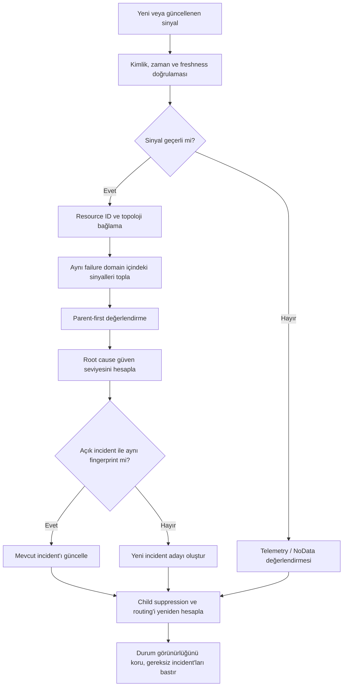
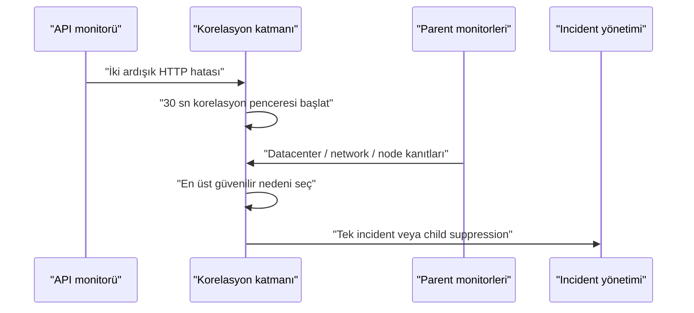
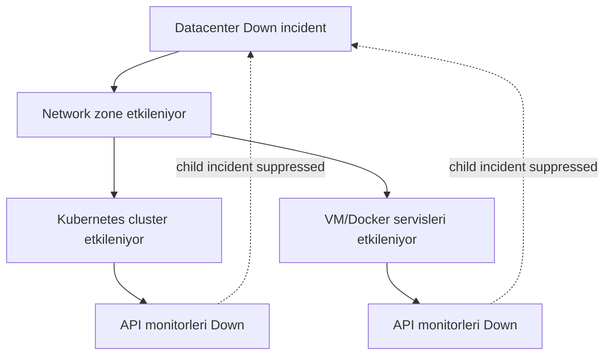
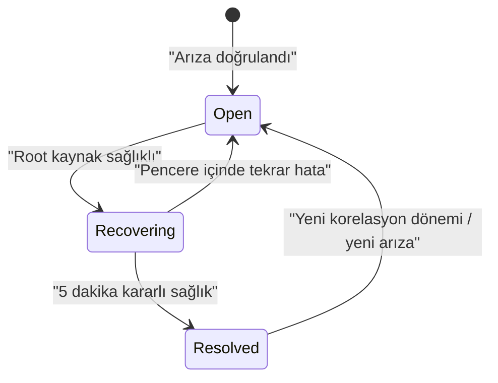

# Aşama 5 — Root Cause Korelasyon ve Alarm Bastırma

## Amaç

Bu aşama, farklı katmanlardan gelen hata sinyallerinin nasıl tek bir olay bağlamında
değerlendirileceğini tanımlar. Hedef, her başarısız monitor için ayrı incident
oluşturmak değil; en üstteki güvenilir arızayı bulmak, alt katmanlardaki semptomları
bu olaya bağlamak ve gereksiz ekip bildirimlerini bastırmaktır.

Bu belge ürün bağımsız bir karar modelidir. OneUptime veya başka bir platformun bu
kuralları tek başına, native olarak uyguladığı varsayılmaz. Uygulama aşamasında
ürünün desteklediği özellikler doğrulanmalı; eksik korelasyon yetenekleri ayrı bir
otomasyon veya olay işleme katmanında tasarlanmalıdır.

## 5.1 Korelasyonun girdileri

Bir sinyal tek başına root cause kararı vermez. Her değerlendirme aşağıdaki dört
veri grubunu birlikte kullanır:

| Girdi | İçerik | Neden gerekli? |
|---|---|---|
| Topoloji | Parent, child, dependency ve failure domain | Hatanın yayılabileceği yönü gösterir |
| Sağlık sinyali | Durum, zaman, freshness, vantage point | Gerçekte ne gözlendiğini açıklar |
| Kaynak kataloğu | Resource ID, environment, owner, criticality | Dedupe ve routing sağlar |
| Korelasyon politikası | Pencere, eşik, suppression ve recovery | Tutarlı karar üretir |

Eksik veya stale veri kesin root cause olarak yorumlanmaz. Böyle bir durumda
`Unknown` ya da `Down/NoData` sonucu üretilir ve olay triage akışına alınır.

## 5.2 Olay işleme sırası

Korelasyon motoru her yeni veya güncellenen sinyalde aşağıdaki sırayı izler:



Parent-first, alt kaynakların kontrol edilmemesi anlamına gelmez. Child sinyalleri
toplanmaya ve görünür olmaya devam eder; yalnızca aynı kök nedenden kaynaklanan
ayrı incident ve gereksiz ekip yönlendirmesi engellenir.

## 5.3 Zaman modeli

### Arıza adayı

Pilot varsayılanı:

- Aktif kontroller 30 saniyede bir çalışır.
- İki ardışık başarısız kontrol arıza adayı üretir.
- Tek başarısız kontrol transient kabul edilir ve incident açmaz.
- İki başarısızlık yaklaşık 60 saniyede bir aday oluşturur.

Bu eşik her kaynak için mutlak değildir. Çok kritik ama hızlı değişen sistemlerde
farklı eşik gerekebilir; değişiklik servis kataloğundaki politikada açıkça
kaydedilmelidir.

### Korelasyon penceresi

Bir aday oluştuğunda aynı failure domain içindeki parent ve sibling sinyalleri
30 saniyelik korelasyon penceresinde beklenir. Amaç, website monitorü önce hata
verdiği için hemen Application ekibine incident göndermemektir.



30 saniye içinde parent kanıtı gelmezse eldeki kanıtla geçici karar verilir.
Daha sonra gelen güçlü parent kanıtı mevcut incident'ı yeniden sınıflandırabilir.

## 5.4 Parent-first değerlendirme

Değerlendirme topolojinin en üst görünür katmanından aşağı doğru yapılır:

1. Monitoring plane ve sinyal kaynağı sağlıklı mı?
2. Datacenter erişimi ve site heartbeat durumu nedir?
3. Network path veya zone sağlıklı mı?
4. Compute katmanı sağlıklı mı?
5. Runtime katmanı sağlıklı mı?
6. Service discovery ve backend katmanı sağlıklı mı?
7. API veya uygulama sinyalleri ne gösteriyor?

Bir parent `Down` olduğunda child hataları neden adayı olmaktan çıkar; fakat child
durumları `Impacted` veya son gözlem durumuyla görünür kalır.

## 5.5 Hard, soft ve redundant dependency davranışı

### Hard dependency

Parent olmadan child çalışamıyorsa parent arızası child incident'larını bastırır.

Örnekler:

- Pod için üzerinde çalıştığı node
- Docker container için Docker daemon
- VM üzerindeki servis için VM/OS
- Bir site içindeki kaynak için fiziksel site erişimi

### Soft dependency

Parent arızası child hizmeti bozabilir ama her durumda bozmaz. Ek kanıt olmadan
tam suppression uygulanmaz; child incident aynı korelasyon grubuna bağlanır ve
`Probable dependency impact` olarak işaretlenir.

### Redundant dependency

Birden çok eşdeğer parent varsa tek parent arızası hizmeti tamamen `Down` yapmaz.

Örnek: iki public IP'den yalnız biri erişilemiyorsa datacenter değil, erişim grubu
`Degraded` olur. İki yolun da kaybı ve bağımsız site heartbeat kaybı birlikteyse
datacenter `Down` adayı oluşur.

## 5.6 Root cause güven seviyeleri

Her incident kararı aşağıdaki seviyelerden biriyle etiketlenir:

| Seviye | Anlam | Örnek |
|---|---|---|
| `Confirmed` | Doğrudan ve authoritative kanıt var | Container state reason `OOMKilled` ve bellek limiti kanıtı |
| `Probable` | Birden fazla tutarlı dolaylı kanıt var | Node heartbeat kaybı ve aynı node'daki tüm workload'ların eşzamanlı hatası |
| `Unknown` | Kanıt yetersiz, çelişkili veya görünürlük boşluğu var | VM ve API kayıp, hypervisor görünürlüğü yok |

`Probable` bir hipotezdir; incident metninde gerçekmiş gibi yazılmaz. `Unknown`
olaylar NOC/Triage'a yönlendirilir ve gerekli diagnostic adımı açıkça belirtilir.

## 5.7 Temel karar kuralları

### Datacenter arızası

`Confirmed` veya güçlü `Probable` datacenter arızası için en az şu kanıtlar aranır:

- İki bağımsız public erişim yolunun da başarısız olması,
- Site içinden dışarı doğru üretilen heartbeat'in kaybolması,
- Kontrol noktalarının monitoring plane arızasından etkilenmediğinin doğrulanması.

Yalnız iki public IP'nin dışarıdan erişilememesi, iç heartbeat sağlıklıysa
datacenter çökmesi değildir; network veya edge erişim olayıdır.

### Network arızası

Network root cause için DNS, TCP, TLS, route/path veya iki vantage point arasındaki
fark gibi network katmanına özgü kanıt gerekir. HTTP hatası tek başına network
root cause kanıtı değildir.

### Kubernetes node arızası

Node `NotReady/Unknown`, kubelet heartbeat kaybı ve aynı node üzerindeki birden çok
workload etkisi birlikteyse node parent incident'ı oluşturulur. Bu workload'lar
ayrı application incident'ı açmaz.

### OOM

`OOMKilled` lifecycle nedeni, kernel/cgroup OOM olayı veya eşdeğer authoritative
kanıt aranır. Yalnız exit code `137`, OOM için yeterli değildir; manuel kill veya
başka bir termination nedeni olabilir.

### Uygulama/kod hatası

Application root cause için parent, network ve runtime katmanları sağlıklı olmalı;
HTTP `5xx` gibi semptomun yanında exception, log veya trace kanıtı bulunmalıdır.

## 5.8 Child incident suppression

Suppression, sinyali veya etkiyi gizlemek değildir. Şu üç işlem ayrı tutulur:

1. **Durum:** Child kaynak hâlâ `Down`, `Down/NoData` veya `Impacted` görünür.
2. **Incident:** Aynı nedenden yeni bağımsız incident açılmaz.
3. **Routing:** Child owner'a ayrı alarm gönderilmez.



Parent incident ayrıntısında aşağıdaki bilgiler korunur:

- Etkilenen child kaynak sayısı,
- Etkilenen servis ve environment listesi,
- Bastırılan incident adayları,
- Her child'ın son sinyal zamanı ve durumu,
- Parent recovery sonrasında yeniden değerlendirilecek child'lar.

## 5.9 Geç bulunan parent'a incident bağlama

Bazen child incident, parent sinyalinden önce oluşur. Bu durumda sistem:

1. Child incident'ı geçici güven seviyesiyle açar.
2. Sonradan gelen parent kanıtını aynı zaman ve failure domain içinde değerlendirir.
3. Parent incident oluşturur veya mevcut parent incident'ı bulur.
4. Child incident'ı parent'a `symptom/caused-by` ilişkisiyle bağlar.
5. Child'a ait bağımsız routing'i durdurur.
6. Audit kaydında neden yeniden sınıflandırıldığını açıklar.

Silme veya geçmişi değiştirme yapılmaz. İlk karar, yeni kanıt ve son karar
zaman çizelgesinde korunur.

## 5.10 Dedupe fingerprint modeli

Tekrarlanan sinyallerin aynı incident'a bağlanması için kararlı bir fingerprint
kullanılır. Kavramsal alanlar:

```text
root_resource_id
failure_domain
symptom_or_cause_class
environment
correlation_epoch
```

Geçici pod adı veya rastgele incident başlığı fingerprint'in ana parçası olmaz.
Workload'ın kararlı Resource ID'si kullanılır. Böylece yeniden yaratılan pod aynı
süregelen sorunun parçası olarak değerlendirilebilir.

Fingerprint şunları sağlamalıdır:

- Aynı arızadan gelen tekrarları birleştirme,
- Farklı failure domain'lerdeki bağımsız arızaları ayırma,
- Recovery tamamlandıktan sonraki yeni arızayı yeni incident sayma,
- Katalogdaki kaynak adı değişikliklerinden etkilenmeme.

## 5.11 Flapping yönetimi

Bir kaynak kısa aralıklarla `Down` ve `Healthy` arasında geçiyorsa:

- Açık incident tekrar tekrar kapanıp açılmaz.
- Incident `Flapping` özelliğiyle güncellenir.
- Geçiş sayısı ve süreleri kaydedilir.
- Aynı fingerprint korunur.
- Öncelik ve owner, arızanın kök nedenine göre kalır.
- Belirlenen süre boyunca kararlı sağlık görülmeden recovery tamamlanmaz.

Flapping, transient hataların gizlenmesi değildir. Kararsızlığın kendisi ayrı bir
operasyonel belirti olarak incident zaman çizelgesine eklenir.

## 5.12 Recovery ve yeniden değerlendirme

### Beş dakikalık stabilite penceresi

Bir incident'ın teknik recovery için aday olması, root kaynağın sağlıklı sinyal
üretmesiyle başlar. Incident'ın otomatik çözülmesi için:

- Root kaynak beş dakika kesintisiz sağlıklı kalmalı,
- Authoritative sinyaller fresh olmalı,
- Aynı fingerprint için yeni hata gelmemeli,
- Parent bağımlılıklar sağlıklı olmalı.



### Parent recovery sonrası child taraması

Parent iyileştiğinde child incident'lar topluca sağlıklı sayılmaz. Sistem her
child'ı yeniden değerlendirir:

- Child sağlıklıysa parent ile birlikte recovery kaydı alır.
- Child hâlâ arızalıysa suppression kaldırılır.
- Kalıcı child arızası kendi fingerprint'i ve gerçek owner'ıyla incident olur.
- Daha önce bastırıldığı bilgisi yeni incident zaman çizelgesine eklenir.

Bu kural, datacenter geri geldiği halde tek bir uygulamanın bozuk kalmasının
gözden kaçmasını önler.

## 5.13 Telemetry ve NoData korelasyonu

Bir agent veya probe kaybolduğunda onun izlediği her kaynak için bağımsız incident
açılmaz. Varsayılan davranış:

1. Telemetry kaynağı için tek parent incident oluşturulur.
2. Alternatif authoritative sinyal olmayan child'lar `Down/NoData` görünür.
3. Child incident ve owner routing'i bastırılır.
4. Alternatif bağımsız sinyal varsa hedefin gerçek sağlık durumu korunur; yalnız
   telemetry katmanı `Degraded` olur.

Monitoring plane arızası ile gerçek hedef arızası birbirinden ayrılmadan root
cause kararı verilmez.

## 5.14 Çelişkili kanıt yönetimi

Çelişki örnekleri:

- Dış API kontrolü başarısız, iç kontrol başarılı,
- Kubernetes API pod'u `Running` gösteriyor fakat EndpointSlice backend içermiyor,
- Host heartbeat kayıp fakat aynı hosttaki bağımsız servis kontrolü başarılı,
- Public IP'ler kayıp fakat site heartbeat sağlıklı.

Bu durumda sistem:

- Kesin root cause üretmez,
- Kanıtları kaynak ve vantage point ile birlikte saklar,
- En dar doğrulanmış failure domain'i seçer,
- `Probable` veya `Unknown` güven seviyesi kullanır,
- Gerekirse NOC/Triage'a diagnostic görev verir.

## 5.15 Korelasyon karar kaydı

Her incident aşağıdaki açıklanabilirlik verisini taşımalıdır:

| Alan | Açıklama |
|---|---|
| Root resource | Seçilen en üst arızalı kaynak |
| Confidence | `Confirmed`, `Probable` veya `Unknown` |
| Evidence | Kararı destekleyen sinyaller ve zamanları |
| Rejected hypotheses | Neden elenen alternatifler |
| Impacted resources | Etkilenen child kaynaklar |
| Suppressed candidates | Ayrı incident açılmayan semptomlar |
| Routing reason | Owner ekibin neden seçildiği |
| Reclassification history | Sonradan gelen kanıtlarla yapılan değişiklikler |

Bu kayıt postmortem sırasında ve yanlış pozitiflerin iyileştirilmesinde temel
veri kaynağıdır.

## 5.16 Öncelik ve korelasyon ilişkisi

Korelasyon root cause'u seçer; öncelik ise etkiyi tanımlar. Aynı neden farklı
etkiye sahip olabilir.

- `P1`: Geniş müşteri/iş etkisi, datacenter veya kritik ortak platform kaybı.
- `P2`: Sınırlı üretim etkisi, redundancynin kaybı veya önemli servis kesintisi.
- `P3`: Düşük etkili, geliştirme/test ya da henüz kullanıcı etkisi olmayan olay.

Child sayısı tek başına `P1` kararı değildir. Criticality, environment,
redundancy ve gerçek iş etkisi birlikte değerlendirilir.

## 5.17 Örnek korelasyon senaryoları

### Senaryo A — Datacenter kaybı

| Gözlem | Karar |
|---|---|
| İki public IP başarısız | Dış erişim kaybı |
| Site heartbeat kayıp | Site içinden de yaşam kanıtı yok |
| Birçok K8s/VM/API sinyali aynı anda kayıp | Ortak failure domain etkisi |
| Sonuç | Tek datacenter incident, child suppression |

### Senaryo B — Yalnız edge/network sorunu

| Gözlem | Karar |
|---|---|
| İki public IP başarısız | Dış erişim sorunu |
| Site heartbeat sağlıklı | Datacenter çalışıyor |
| İç servis kontrolleri sağlıklı | Compute/runtime çalışıyor |
| Sonuç | Network/edge incident, Application'a routing yok |

### Senaryo C — Kubernetes node sorunu

| Gözlem | Karar |
|---|---|
| Tek node `NotReady` | Node arızası adayı |
| Aynı node'daki workload'lar etkilenmiş | Ortak parent kanıtı |
| Diğer node'lardaki servisler sağlıklı | Cluster genel arızası değil |
| Sonuç | Infra/Platform owner'lı node incident |

### Senaryo D — Kod hatası

| Gözlem | Karar |
|---|---|
| Datacenter, network, node ve runtime sağlıklı | Parent hipotezleri elendi |
| API `500` dönüyor | Uygulama semptomu |
| Aynı release ile başlayan exception/trace | Güçlü uygulama kanıtı |
| Sonuç | Application owner'lı incident |

## 5.18 Anti-pattern'ler

- İlk hata veren monitorü otomatik root cause kabul etmek.
- Her `Down` sinyalini doğrudan incident'a dönüştürmek.
- Child kaynakları suppression sırasında görünmez yapmak.
- Exit code `137` gördüğünde doğrudan OOM demek.
- İki public IP kaybını heartbeat kontrol etmeden datacenter çökmesi saymak.
- Sonradan gelen parent kanıtını mevcut incident'a bağlamamak.
- Recovery anında incident'ı kapatıp flapping üretmek.
- Geçici pod adını dedupe anahtarı olarak kullanmak.
- `Unknown` olayı tahminle Application ekibine göndermek.

## 5.19 Aşama kabul kriterleri

- [ ] Her sinyal Resource ID ve topolojiye bağlanabiliyor.
- [ ] İki ardışık hata ve 30 saniyelik korelasyon penceresi tanımlı.
- [ ] Parent-first sırası deterministik.
- [ ] Hard, soft ve redundant dependency davranışları ayrılmış.
- [ ] Root cause güven seviyesi her incident'ta gösteriliyor.
- [ ] Child durum görünürlüğü korunurken incident ve routing bastırılabiliyor.
- [ ] Geç bulunan parent mevcut child incident'larıyla ilişkilendirilebiliyor.
- [ ] Dedupe fingerprint kararlı kaynak kimliğine dayanıyor.
- [ ] Beş dakikalık recovery stabilite penceresi uygulanıyor.
- [ ] Parent recovery sonrası child'lar yeniden değerlendiriliyor.
- [ ] Telemetry NoData tek parent incident altında toplanıyor.
- [ ] Her karar kanıtları ve elenen hipotezlerle açıklanabiliyor.

## 5.20 Bu aşamanın çıktısı

Bu aşamayla birlikte incident üretiminden önce uygulanacak korelasyon sözleşmesi
tanımlanmıştır:

- İki ardışık hata arıza adayıdır.
- Adaylar 30 saniyelik pencerede aynı failure domain ile korele edilir.
- Parent-first değerlendirme yapılır.
- En güçlü kanıtla `Confirmed`, `Probable` veya `Unknown` neden seçilir.
- Aynı nedene bağlı child incident'lar bastırılır, etkileri görünür kalır.
- Aynı olay kararlı fingerprint ile dedupe edilir.
- Recovery beş dakikalık kararlı sağlık sonrasında tamamlanır.
- Parent iyileştiğinde kalıcı child arızaları yeni sahipleriyle açığa çıkarılır.

## Gezinme

- Önceki: [Aşama 4 — Sinyal ve Monitor Tasarımı](04-sinyal-ve-monitor-tasarimi.md)
- İndeks: [Genel Mimari Dokümantasyon İndeksi](README.md)
- Sonraki: [Aşama 6 — Incident Sahipliği ve Ekip Yönlendirme](06-incident-sahipligi-ve-ekip-yonlendirme.md)

