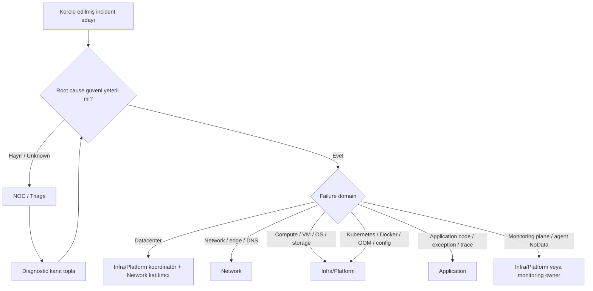
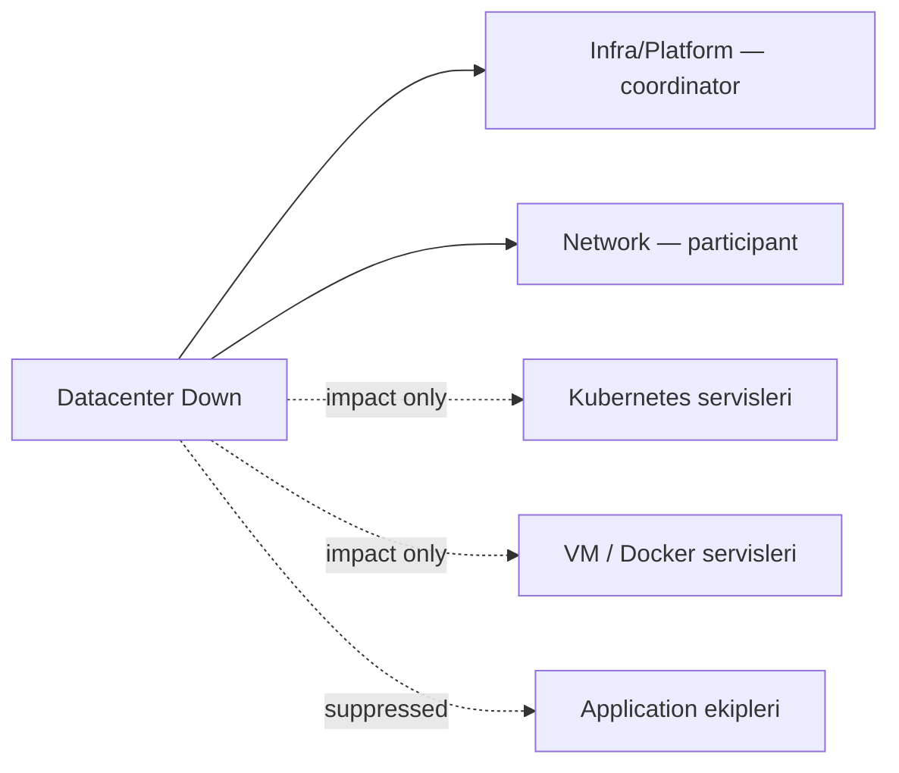
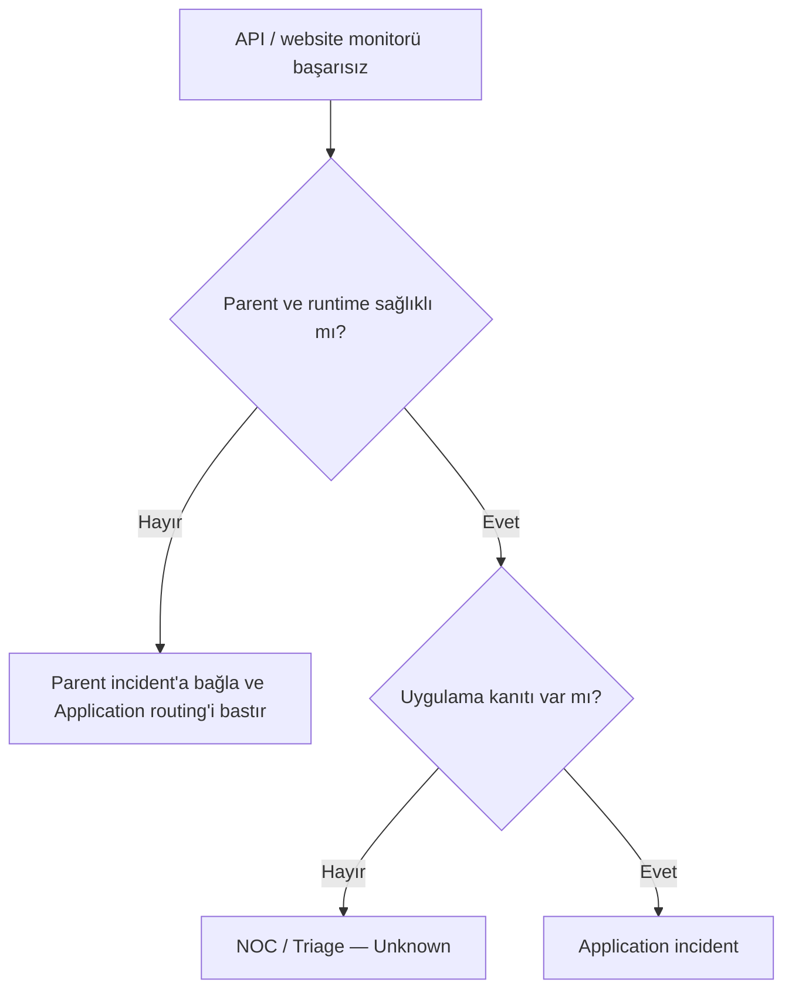

# Aşama 6 — Incident Sahipliği ve Ekip Yönlendirme

## Amaç

Bu aşama, korelasyonla belirlenen root cause ve kanıt seviyesine göre incident'ın
hangi ekibe atanacağını tanımlar. Hedef, bir datacenter veya network arızası
nedeniyle başarısız olan bütün website monitorlerinin Application ekiplerine
bağımsız alarm göndermesini engellemektir.

Sahiplik, bildirim kanalıyla aynı şey değildir. Bu belgede e-posta, Telegram,
telefon, SMS veya başka bir kanal seçilmez. Önce doğru incident ve doğru owner
belirlenir; bildirim ve escalation politikaları daha sonraki kapsamdır.

## 6.1 Ekip domain'leri

Pilot model dört operasyonel domain kullanır:

| Ekip | Birincil sorumluluk |
|---|---|
| NOC/Triage | İlk değerlendirme, belirsiz olaylar, veri eksikliği ve koordinasyon |
| Network | Routing, firewall, DNS, load balancer, TCP/TLS erişimi ve network path |
| Infra/Platform | Fiziksel altyapı, VM/OS, Kubernetes, Docker, OOM, deployment/config, database ve storage |
| Application | Uygulama kodu, exception, business logic ve kod kaynaklı performans hataları |

Bu gruplar organizasyonel şema değil, routing domain'idir. Şirket içinde ekip
isimleri farklı olabilir; katalogdaki kararlı owner kimliği bu domain'lerden
birine eşlenmelidir.

## 6.2 Sahiplik ilkeleri

### Root cause owner'dır

Incident, en görünür semptomun sahibine değil, doğrulanmış veya en güçlü olası
kök nedenin sahibine atanır. HTTP kontrolü başarısız olsa bile neden network ise
Application ekibi owner yapılmaz.

### Bir incident'ın tek koordinatörü olur

Birden fazla ekip çalışsa bile incident'ın tek koordinatör owner'ı bulunur.
Katılımcı ekipler ayrı alanlarda tutulur. Böylece karar ve iletişim sorumluluğu
belirsiz kalmaz.

### Belirsizlik tahminle kapatılmaz

Kanıt `Unknown` ise incident rastgele bir teknik ekibe atanmaz. NOC/Triage owner
olur; kanıt güçlendikçe incident yeniden sınıflandırılır.

### Sahiplik değişimi audit edilir

Yeni kanıt nedeniyle owner değişirse önceki owner, değişim zamanı, gerekçe ve yeni
owner incident zaman çizelgesinde korunur.

## 6.3 Routing karar akışı

## 6.4 Root cause–owner matrisi

| Root cause sınıfı | Koordinatör owner | Katılımcı | Application routing |
|---|---|---|---|
| Datacenter fiziksel/site kaybı | Infra/Platform | Network | Bastırılır |
| Dış erişim/edge kaybı | Network | Infra/Platform gerekirse | Bastırılır |
| DNS, route, firewall, TCP/TLS | Network | İlgili platform owner | Bastırılır |
| Fiziksel host/hypervisor | Infra/Platform | NOC/Triage gerekirse | Bastırılır |
| VM/OS kaybı | Infra/Platform | — | Bastırılır |
| Kubernetes cluster/node/kubelet | Infra/Platform | — | Bastırılır |
| Pod scheduling/runtime/config | Infra/Platform | Application danışman olabilir | Varsayılan bastırılır |
| Docker daemon/container lifecycle | Infra/Platform | Application danışman olabilir | Varsayılan bastırılır |
| OOM / resource limit | Infra/Platform | Application danışman olabilir | Ayrı owner yapılmaz |
| Database/storage altyapısı | Infra/Platform | Application etki sahibi olabilir | Child routing bastırılır |
| Güçlü kod/log/trace kanıtı | Application | Infra/Platform gerekirse | Etkin |
| Agent/probe/monitoring plane kaybı | Infra/Platform | NOC/Triage | Hedef ekipleri bastırılır |
| Çelişkili/yetersiz kanıt | NOC/Triage | Kanıta göre | Henüz gönderilmez |

## 6.5 Datacenter incident sahipliği

Datacenter `Down` doğrulandığında:

- Koordinatör: **Infra/Platform**
- Katılımcı: **Network**
- Etkilenen tüm Kubernetes, VM, Docker ve uygulama kaynakları parent incident'a
  bağlanır.
- Alt kaynak owner'larına bağımsız incident yönlendirilmez.
- Etkilenen servislerin listesi incident'ta görünür kalır.

Datacenter incident'ının Application ekiplerine hiç görünmemesi gerekmez. Okuma
ve etki görünürlüğü sağlanabilir; fakat görev/çağrı sahipliği verilmez.

## 6.6 Network incident sahipliği

Aşağıdaki kanıtlar Network domain'ine yönlendirilir:

- İki public IP kayıp, site heartbeat sağlıklı,
- Route/path değişimi veya packet loss,
- Firewall/ACL nedeniyle bağlantı reddi,
- DNS resolution hatası,
- Load balancer veya edge erişim problemi,
- TCP/TLS handshake başarısızlığı ve sağlıklı backend kanıtı.

HTTP `500` tek başına Network olayı değildir. DNS, TCP veya TLS kontrolü başarılı
ve uygulama exception kanıtı varsa Application domain'i değerlendirilir.

## 6.7 Infra/Platform sahipliği

Infra/Platform birleşik domain'i pilotta şu alanları kapsar:

- Fiziksel host ve datacenter compute,
- Hypervisor ve sanal makine yaşam döngüsü,
- İşletim sistemi ve host kaynakları,
- Kubernetes control plane, node, kubelet ve scheduler,
- Pod scheduling, deployment/config ve container runtime,
- Docker daemon ve container lifecycle,
- OOM ve resource limit olayları,
- Database ve storage altyapısı,
- Monitoring plane, agent ve probe sağlığı.

Bu geniş domain pilot için bilinçli bir sadeleştirmedir. Yaygınlaştırmada ayrı
Database, Storage, SRE veya Virtualization ekipleri oluşursa katalog owner
eşlemeleri bölünebilir; korelasyon modeli değişmek zorunda değildir.

## 6.8 OOM sahipliği

Doğrulanmış bütün OOM olaylarının koordinatörü Infra/Platform'dur. Bunun nedeni,
OOM'un yalnız kod davranışı değil aşağıdaki unsurlarla da ilişkili olabilmesidir:

- Yanlış container memory limit/request,
- Node memory pressure,
- VM bellek kapasitesi,
- Runtime veya kernel davranışı,
- Deployment konfigürasyonu,
- Uygulama memory leak'i.

Application ekibi memory leak kanıtı varsa katılımcı yapılabilir. Buna rağmen
incident'ın ilk koordinasyonu Infra/Platform'da kalır; root cause kesinleştiğinde
problem kaydı Application'a devredilebilir.

## 6.9 Deployment ve konfigürasyon sahipliği

Pilot kararı gereği aşağıdaki olayların owner'ı Infra/Platform'dur:

- Image pull ve registry erişim/config hataları,
- Eksik Secret veya ConfigMap referansı,
- Yanlış resource limit/request,
- Scheduling constraint ve node selector problemi,
- Service selector ve EndpointSlice eşleşme sorunu,
- Deployment rollout veya runtime config hatası.

Değişikliği Application ekibi yapmış olsa bile operasyonel incident'ın ilk owner'ı
platformdur. Düzeltme sorumluluğu ve postmortem action item'ları ayrıca ilgili
ekibe atanabilir.

## 6.10 Application sahipliği için gereken kanıt

Application routing yalnızca şu koşullar birlikte sağlandığında yapılır:

1. Datacenter ve network parent'ları sağlıklı.
2. Host/node/VM ve runtime sağlıklı.
3. Service/backend erişilebilir veya hata uygulama sürecinden geliyor.
4. HTTP `5xx`, business health failure veya eşdeğer uygulama semptomu var.
5. Exception, log, trace, error signature veya release korelasyonu gibi güçlü
   uygulama kanıtı var.

## 6.11 NOC/Triage sahipliği

NOC/Triage aşağıdaki durumlarda geçici owner'dır:

- Root cause `Unknown`,
- Sinyaller çelişkili,
- Katalog parent ilişkisi eksik,
- Hypervisor görünürlük boşluğu karar vermeyi engelliyor,
- Birden fazla bağımsız failure domain olasılığı var,
- Incident routing policy ile eşleşmiyor,
- Telemetry kaybının gerçek hedef arızası olup olmadığı belirlenemiyor.

NOC/Triage'ın görevi incident'ı sonsuza kadar üzerinde tutmak değil; gerekli
kanıtı toplamak, failure domain'i daraltmak ve doğru owner'a kontrollü handoff
yapmaktır.

## 6.12 Öncelik modeli

### P1 — Kritik

- Datacenter veya kritik ortak platform kaybı,
- Birden fazla kritik üretim servisinde geniş kullanıcı etkisi,
- Redundancy kalmadan hizmet kesintisi,
- Hızlı koordinasyon gerektiren güvenlik veya veri bütünlüğü riski.

### P2 — Yüksek

- Tek kritik servis veya sınırlı üretim kesintisi,
- Redundant yolun kaybı nedeniyle `Degraded` çalışma,
- Bir Kubernetes node'u veya VM'in etkilediği sınırlı servis grubu,
- Tekrarlayan ve kullanıcı etkisi oluşturan kararsızlık.

### P3 — Normal

- Geliştirme/test ortamı sorunu,
- Kullanıcı etkisi olmayan düşük riskli degradation,
- Kapasite veya lifecycle uyarısı,
- Planlı çalışma kapsamında takip edilebilecek teknik borç.

Öncelik monitor türünden değil; environment, criticality, redundancy, scope ve
gerçek iş etkisinden hesaplanır.

## 6.13 Katılımcı ve etki sahibi ayrımı

Incident'ta üç rol ayrılır:

| Rol | Sorumluluk |
|---|---|
| Coordinator owner | Olayı yönetir, kararları ve handoff'u koordine eder |
| Technical participant | Kendi domain'inde diagnostic veya düzeltme yapar |
| Impacted service owner | Etkiyi bilir, ancak root cause üzerinde çalışmak zorunda değildir |

Örneğin datacenter kesintisinde Application ekibi yalnız impacted service owner
olarak listelenebilir; coordinator veya technical participant yapılmaz.

## 6.14 Handoff kuralları

Bir incident'ın owner'ı yalnız yeni ve daha güçlü kanıtla değiştirilir:

1. Mevcut kanıt ve güven seviyesi kaydedilir.
2. Yeni kanıtın hangi hipotezi doğruladığı açıklanır.
3. Yeni owner seçilir ve kabul eder.
4. Eski owner katılımcı veya gözlemci olarak gerekirse korunur.
5. Handoff zamanı ve nedeni audit kaydına eklenir.

`Bu bizim sorunumuz değil` ifadesi tek başına handoff nedeni değildir. Kanıt veya
topoloji ilişkisi gerekir.

## 6.15 Escalation sınırı

Bu mimari aşağıdakileri tanımlar:

- Incident owner,
- Katılımcı ekipler,
- P1/P2/P3 önceliği,
- Child routing suppression,
- Belirsiz olayların triage sahibi.

Aşağıdakiler bu aşamanın kapsamı dışındadır:

- Telegram, e-posta, SMS veya telefon kanalı,
- On-call takvimi,
- Kişi bazlı escalation süresi,
- Mesai içi/mesai dışı kanal farkı,
- Vendor veya müşteri iletişim akışı.

Bu ayrım, yanlış incident üretimini yalnız daha güçlü bir bildirim sistemiyle
büyütmemek için önemlidir.

## 6.16 Örnek routing senaryoları

| Senaryo | Root cause | Owner | Bastırılan ekip |
|---|---|---|---|
| Site heartbeat ve iki public IP kayıp | Datacenter | Infra/Platform + Network | Application |
| İki public IP kayıp, heartbeat sağlıklı | Edge/network | Network | Application |
| `pilot-k8s-node` NotReady | Kubernetes node | Infra/Platform | Workload Application owner'ları |
| Pod `OOMKilled` | OOM | Infra/Platform | Ayrı Application incident'ı |
| VM heartbeat kayıp | VM/OS veya visibility gap | Infra/Platform / NOC | Container Application owner'ları |
| Docker daemon kayıp | Runtime | Infra/Platform | Container Application owner'ları |
| Parent sağlıklı, API 500 ve exception | Kod | Application | — |
| Probe kayıp, başka sinyal yok | Telemetry | Infra/Platform | İzlenen bütün service owner'ları |
| Kanıtlar çelişkili | Unknown | NOC/Triage | Erken teknik routing |

## 6.17 Sahiplik anti-pattern'leri

- Website monitorü başarısız olduğu için doğrudan Application'a atamak.
- Etkilenen her servisin owner'ını incident coordinator yapmak.
- OOM olayını kanıt toplamadan yalnız Application'a yönlendirmek.
- Datacenter olayında bütün ekiplere bağımsız incident göndermek.
- Unknown olayı en son değişiklik yapan ekibe atamak.
- Owner değişimini audit kaydı olmadan yapmak.
- Önceliği yalnız kaynak sayısına göre belirlemek.
- Bildirim kanalı seçimini incident sahipliğiyle karıştırmak.

## 6.18 Aşama kabul kriterleri

- [ ] Her root cause sınıfının tek koordinatör owner'ı var.
- [ ] Datacenter olayında Infra/Platform koordinatör, Network katılımcı.
- [ ] Network olayları Network domain'ine gidiyor.
- [ ] VM, Kubernetes, Docker, OOM ve config olayları Infra/Platform'a gidiyor.
- [ ] Application routing için güçlü kod/log/trace kanıtı aranıyor.
- [ ] Unknown olaylar NOC/Triage'a gidiyor.
- [ ] Child service owner'ları parent arızasında incident almıyor.
- [ ] Etkilenen servis görünürlüğü suppression sırasında korunuyor.
- [ ] P1/P2/P3 etki ve criticality üzerinden belirleniyor.
- [ ] Handoff gerekçeli ve audit edilebilir.
- [ ] Bildirim kanalları routing modelinden ayrı tutuluyor.

## 6.19 Bu aşamanın çıktısı

Bu aşamayla birlikte root cause sınıfından ekip sahipliğine giden deterministik
routing sözleşmesi oluşturulmuştur. Böylece geniş bir altyapı arızasında yalnız
gerekli ekipler görev alırken Application ekipleri alt katmandaki semptomlar
nedeniyle gereksiz alarmlarla karşılaşmaz.

## Gezinme

- Önceki: [Aşama 5 — Root Cause Korelasyon ve Alarm Bastırma](05-root-cause-korelasyon-ve-alarm-bastirma.md)
- İndeks: [Genel Mimari Dokümantasyon İndeksi](README.md)
- Sonraki: [Aşama 7 — Kubernetes Pilot Mimarisi](07-kubernetes-pilot-mimarisi.md)
