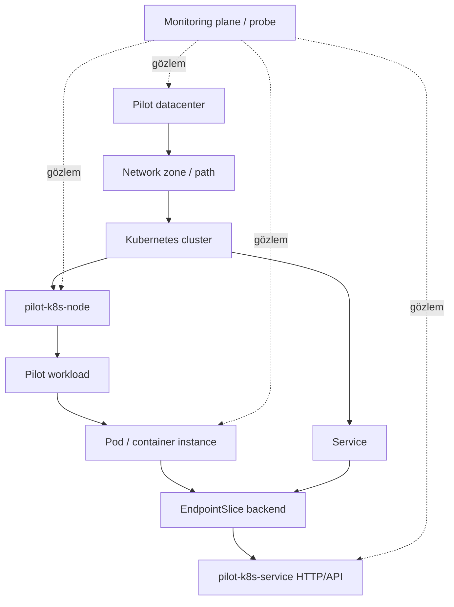
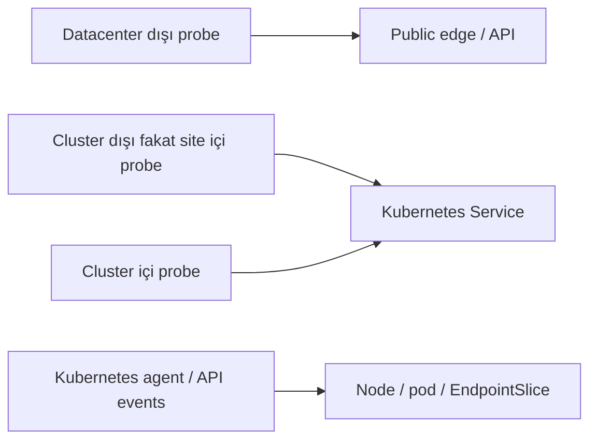
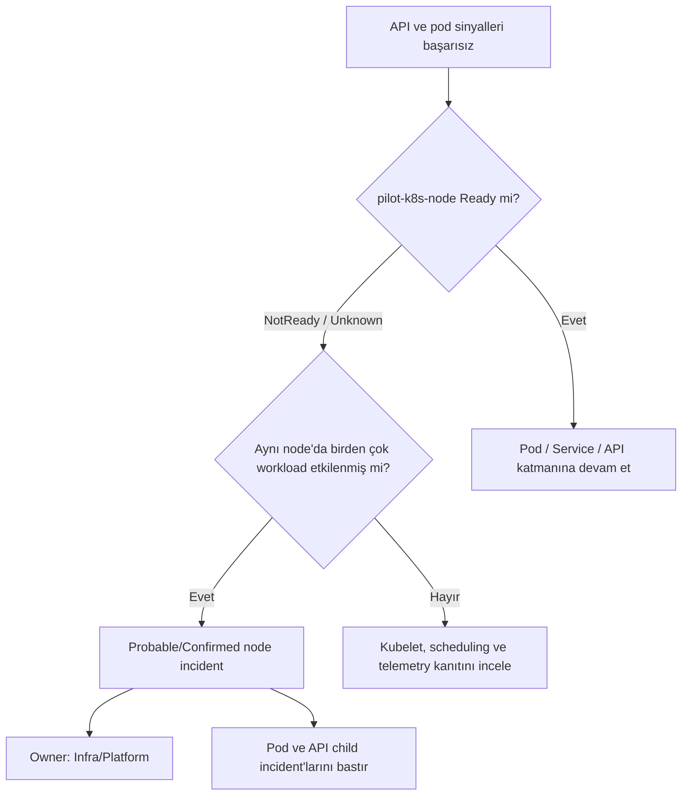
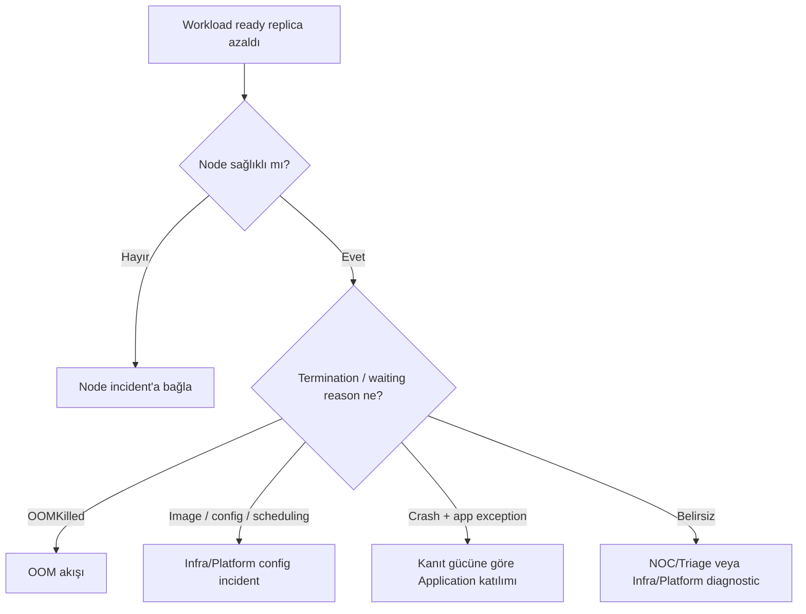
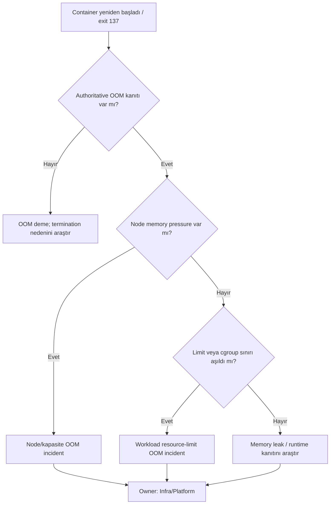
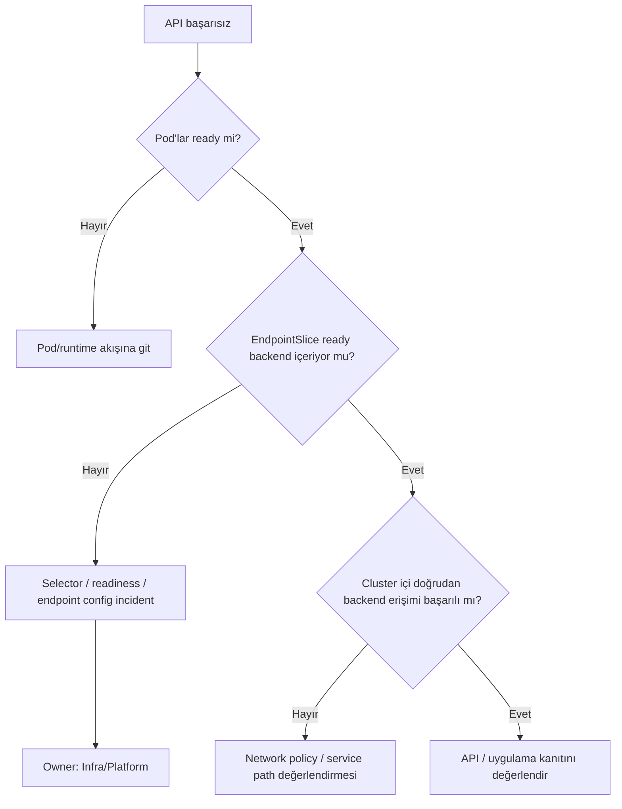
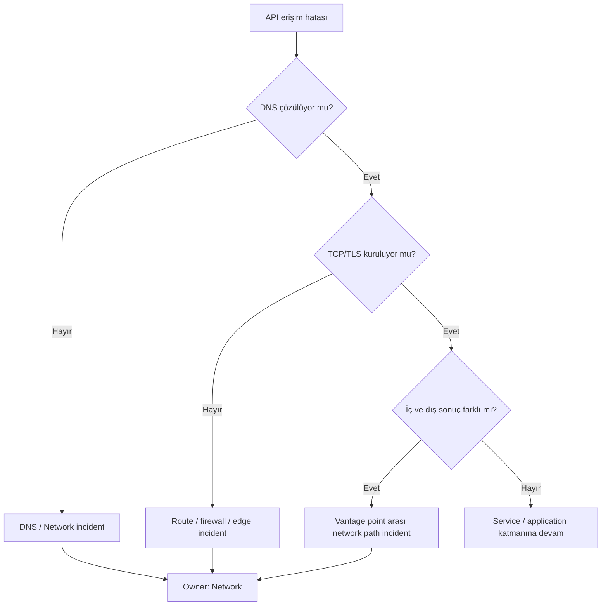
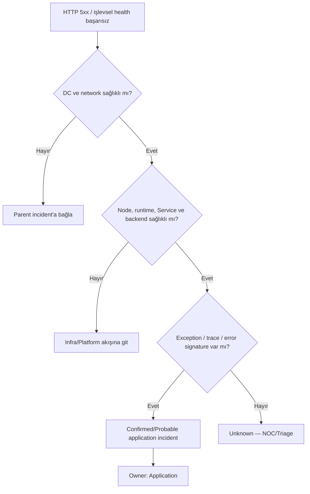

# Aşama 7 — Kubernetes Pilot Mimarisi

## Amaç

Bu aşama, katmanlı root cause ve incident yönlendirme modelinin kontrollü bir
Kubernetes pilotunda nasıl doğrulanacağını tanımlar. Pilot tek bir örnek zincire
odaklanır; bütün cluster'ı bir kerede kapsama alma amacı taşımaz.

Pilotun örnek kaynakları:

- Kubernetes node: `pilot-k8s-node`
- Workload/pod/container: pilot uygulama
- Service ve EndpointSlice: pilot backend seçimi
- HTTP/API: `pilot-k8s-service` sağlık ve örnek işlev kontrolü

Bu belge manifest, komut veya ürün ayarı içermez. İsimler mimari örneklerdir.

## 7.1 Pilotun hedefleri

Pilot şu sorulara ölçülebilir yanıt vermelidir:

1. API hatası oluştuğunda node, pod, network ve kod nedenleri ayrılabiliyor mu?
2. Parent arızası child incident'ları bastırıyor mu?
3. OOM doğrudan lifecycle kanıtıyla doğrulanıyor mu?
4. Incident yalnız doğru owner ekibe gidiyor mu?
5. Parent recovery sonrasında kalıcı child arızası yeniden açığa çıkıyor mu?
6. Karar kullanılan kanıtlarla açıklanabiliyor mu?

Pilot başarı kriteri çok sayıda dashboard veya monitor oluşturmak değil; az sayıda
ama ayırt edici sinyalle deterministik karar üretmektir.

## 7.2 Pilot bağımlılık zinciri

Service ve EndpointSlice, pod ile API arasında ayrıca izlenir. Pod `Running` olsa
bile selector hatası nedeniyle EndpointSlice boş kalabilir; yalnız pod ve HTTP
monitorü bu ayrımı doğru yapamaz.

## 7.3 Pilot kaynak kataloğu

| Resource ID | Tür | Parent | Owner | Kritik metadata |
|---|---|---|---|---|
| `dc:pilot` | Datacenter | — | Infra/Platform | Site, environment |
| `network:pilot-zone` | Network zone | `dc:pilot` | Network | Segment, path |
| `k8s:pilot-cluster` | Kubernetes cluster | `network:pilot-zone` | Infra/Platform | Cluster ID |
| `k8s-node:pilot-k8s-node` | Node | `k8s:pilot-cluster` | Infra/Platform | Failure domain |
| `workload:pilot-app` | Workload | `k8s:pilot-cluster` | Infra/Platform | Application owner reference |
| `service:pilot-k8s-service` | Service | `k8s:pilot-cluster` | Infra/Platform | Selector identity |
| `api:pilot-k8s-service` | API | Service/backend | Application | Criticality, SLO |

Geçici pod UID'si ayrı gözlem kimliğidir; incident dedupe için workload'ın kararlı
Resource ID'si kullanılır.

## 7.4 Toplanacak sinyal seti

### Datacenter ve network

- İki bağımsız public IP üzerinden dış erişim sonucu,
- Site içinden bağımsız heartbeat,
- DNS sonucu ve cevaplanan adres,
- TCP/TLS erişimi,
- İç ve dış vantage point'ten API sonucu.

### Cluster ve node

- Cluster/Kubernetes API erişimi,
- Node `Ready`, `NotReady` veya `Unknown` durumu,
- Kubelet heartbeat freshness,
- CPU, memory, disk ve PID pressure,
- Node üzerinde pod scheduling ve eviction olayları,
- Aynı node üzerindeki workload etki sayısı.

### Workload, pod ve container

- Desired/available/ready replica farkı,
- Pod phase ve readiness,
- Container waiting/terminated reason,
- Restart sayısı ve zaman içindeki artış,
- Son termination reason ve exit code,
- OOM lifecycle veya kernel/cgroup kanıtı,
- Image, config, Secret ve scheduling olay sınıfları.

### Service ve EndpointSlice

- Service nesnesinin varlığı,
- Selector ile beklenen workload eşleşmesi,
- Ready endpoint sayısı,
- Endpoint'lerin beklenen workload/pod'lara ait olması,
- Backend değişimi ve freshness.

### API ve uygulama

- İç probe'dan HTTP status ve latency,
- Uygunsa dış probe'dan aynı servis yolu,
- Liveness ile işlevsel readiness/health ayrımı,
- HTTP `5xx`, timeout ve response doğrulama,
- Exception, log error signature ve trace span durumu,
- Release/deployment zamanıyla hata başlangıcı ilişkisi.

## 7.5 Vantage point modeli

Tek probe bütün nedenleri ayıramaz. Pilot en az şu kavramsal noktalardan gözlem
üretir:

Sonuçların yorumu:

- Dış başarısız, iç başarılı: edge/network adayı.
- Dış ve iç başarısız, node/pod sağlıklı: Service/backend veya path adayı.
- Node ve o node'daki bütün workload'lar başarısız: node parent adayı.
- Her katman sağlıklı, API `500` ve exception var: uygulama adayı.

## 7.6 Normal çalışma referansı

Fault testlerinden önce en az bir kararlı referans dönemi gözlenmelidir:

- Datacenter ve network `Healthy`,
- Cluster erişilebilir,
- `pilot-k8s-node` `Ready`,
- Pilot workload desired = available = ready,
- EndpointSlice en az bir ready backend içeriyor,
- İç ve dış API kontrolleri beklenen cevabı veriyor,
- Agent/probe sinyalleri fresh,
- Açık incident ve bastırılmış aday yok.

Referans olmadan test yapılırsa önceden var olan bir bozukluk fault injection ile
karıştırılabilir.

## 7.7 Node arızası karar ağacı

Beklenen incident:

- Root resource: `pilot-k8s-node`
- Cause class: Kubernetes node/kubelet
- Owner: Infra/Platform
- Child impact: workload, pod, Service backend ve API
- Application routing: bastırılmış

Node sinyali yalnız tek agent'tan geliyorsa agent kaybı olasılığı ayrıca kontrol
edilir. Bağımsız API veya workload sinyalleri sağlıklıysa node doğrudan `Down`
sayılmaz; telemetry incident'ı değerlendirilir.

## 7.8 Pod ve container arızası karar ağacı

Tek replica kaybı ile çok replica servis aynı şekilde değerlendirilmez. Hazır
backend kaldıysa hizmet `Degraded`, backend kalmadıysa `Down` olabilir.

## 7.9 OOM karar ağacı

Application ekibi, log/heap/trace gibi güçlü memory leak kanıtı bulunursa teknik
katılımcı yapılır. Pilot kuralı gereği OOM incident koordinasyonu her durumda
Infra/Platform'dadır.

## 7.10 Service ve EndpointSlice arızası karar ağacı

Bu ayrım, `Running` görünen pod'lara rağmen Service'in trafik yönlendirememesi
durumunda hatayı yanlışlıkla Application koduna atamayı önler.

## 7.11 Network arızası karar ağacı

Network olayı doğrulandığında API semptomu görünür kalır fakat Application
incident'ı oluşturulmaz.

## 7.12 Kod/uygulama hatası karar ağacı

## 7.13 Deployment/config arızası

Pilot aşağıdaki kalıpları ayrı neden sınıfı olarak gözler:

- Image pull veya registry erişim/config hatası,
- Eksik Secret/ConfigMap referansı,
- Scheduling constraint veya node selector uyumsuzluğu,
- Yanlış Service selector,
- Readiness nedeniyle EndpointSlice dışında kalma,
- Resource limit/request hatası,
- Başarısız rollout.

Beklenen owner Infra/Platform'dur. Release'i yapan Application ekibi incident'ın
etki ve değişiklik bağlamında gösterilebilir; fakat otomatik owner yapılmaz.

## 7.14 NoData ve agent kaybı

Agent veya Kubernetes API sinyali kaybolduğunda:

1. Bağımsız API kontrolleri değerlendirilir.
2. API sağlıklıysa hedefler sağlıklı kalır, telemetry katmanı `Degraded` olur.
3. Alternatif sinyal yoksa hedefler `Down/NoData` olur.
4. Tek telemetry parent incident açılır.
5. Pod ve uygulama owner'larına ayrı incident gönderilmez.

Bu senaryo pilotta özellikle test edilmelidir; monitoring kaybının servis kaybı
olarak yanlış sınıflandırılmaması temel kabul kriteridir.

## 7.15 Suppression beklentileri

| Root incident | Bastırılacak adaylar | Görünür kalacak etki |
|---|---|---|
| Datacenter Down | Cluster, node, pod, Service, API | Bütün child kaynaklar |
| Network path Down | API/website child incident'ları | Erişilemeyen servisler |
| Node Down | Aynı node'daki pod/container/API | Workload ve servis etkisi |
| Runtime/config | API child incident'ı | Workload/backend etkisi |
| Telemetry NoData | Agent'ın bütün hedef incident'ları | `Down/NoData` kaynaklar |
| Application code | Bastırma yok | İlgili API ve servis |

## 7.16 Recovery beklentileri

- Root kaynak sağlıklı olduktan sonra beş dakika kararlılık aranır.
- Node recovery, workload'ın hazır olduğu anlamına gelmez.
- Pod ve EndpointSlice yeniden ayrı değerlendirilir.
- API hâlâ başarısızsa suppression kaldırılır ve yeni child incident gerçek owner'a
  yönlendirilir.
- Aynı hata recovery penceresinde tekrarlanırsa incident kapanmaz; `Flapping`
  bilgisi eklenir.

## 7.17 Pilot gözlem ve karar tablosu

Her test için aşağıdaki kayıt tutulur:

| Alan | Beklenen içerik |
|---|---|
| Test ID | Kararlı senaryo kimliği |
| Fault layer | Node, pod, Service, network, API veya telemetry |
| First symptom | İlk görülen sinyal |
| Selected root cause | Korelasyon sonucu |
| Confidence | Confirmed/Probable/Unknown |
| Incident owner | Seçilen koordinatör |
| Suppressed candidates | Bastırılan child olaylar |
| Detection time | İlk fault ile aday arası süre |
| Correlation time | Aday ile incident arası süre |
| Recovery time | Sağlık dönüşü ile resolve arası süre |
| False routing | Yanlış ekibe incident gidip gitmediği |

## 7.18 Pilot kabul kriterleri

- [ ] `pilot-k8s-node` ve kararlı workload Resource ID'leri katalogda tanımlı.
- [ ] Node, pod/container, Service/EndpointSlice ve API sinyalleri ayrılmış.
- [ ] İç ve dış vantage point sonuçları ilişkilendirilebiliyor.
- [ ] Node arızası tek parent incident oluşturuyor.
- [ ] OOM yalnız authoritative kanıtla sınıflandırılıyor.
- [ ] Service selector/backend hatası uygulama kodundan ayrılıyor.
- [ ] Network hatası Application'a yönlendirilmiyor.
- [ ] Kod hatası için parent/runtime sağlığı ve log/trace kanıtı aranıyor.
- [ ] Agent NoData hedef incident fırtınası üretmiyor.
- [ ] Parent recovery sonrası kalıcı child arızası açığa çıkarılıyor.
- [ ] Her karar root resource, evidence, confidence ve routing reason içeriyor.

## 7.19 Bu aşamanın çıktısı

Kubernetes pilotu, tek API monitorünün belirsiz sonucunu node, workload, runtime,
Service/backend, network ve uygulama kanıtlarıyla ayrıştıran kontrollü bir dikey
dilim olarak tanımlanmıştır. Pilotun amacı kurulum yapmak değil, root cause ve
routing kurallarını güvenli senaryolarla doğrulamaktır.

## Gezinme

- Önceki: [Aşama 6 — Incident Sahipliği ve Ekip Yönlendirme](06-incident-sahipligi-ve-ekip-yonlendirme.md)
- İndeks: [Genel Mimari Dokümantasyon İndeksi](README.md)
- Sonraki: [Aşama 8 — VM/Docker Pilot Mimarisi](08-vm-docker-pilot-mimarisi.md)

