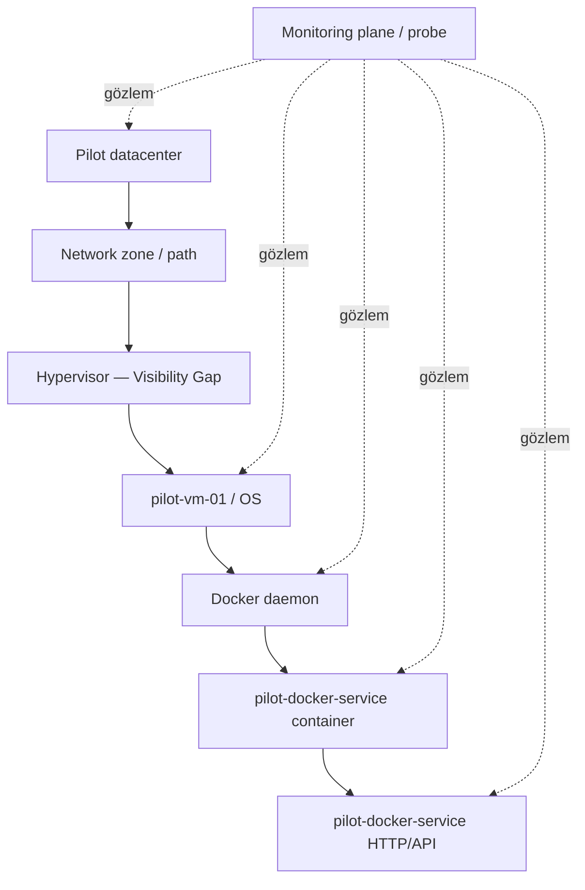
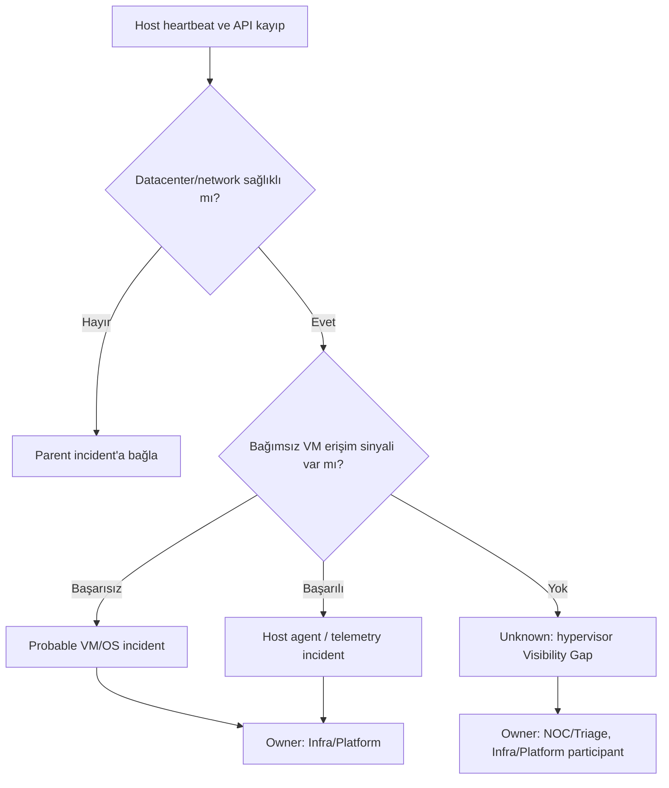
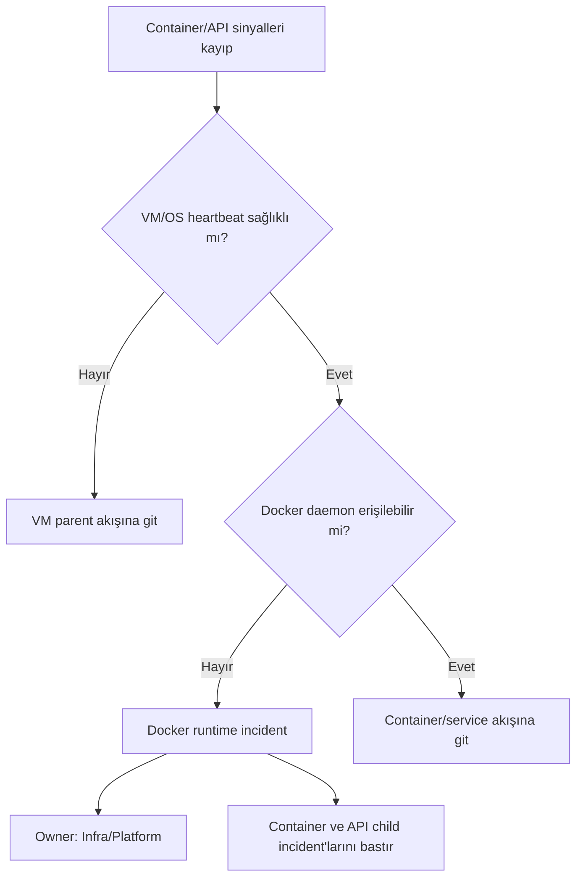
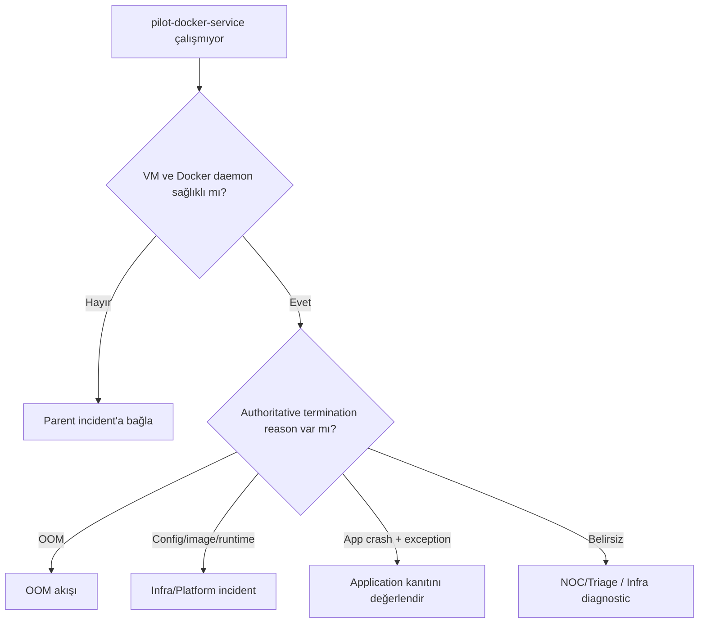
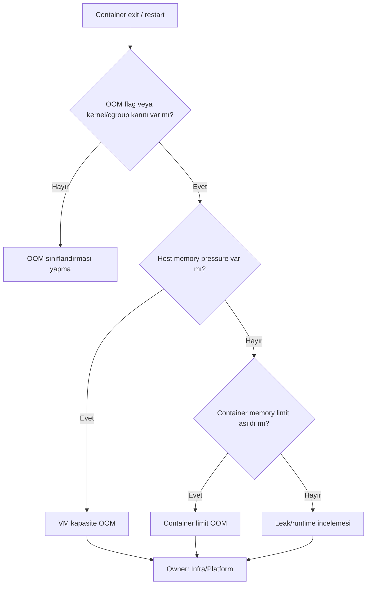
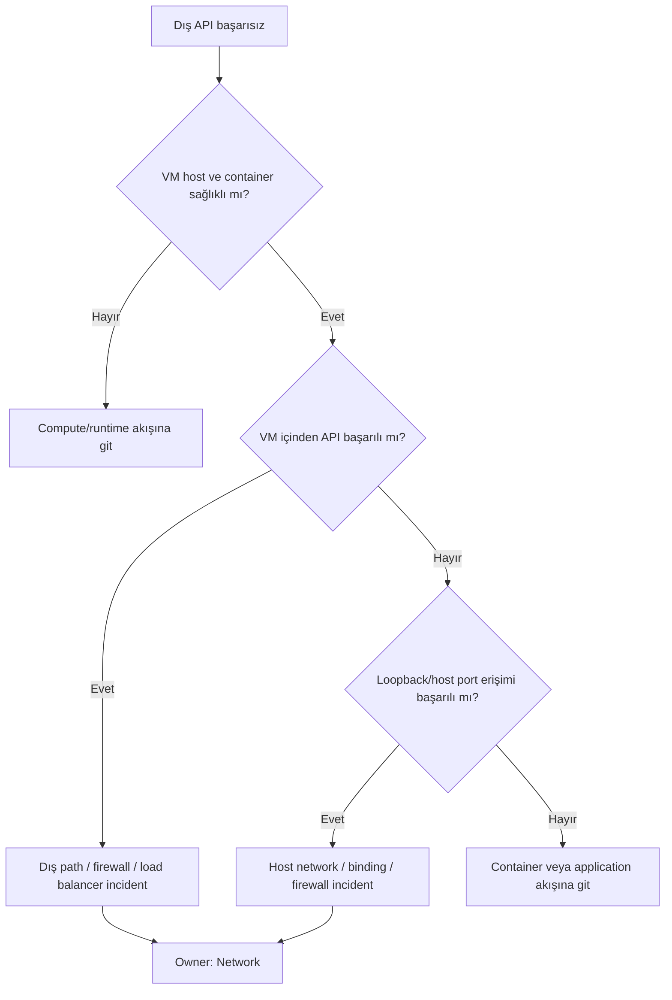
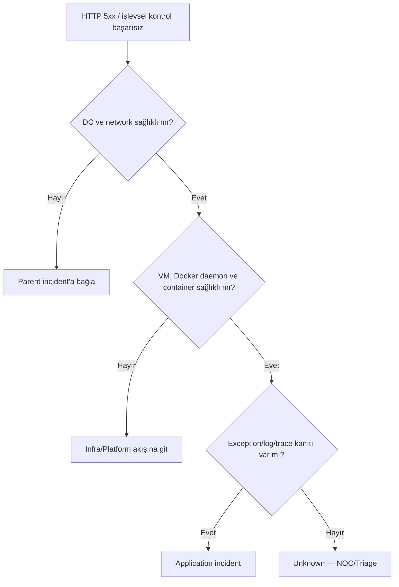

# Aşama 8 — VM/Docker Pilot Mimarisi

## Amaç

Bu aşama, Kubernetes bulunmayan bir sanal makinede manuel veya servis yöneticisi
aracılığıyla çalıştırılan Docker servisleri için katmanlı root cause modelini
tanımlar. Pilot tek bir VM ve tek bir Docker servisi üzerinden yürütülür:

- VM/OS: `pilot-vm-01`
- Docker servisi: `pilot-docker-service`
- Container: servisin geçici runtime instance'ı
- HTTP/API: servisin sağlık ve işlev kontrolü

Hypervisor API erişimi olmadığı varsayılır. Bu nedenle hypervisor katmanı
`Visibility Gap` olarak kataloglanır; görünmeyen bir durum kesin root cause gibi
sunulmaz.

## 8.1 Pilotun hedefleri

Pilot şu ayrımları kanıtlamalıdır:

- VM/OS kaybı ile Docker daemon kaybı,
- Docker daemon kaybı ile tek container kaybı,
- Container OOM ile manuel/başka termination nedenleri,
- Network erişim hatası ile uygulama kod hatası,
- Host agent kaybı ile gerçek VM kaybı,
- Hypervisor görünürlük boşluğu ile doğrulanmış hypervisor arızası.

## 8.2 Pilot bağımlılık zinciri

Hypervisor görünürlüğünün olmaması bu katmanı topolojiden silmez. Aksine, kesin
kanıt üretilemeyen bir parent olarak açıkça işaretlenir.

## 8.3 Pilot kaynak kataloğu

| Resource ID | Tür | Parent | Owner | Not |
|---|---|---|---|---|
| `dc:pilot` | Datacenter | — | Infra/Platform | K8s pilotuyla aynı site olabilir |
| `network:pilot-zone` | Network | `dc:pilot` | Network | VM erişim path'i |
| `hypervisor:pilot-unknown` | Hypervisor | Network | Infra/Platform | Visibility Gap |
| `vm:pilot-vm-01` | VM/OS | Hypervisor | Infra/Platform | Kararlı VM identity |
| `runtime:pilot-vm-01-docker` | Docker daemon | VM | Infra/Platform | Runtime identity |
| `service:pilot-docker-service` | Docker service | Runtime | Infra/Platform | Application owner reference |
| `api:pilot-docker-service` | HTTP/API | Docker service | Application | Criticality/SLO |

Container ID geçicidir. Dedupe ve sahiplik kararı kararlı servis Resource ID'sine
bağlanır.

## 8.4 Toplanacak sinyal seti

### Datacenter ve network

- İki public IP üzerinden erişim,
- Site heartbeat,
- VM'e farklı vantage point'lerden TCP erişimi,
- DNS ve route/path sonucu,
- API için iç ve dış erişim farkı.

### VM/OS

- Agent/host heartbeat freshness,
- OS uptime ve boot identity,
- CPU, memory, disk, inode, load ve process pressure,
- Network interface/link durumu,
- Kernel OOM ve system event'leri,
- Docker daemon process/socket erişimi,
- Agent'ın kendisine ait sağlık sinyali.

### Docker daemon

- Daemon API veya eşdeğer sağlık erişimi,
- Daemon process/service lifecycle,
- Container envanter freshness,
- Runtime event stream,
- Daemon restart ve storage/network driver hataları.

### Container/service

- Running/exited/restarting durumu,
- Restart sayısı ve trendi,
- Exit code ile doğrudan termination reason,
- OOM flag veya kernel/cgroup kanıtı,
- CPU/memory/network/process metrikleri,
- Beklenen port/process durumu,
- Image/config değişim zamanı.

### HTTP/API ve uygulama

- İç ve dış HTTP status/latency,
- Response content veya işlevsel doğrulama,
- Timeout/connection refused ayrımı,
- Application log exception/error signature,
- Trace/span error ve dependency süresi,
- Release/config değişimiyle zaman korelasyonu.

## 8.5 Host heartbeat ve API kontrolünün ayrımı

Host heartbeat VM/OS yaşamını; API kontrolü hizmet yolunu gözler. Birinin başarısı
diğerinin her zaman sağlıklı olduğunu kanıtlamaz.

| Host heartbeat | API | İlk yorum |
|---|---|---|
| Sağlıklı | Sağlıklı | Normal |
| Sağlıklı | Başarısız | Docker/container/network path/application araştırılır |
| Kayıp | Sağlıklı | Host agent/telemetry arızası olası |
| Kayıp | Başarısız | VM, network, hypervisor veya site parent araştırılır |

## 8.6 VM/OS kaybı karar ağacı

Hypervisor verisi olmadığı için VM heartbeat ve API kaybından `hypervisor çöktü`
sonucu çıkarılmaz. En doğru ifade `VM/OS veya görünmeyen compute parent arızası`
olur ve güven seviyesi `Probable` ya da `Unknown` olarak korunur.

## 8.7 Docker daemon kaybı karar ağacı

Daemon kaybında aynı VM üzerindeki bütün container semptomları tek runtime
incident altında toplanır.

## 8.8 Container arızası karar ağacı

Container `exited` olması yalnız semptomdur. Owner seçmek için termination reason,
daemon sağlığı, VM sağlığı ve uygulama kanıtı birlikte değerlendirilir.

## 8.9 OOM karar ağacı

Exit code `137` tek başına OOM kanıtı değildir. Application ekibi ancak leak veya
kod davranışına ait güçlü kanıt varsa katılımcı olur.

## 8.10 Network arızası karar ağacı

## 8.11 Uygulama/kod hatası karar ağacı

## 8.12 Hypervisor görünürlük boşluğu

Hypervisor API erişimi bulunmadığında şu sınırlar dokümante edilir:

- VM'in power state'i doğrudan doğrulanamaz.
- Host fiziksel sorunu ile VM/OS sorunu kesin ayrılamayabilir.
- Aynı hypervisor üzerindeki diğer VM korelasyonu yapılamayabilir.
- HA migration veya hypervisor bakım olayı görülemeyebilir.

Bu durumda uygulanacak politika:

1. Görünmeyen parent katalogda tutulur.
2. VM kaybı `Probable VM/compute` veya `Unknown` olarak ifade edilir.
3. Kesin `hypervisor failure` iddiası yapılmaz.
4. Owner NOC/Triage veya Infra/Platform olur.
5. Gelecekte entegrasyon açıldığında topoloji ve monitor genişletilir.

## 8.13 Manual process ve lifecycle bilgisi

Kubernetes dışı ortamlarda container'ın nasıl başlatıldığı değişebilir. Servis
kataloğunda aşağıdaki lifecycle bilgileri tutulmalıdır:

- Başlatma yöntemi: manuel, service manager veya orchestrator,
- Beklenen restart policy,
- İzin verilen bakım penceresi,
- Image ve config owner'ı,
- Bağımlı volume/network kaynakları,
- Sağlıklı instance sayısı beklentisi.

Bu bilgi olmadan stopped container'ın planlı mı arızalı mı olduğu doğru
yorumlanamaz.

## 8.14 NoData ve host agent kaybı

Host agent heartbeat kaybında:

- Bağımsız API ve TCP kontrolleri sağlıklıysa VM/servis durumu korunur; telemetry
  katmanı `Degraded` olur.
- API de başarısızsa network ve VM erişim sinyalleri korele edilir.
- Alternatif sinyal yoksa hedefler `Down/NoData` görünür.
- Tek host-agent incident açılır; her metric ve container için incident açılmaz.

## 8.15 Suppression beklentileri

| Root incident | Bastırılacak adaylar | Görünür etki |
|---|---|---|
| Datacenter Down | VM, daemon, container, API | Bütün servisler |
| Network Down | VM/API erişim child incident'ları | Erişilemeyen kaynaklar |
| VM/OS Down | Docker daemon, container, API | VM altındaki kaynaklar |
| Docker daemon Down | Bütün container/API adayları | Runtime altındaki servisler |
| Container lifecycle/config | API child incident'ı | İlgili servis |
| Host agent NoData | Metric/container NoData adayları | Telemetry kapsamı |
| Application code | Bastırma yok | İlgili API |

## 8.16 Recovery beklentileri

- VM heartbeat dönünce Docker daemon ayrıca kontrol edilir.
- Daemon dönünce container'ın gerçekten `Running` ve sağlıklı olduğu doğrulanır.
- Container dönünce API health ve işlevsel kontrol ayrı değerlendirilir.
- Beş dakika kararlı sağlık görülmeden parent incident çözülmez.
- Parent iyileştiği halde child bozuksa suppression kaldırılır ve ayrı incident
  gerçek owner'a yönlendirilir.

## 8.17 Pilot kabul kriterleri

- [ ] `pilot-vm-01`, Docker runtime ve servis için kararlı Resource ID'ler var.
- [ ] Hypervisor katmanı `Visibility Gap` olarak kataloglanmış.
- [ ] Host heartbeat ile API kontrolü ayrı sinyaller.
- [ ] VM kaybı Docker/container incident fırtınası üretmiyor.
- [ ] Docker daemon kaybı tek runtime incident oluşturuyor.
- [ ] OOM yalnız authoritative kanıtla doğrulanıyor.
- [ ] İç/dış erişim farkı network sorununu uygulamadan ayırıyor.
- [ ] Uygulama routing'i için parent/runtime sağlığı ve log/trace kanıtı aranıyor.
- [ ] Host agent NoData servis owner'larına incident fırtınası üretmiyor.
- [ ] Recovery sırası VM → daemon → container → API olarak doğrulanıyor.
- [ ] Görünmeyen hypervisor hakkında kesin root cause iddiası yapılmıyor.

## 8.18 Bu aşamanın çıktısı

VM/Docker pilotu, Kubernetes dışındaki sunucuların aynı katmanlı modelle ama kendi
runtime ve görünürlük özellikleri dikkate alınarak izlenmesini tanımlar. Böylece
bir website monitorü hatası VM, Docker daemon, container, network veya uygulama
kanıtlarıyla ayrıştırılır ve yalnız doğru owner ekibe yönlendirilir.

## Gezinme

- Önceki: [Aşama 7 — Kubernetes Pilot Mimarisi](07-kubernetes-pilot-mimarisi.md)
- İndeks: [Genel Mimari Dokümantasyon İndeksi](README.md)
- Sonraki: [Aşama 9 — Monitoring Plane Yedekliliği](09-monitoring-plane-yedekliligi.md)

