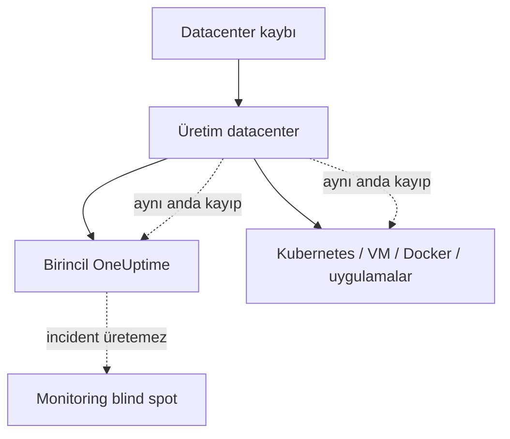
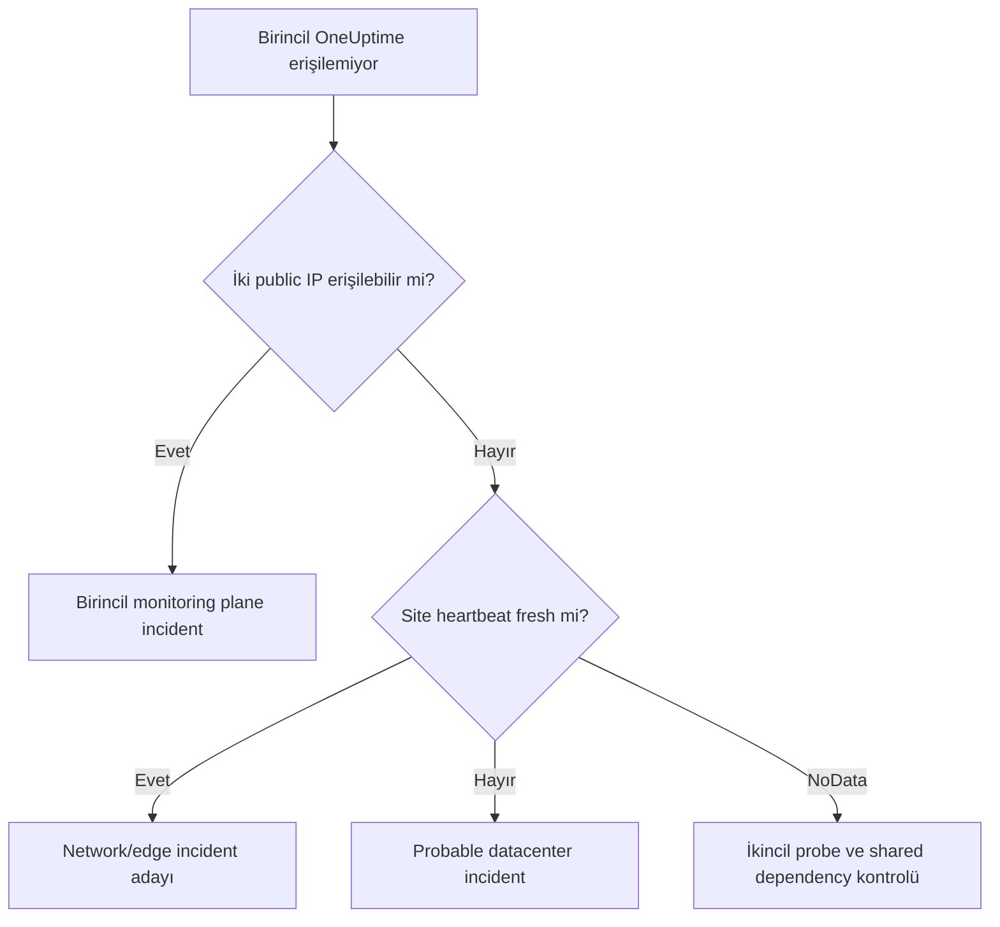
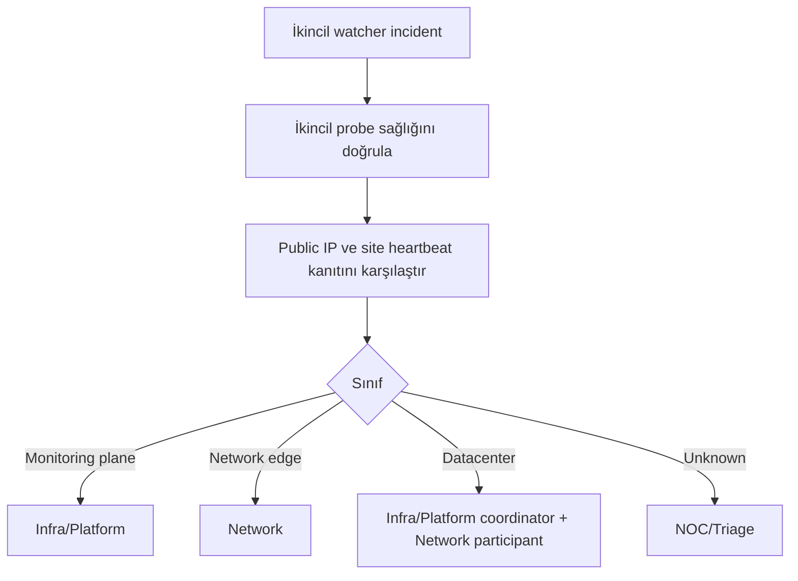

# Aşama 9 — Monitoring Plane Yedekliliği

## Amaç

Birincil OneUptime üretim datacenter'ında çalışıyorsa aynı datacenter çöktüğünde
hem servisler hem de onları izleyen sistem kaybolabilir. Bu aşama, bu kör noktayı
azaltmak için farklı bir lokasyondaki bağımsız ikinci izleme sisteminin sınırlarını
tanımlar.

İkinci sistem tam bir active-active OneUptime değildir. Yalnız monitoring plane ve
birincil datacenter yaşamını gözleyen dar kapsamlı bir gözcüdür. Uygulama, VM ve
Kubernetes monitorleri iki sistemde kopyalanmaz.

## 9.1 Korunmak istenen risk

Birincil sistemin veri merkezinde bulunması normal operasyon için avantajlı
olabilir; fakat site-wide arızada kendi incident workflow'larını çalıştıramaz.
Bu nedenle kendi kendini izlemesi yeterli değildir.

## 9.2 İkincil gözcünün kapsamı

Farklı failure domain ve tercihen farklı fiziksel lokasyonda bulunan ikincil
OneUptime yalnız şu kaynakları gözler:

1. Birincil OneUptime'ın dış sağlık endpoint'i,
2. Birincil datacenter'ın iki public IP üzerinden erişimi,
3. Datacenter içinden ikincil sisteme gönderilen site heartbeat,
4. İkincil sistemin kendi probe/agent ve monitoring plane sağlığı.

Şunları gözlemez:

- Her uygulama API'si,
- Her Kubernetes node veya pod,
- Her VM/Docker servisi,
- Birincil sistemdeki bütün incident ve workflow'lar,
- Birincil veritabanının içeriği.

## 9.3 Mimari

```mermaid
flowchart LR
    subgraph P["Üretim Datacenter / Failure Domain A"]
        O1["Birincil OneUptime"]
        S["Kubernetes, VM/Docker ve uygulamalar"]
        HB["Site heartbeat üreticisi"]
        IP1["Public IP 1"]
        IP2["Public IP 2"]
        O1 --> S
    end

    subgraph Q["Bağımsız Lokasyon / Failure Domain B"]
        O2["İkincil OneUptime — monitoring-plane watcher"]
        P2["Bağımsız probe"]
        P2 --> O2
    end

    P2 --> O1
    P2 --> IP1
    P2 --> IP2
    HB --> O2
```

İkincil lokasyonun enerji, internet, DNS ve kimlik doğrulama bağımlılıklarının
birincil datacenter ile ortak olmaması tercih edilir. Aksi halde görünen
yedeklilik gerçekte aynı failure domain içinde kalabilir.

## 9.4 Rol ayrımı

| Fonksiyon | Birincil sistem | İkincil sistem |
|---|---|---|
| Uygulama/K8s/VM monitorleri | Yetkili | Yok |
| Normal incident korelasyonu | Yetkili | Yok |
| Servis owner routing | Yetkili | Yok |
| Birincil monitoring plane health | Kendi sinyali | Dış gözlem, yetkili |
| Datacenter public erişim | Ana topoloji sinyali | Dış teyit |
| Site heartbeat kaybı | Kullanabilir | Yetkili dış alarm girdisi |
| Datacenter-wide körlük alarmı | Sınırlı | Yetkili |

Bu ayrım iki sistemin aynı uygulama hatası için iki bağımsız incident üretmesini
engeller.

## 9.5 Birincil ve ikincil karar matrisi

| Birincil OneUptime | Public IP'ler | Site heartbeat | İkincil yorum |
|---|---|---|---|
| Erişilebilir | Erişilebilir | Fresh | Normal |
| Erişilemez | Erişilebilir | Fresh | Birincil monitoring plane arızası |
| Erişilemez | İkisi de kayıp | Kayıp | Probable datacenter/site arızası |
| Erişilemez | İkisi de kayıp | Fresh | Edge/network erişim arızası olası |
| Erişilebilir | Bir IP kayıp | Fresh | Redundant erişim `Degraded` |
| Erişilebilir | İki IP kayıp | Fresh | Ölçüm/path çelişkisi; Network triage |
| Erişilemez | Belirsiz/NoData | Kayıp | Unknown; ikincil probe sağlığı kontrol edilir |

İkincil sistem yalnız kendi gözlediği sınırlar içinde karar verir. Uygulama veya
cluster root cause'u üretmez.

## 9.6 Datacenter ve monitoring-plane incident ayrımı

Birincil OneUptime erişilemiyor diye doğrudan datacenter çöktü denmez. Public
erişim ve site heartbeat kanıtı mutlaka değerlendirilir.

## 9.7 Çift incident'ı önleme politikası

İki sistem arasında ortak uygulama monitorleri olmadığı için çoğu çift incident
tasarım gereği engellenir. Kalan çakışmalar şu kurallarla yönetilir:

- İkincil sistem yalnız `monitoring-plane` ve `datacenter-watch` incident sınıfı
  oluşturur.
- Birincil sistem sağlıklıysa normal servis incident'ları yalnız orada kalır.
- İkincil incident fingerprint'i site ve monitoring-plane kimliğine dayanır.
- Birincil sistem geri geldiğinde ikincil olay otomatik olarak uygulama
  incident'larına kopyalanmaz.
- İnsan veya ileride tasarlanacak entegrasyon, ikincil olay referansını birincil
  incident'a bağlayabilir; iki kayıt audit amacıyla korunur.

## 9.8 Neden veritabanı replikasyonu yapılmaz?

Bu tasarımda iki OneUptime arasında database veya incident replikasyonu yoktur.
Nedenleri:

- İkincil sistem tam disaster-recovery kopyası değildir.
- Replikasyon split-brain ve tutarlılık sorunları yaratabilir.
- Ortak veritabanı yeni bir shared failure domain oluşturabilir.
- İkincil sistemin küçük ve bağımsız kalması güvenilirliği artırır.
- Monitoring-plane gözcülüğü için geçmiş uygulama verisine ihtiyaç yoktur.

Bu karar, ileride ayrı bir OneUptime disaster recovery çalışması yapılmasına engel
değildir; o çalışma farklı hedefler ve ürün tarafından doğrulanmış destek modeli
gerektirir.

## 9.9 Bağımsızlık gereksinimleri

İkincil gözcü mümkün olduğunca aşağıdaki bağımlılıkları paylaşmamalıdır:

- Fiziksel datacenter,
- Enerji ve UPS,
- Internet sağlayıcısı ve edge router,
- DNS resolver,
- Kimlik doğrulama altyapısı,
- Certificate/secret dağıtım yolu,
- Aynı Kubernetes cluster veya hypervisor,
- Aynı storage/database.

Tam bağımsızlık mümkün değilse her ortak bağımlılık katalogda `shared_dependency`
olarak işaretlenir ve incident güven seviyesini etkiler.

## 9.10 Güvenli credential ve erişim sınırı

Bu doküman gerçek credential veya bağlantı bilgisi içermez. Mimari ilke olarak:

- İkincil probe yalnız gerekli health endpoint'lerine erişir.
- Birincil sistemin admin yetkisini taşımaz.
- Site heartbeat tek yönlü ve minimum veri içerir.
- Secret'lar dokümana, ekran görüntüsüne veya incident metnine yazılmaz.
- Erişim rotasyonu ve sahipliği katalogda tanımlanır.

## 9.11 İkincil sistemin kendi sağlığı

İkincil gözcü de arızalanabilir. Bu nedenle en az şu sinyaller görünür olmalıdır:

- İkincil probe heartbeat freshness,
- Monitoring process ve queue sağlığı,
- Dış network erişimi,
- Son başarılı kontrol zamanı,
- Kendi storage/capacity göstergeleri.

İkincil sistem kaybolduğunda birincildeki uygulama kaynakları `Down` sayılmaz;
`external watcher coverage degraded` durumu oluşur.

## 9.12 Recovery davranışı

Datacenter veya birincil monitoring plane geri geldiğinde:

1. İkincil sistem dış health ve public erişimi tekrar doğrular.
2. Site heartbeat freshness geri döner.
3. Beş dakika kararlı sağlık penceresi beklenir.
4. İkincil incident çözülür.
5. Birincil sistem kendi child kaynaklarını bağımsız yeniden değerlendirir.
6. İkincil sistem birincildeki child incident'ları otomatik çözmez.

## 9.13 Operasyonel runbook sınırı

İkincil incident oluştuğunda görev sırası kavramsal olarak şöyledir:

Bildirim kanalları ve kişi bazlı on-call bu aşamada tanımlanmaz.

## 9.14 Başarısız tasarım örnekleri

- İkinci OneUptime'ı aynı datacenter veya cluster'a koymak.
- Her iki sistemde bütün servis monitorlerini kopyalamak.
- İki sistemin aynı incident'ı bağımsız şekilde ekiplere yönlendirmesine izin
  vermek.
- Ortak database ile iki sistemi görünürde yedeklemek.
- İkincil probe sağlığını izlemeden NoData'yı datacenter arızası saymak.
- Birincil OneUptime erişim kaybını tek başına site arızası kabul etmek.
- Paylaşılan DNS veya network bağımlılıklarını kataloglamamak.

## 9.15 Aşama kabul kriterleri

- [ ] İkincil watcher farklı failure domain'de tanımlı.
- [ ] Kapsam yalnız birincil OneUptime, iki public IP ve site heartbeat ile sınırlı.
- [ ] Uygulama, VM ve Kubernetes monitorleri ikincilde kopyalanmıyor.
- [ ] Birincil monitoring-plane arızası datacenter arızasından ayrılabiliyor.
- [ ] İkincil incident sınıfları normal servis incident'larından ayrılmış.
- [ ] İki sistem arasında database/incident replikasyonu varsayılmıyor.
- [ ] Paylaşılan bağımlılıklar kataloglanıyor.
- [ ] İkincil sistem kendi probe ve telemetry sağlığını gösteriyor.
- [ ] Recovery sonrası birincil child kaynakları kendi sistemi tarafından
      yeniden değerlendiriliyor.
- [ ] Bildirim kanalları kapsam dışında tutuluyor.

## 9.16 Bu aşamanın çıktısı

Monitoring plane yedekliliği, tam bir ikinci üretim izleme kopyası yerine dar
kapsamlı ve bağımsız bir dış gözcü olarak tanımlanmıştır. Bu tasarım site-wide
arızada kör kalmayı azaltırken çift incident ve split-brain riskini sınırlı tutar.

## Gezinme

- Önceki: [Aşama 8 — VM/Docker Pilot Mimarisi](08-vm-docker-pilot-mimarisi.md)
- İndeks: [Genel Mimari Dokümantasyon İndeksi](README.md)
- Sonraki: [Aşama 10 — Güvenli Test ve Kabul Senaryoları](10-guvenli-test-ve-kabul-senaryolari.md)
