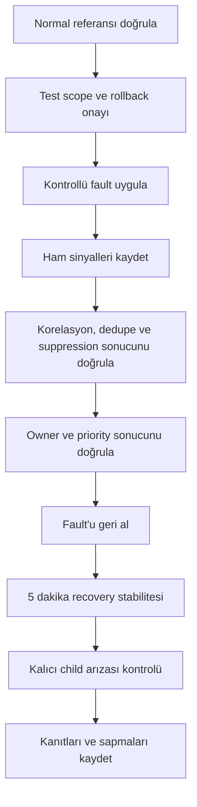

# Aşama 10 — Güvenli Test ve Kabul Senaryoları

## Amaç

Bu aşama, katmanlı root cause, suppression ve ekip yönlendirme modelinin gerçek
datacenter veya üretim servisleri kapatılmadan nasıl doğrulanacağını tanımlar.

Testlerin amacı yalnız monitorün `Down` olduğunu görmek değildir. Her senaryoda
şunlar birlikte doğrulanır:

- Doğru root cause sınıfı,
- Doğru güven seviyesi,
- Tek ve doğru incident,
- Bastırılan child incident adayları,
- Doğru owner ve öncelik,
- Recovery sonrasında doğru yeniden değerlendirme,
- Kararın kanıt ve zaman çizelgesiyle açıklanabilmesi.

Bu belge çalıştırılabilir komut veya fault manifesti içermez. Uygulama yöntemi
ortam sahibi ekip tarafından change prosedürüyle hazırlanmalıdır.

## 10.1 Güvenlik ilkeleri

### Gerçek datacenter kapatılmaz

Datacenter testi fiziksel enerji, core switch, internet edge veya ortak storage
kapatılarak yapılmaz. Aşağıdaki kontrollü yöntemler tercih edilir:

- Yalnız test endpoint'i için erişim politikasını geçici değiştirme,
- Test amaçlı heartbeat akışını kontrollü durdurma,
- İzole pilot kaynakta process/container durdurma,
- Test workload'unda sınırlı fault injection,
- Mock veya synthetic sinyal üretme,
- Staging/test environment kullanma.

### Blast radius sınırlandırılır

Her test yalnız pilot Resource ID'lerini etkiler. Üretim servisleriyle paylaşılan
dependency varsa test yapılmadan önce risk analizi ve geri dönüş adımı gerekir.

### Geri dönüş önceden tanımlanır

Fault oluşturulmadan önce normal duruma dönüş koşulu, sorumlusu ve azami test
süresi belirlenir. Recovery mekanizması doğrulanmadan test başarılı sayılmaz.

### Gözlem ve kontrol rolleri ayrılır

Fault'u uygulayan kişi ile incident/routing sonucunu doğrulayan kişi mümkünse
farklı olur. Bu, beklenen sonucu bilmenin doğrulamayı etkilemesini azaltır.

## 10.2 Test ön koşulları

- Pilot kaynak kataloğu onaylanmış olmalı.
- Parent, child ve redundant dependency ilişkileri tanımlı olmalı.
- Normal çalışma referans ölçümü tamamlanmış olmalı.
- Agent, probe ve monitoring-plane sağlıklı olmalı.
- Aktif eski incident bulunmamalı veya açık olaylar test kaydında belirtilmeli.
- İki ardışık hata, 30 saniyelik korelasyon ve beş dakikalık recovery politikası
  etkin tasarım varsayımı olmalı.
- NOC/Triage, Network, Infra/Platform ve Application owner eşlemeleri doğrulanmalı.
- Test için change window ve geri dönüş sahibi belirlenmeli.

## 10.3 Her senaryoda tutulacak kanıt

| Alan | Açıklama |
|---|---|
| Test ID | Tekil ve kararlı senaryo kimliği |
| Kaynak | Hedef Resource ID |
| Fault start/end | Gerçek fault zamanları |
| Expected root cause | Beklenen neden sınıfı |
| First detected signal | İlk semptom |
| Correlated evidence | Parent/sibling/child kanıtları |
| Incident fingerprint | Dedupe kimliği |
| Confidence | Confirmed/Probable/Unknown |
| Owner/participants | Seçilen ekipler |
| Suppressed candidates | Bastırılan child olaylar |
| Detection/correlation time | Ölçülen süreler |
| Recovery stable time | Sağlık dönüşü ve resolve süresi |
| Unexpected routing | Gereksiz ekip incident'ı |
| Result | Pass, conditional pass veya fail |

## 10.4 Genel test akışı



## 10.5 Senaryo 1 — Tek public IP kesintisi

### Amaç

Redundant dış erişim yollarından yalnız biri kaybolduğunda datacenter'ın `Down`
sayılmadığını doğrulamak.

### Güvenli uygulama

Yalnız pilot kontrol noktasının public IP1 erişimi, sınırlı scope ile başarısız
hale getirilir. Public IP2 ve site heartbeat etkilenmez.

### Beklenen sonuç

- Public erişim grubu: `Degraded`
- Datacenter: `Healthy` veya policy'ye göre `Degraded`, kesinlikle `Down` değil
- Root cause: Redundant network path/IP kaybı
- Owner: Network
- Priority: Etkiye göre P2 veya P3
- Application incident'ları: Açılmaz
- İkinci IP üzerindeki hizmet devamı: Kanıtlanır

### Başarısızlık koşulları

- Datacenter incident oluşması,
- Application ekiplerine incident gitmesi,
- İkinci IP'nin sağlığı kontrol edilmeden karar verilmesi.

## 10.6 Senaryo 2 — Çift public IP kesintisi, heartbeat sağlıklı

### Amaç

Dış erişim tamamen kaybolsa bile datacenter iç yaşam kanıtı varsa olayın network
veya edge olarak sınıflandırıldığını doğrulamak.

### Beklenen sonuç

- İki public IP: `Down`
- Site heartbeat: `Healthy/Fresh`
- Root cause: Network/edge erişim kaybı, `Confirmed` veya `Probable`
- Owner: Network
- Datacenter fiziksel sağlık: `Degraded`, kesin `Down` değil
- Child API erişim incident'ları: Bastırılır
- Infra/Platform: Gerekirse katılımcı, coordinator değil

## 10.7 Senaryo 3 — Datacenter heartbeat kaybı

### Amaç

Site heartbeat kaybının public erişim sinyalleriyle birlikte ve monitoring-plane
sağlığı kontrol edilerek yorumlandığını doğrulamak.

### Alt senaryolar

| Public IP'ler | Heartbeat | Beklenen yorum |
|---|---|---|
| Sağlıklı | Kayıp | Heartbeat producer/telemetry incident |
| İkisi de kayıp | Kayıp | Probable datacenter incident |
| Biri sağlıklı | Kayıp | Çelişkili kanıt, NOC/Triage |

### Beklenen datacenter incident davranışı

- Tek parent incident,
- Coordinator: Infra/Platform,
- Participant: Network,
- Kubernetes/VM/Docker/API child incident'ları bastırılmış,
- Etkilenen kaynaklar incident altında görünür,
- Application routing yok.

## 10.8 Senaryo 4 — Kubernetes node arızası

### Amaç

`pilot-k8s-node` arızasının aynı node'daki workload ve API semptomlarından önce
veya sonra gelse bile tek parent incident oluşturduğunu doğrulamak.

### Güvenli uygulama sınırı

Gerçek control-plane veya üretim node'u kapatılmaz. İzole pilot worker, synthetic
node sinyali veya test ortamı kullanılır.

### Beklenen sonuç

- Root resource: `pilot-k8s-node`
- Cause: Kubernetes node/kubelet
- Confidence: Kanıta göre Confirmed/Probable
- Owner: Infra/Platform
- Aynı node'daki pod/API incident'ları: Bastırılmış
- Diğer node'lardaki servisler: Etkilenmemiş
- Datacenter/cluster-wide incident: Oluşmamalı

## 10.9 Senaryo 5 — Kubernetes pod/container arızası

### Amaç

Sağlıklı node üzerindeki tek workload arızasının node veya datacenter olayı gibi
yorumlanmadığını doğrulamak.

### Beklenen sonuç

- Node ve cluster sağlıklı,
- Root resource workload/container,
- Cause sınıfı termination reason'a göre belirlenmiş,
- API child incident'ı aynı workload incident'ına bağlanmış,
- Owner config/runtime ise Infra/Platform,
- Application owner yalnız güçlü uygulama kanıtında katılımcı veya owner.

## 10.10 Senaryo 6 — OOMKilled

### Amaç

OOM sınıflandırmasının yalnız authoritative kanıtla yapıldığını ve owner'ın
Infra/Platform olduğunu doğrulamak.

### Güvenli uygulama

Yalnız pilot workload/container için kontrollü ve sınırlandırılmış bellek testi
tasarlanır. Üretim node memory pressure oluşturulmaz.

### Beklenen sonuç

- OOM lifecycle veya kernel/cgroup kanıtı kayıtlı,
- Exit `137` tek başına gerekçe değil,
- Root cause: workload limit veya host/node memory pressure olarak ayrılmış,
- Owner: Infra/Platform,
- Application: Leak kanıtı varsa participant,
- API child incident'ı bastırılmış,
- Recovery sonrası memory ve restart trendi izlenmiş.

## 10.11 Senaryo 7 — HTTP 500 ve exception

### Amaç

Parent ve runtime katmanları sağlıklıyken kod kaynaklı hatanın Application ekibine
yönlendirildiğini doğrulamak.

### Güvenli uygulama

Pilot endpoint'in yalnız test girdisi veya test sürümü kontrollü bir `500` ve
eşleşen exception üretir. Ortak üretim endpoint'i etkilenmez.

### Beklenen sonuç

- Datacenter/network/compute/runtime: Sağlıklı,
- API: `Down` veya işlevsel hata,
- Log/trace: Eşleşen exception/error signature,
- Root cause: Application code,
- Owner: Application,
- Infra/Platform incident: Açılmaz,
- Release/test zamanı incident kanıtına eklenir.

## 10.12 Senaryo 8 — Service/EndpointSlice hatası

### Amaç

Running pod'lara rağmen Service backend seçiminin bozulmasının uygulama kodu
incident'ı olarak yönlendirilmediğini doğrulamak.

### Beklenen sonuç

- Pod'lar ready/running,
- EndpointSlice ready backend sayısı beklenenin altında veya sıfır,
- API başarısız,
- Root cause: Service selector/readiness/config,
- Owner: Infra/Platform,
- Application incident: Bastırılmış,
- Recovery: Backend tekrar seçildikten sonra API ayrıca doğrulanır.

## 10.13 Senaryo 9 — VM heartbeat kaybı

### Amaç

VM kaybı, host-agent kaybı ve hypervisor görünürlük boşluğu ayrımını doğrulamak.

### Alt senaryolar

| Host heartbeat | Bağımsız API/TCP | Beklenen sonuç |
|---|---|---|
| Kayıp | Sağlıklı | Host agent/telemetry incident |
| Kayıp | Başarısız | Probable VM/compute incident |
| Kayıp | NoData | Unknown, visibility gap |

Kesin hypervisor arızası, hypervisor kanıtı yoksa üretilmemelidir.

## 10.14 Senaryo 10 — Docker daemon kaybı

### Amaç

Sağlıklı VM üzerindeki Docker daemon kaybının bütün container/API semptomlarını
tek runtime incident altında topladığını doğrulamak.

### Beklenen sonuç

- VM/OS heartbeat: Sağlıklı,
- Docker daemon: `Down`,
- Container inventory ve API: Etkilenmiş,
- Root cause: Docker runtime,
- Owner: Infra/Platform,
- Container ve Application incident'ları: Bastırılmış,
- Daemon recovery sonrası container ve API ayrı doğrulanmış.

## 10.15 Senaryo 11 — Agent/probe NoData

### Amaç

Telemetry kaybının yüzlerce hedef incident'ına dönüşmediğini doğrulamak.

### Beklenen sonuç

- Tek agent/probe parent incident,
- Alternatif authoritative kontrolü olan hedeflerde gerçek sağlık korunmuş,
- Alternatifi olmayan hedefler `Down/NoData`,
- Child incident ve service-owner routing bastırılmış,
- Owner: Infra/Platform veya monitoring owner,
- Probe geri gelince hedef sinyalleri yeniden değerlendirilmiş.

## 10.16 Senaryo 12 — Parent recovery sonrası kalıcı child arızası

### Amaç

Parent incident çözülürken hâlâ bozuk olan bir child'ın yanlışlıkla sağlıklı
sayılmadığını doğrulamak.

### Akış

```mermaid
sequenceDiagram
    participant P as "Parent kaynak"
    participant C as "Child servis"
    participant K as "Korelasyon"
    participant I as "Incident"
    P->>K: "Down"
    C->>K: "Down"
    K->>I: "Parent incident; child suppressed"
    P->>K: "Healthy"
    K->>K: "5 dakika stabilite + child rescan"
    C->>K: "Hâlâ Down"
    K->>I: "Parent resolve; child için yeni incident"
```

### Beklenen sonuç

- Parent incident çözülür,
- Child suppression kaldırılır,
- Child'ın kendi fingerprint'iyle incident oluşur,
- Owner gerçek child cause'a göre seçilir,
- Zaman çizelgesinde önce parent nedeniyle bastırıldığı belirtilir.

## 10.17 Senaryo 13 — Flapping ve deduplication

### Amaç

Kısa aralıklarla tekrarlayan aynı arızanın incident fırtınası oluşturmadığını
doğrulamak.

### Beklenen sonuç

- Aynı root resource/failure domain/cause fingerprint'i korunur,
- Tek açık incident güncellenir,
- Geçiş sayısı ve süreleri kaydedilir,
- Recovery penceresinde yeni hata gelirse incident kapanmaz,
- Beş dakika kararlı sağlık sonrası resolve olur,
- Yeni korelasyon dönemindeki bağımsız arıza yeni incident sayılır.

## 10.18 Senaryo 14 — Geç bulunan parent

### Amaç

API incident'ı açıldıktan sonra gelen node, network veya datacenter kanıtının
mevcut olayı yeniden sınıflandırabildiğini doğrulamak.

### Beklenen sonuç

- İlk child kararı audit kaydında korunur,
- Parent incident doğru fingerprint ile bulunur/oluşturulur,
- Child parent'a bağlanır,
- Child routing durdurulur,
- Owner yeni güçlü kanıta göre değişir,
- Handoff gerekçesi zaman çizelgesinde görünür.

## 10.19 Senaryo 15 — Birincil OneUptime kaybı

### Amaç

Farklı lokasyondaki ikincil watcher'ın monitoring plane kaybını datacenter
arızasından ayırdığını doğrulamak.

### Beklenen matris

| Birincil | Public IP | Heartbeat | Beklenen incident |
|---|---|---|---|
| Down | Up | Fresh | Monitoring-plane |
| Down | Down | Fresh | Network/edge |
| Down | Down | Lost | Probable datacenter |

İkincil sistem uygulama incident'ı üretmemeli ve birincil database/incident
verisini replikasyonla devralmaya çalışmamalıdır.

## 10.20 Ölçülecek zaman hedefleri

Pilot varsayımları altında:

- Arıza adayı: İki 30 saniyelik kontrol sonunda yaklaşık 60 saniye,
- Korelasyon: Adaydan sonra en fazla 30 saniyelik pencere,
- Incident hedefi: Kanıt bulunmasına bağlı olarak yaklaşık 60–90 saniye,
- Recovery: Sağlık dönüşünden sonra beş dakika kararlı pencere.

Bu değerler SLO değildir; pilot başlangıç hedefidir. Gerçek ölçümler kayıt altına
alınır ve yol haritasında iyileştirme girdisi olur.

## 10.21 Başarı metrikleri

| Metrik | Pilot hedefi |
|---|---|
| Doğru root cause sınıfı | Test senaryolarının tamamında beklenen sonuç |
| Yanlış Application routing | Parent/network/infra testlerinde sıfır |
| Child incident fırtınası | Parent fault testlerinde sıfır bağımsız child incident |
| Dedupe | Aynı flapping olayı için tek incident |
| Recovery doğruluğu | Kalıcı child arızası hiçbir testte kaybolmamalı |
| Açıklanabilirlik | Her incident evidence, confidence ve routing reason içermeli |
| NoData davranışı | Tek telemetry incident, hedef bazlı alarm fırtınası yok |

Yüzdesel hedefler pilot tekrar sayısı arttıktan sonra belirlenmelidir. Az sayıdaki
testte yanıltıcı başarı yüzdesi üretmek yerine her senaryonun pass/fail sonucu
kullanılır.

## 10.22 Test sonucu sınıfları

- **Pass:** Root cause, owner, suppression ve recovery tamamen beklenen davranışta.
- **Conditional pass:** Incident doğru fakat kanıt, süre veya açıklama iyileştirmesi
  gerekiyor; yanlış ekip çağrılmamış.
- **Fail:** Yanlış root cause, gereksiz ekip routing'i, incident fırtınası, kaybolan
  child arızası veya güvenli rollback problemi oluşmuş.

Fail olan kural geniş kapsama alınmaz; sinyal, katalog veya korelasyon politikası
düzeltilip senaryo yeniden çalıştırılır.

## 10.23 Test sonrası inceleme

Her test turunda aşağıdaki sorular cevaplanır:

1. İlk semptom ile gerçek fault arasındaki fark neydi?
2. Parent kanıtı korelasyon penceresine zamanında geldi mi?
3. Yanlış owner veya gereksiz katılımcı oluştu mu?
4. Hangi sinyal root cause ayrımını mümkün kıldı?
5. Hangi sinyal gereksiz gürültü üretti?
6. Katalog dependency veya owner verisi eksik miydi?
7. Recovery sırasında kalıcı child arızası doğru görüldü mü?
8. İkincil watcher shared dependency nedeniyle yanıltıcı sonuç verdi mi?

## 10.24 Aşama kabul kriterleri

- [ ] Fault injection yalnız pilot kaynak ve kontrollü scope kullanıyor.
- [ ] Gerçek datacenter, control-plane veya ortak üretim bileşeni kapatılmıyor.
- [ ] Her testte rollback ve azami süre tanımlı.
- [ ] Tek/çift public IP ve heartbeat kombinasyonları test ediliyor.
- [ ] Kubernetes node, pod, OOM ve Service/backend senaryoları test ediliyor.
- [ ] HTTP 500 + exception Application routing'ini doğruluyor.
- [ ] VM heartbeat ve Docker daemon kaybı ayrıştırılıyor.
- [ ] Agent/probe NoData incident fırtınası üretmiyor.
- [ ] Parent recovery sonrası kalıcı child arızası açığa çıkarılıyor.
- [ ] Flapping tek fingerprint altında dedupe ediliyor.
- [ ] Birincil OneUptime kaybı ikincil watcher ile doğrulanıyor.
- [ ] Kanıt, süre, owner, suppression ve recovery sonucu kaydediliyor.

## 10.25 Bu aşamanın çıktısı

Mimari kuralların yalnız teorik kalmaması için güvenli, tekrarlanabilir ve
ölçülebilir bir kabul test paketi tanımlanmıştır. Bu testler başarıyla
tamamlanmadan pilotun daha fazla cluster veya VM/Docker servisine yayılması
önerilmez.

## Gezinme

- Önceki: [Aşama 9 — Monitoring Plane Yedekliliği](09-monitoring-plane-yedekliligi.md)
- İndeks: [Genel Mimari Dokümantasyon İndeksi](README.md)
- Sonraki: [Aşama 11 — Yaygınlaştırma Yol Haritası](11-yayginlastirma-yol-haritasi.md)

