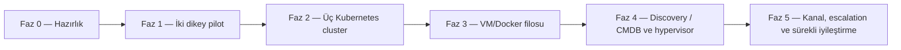
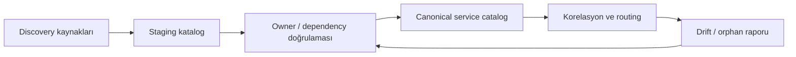
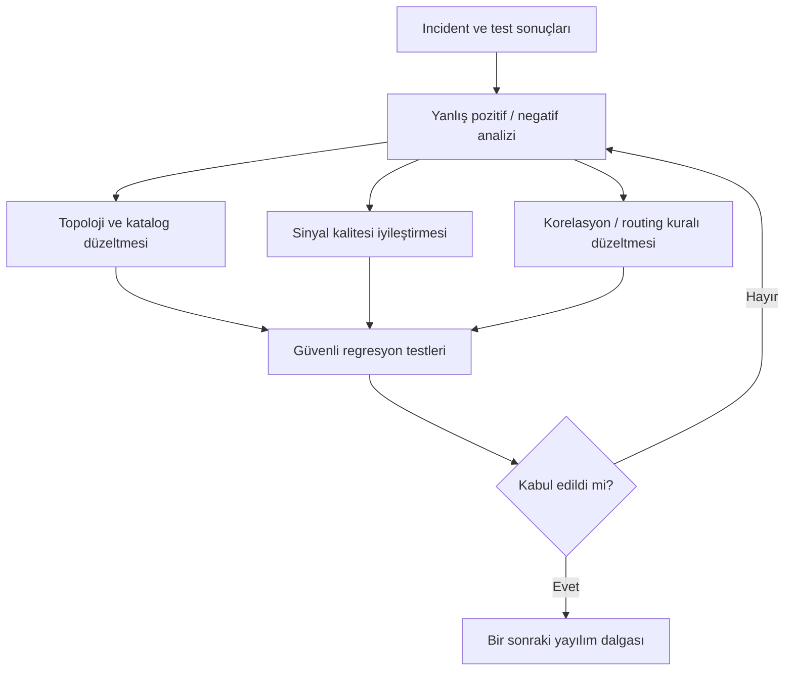
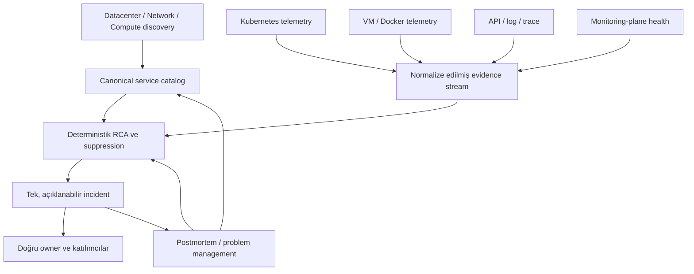

# Aşama 11 — Yaygınlaştırma Yol Haritası

## Amaç

Bu aşama, Kubernetes ve VM/Docker pilotlarında doğrulanan katmanlı root cause,
suppression ve ekip yönlendirme modelinin kontrollü biçimde genişletilmesini
tanımlar.

Yol haritası bir ürün kurulum takvimi değildir. Her fazın veri kalitesi, kabul
testi ve organizasyonel sahiplik koşulları sağlanmadan bir sonraki faza geçilmez.

## 11.1 Yaygınlaştırma ilkeleri

- Önce topoloji ve owner doğruluğu, sonra monitor kapsamı genişletilir.
- Her yeni failure domain küçük bir pilotla eklenir.
- Monitor sayısı başarı metriği değildir.
- Yeni sinyal root cause veya incident kararını değiştirmiyorsa zorunlu değildir.
- Child suppression uygulanmadan geniş API monitor kapsamı açılmaz.
- `Unknown` ve yanlış routing sonuçları öğrenme girdisi olarak saklanır.
- OneUptime veya başka bir ürünün doğrulanmamış yeteneği mimari varsayım yapılmaz.
- Bildirim kanalı ve escalation, doğru incident üretildikten sonra ele alınır.

## 11.2 Fazlar

## 11.3 Faz 0 — Hazırlık ve yönetişim

### Çıktılar

- Kaynak kimliği ve naming standardı,
- Minimum servis kataloğu şablonu,
- Dependency türleri ve suppression politikaları,
- Ekip domain'leri ve owner matrisi,
- P1/P2/P3 tanımı,
- Sinyal freshness ve korelasyon varsayımları,
- Test/change ve audit prosedürü.

### Geçiş koşulları

- Dört ekip domain'i sorumluluk sınırlarını onaylamış,
- Pilot kaynakların parent ve owner kayıtları eksiksiz,
- Hypervisor gibi görünürlük boşlukları işaretlenmiş,
- Monitoring plane failure domain'i dokümante edilmiş olmalı.

## 11.4 Faz 1 — İki dikey pilot

İki pilot paralel teknoloji kapsamı sağlar:

1. Kubernetes: `pilot-k8s-node` → workload → pod/container → Service/EndpointSlice
   → `pilot-k8s-service` API.
2. VM/Docker: `pilot-vm-01` → Docker daemon → `pilot-docker-service` container
   → HTTP/API.

### Pilot değerlendirme kapısı

Bir sonraki fazdan önce:

- Güvenli test senaryoları tamamlanmış,
- Parent fault'larda yanlış Application routing sıfır,
- Child incident fırtınası oluşmamış,
- OOM doğru kanıtla ayrılmış,
- NoData tek telemetry incident üretmiş,
- Parent recovery sonrasında kalıcı child arızası bulunmuş,
- Her karar açıklanabilir olmuş olmalıdır.

### Pilot geribildirimleri

Pilot sonunda üç backlog oluşturulur:

- **Sinyal boşlukları:** Ayırım yapmak için eksik kalan ölçümler,
- **Katalog hataları:** Yanlış parent, owner veya criticality,
- **Korelasyon hataları:** Yanlış dedupe, suppression veya confidence.

## 11.5 Faz 2 — Üç Kubernetes cluster'ına genişleme

Genişleme cluster bazında, tek seferde değil dalgalar halinde yapılır.

### Dalga sırası

1. En düşük riskli cluster,
2. Orta kritik production dışı veya sınırlı production cluster,
3. Kritik production cluster.

Her cluster için aşağıdakiler yeniden doğrulanır:

- Datacenter ve network parent eşlemesi,
- Cluster ve node Resource ID standardı,
- Workload owner ve criticality,
- Service/EndpointSlice ilişkileri,
- Agent/probe vantage point bağımsızlığı,
- Node failure domain ve redundancy,
- Cluster'a özel control plane görünürlüğü,
- Test edilebilir pilot servis.

### Cluster geçiş kapısı

- Node arızası doğru suppress ediliyor,
- Tek workload arızası cluster-wide incident olmuyor,
- Service/backend config hatası Application'a gitmiyor,
- OOM owner'ı Infra/Platform,
- API code hatası güçlü kanıtla Application'a gidiyor,
- Agent NoData child alarm fırtınası üretmiyor.

Bir cluster başarısızsa sonraki cluster'a geçilmez; policy o failure domain içinde
düzeltilip test tekrar edilir.

## 11.6 Faz 3 — VM/Docker filosuna genişleme

VM/Docker sistemleri homojen kabul edilmez. Önce envanter aşağıdaki gruplara
ayrılır:

- İşletim sistemi ailesi ve sürümü,
- Docker/runtime sürümü,
- Container başlatma yöntemi,
- Restart policy,
- Network ve volume modeli,
- Uygulama criticality/environment,
- Hypervisor/fiziksel host görünürlüğü,
- Agent kurulabilirliği ve erişim sınırları.

### Dalga yaklaşımı

1. Standart ve düşük riskli VM grubu,
2. Benzer runtime kullanan orta kritik servisler,
3. Manuel lifecycle veya görünürlük boşluğu fazla olan servisler,
4. Kritik üretim VM/Docker servisleri.

### Her dalgada doğrulanacaklar

- VM heartbeat ile agent health ayrımı,
- Docker daemon ile container health ayrımı,
- Kararlı servis Resource ID'si,
- OOM ve restart kanıtı,
- İç/dış API vantage point farkı,
- Hypervisor visibility gap işaretlemesi,
- Parent recovery sırası VM → daemon → container → API.

## 11.7 Faz 4 — CMDB/discovery olgunlaştırması

Manuel katalog pilot için yeterlidir; kapsam büyüdükçe drift riski artar. Gelecek
hedefi otomatik discovery ile insan onayını birleştiren bir modeldir.

### Otomasyon adayları

- Kubernetes API'den cluster/node/workload/Service/EndpointSlice discovery,
- VM/host agent'tan host ve Docker servis discovery,
- DNS/load balancer kayıtlarından service endpoint ilişkisi,
- Deployment metadata'dan application owner ve release bilgisi,
- Organizasyon dizininden ekip kimlikleri,
- Git veya configuration inventory'den ownership metadata.

Discovery sonucu doğrudan production katalog gerçeği yapılmaz. Parent ve owner
gibi kritik alanlar review gerektirir.

## 11.8 Hypervisor entegrasyonu

Mevcut VM pilotundaki `Visibility Gap`, uygun API ve yetki sağlandığında ayrı bir
çalışma olarak kapatılır.

### Beklenen sinyaller

- Hypervisor node health,
- VM power state ve HA durumu,
- Host CPU/memory/storage pressure,
- VM migration/restart event'leri,
- Aynı fiziksel host üzerindeki VM grupları,
- Cluster/quorum ve storage dependency'leri.

### Mimariye etkisi

Hypervisor görünürlüğü geldiğinde:

- `Unknown VM/compute` olayları daha kesin sınıflandırılabilir,
- Aynı hosttaki çoklu VM semptomları tek parent incident'a bağlanabilir,
- VM owner routing'i değişmeden kanıt seviyesi güçlenir,
- Yeni parent ilişkileri servis kataloğuna eklenir.

Entegrasyon yapılana kadar kesin hypervisor root cause iddiası kullanılmaz.

## 11.9 Monitoring plane olgunlaştırması

İkincil OneUptime gözcüsü dar kapsamını korur. Olgunlaşma adımları:

- Shared dependency envanterini doğrulama,
- Site heartbeat freshness ve kayıp senaryolarını düzenli test etme,
- İkincil watcher'ın kendi health görünürlüğünü artırma,
- Monitoring-plane incident sınıflarını normal servis olaylarından ayırma,
- İnsan tarafından olay referansı bağlama sürecini standardize etme.

İkinci sistemi bütün production monitorlerinin kopyası haline getirmek veya iki
sistem arasında doğrulanmamış database replikasyonu kurmak bu yol haritasının
parçası değildir.

## 11.10 Bildirim kanalları ve escalation için sonraki kararlar

Doğru incident ve owner modeli kararlı hale geldikten sonra ayrı bir tasarımda şu
konular kararlaştırılır:

- P1/P2/P3 için kanal matrisi,
- Mesai içi ve dışı on-call politikası,
- Acknowledgement ve yeniden escalation süreleri,
- Telegram/e-posta/telefon/SMS gibi kanal seçenekleri,
- Takım ve kişi bazlı yedekler,
- Vendor ve yönetim bilgilendirme sınırları,
- Suppressed child owner'larına yalnız görünürlük sunma modeli.

Kanal tasarımının kabul koşulu, parent fault testlerinde yanlış ekibe incident
gitmemesidir. Aksi halde daha güçlü bildirim yalnız alarm fırtınasını büyütür.

## 11.11 Postmortem ve problem management

### Zorunlu kapsam

- Bütün P1 incident'lar,
- Tekrarlayan P2 incident'lar,
- Yanlış root cause veya yanlış ekip routing'i üreten olaylar,
- Suppression nedeniyle kalıcı child arızasının geç bulunduğu olaylar,
- Monitoring plane körlüğü oluşturan olaylar.

### Postmortem içeriği

| Bölüm | İçerik |
|---|---|
| Etki | Kullanıcı, servis ve süre |
| Zaman çizelgesi | Fault, detection, correlation, routing, recovery |
| Root cause | Kanıt ve confidence |
| Alarm davranışı | Açılan, dedupe edilen ve bastırılan olaylar |
| Routing | Doğru/yanlış owner ve handoff'lar |
| Görünürlük boşluğu | Eksik sinyal/topoloji |
| Action items | Owner, tarih ve doğrulama testi |

Teknik incident beş dakikalık stabilite sonrasında çözülebilir; P1 veya tekrarlayan
P2 için problem/RCA kaydı action item'lar kapanana kadar açık kalır.

## 11.12 Sürekli iyileştirme döngüsü

## 11.13 Ölçüm ve yönetim göstergeleri

Olgunluk aşağıdaki metriklerle takip edilir:

| Alan | Gösterge |
|---|---|
| Katalog | Owner/parent eksik kaynak oranı |
| Sinyal | Stale/NoData oranı ve freshness ihlali |
| Korelasyon | Doğru root cause, yanlış pozitif/negatif |
| Suppression | Parent başına bastırılan child ve kaçırılan kalıcı child |
| Routing | İlk seferde doğru owner oranı ve handoff sayısı |
| Gürültü | Incident başına tekrar/duplicate sinyal |
| Operasyon | Detection, correlation, acknowledgement ve recovery süreleri |
| Postmortem | Action item kapanma oranı ve tekrarlayan nedenler |

Bu metrikler ekipleri cezalandırmak için değil sistem tasarımındaki eksikleri
görmek için kullanılır.

## 11.14 Değişiklik yönetimi

Korelasyon ve routing kuralı değişiklikleri production kod değişikliği kadar
dikkatli ele alınmalıdır. Her değişiklik:

1. Gerekçe ve beklenen davranışla tanımlanır.
2. Etkilenen kaynak/failure domain listesi çıkarılır.
3. Önce test verisi veya düşük riskli pilotta doğrulanır.
4. Güvenli regresyon senaryolarından geçirilir.
5. Owner ekiplerden review alır.
6. Audit edilebilir sürümle yayınlanır.
7. Yanlış routing açısından gözlem süresine alınır.

## 11.15 Stop/go kriterleri

### Go

- Önceki dalganın bütün kritik testleri pass,
- Yanlış Application routing yok,
- Parent fault'larda incident fırtınası yok,
- Katalog doğruluğu kabul edilmiş,
- Recovery kalıcı child arızasını kaçırmıyor,
- Monitoring plane ve NoData davranışı doğrulanmış.

### Stop

- Root cause sık sık `Unknown` ve diagnostic yol belirsiz,
- Owner/parent kayıtları eksik,
- Bir parent fault çok sayıda child incident üretiyor,
- OOM, network veya config yanlışlıkla Application'a gidiyor,
- Agent kaybı hedefleri gerçek arıza gibi gösteriyor,
- Recovery child sorunlarını görünmez yapıyor,
- İkincil watcher çift incident üretiyor.

## 11.16 Önerilen sorumluluk yapısı

| Çalışma alanı | Sorumlu domain | Katılımcılar |
|---|---|---|
| Service catalog governance | Infra/Platform | Network, Application, NOC |
| Network dependency model | Network | Infra/Platform |
| K8s/VM/Docker telemetry | Infra/Platform | Application |
| Uygulama log/trace semantiği | Application | Infra/Platform |
| Correlation/routing policy | Ortak çalışma grubu | Dört domain |
| Test koordinasyonu | NOC/Triage veya designated owner | İlgili teknik ekipler |
| Monitoring-plane watcher | Infra/Platform | Network |
| Postmortem governance | Incident coordinator | Etkilenen ekipler |

## 11.17 Uzun vadeli hedef mimari

Uzun vadeli hedef `her şeyi izlemek` değil; fiziksel altyapıdan uygulama koduna
kadar her incident'ı doğru failure domain, kanıt seviyesi ve owner ile açıklayan
bir işletim sistemi kurmaktır.

## 11.18 Yol haritası kabul kriterleri

- [ ] Pilot sonuçları ölçülmüş ve yayılım kapısı tanımlı.
- [ ] Üç Kubernetes cluster dalgalar halinde ele alınıyor.
- [ ] VM/Docker filosu runtime ve visibility özelliklerine göre gruplandırılıyor.
- [ ] CMDB/discovery insan review'ıyla canonical kataloğa bağlanıyor.
- [ ] Hypervisor visibility gap için ayrı entegrasyon hedefi var.
- [ ] İkincil monitoring watcher dar kapsamını koruyor.
- [ ] Bildirim kanalı ve escalation sonraki ayrı karar olarak planlanmış.
- [ ] P1 ve tekrarlayan P2 için postmortem/problem süreci tanımlı.
- [ ] Her yayılım dalgasında stop/go kriterleri uygulanıyor.
- [ ] Sürekli iyileştirme test, incident ve katalog verisiyle besleniyor.

## 11.19 Sonuç

Bu yol haritası, tek bir website monitoründen yola çıkan belirsiz alarm modelini;
datacenter, network, compute, runtime, service ve application kanıtlarını kullanan
açıklanabilir bir incident yönetim sistemine dönüştürür.

Başarı, daha fazla alarm üretmek değil; gerçek kök nedeni daha erken bulmak,
semptomları tek olay altında toplamak ve yalnız çözüm üretebilecek ekipleri sürece
dahil etmektir.

## Gezinme

- Önceki: [Aşama 10 — Güvenli Test ve Kabul Senaryoları](10-guvenli-test-ve-kabul-senaryolari.md)
- İndeks: [Genel Mimari Dokümantasyon İndeksi](README.md)
- Sonraki: Bu dokümantasyon serisinin son aşamasıdır.
