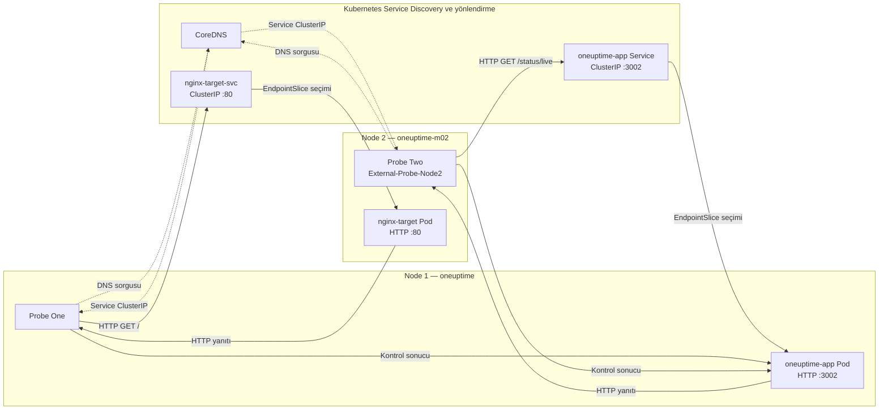
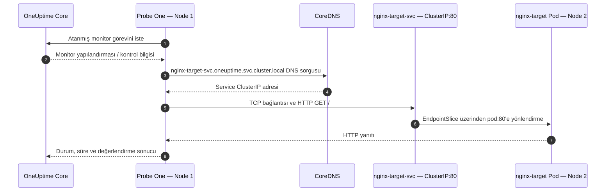
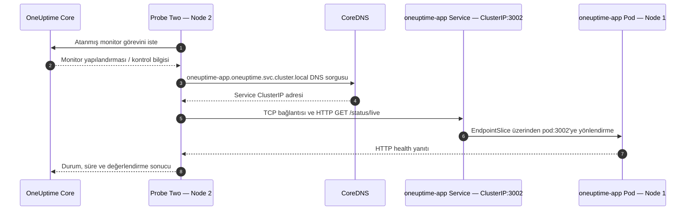

# Kubernetes Cross-Monitoring Trafiği ve Service DNS

Bu belge, iki node'lu OneUptime laboratuvarında oluşturulan iki Website
Monitor'ın trafiğini öğretici olarak açıklar:

| Monitor | İsteği gönderen probe | Kaynak node | Hedef | Hedef node |
|---|---|---|---|---|
| `Node2-Nginx-Health-Check` | Probe One | `oneuptime` | `http://nginx-target-svc.oneuptime.svc.cluster.local` | `oneuptime-m02` |
| `Node1-App-Health-Check` | `External-Probe-Node2` / Probe Two | `oneuptime-m02` | `http://oneuptime-app.oneuptime.svc.cluster.local:3002/status/live` | `oneuptime` |

Bu iki kontrol birlikte cross-monitoring oluşturur: Node 1'deki probe Node 2'deki
hedefi, Node 2'deki probe ise Node 1'deki hedefi kontrol eder.

## 1. Canlı topoloji

Kurulumdaki temel bileşenler şunlardır:

| Bileşen | Kubernetes nesnesi | Node |
|---|---|---|
| Probe One | `oneuptime-probe-one-...` podu | `oneuptime` |
| OneUptime App | `oneuptime-app-...` podu | `oneuptime` |
| Probe Two | `oneuptime-probe-two-...` podu | `oneuptime-m02` |
| Nginx test hedefi | `nginx-target` podu | `oneuptime-m02` |

Pod adlarının sonundaki hash değişebilir. Service adları ise podların yeniden
oluşturulmasından bağımsız, sabit erişim noktaları sağlar.

## 2. Genel trafik akış şeması



Şemadaki iki trafik türünü ayırmak önemlidir:

1. **Kontrol trafiği:** Probe ile OneUptime Core arasında monitor görevi,
   heartbeat ve kontrol sonucu bilgileri taşınır.
2. **Hedef trafiği:** HTTP isteğini doğrudan seçilen probe gönderir. Dashboard
   veya kullanıcının bilgisayarı bu isteği göndermez.

OneUptime'ın Website Monitor özelliği hedef URL'ye periyodik HTTP isteği
gönderir; durum kodu, yanıt süresi, header ve body gibi sonuçları monitor
kriterlerine göre değerlendirebilir.

## 3. Kubernetes Service DNS isimlendirmesi

Bir Kubernetes Service'in tam DNS adı genel olarak şu biçimdedir:

```text
<service-adı>.<namespace>.svc.<cluster-domain>
```

Bu cluster'da varsayılan cluster domain `cluster.local` olduğu için yapı şöyledir:

```text
oneuptime-app.oneuptime.svc.cluster.local
│             │         │   └─ Cluster DNS domain'i
│             │         └──── Service kayıtları için sabit bölüm
│             └────────────── Kubernetes namespace'i
└──────────────────────────── Service nesnesinin adı
```

Kubernetes DNS servisi (genellikle CoreDNS), Service oluşturulduğunda onun için
DNS kaydı üretir. Normal bir `ClusterIP` Service adı çözümlendiğinde pod IP'si
değil, Service'in sanal ClusterIP adresi döner. Service veri düzlemi daha sonra
trafiği hazır EndpointSlice kayıtlarından bir pod endpoint'ine yönlendirir.

### Kullanılabilen isim biçimleri

Probe ve hedef aynı `oneuptime` namespace'inde olduğu için aşağıdaki adlar
çözümlenebilir:

| İsim | Kapsam |
|---|---|
| `nginx-target-svc` | Yalnızca aynı namespace içinde kısa ad |
| `nginx-target-svc.oneuptime` | Service ve namespace adı |
| `nginx-target-svc.oneuptime.svc.cluster.local` | Tam nitelikli cluster içi DNS adı (FQDN) |

Monitor tanımında FQDN kullanmak hedefin hangi namespace ve cluster DNS alanına
ait olduğunu açıkça gösterir. Başka namespace'ten erişimde en az
`service.namespace` biçimi gerekir.

> `cluster.local` genel internette kayıtlı bir alan adı değildir. Bu isimler
> yalnızca cluster DNS'ini kullanan podların içinden çözümlenir. Mac'teki normal
> tarayıcı bu adresleri doğrudan açamaz.

## 4. İki monitor URL'sinin parçaları

### 4.1 Node 1 → Node 2 Nginx

```text
http://nginx-target-svc.oneuptime.svc.cluster.local
└─┬─┘  └────────────────────┬─────────────────────┘
  │                         └─ Kubernetes Service FQDN
  └─ HTTP; port yazılmadığı için varsayılan TCP 80
```

Bu URL'nin anlamı:

- **Protokol:** `http`
- **Service:** `nginx-target-svc`
- **Namespace:** `oneuptime`
- **Service portu:** `80` (URL'de yazılmadığı için HTTP varsayılanı)
- **Path:** `/`
- **Endpoint:** Node 2'deki `nginx-target` podunun port `80` endpoint'i

Pod yeniden oluşturulup IP'si değişse bile Service selector ve EndpointSlice
güncellendiği sürece monitor URL'si değişmez.

### 4.2 Node 2 → Node 1 OneUptime App

```text
http://oneuptime-app.oneuptime.svc.cluster.local:3002/status/live
└─┬─┘  └───────────────────┬────────────────────┘ └┬─┘ └────┬────┘
  │                        │                       │        └─ Health path
  │                        │                       └─ Service portu
  │                        └─ Kubernetes Service FQDN
  └─ HTTP
```

Bu URL'nin anlamı:

- **Protokol:** `http`
- **Service:** `oneuptime-app`
- **Namespace:** `oneuptime`
- **Service portu:** `3002`
- **Path:** `/status/live`
- **Endpoint:** Node 1'deki hazır `oneuptime-app-...` podu

`/status/live`, OneUptime App sürecinin canlılık endpoint'idir. Bu endpoint'in
başarılı yanıt vermesi uygulama container'ının HTTP isteğine cevap verebildiğini
gösterir.

## 5. Monitor 1 trafik sırası: Probe One → Nginx



Adım adım:

1. Probe One, kendisine atanmış `Node2-Nginx-Health-Check` kontrolünü yürütür.
2. Pod içindeki DNS resolver FQDN'i CoreDNS'e sorar. DNS sonucu cache'teyse her
   kontrolde yeni DNS paketi görülmeyebilir.
3. CoreDNS, `nginx-target-svc` Service'inin ClusterIP adresini döndürür.
4. Probe bu sanal IP'nin TCP `80` portuna HTTP isteği gönderir.
5. Kubernetes Service veri düzlemi, EndpointSlice içindeki hazır
   `nginx-target` podunu seçer.
6. Paket CNI ağı üzerinden Node 1'den Node 2'ye taşınır.
7. Nginx yanıtı aynı TCP bağlantısı üzerinden Probe One'a döner.
8. Probe sonucu OneUptime Core'a bildirir; monitor kriterleri değerlendirilir ve
   dashboard durumu güncellenir.

Bu kontrol yalnızca Nginx process'ini değil; Probe One, cluster DNS, Service,
EndpointSlice, node'lar arası pod ağı ve Node 2'deki Nginx podunu birlikte sınar.

## 6. Monitor 2 trafik sırası: Probe Two → OneUptime App



Bu kez trafik ters yöndedir:

1. Node 2'deki Probe Two, `Node1-App-Health-Check` kontrolünü yürütür.
2. `oneuptime-app` Service FQDN'i CoreDNS tarafından ClusterIP'ye çevrilir.
3. Probe Two, Service'in açıkça belirtilen TCP `3002` portuna istek gönderir.
4. Service, isteği Node 1'deki hazır OneUptime App endpoint'ine yollar.
5. `/status/live` yanıtı Probe Two'ya döner ve sonuç OneUptime'a bildirilir.

Bu kontrol Probe Two'nun Node 1'e erişimini, DNS/Service yönlendirmesini ve App
health endpoint'ini sınar.

## 7. Paket cluster içinde fiziksel olarak nasıl ilerler?

Bu laboratuvarda pod ağları node bazında ayrılır. Canlı durum örneğinde Node 1
podları `10.244.0.x`, Node 2 podları `10.244.1.x` aralığındadır. Service
ClusterIP'leri ise ayrı bir sanal Service CIDR'ındadır.

Örnek veri yolları:

```text
Probe One pod IP
  → nginx-target-svc ClusterIP:80
  → Service endpoint seçimi
  → nginx-target pod IP:80 (Node 2)

Probe Two pod IP
  → oneuptime-app ClusterIP:3002
  → Service endpoint seçimi
  → oneuptime-app pod IP:3002 (Node 1)
```

Service ClusterIP gerçek bir pod veya process değildir; sanal bir erişim
noktasıdır. Service uygulaması cluster'a göre kube-proxy ya da eşdeğer bir veri
düzlemi tarafından yapılır. Node'lar arası pod paketlerini ise CNI ağı taşır.

Pod IP'leri geçicidir. Pod restart veya rollout sonrasında değişebilir. Monitor
URL'lerinde pod IP'si kullanmak yerine Service DNS adı kullanılmasının temel
nedeni budur.

## 8. Port-forward bu trafiğin neresindedir?

```text
Mac tarayıcısı → https://oneuptime.furkan.test → kubectl port-forward
→ oneuptime-local-tls → oneuptime-nginx
```

Port-forward yalnızca kullanıcının dashboard'a erişmesi içindir. İki probe'un
monitor istekleri `oneuptime.furkan.test` üzerinden gitmez. Probe'lar cluster içinde
çalıştığı için Service FQDN'lerini doğrudan çözümler ve hedeflere cluster ağı
üzerinden bağlanır.

Bu nedenle port-forward terminali kapansa bile çalışan probe'ların iç monitor
kontrolleri devam edebilir; yalnızca Mac'ten dashboard erişimi kesilir.

Tarayıcıdan başlayıp `/etc/hosts`, portsuz `80/443`, TLS proxy, CoreDNS ve
OneUptime gateway üzerinden uygulamaya ulaşan kullanıcı trafiği ayrı belgede
ayrıntılı ve diyagramlı olarak açıklanır:

- [Yerel DNS, TLS Proxy ve Uygulama Trafik Akışı](../kurulum/LOCAL_DNS_TLS_TRAFFIC.md)

## 9. HTTP ve güvenlik notu

İki monitor URL'si de `http://` kullandığı için hedef trafiği uygulama katmanında
şifrelenmez. Trafiğin cluster içinde kalması onu otomatik olarak şifreli yapmaz.
Bu Minikube laboratuvarı için basit ve uygundur; hassas üretim trafiğinde TLS,
NetworkPolicy ve uygun kimlik doğrulama değerlendirilmelidir.

NetworkPolicy kullanılırsa probe podlarının şu trafiğine izin verilmelidir:

- CoreDNS'e DNS sorguları (genellikle UDP/TCP `53`)
- Probe One'dan `nginx-target-svc` port `80` trafiği
- Probe Two'dan `oneuptime-app` port `3002` trafiği
- Her iki probe ile OneUptime Core arasındaki kontrol/sonuç trafiği

## 10. Trafiği Kubernetes tarafından doğrulama

### Podların hangi node'da olduğunu görün

```bash
kubectl get pods -n oneuptime -o wide
```

### Service ve portları görün

```bash
kubectl get svc -n oneuptime oneuptime-app nginx-target-svc -o wide
```

### Service → pod eşleşmesini görün

```bash
kubectl get endpointslice -n oneuptime \
  -l kubernetes.io/service-name=nginx-target-svc

kubectl get endpointslice -n oneuptime \
  -l kubernetes.io/service-name=oneuptime-app
```

Endpoint listesi boşsa Service'in yönlendirebileceği hazır bir pod yoktur.

### Node 1 tarafında DNS ve HTTP testi

Aşağıdaki geçici test podu Node 1'e yerleştirilir ve işlem bitince silinir:

```bash
kubectl run curl-node1 -n oneuptime --rm -it --restart=Never \
  --image=curlimages/curl \
  --overrides='{"spec":{"nodeSelector":{"app":"oneuptime-core"}}}' -- \
  curl -sv --max-time 10 \
  http://nginx-target-svc.oneuptime.svc.cluster.local
```

### Node 2 tarafında DNS ve HTTP testi

```bash
kubectl run curl-node2 -n oneuptime --rm -it --restart=Never \
  --image=curlimages/curl \
  --overrides='{"spec":{"nodeSelector":{"app":"oneuptime-probe"}}}' -- \
  curl -sv --max-time 10 \
  http://oneuptime-app.oneuptime.svc.cluster.local:3002/status/live
```

Bu geçici pod testleri veri yolunu doğrular; monitor'ı çalıştıran gerçek
bileşenler yine Probe One ve Probe Two'dur.

### Probe loglarını inceleyin

```bash
kubectl logs -n oneuptime deployment/oneuptime-probe-one --tail=100
kubectl logs -n oneuptime deployment/oneuptime-probe-two --tail=100
```

## 11. Hata belirtilerini katmanlara ayırma

| Belirti | Muhtemel katman | Kontrol |
|---|---|---|
| Probe `Disconnected` | Probe ↔ OneUptime kontrol bağlantısı, key veya pod | Probe podu ve logları |
| `ENOTFOUND` / isim çözümlenmiyor | CoreDNS, yanlış Service/namespace adı | Service adı, CoreDNS ve FQDN |
| Service var fakat EndpointSlice boş | Selector eşleşmiyor veya hedef pod hazır değil | Service selector ve pod label'ları |
| `Connection refused` | Yanlış port veya hedef process dinlemiyor | Service `port`/`targetPort` ve container portu |
| Timeout | CNI, node bağlantısı, NetworkPolicy veya hedef kilitlenmesi | Node durumu, events ve ağ kuralları |
| HTTP `4xx`/`5xx` | Uygulama katmanı | Hedef pod logları ve monitor URL/path ayarı |
| Dashboard açılmıyor fakat monitor çalışıyor | Port-forward kapalı | `kubectl port-forward` terminali |

## 12. Bu iki monitor tam olarak neyi kanıtlar?

Cross-monitoring başarılı olduğunda şu zincirlerin çalıştığı doğrulanır:

- İki probe da OneUptime'a bağlıdır ve monitor çalıştırabilmektedir.
- CoreDNS iki Service adını çözümleyebilmektedir.
- ClusterIP Service'leri doğru EndpointSlice kayıtlarına sahiptir.
- İki node arasındaki CNI/pod ağı iki yönde çalışmaktadır.
- Nginx port `80` ve OneUptime App port `3002` HTTP yanıtı vermektedir.
- Probe sonuçları OneUptime'a dönmekte ve dashboard'da değerlendirilmektedir.

Bu testler dış internet erişimini, public ingress'i, `oneuptime.furkan.test`
port-forward'ını veya yerel HTTPS sertifikasını doğrulamaz. Bunlar ayrı trafik
yollarıdır.

## Resmi kaynaklar

- [Kubernetes — DNS for Services and Pods](https://kubernetes.io/docs/concepts/services-networking/dns-pod-service/)
- [Kubernetes — Service](https://kubernetes.io/docs/concepts/services-networking/service/)
- [OneUptime — Website Monitor](https://oneuptime.com/docs/en/monitor/website-monitor)
- [OneUptime — Custom Probes](https://oneuptime.com/docs/en/probe/custom-probe)
