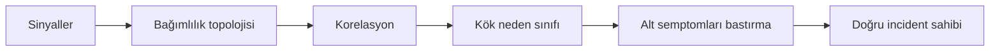
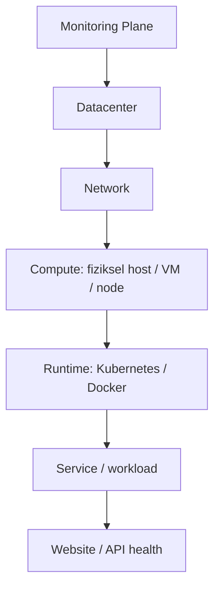

# Katmanlı İzleme, Root Cause ve Incident Yönlendirme Mimarisi

Bu klasör; veri merkezi, ağ, fiziksel veya sanal sunucu, Kubernetes, Docker ve
uygulama katmanlarından gelen izleme sinyallerini tek başına değerlendirmek
yerine aralarındaki bağımlılıkları kullanarak anlamlandıran bir operasyon
mimarisini adım adım tanımlar.

Temel amaç, bir website veya API kontrolü başarısız olduğunda bu sonucu doğrudan
"uygulama hatası" olarak yorumlamamaktır. Sistem önce üst katmanları kontrol
etmeli, mümkün olan kök nedeni belirlemeli, aynı arızadan kaynaklanan alt
semptomları tek olay altında toplamalı ve incident'ı yalnızca sorumlu ekiplere
yönlendirmelidir.

Bu dokümantasyon bir kurulum rehberi değildir. Herhangi bir üründe yapılacak
ayarları, çalıştırılabilir komutları, manifestleri veya uygulama kodunu içermez.
OneUptime mevcut laboratuvar çalışmasının izleme platformu olarak ele alınabilir;
ancak burada açıklanan korelasyon ve yönlendirme modeli ürün bağımsızdır.

## 1. Neden yeni bir mimariye ihtiyaç var?

Aşağıdaki sağlık kontrolünün HTTP `200` dönmediğini düşünelim:

```text
http://oneuptime-app.oneuptime.svc.cluster.local:3002/status/live
```

Bu kontrol yalnızca isteğin beklenen cevabı alamadığını kanıtlar. Tek başına şu
sorulardan hiçbirini cevaplayamaz:

- Uygulama kodunda bir hata mı oluştu?
- Pod veya container `OOMKilled` nedeniyle mi kapandı?
- Kubernetes node'u erişilemez mi oldu?
- VM, işletim sistemi veya Docker daemon mı durdu?
- DNS, firewall, routing veya başka bir ağ bileşeni mi bozuldu?
- Veri merkezinin dış bağlantısı mı kesildi?
- Kontrolü yapan probe veya agent mı çalışmayı bıraktı?

Bu ayrım yapılmadan her monitor bağımsız incident oluşturursa aynı fiziksel
arızadan onlarca veya yüzlerce alarm üretilebilir. Uygulama ekipleri kendilerinden
kaynaklanmayan bir veri merkezi ya da ağ kesintisi için çağrılırken gerçek kök
neden alarm kalabalığı içinde kaybolabilir.

Tasarlanan mimari şu sırayı esas alır:



## 2. Dokümantasyon hedefleri

Bu seri tamamlandığında aşağıdaki konular karar verilmiş ve birbirleriyle tutarlı
bir mimari halinde açıklanmış olacaktır:

- Kubernetes ve Kubernetes bulunmayan VM/Docker ortamlarının aynı modelde
  izlenmesi
- Veri merkezinden uygulama endpoint'ine kadar parent-child bağımlılıklarının
  kurulması
- Website, API, host, container ve altyapı sinyallerinin ortak olay modelinde
  değerlendirilmesi
- Semptom ile kanıtlanmış veya olası kök nedenin ayrılması
- Ortak bir üst katman arızasında alt incident'ların bastırılması
- Incident'ın yalnızca gerekli ekip veya ekiplere atanması
- Kök neden belirlenemediğinde olayın NOC/Triage kuyruğuna alınması
- Birincil izleme sisteminin bulunduğu veri merkezi çöktüğünde ikinci izleme
  sistemiyle kör noktanın azaltılması
- Güvenli fault injection senaryolarıyla mimarinin doğrulanması

Bildirim kanalları bu tasarımın konusu değildir. Telefon, e-posta, sohbet
uygulaması, ticket sistemi veya başka bir kanal daha sonra seçilebilir. Bu
belgelerde önce incident'ın **hangi ekibin sorumluluğunda olması gerektiği**
çözülecektir.

## 3. Pilot kapsamı

Gerçek ortamda üç Kubernetes cluster'ı ve VM üzerinde manuel Docker ile çalışan
servisler bulunmaktadır. Buna rağmen ilk aşamada tüm envanterin aynı anda
modellenmesi hedeflenmez. Mimari, iki küçük ama uçtan uca örnek üzerinden
doğrulanacaktır.

### 3.1 Kubernetes pilotu

```text
Datacenter
→ Network Zone
→ Kubernetes Cluster
→ pilot-k8s-node
→ Pod / Container
→ Service / EndpointSlice
→ pilot-k8s-service HTTP/API
```

Bu örnek; node erişilemezliği, pod veya container hatası, `OOMKilled`, Service
endpoint kaybı, ağ sorunu ve uygulama hatasının birbirinden ayrılmasını
gösterecektir.

### 3.2 VM ve Docker pilotu

```text
Datacenter
→ Network Zone
→ Hypervisor
→ pilot-vm-01
→ Docker Daemon
→ pilot-docker-service Container
→ HTTP/API
```

Pilot sırasında hypervisor yönetim API'sine erişim olmadığı kabul edilir. Bu
nedenle hypervisor topolojide parent kaynak olarak gösterilecek, fakat sağlık
kanıtı bulunmayan bu katman bir **görünürlük boşluğu** olarak işaretlenecektir.
VM heartbeat kaybı tek başına fiziksel host arızası olarak ilan edilmeyecektir.

### 3.3 Pilot dışında kalanlar

İlk pilot aşağıdakileri uygulamaz:

- Üç Kubernetes cluster'ının tamamını devreye alma
- Bütün VM ve Docker servislerini kataloglama
- Hypervisor API entegrasyonu
- Otomatik CMDB veya discovery sistemi kurma
- Bildirim kanalı ve nöbetçi escalation politikası seçme
- Makine öğrenmesiyle root cause tahmini
- Gerçek veri merkezini veya üretim ağını kapatan kesinti testleri

Bu başlıklar pilot kanıtlandıktan sonra yaygınlaştırma yol haritasında ele
alınacaktır.

## 4. Temel kavramlar

| Kavram | Bu dokümantasyondaki anlamı |
|---|---|
| Sinyal | Bir monitor, agent, probe, log, metric, trace veya event tarafından üretilen ham gözlem |
| Semptom | Bir üst katman arızasının alt kaynakta oluşturduğu sonuç; örneğin DC kesintisinde API timeout |
| Root cause | Elde edilen kanıtlarla olay zincirini başlatan en üst ve müdahale edilebilir neden |
| Parent resource | Alt kaynağın çalışabilmesi için bağımlı olduğu üst kaynak |
| Child resource | Parent kaynağın arızasından etkilenebilen alt kaynak |
| Correlation | Zaman, topoloji ve kanıt ilişkilerini kullanarak sinyalleri aynı olay altında toplama |
| Suppression | Parent incident aktifken child semptom için ayrı incident ve ekip yönlendirmesi oluşturmama |
| Deduplication | Aynı kaynak ve neden için yinelenen sinyallerden tek aktif incident üretme |
| Fingerprint | Aynı olaya ait sinyalleri tanımak için kullanılan kararlı olay kimliği |
| Vantage point | Sağlık kontrolünün yapıldığı ağ veya lokasyon bakış noktası |
| NoData | Hedefin sağlığından çok telemetri kaynağı hakkında belirsizlik oluşturan veri kesintisi |
| Visibility gap | Topolojide bulunan fakat doğrudan sağlık telemetrisi alınamayan katman |
| Incident | Operasyon ekibinin müdahale etmesi gereken, sahibi ve önceliği belirlenmiş olay kaydı |
| Problem/RCA kaydı | Teknik iyileşmeden sonra kalıcı nedeni ve önleyici aksiyonları araştıran kayıt |

## 5. Katmanlı bakış

Her HTTP/API hatası en alt katmanda görünse de karar üstten alta verilmelidir:



Örneğin `API Down` sinyali geldiğinde:

1. Önce monitoring plane ve kontrolü yapan probe/agent değerlendirilir.
2. Datacenter ve ortak ağ parent'ları kontrol edilir.
3. Compute ve runtime sağlığı incelenir.
4. Service endpoint ve container/pod durumu değerlendirilir.
5. Üst katmanlar sağlıklıysa uygulama logu, trace'i ve HTTP cevabı incelenir.
6. En güçlü kanıtın bulunduğu katman root cause adayı olur.
7. Alt katman hataları aynı parent incident altında semptom olarak tutulur.

## 6. Ortamların ortak ve farklı yönleri

| Konu | Kubernetes ortamı | VM/Docker ortamı |
|---|---|---|
| Compute kaynağı | Kubernetes node | VM/OS |
| Runtime | Kubelet ve container runtime | Docker daemon |
| Çalışan birim | Pod/container | Container |
| Servis yönlendirmesi | Service ve EndpointSlice | VM portu, reverse proxy veya doğrudan container portu |
| Runtime olayları | Kubernetes events, pod phase, restart ve termination reason | Docker events, container state, exit code ve restart count |
| Kaynak sinyalleri | Node/pod/container metrics | Host/container metrics |
| Uygulama kanıtı | HTTP/API, log ve trace | HTTP/API, log ve trace |
| Parent görünürlüğü | Cluster ve node sinyalleri bulunabilir | Hypervisor pilotta görünürlük boşluğudur |

İki ortam farklı agent ve monitor türleri kullanabilir. Buna rağmen korelasyon
motorunun cevaplamak istediği sorular aynıdır:

- Hangi kaynak bozuldu?
- Bu kaynak hangi parent'a bağlı?
- Aynı zaman aralığında parent da arızalı mı?
- Child hatası bağımsız incident mı, yoksa parent arızasının semptomu mu?
- Kanıt hangi ekibin müdahalesini gerektiriyor?

## 7. Ekip ve sorumluluk özeti

Detaylı yönlendirme matrisi
[Aşama 6 — Incident Sahipliği ve Ekip Yönlendirme](06-incident-sahipligi-ve-ekip-yonlendirme.md)
belgesinde tanımlanmıştır. Genel sınırlar şöyledir:

| Ekip | Ana sorumluluk alanı |
|---|---|
| NOC/Triage | Kanıtı eksik veya çelişkili olayları değerlendirmek |
| Network | WAN, routing, firewall, DNS, load balancer ve ağ yolu sorunları |
| Infra/Platform | Datacenter, compute, VM/OS, Kubernetes, Docker, OOM, deployment/config, database ve storage |
| Application | Parent ve runtime sağlıklıyken kod, exception, trace veya uygulama davranışıyla kanıtlanan hatalar |

Datacenter `Down` olayında Network ile Infra/Platform birlikte owner olacak;
incident koordinasyonunu Infra/Platform yürütecektir. Alt uygulama ekiplerine
ayrı incident gönderilmeyecektir.

## 8. Doküman sırası

| Sıra | Doküman | Durum |
|---:|---|---|
| 1 | [Sorun Tanımı ve Hedefler](01-sorun-tanimi-ve-hedefler.md) | Hazır |
| 2 | [Katmanlı Kaynak Topolojisi](02-katmanli-kaynak-topolojisi.md) | Hazır |
| 3 | [Servis Kataloğu ve Sahiplik Modeli](03-servis-katalogu-ve-sahiplik-modeli.md) | Hazır |
| 4 | [Sinyal ve Monitor Tasarımı](04-sinyal-ve-monitor-tasarimi.md) | Hazır |
| 5 | [Root Cause Korelasyon ve Alarm Bastırma](05-root-cause-korelasyon-ve-alarm-bastirma.md) | Hazır |
| 6 | [Incident Sahipliği ve Ekip Yönlendirme](06-incident-sahipligi-ve-ekip-yonlendirme.md) | Hazır |
| 7 | [Kubernetes Pilot Mimarisi](07-kubernetes-pilot-mimarisi.md) | Hazır |
| 8 | [VM/Docker Pilot Mimarisi](08-vm-docker-pilot-mimarisi.md) | Hazır |
| 9 | [Monitoring Plane Yedekliliği](09-monitoring-plane-yedekliligi.md) | Hazır |
| 10 | [Güvenli Test ve Kabul Senaryoları](10-guvenli-test-ve-kabul-senaryolari.md) | Hazır |
| 11 | [Yaygınlaştırma Yol Haritası](11-yayginlastirma-yol-haritasi.md) | Hazır |

## 9. Dokümantasyon ilkeleri

- Ürüne özgü özellik ile tasarlanması gereken harici yetenek birbirine
  karıştırılmayacaktır.
- OneUptime'ın doğrulanmamış bir özelliği native özellik olarak
  sunulmayacaktır.
- Her root cause kararı dayandığı kanıtlarla açıklanabilir olacaktır.
- Monitor durumuyla incident oluşturma kararı birbirinden ayrılacaktır.
- Parent arızası alt kaynakların gözlemlerini saklamayacak; yalnızca gereksiz
  incident ve ekip yönlendirmesini bastıracaktır.
- Görünür olmayan bir katman hakkında kesin kök neden iddiası yapılmayacaktır.
- Dokümanlarda gerçek ortam credential'ı, IP adresi veya hassas envanter bilgisi
  kullanılmayacaktır.

## Sonraki adım

[Aşama 1 — Sorun Tanımı ve Hedefler](01-sorun-tanimi-ve-hedefler.md)
