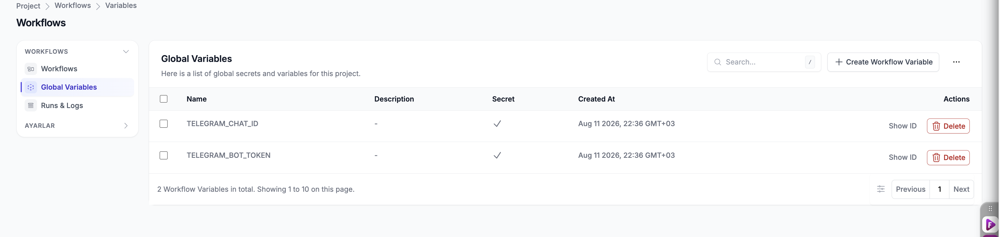

# Aşama 2 — OneUptime Global Variables Oluşturma

## Amaç

Telegram token ve Chat ID değerlerini Workflow bileşenlerinde düz metin olarak
yazmak yerine OneUptime proje seviyesindeki secret değişkenlerde saklamak.

## 2.1 Global Variables ekranını açma

OneUptime arayüzünde şu yolu izleyin:

```text
Project → Workflows → Global Variables
```

Sağ üstteki **Create Workflow Variable** düğmesini kullanın.

> **Ekran görüntüsü eklenecek:** Workflows menüsü, `Global Variables` seçeneği ve
> `Create Workflow Variable` düğmesi. Secret içerikleri görünmemelidir.
> Önerilen dosya: `images/02-global-variables-page.png`

## 2.2 Bot token değişkenini oluşturma

Formu aşağıdaki gibi doldurun:

| Alan | Değer |
|---|---|
| Name | `TELEGRAM_BOT_TOKEN` |
| Description | `OneUptime Telegram bildirim botu token değeri` |
| Content | BotFather'dan alınan gerçek token |
| Secret | Etkin / `Yes` |

Kaydetmeden önce **Secret** seçeneğinin etkin olduğunu doğrulayın.

> **Ekran görüntüsü eklenecek:** `TELEGRAM_BOT_TOKEN` değişken oluşturma formu.
> `Content` alanı çekimden önce tamamen kapatılmalı veya görsel dışında
> bırakılmalıdır.
> Önerilen dosya: `images/02-create-bot-token-variable.png`

## 2.3 Chat ID değişkenini oluşturma

Aynı işlemi ikinci değişken için tekrarlayın:

| Alan | Değer |
|---|---|
| Name | `TELEGRAM_CHAT_ID` |
| Description | `Telegram kişisel bildirim sohbetinin Chat ID değeri` |
| Content | Aşama 1'de bulunan gerçek Chat ID |
| Secret | Etkin / `Yes` |

> **Ekran görüntüsü eklenecek:** `TELEGRAM_CHAT_ID` değişken oluşturma formu.
> Gerçek `Content` değeri görünmemelidir.
> Önerilen dosya: `images/02-create-chat-id-variable.png`

## 2.4 Sonucu doğrulama

Global Variables listesinde iki kayıt görünmelidir:

```text
TELEGRAM_BOT_TOKEN    Secret: Yes
TELEGRAM_CHAT_ID      Secret: Yes
```

Listede bulunan **Show ID** eylemi, secret'ın gerçek içeriğini değil OneUptime
kaynak kimliğini gösterir. Workflow kurarken alan değerleri elle yazılmamalı;
değer seçicisindeki **variable** bağlantısıyla bu Global Variables kayıtları
seçilmelidir.



*Şekil 5 — `TELEGRAM_CHAT_ID` ve `TELEGRAM_BOT_TOKEN` değişkenleri secret olarak
oluşturulmuştur. Görsel gerçek secret içeriklerini göstermez.*

## Kabul kontrolü

- [ ] `TELEGRAM_BOT_TOKEN` oluşturuldu.
- [ ] `TELEGRAM_CHAT_ID` oluşturuldu.
- [ ] Her iki kayıt da `Secret` olarak işaretlendi.
- [ ] Gerçek içerikler ekranda veya dokümanda gösterilmedi.

Bu kontroller tamamlandıktan sonra
[Aşama 3 — Kubernetes Telegram Secret](03-kubernetes-telegram-secret.md)
uygulanır.
