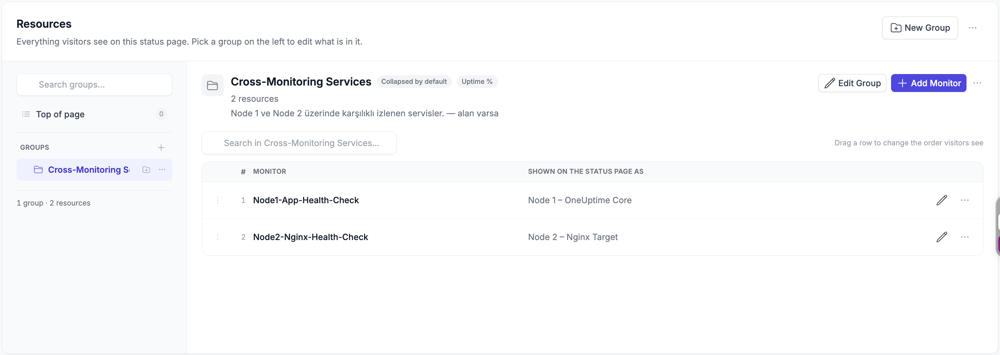
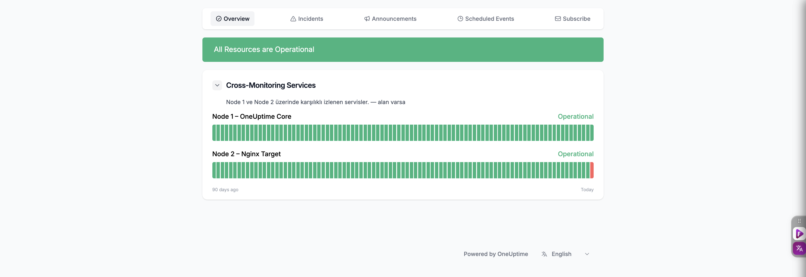

# Aşama 4 — Public Status Page Oluşturma

## Amaç

İki cross-monitor kaynağını tek bir yerel ve parolasız Status Page üzerinde
göstermek:

| Status Page kaynağı | Bağlı monitor |
|---|---|
| `Node 1 – OneUptime Core` | `Node1-App-Health-Check` |
| `Node 2 – Nginx Target` | `Node2-Nginx-Health-Check` |

Sayfa yalnızca Minikube'a yapılan port-forward üzerinden yerel olarak public
olacaktır. İnternete açık bir custom domain kurulmaz.


*Şekil 7 — Bu aşamanın hedef görünümü: iki kaynak da `Operational` durumdadır.*

## 4.1 OneUptime arayüzünü açma

Ayrı bir terminal sekmesinde port-forward başlatın ve terminali açık bırakın:

```bash
./scripts/port-forward-https.sh
```

Beklenen terminal çıktısı:

```text
Forwarding from 127.0.0.1:80 -> 8080
Forwarding from [::1]:80 -> 8080
Forwarding from 127.0.0.1:443 -> 8443
Forwarding from [::1]:443 -> 8443
```

Tarayıcıdan istek geldikçe terminalde `Handling connection for 443` satırı
görülebilir. Bu komut çalıştığı sürece terminal oturumu açık bırakılmalıdır.

Tarayıcıdan şu adresi açın:

```text
https://oneuptime.furkan.test
```

Port-forward yalnızca bilgisayardan arayüze erişim sağlar. Cluster içindeki probe
trafiği bu bağlantıyı kullanmaz.

## 4.2 Status Page kaydını oluşturma

OneUptime arayüzünde **Status Pages** bölümüne gidip yeni bir Status Page
oluşturun.

| Alan | Değer |
|---|---|
| Name | `OneUptime Cross-Monitoring Status` |
| Access | Public |
| Password protection | Kapalı |
| Custom domain | Yapılandırılmayacak |

Sürüm ve dil seçimine göre alan adları küçük farklılıklar gösterebilir. Temel
sonuç sayfanın anonim olarak, parola istemeden açılmasıdır.

> **Ekran görüntüsü önerisi:** Yeni Status Page oluşturma formunda sayfa adı ve
> public erişim seçeneği. Buraya `04-status-page-create-form.png` resmini
> koyabilirsin. Tarayıcıdaki oturum veya kullanıcı bilgilerini kadraj dışında
> bırak.

## 4.3 Kaynak grubunu oluşturma

Status Page içinde bir kaynak grubu ekleyin:

| Alan | Değer |
|---|---|
| Group name | `Cross-Monitoring Services` |
| Description | `Node 1 ve Node 2 üzerinde karşılıklı izlenen servisler.` |

Grup, iki kaynağın tek bir genel durum altında gösterilmesini sağlar. Grubun
durumu, içindeki kaynakların en kötü güncel durumuna göre etkilenir.



*Şekil 8 — `Cross-Monitoring Services` grubunda Node 1 ve Node 2 monitorlerinin
Status Page üzerinde kullanılacak adlarla eşleştirilmesi.*

## 4.4 Node 1 kaynağını ekleme

Gruba ilk Status Page kaynağını ekleyin:

| Alan | Değer |
|---|---|
| Resource name | `Node 1 – OneUptime Core` |
| Resource type | Monitor |
| Monitor | `Node1-App-Health-Check` |

Güncel durum ve uptime geçmişinin gösterilmesini sağlayan seçenekler varsa
etkinleştirin.

Node 1 kaynağı ile `Node1-App-Health-Check` eşleştirmesi Şekil 8'de
gösterilmektedir.

## 4.5 Node 2 kaynağını ekleme

İkinci kaynağı aynı gruba ekleyin:

| Alan | Değer |
|---|---|
| Resource name | `Node 2 – Nginx Target` |
| Resource type | Monitor |
| Monitor | `Node2-Nginx-Health-Check` |

Güncel durum ve uptime geçmişi görünür olmalıdır.

Node 2 kaynağı ile `Node2-Nginx-Health-Check` eşleştirmesi de Şekil 8'de
gösterilmektedir.

## 4.6 Public incident görünümünü doğrulama

Status Page ayarlarında incident'ların gösterilmesine izin verin. Monitor
kriterlerinde ayrıca **Show Incident on Status Page** etkinleştirilecektir; iki
ayar birlikte active incident'ın public sayfada görünmesini sağlar.

Sayfayı oturum gerektirmeyen public görünüm bağlantısından açın. Sağlıklı durumda
beklenen görünüm:

```text
All Resources are Operational

Cross-Monitoring Services
├── Node 1 – OneUptime Core       Operational
└── Node 2 – Nginx Target         Operational
```



*Şekil 9 — Public Status Page üzerinde iki kaynağın güncel durumu ve uptime
geçmişi birlikte gösterilmektedir.*

## Kabul kontrolü

- [ ] Sayfa adı `OneUptime Cross-Monitoring Status`.
- [ ] Sayfa public ve parolasız.
- [ ] `Cross-Monitoring Services` grubu mevcut.
- [ ] Node 1 kaynağı doğru monitore bağlı.
- [ ] Node 2 kaynağı doğru monitore bağlı.
- [ ] Güncel durum ve uptime geçmişi görünür.
- [ ] Custom domain yapılandırılmadı.

OneUptime Status Page modeli public/private erişimi ve sayfa kaynaklarını
destekler. Ek alanların teknik referansı için [resmî Status Page API
dokümantasyonu](https://oneuptime.com/reference/en/status-page) kullanılabilir.

Sonraki adım:
[Aşama 5 — Monitor kriterleri ve incident'lar](05-monitor-kriterleri-ve-incidentlar.md).
