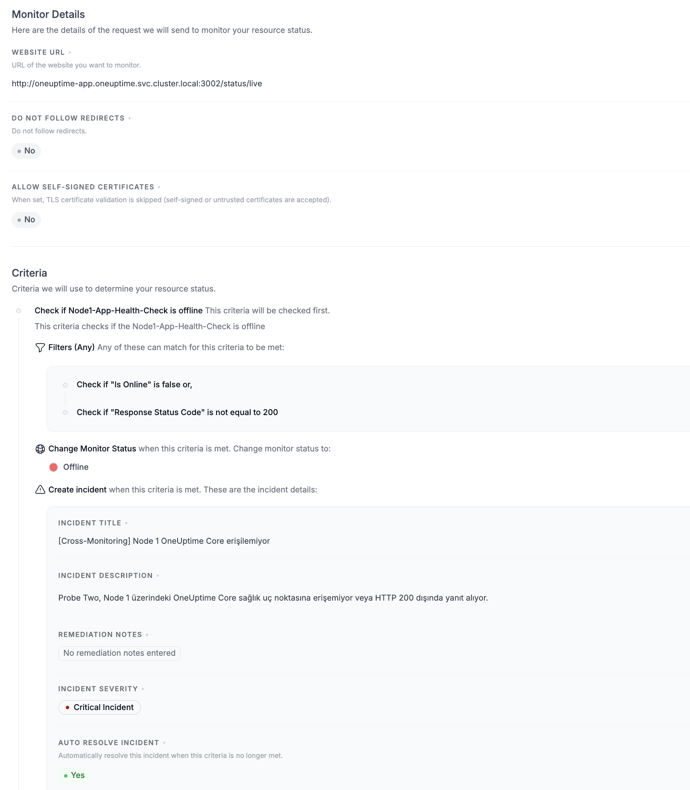
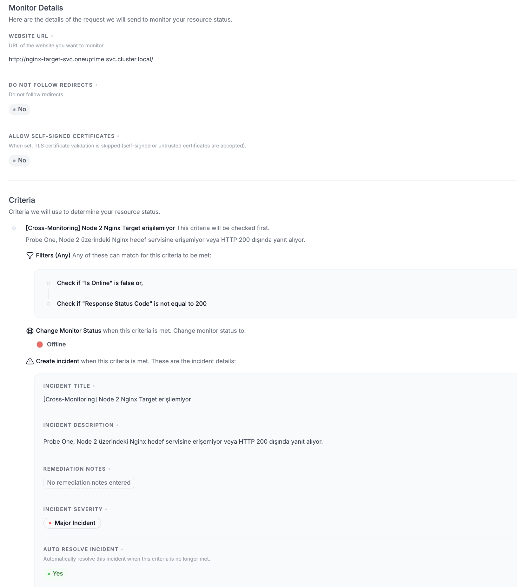

# Aşama 5 — Monitor Kriterleri ve Otomatik Incident'lar

## Amaç

Her cross-monitor başarısızlığında monitor durumunu `Offline` yapmak, otomatik
incident oluşturmak, incident'ı Status Page'de göstermek ve hedef yeniden sağlıklı
olduğunda incident'ı otomatik çözmek.

Bu aşama Website türündeki iki cross-monitor içindir. Yerel TLS sertifikasının
`Expires In Days` kriterleri ve Probe One'a özel DNS yapısı
[Aşama 14 — TLS Certificate Monitor](14-tls-certificate-monitor.md) belgesinde
ayrı anlatılır. TLS monitoründe 7 ve 30 günlük eşikler aynı Offline kartında
birleştirilmemelidir.

## 5.1 Ön koşul: iki monitor

| Monitor | Probe | Hedef |
|---|---|---|
| `Node1-App-Health-Check` | Probe Two / Node 2 | `http://oneuptime-app.oneuptime.svc.cluster.local:3002/status/live` |
| `Node2-Nginx-Health-Check` | Probe One / Node 1 | `http://nginx-target-svc.oneuptime.svc.cluster.local` |

Hazır monitor özet görselleri bu bölümde yardımcı kanıt olarak kullanılabilir:

- `../../img/monitor-node1-app-summary.png`
- `../../img/monitor-node2-nginx-summary.png`
- `../../img/monitor-probes-connected.png`

## 5.2 Kriter sırasının önemi

Monitor kriterleri yukarıdan aşağıya değerlendirilir ve ilk eşleşen kriter sonuç
üretir. Bu nedenle `Offline` kriteri birinci, `Operational` kriteri ikinci sırada
olmalıdır.

### Offline kriteri

Filtre birleşimi **Any** olmalıdır:

```text
Is Online = False
OR
Response Status Code != 200
```

Sonuç:

```text
Change Monitor Status → Offline
Create Incident → Yes
```

`Is Online=False`, bağlantı kurulamadığı ve HTTP status code üretilemediği
durumları yakalar. `Response Status Code != 200` ise erişilebilen fakat başarılı
olmayan HTTP yanıtlarını yakalar.

### Operational kriteri

Filtre birleşimi **All** olmalıdır:

```text
Is Online = True
AND
Response Status Code = 200
```

Sonuç:

```text
Change Monitor Status → Operational
```

Default Monitor Status da `Operational` olarak bırakılabilir.

## 5.3 Node 1 incident kriteri

`Node1-App-Health-Check` monitoründe Offline kriterine aşağıdaki incident
bilgilerini girin:

| Alan | Değer |
|---|---|
| Title | `[Cross-Monitoring] Node 1 OneUptime Core erişilemiyor` |
| Description | `Probe Two, Node 1 üzerindeki OneUptime Core sağlık uç noktasına erişemiyor veya HTTP 200 dışında yanıt alıyor.` |
| Severity | `Critical Incident` |
| Auto Resolve Incident | `Yes` |
| Show Incident on Status Page | `Yes` |



*Şekil 10 — Node 1 monitoründe `Filters (Any)`, Offline durumu, Critical
incident ve `Auto Resolve=Yes` yapılandırması.*

## 5.4 Node 2 incident kriteri

`Node2-Nginx-Health-Check` monitoründe Offline kriterine aşağıdaki değerleri
girin:

| Alan | Değer |
|---|---|
| Title | `[Cross-Monitoring] Node 2 Nginx Target erişilemiyor` |
| Description | `Probe One, Node 2 üzerindeki Nginx hedef servisine erişemiyor veya HTTP 200 dışında yanıt alıyor.` |
| Severity | `Major Incident` |
| Auto Resolve Incident | `Yes` |
| Show Incident on Status Page | `Yes` |



*Şekil 11 — Node 2 monitoründe aynı Offline filtreleri, Major incident ve
`Auto Resolve=Yes` yapılandırması.*

## 5.5 Operational kriterlerini doğrulama

Her iki monitorün ikinci kriterinde şunları doğrulayın:

- Filter condition: `All`
- `Is Online = True`
- `Response Status Code = 200`
- Change Monitor Status: `Operational`

> **Ekran görüntüsü önerisi:** Offline kriterinin birinci, Operational
> kriterinin ikinci sırada göründüğü tam Criteria sayfası. Buraya
> `05-criteria-order-and-operational.png` resmini koyabilirsin.

## 5.6 Auto Resolve davranışını doğru yorumlama

`Auto Resolve Incident=Yes`, hedef hâlâ kapalıyken incident'ı çözmez. Incident,
onu oluşturan Offline kriteri artık eşleşmediğinde, yani monitor sağlıklı sonuca
döndüğünde otomatik çözülür.

Test sırasında incident üzerindeki **Resolve** düğmesine elle basılırsa Recovery
workflow'u çalışabilir; ancak bu, hedef servisin iyileştiğini kanıtlamaz. Gerçek
otomatik çözülme testi için incident'a elle müdahale edilmemelidir.

## Kabul kontrolü

- [ ] İki monitorde Offline kriteri ilk sırada ve `Any` birleşimli.
- [ ] İki monitorde Operational kriteri ikinci sırada ve `All` birleşimli.
- [ ] Node 1 incident severity `Critical`.
- [ ] Node 2 incident severity `Major`.
- [ ] Her iki incident başlığı `[Cross-Monitoring]` ile başlıyor.
- [ ] Auto Resolve ve Status Page görünümü etkin.

Kriterlerin sıralı değerlendirilmesi ve incident'ın kriter eşleşmesi bittiğinde
otomatik çözülmesi OneUptime'ın [Monitor Criteria](https://oneuptime.com/reference/monitor-criteria)
ve [Criteria Incident](https://oneuptime.com/reference/en/criteria-incident)
modelleriyle uyumludur.

Sonraki adım:
[Aşama 6 — Workflow JSON import](06-workflow-json-import.md).
