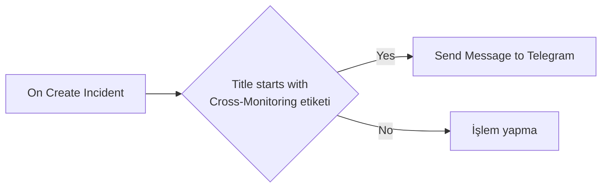
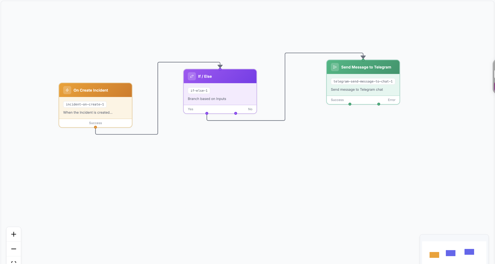
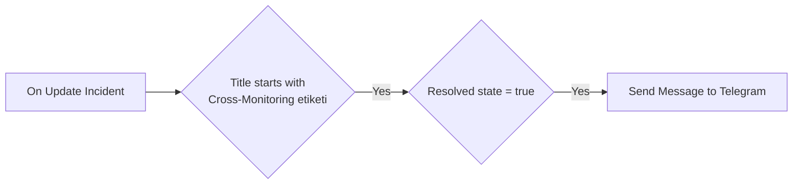
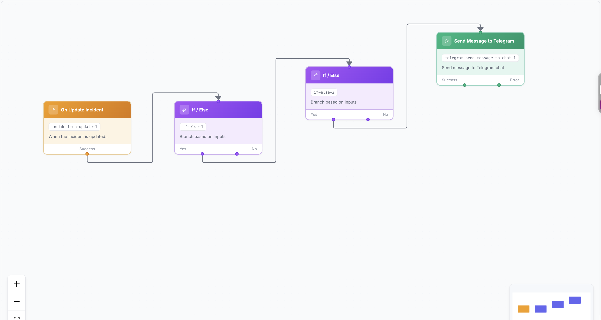

# Aşama 6 — Workflow JSON Dosyalarını İçe Aktarma

## Amaç

Workflow Builder içinde blokları tek tek kurmak yerine, OneUptime `12.0.6` export
şemasına uygun hazırlanmış iki workflow'u JSON olarak içe aktarmak:

- [Incident workflow JSON](../../../workflows/oneuptime-incident-telegram-workflow.json)
- [Recovery workflow JSON](../../../workflows/oneuptime-recovery-telegram-workflow.json)

JSON dosyaları gerçek token veya Chat ID içermez. Yalnızca şu Global Variable
referanslarını taşır:

```text
{{global.variables.TELEGRAM_BOT_TOKEN}}
{{global.variables.TELEGRAM_CHAT_ID}}
```

## 6.1 Import öncesi kontrol

`Project → Workflows → Global Variables` sayfasında şu iki secret değişkenin
mevcut olduğunu doğrulayın:

```text
TELEGRAM_BOT_TOKEN
TELEGRAM_CHAT_ID
```

Global Variables proje dışına export edilmez. Workflow başka projeye import
edilecekse değişkenler hedef projede ayrıca oluşturulmalıdır.

## 6.2 Incident workflow'u import etme

1. `Project → Workflows → Workflows` sayfasını açın.
2. Sayfadaki üç nokta menüsünden **Import JSON** seçeneğini açın.
3. `oneuptime-incident-telegram-workflow.json` dosyasını seçin.
4. Import sonrasında workflow'un listede göründüğünü doğrulayın.

Import adı:

```text
Cross-Monitoring Incident → Telegram (JSON)
```

> **Ekran görüntüsü önerisi:** Workflows listesindeki üç nokta menüsü ve
> `Import JSON` seçeneği. Buraya `06-workflow-import-menu.png` resmini
> koyabilirsin.

## 6.3 Recovery workflow'u import etme

Aynı menüden `oneuptime-recovery-telegram-workflow.json` dosyasını import edin.

Import adı:

```text
Cross-Monitoring Recovery → Telegram (JSON)
```

> **Ekran görüntüsü önerisi:** Import tamamlandıktan sonra iki `(JSON)`
> workflow'un listede göründüğü ekran. Buraya
> `06-two-workflows-imported.png` resmini koyabilirsin.

## 6.4 Import sonrası güvenlik durumu

Import edilen workflow'ların başlangıçta `Disabled/Kapalı` olması beklenir. Bu,
yanlış projedeki kaynaklara veya eksik değişkenlere karşı güvenlik önlemidir.
Workflow'lar kontrol ve test tamamlanmadan etkinleştirilmemelidir.

OneUptime'ın resmî [Workflow Configuration & Safety](https://oneuptime.com/docs/en/workflows/configuration)
dokümantasyonu da import edilen workflow'ların disabled oluşturulduğunu ve
Global Variable değerlerinin JSON dosyasına dahil edilmediğini belirtir.

## 6.5 Incident workflow grafiğini doğrulama

Builder görünümünde beklenen akış:



Kontrol edilecek bileşenler:

- Trigger: `On Create Incident`
- Conditions / If Else: incident title `[Cross-Monitoring]` ile başlıyor
- Yes çıkışı: `Send Message to Telegram`
- Bot Token: `TELEGRAM_BOT_TOKEN` Global Variable
- Chat ID: `TELEGRAM_CHAT_ID` Global Variable



*Şekil 13 — Incident oluşturulduğunda başlık koşulunu kontrol edip Telegram'a
mesaj gönderen üç bileşenli workflow.*

## 6.6 Recovery workflow grafiğini doğrulama

Builder görünümünde beklenen akış:



Kontrol edilecek bileşenler:

- Trigger: `On Update Incident`
- Birinci If Else: başlık `[Cross-Monitoring]` ile başlıyor
- İkinci If Else: `currentIncidentState.isResolvedState == true`
- İkinci Yes çıkışı: `Send Message to Telegram`



*Şekil 14 — Incident güncellendiğinde önce başlığı, ardından Resolved durumunu
kontrol edip Telegram'a mesaj gönderen workflow.*

## Kabul kontrolü

- [ ] İki JSON dosyası hatasız import edildi.
- [ ] İki workflow başlangıçta disabled.
- [ ] Incident grafiğinde üç bileşen var.
- [ ] Recovery grafiğinde dört bileşen var.
- [ ] Telegram alanları Global Variable referansı kullanıyor.
- [ ] JSON veya Builder içinde gerçek credential yazmıyor.

Sonraki adım:
[Aşama 7 — Incident workflow testi](07-incident-telegram-workflow.md).
