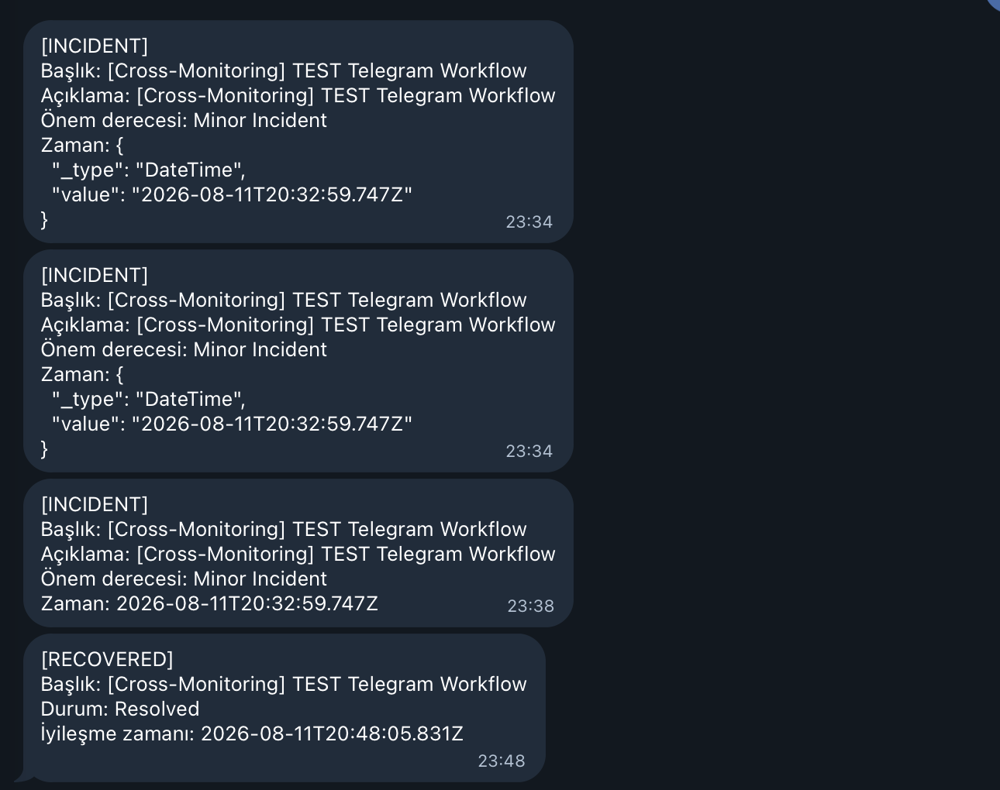

# Aşama 7 — Incident → Telegram Workflow Testi

## Amaç

`[Cross-Monitoring]` etiketiyle oluşturulan bir incident'ın Telegram'a Türkçe
bildirim gönderdiğini ve farklı başlıklara gereksiz bildirim gönderilmediğini
doğrulamak.

## 7.1 Workflow bileşenlerini kontrol etme

`Cross-Monitoring Incident → Telegram (JSON)` workflow'unu açın ve Builder'da
aşağıdaki değerleri doğrulayın.

### Trigger

```text
On Create Incident
```

Trigger'ın incident modelinden şu alanları seçtiğini doğrulayın:

- `title`
- `description`
- `declaredAt`
- `incidentSeverity.name`

### If Else

| Alan | Değer |
|---|---|
| Input 1 | Trigger'dan Incident Title |
| Operator | `starts with` |
| Input 2 | `[Cross-Monitoring]` |

Alan yolu elle yazılmak yerine mümkün olduğunda değer seçicisindeki önceki
component çıktısından seçilmelidir.

### Telegram

Telegram mesaj şablonu:

```text
[INCIDENT]
Başlık: <incident başlığı>
Açıklama: <incident açıklaması>
Önem derecesi: <incident severity adı>
Zaman: <declaredAt.value>
```

Tarih alanında `declaredAt` nesnesinin tamamı değil `declaredAt.value`
kullanılmalıdır. Aksi halde mesajda `_type` ve `value` içeren JSON nesnesi
görünebilir.

## 7.2 Workflow'u test için etkinleştirme

Workflow'u geçici olarak `Enabled/Açık` yapın. Recovery workflow bu aşamada
kapalı kalabilir.

## 7.3 Test incident'ı oluşturma

`Project → Incidents → Declare New Incident` yolunu açın.

| Alan | Değer |
|---|---|
| Title | `[Cross-Monitoring] TEST Telegram Workflow` |
| Description | `[Cross-Monitoring] TEST Telegram Workflow` |
| Severity | `Minor Incident` |
| Initial state | `Identified` veya projenin aktif başlangıç durumu |
| Resources affected | Boş bırakılabilir |
| Change monitor status | Değiştirme |
| Private incident | `No` |

Owner, incident role ve on-call policy bu bağlantı testi için zorunlu değildir.

> **Ekran görüntüsü önerisi:** Test incident formunun Summary ekranı. Buraya
> `07-test-incident-summary.png` resmini koyabilirsin. Gerçek kullanıcı ve ekip
> bilgilerini göstermek zorunda değilsin.

## 7.4 Telegram sonucunu doğrulama

Incident oluşturulduktan sonra Telegram'da şu yapıda mesaj beklenir:

```text
[INCIDENT]
Başlık: [Cross-Monitoring] TEST Telegram Workflow
Açıklama: [Cross-Monitoring] TEST Telegram Workflow
Önem derecesi: Minor Incident
Zaman: <ISO-8601 zaman değeri>
```



*Şekil 16 — İlk denemelerde tarih nesnesinin tamamı görünürken son Incident
mesajında `declaredAt.value` kullanılarak düz ISO-8601 tarih elde edilmiştir.
Aynı görsel, daha sonra gönderilen Recovery test mesajını da gösterir.*

## 7.5 Runs & Logs kontrolü

`Project → Workflows → Runs & Logs` sayfasını açın:

- Run durumu `Success` olmalı.
- Trigger çalışmış olmalı.
- If Else `Yes` çıkışını izlemeli.
- Telegram bileşeni `Success` olmalı.

Incident ve Recovery workflow run kayıtlarının `Success` olduğu örnek Runs &
Logs görünümü Aşama 8'deki Şekil 17'de gösterilmektedir. Secret değerlerini
gösterebilecek ayrıntı panelleri açılmamalıdır.

## Kabul kontrolü

- [ ] Test incident oluşturuldu.
- [ ] Telegram'a tek bir `[INCIDENT]` mesajı ulaştı.
- [ ] Tarih düz ISO-8601 değer olarak göründü.
- [ ] Workflow run sonucu `Success`.
- [ ] Telegram component sonucu `Success`.

Workflow trigger ve component yaklaşımı OneUptime'ın [Workflows
Overview](https://oneuptime.com/docs/en/workflows/index) ve [Workflow
Components](https://oneuptime.com/docs/en/workflows/components) modeliyle
uyumludur.

Test incident'ı henüz silmeyin; aynı kayıt Recovery testinde kullanılacaktır.

Sonraki adım:
[Aşama 8 — Recovery workflow testi](08-recovery-telegram-workflow.md).
