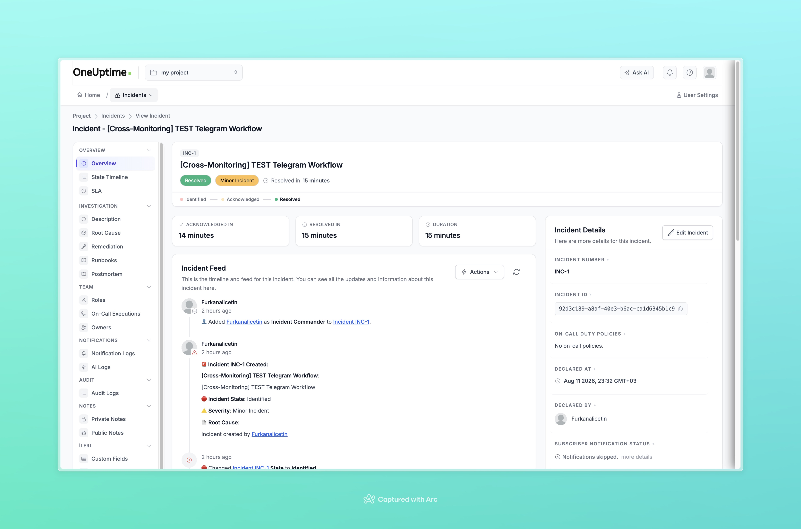
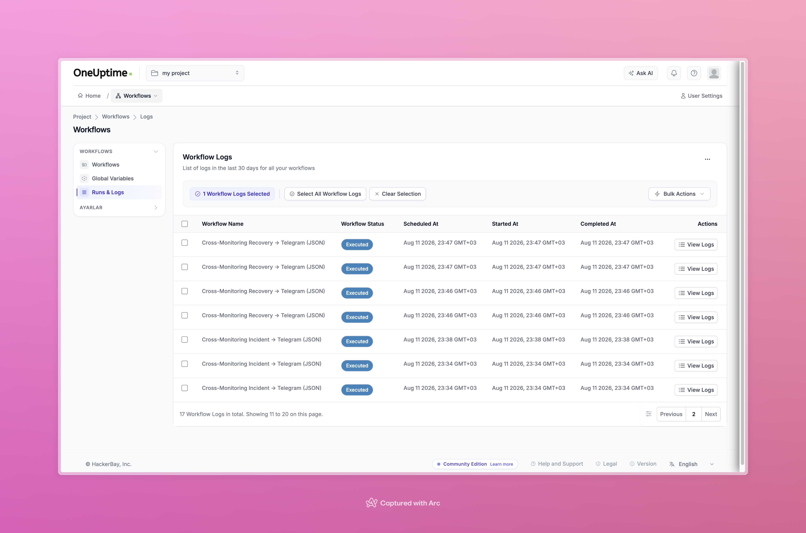

# Aşama 8 — Recovery → Telegram Workflow Testi

## Amaç

Cross-monitoring incident durumu `Resolved` olduğunda Telegram'a yalnızca bir
iyileşme mesajı gönderildiğini doğrulamak.

## 8.1 Recovery workflow'u kontrol etme

`Cross-Monitoring Recovery → Telegram (JSON)` workflow'unu açın.

### Trigger

```text
On Update Incident
```

Trigger'ın en az şu alanları sağladığını doğrulayın:

- `title`
- `updatedAt`
- `currentIncidentState.name`
- `currentIncidentState.isResolvedState`

### Birinci If Else

```text
Incident title starts with [Cross-Monitoring]
```

### İkinci If Else

```text
currentIncidentState.isResolvedState == true
```

Birinci koşul yalnızca bu proje akışına ait incident'ları seçer. İkinci koşul,
incident üzerindeki her güncellemenin recovery mesajına dönüşmesini engeller.

### Telegram mesajı

```text
[RECOVERED]
Başlık: <incident başlığı>
Durum: <incident state adı>
İyileşme zamanı: <updatedAt.value>
```

Tarih için `updatedAt.value` alanını kullanın.

## 8.2 Recovery workflow'u etkinleştirme

Recovery workflow'u `Enabled/Açık` yapın. Incident workflow da açık kalabilir;
Incident workflow yalnızca `On Create` olayını dinlediği için mevcut kaydın
çözülmesinde yeniden `[INCIDENT]` göndermemelidir.

## 8.3 Test incident'ını çözme

Aşama 7'de oluşturulan incident'ı açın:

```text
[Cross-Monitoring] TEST Telegram Workflow
```

Incident state değerini `Resolved` yapın ve kaydedin.



*Şekil 15 — Manuel test incident'ının `Resolved` durumuna geçtiği OneUptime
incident ayrıntı ekranı.*

## 8.4 Telegram mesajını doğrulama

Beklenen mesaj biçimi:

```text
[RECOVERED]
Başlık: [Cross-Monitoring] TEST Telegram Workflow
Durum: Resolved
İyileşme zamanı: <ISO-8601 zaman değeri>
```

Telegram'daki `[RECOVERED]` test mesajı Aşama 7'deki Şekil 16'nın alt kısmında
gösterilmektedir.

## 8.5 Runs & Logs kontrolü

Recovery run kaydında şu akış görülmelidir:

```text
On Update Incident
→ title koşulu: Yes
→ resolved koşulu: Yes
→ Telegram: Success
```



*Şekil 17 — Incident ve Recovery workflow'larının yürütüldüğünü gösteren Runs &
Logs listesi.*

## Kabul kontrolü

- [ ] Recovery workflow etkinleştirildi.
- [ ] Test incident `Resolved` yapıldı.
- [ ] Telegram'a tek bir `[RECOVERED]` mesajı geldi.
- [ ] Mesaj durumu `Resolved` gösterdi.
- [ ] Tarih düz ISO-8601 değer olarak göründü.
- [ ] Workflow run sonucu `Success`.

Sonraki adım:
[Aşama 9 — Workflow'ları etkinleştirme](09-workflow-etkinlestirme.md).
