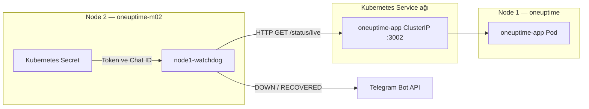

# Aşama 10 — Node 2 Bağımsız Watchdog Kurulumu

## Amaç

Node 1 üzerindeki OneUptime Core tamamen çalışamaz hale geldiğinde, OneUptime
Workflow motoruna ihtiyaç duymadan Node 2'den Telegram bildirimi göndermek.

Kullanılan manifest:
[node1-watchdog.yaml](../../node1-watchdog.yaml)

## 10.1 Neden ikinci bir bildirim yolu gerekir?

Normal akışta probe sonucu OneUptime Core'a ulaşır, Core incident oluşturur ve
Workflow Telegram mesajı gönderir. Core'un kendisi kapandığında bu zincirin
tamamı kullanılamayabilir.

Watchdog zinciri OneUptime uygulama sürecinden bağımsızdır:



## 10.2 Manifestin davranışı

| Özellik | Değer |
|---|---|
| Deployment | `node1-watchdog` |
| Replica | `1` |
| Container image | `curlimages/curl:8.12.1` |
| Çalışacağı node | `oneuptime-m02` |
| Node selector | `app=oneuptime-probe` |
| Kontrol aralığı | `30` saniye |
| DOWN eşiği | `3` ardışık hata |
| RECOVERED eşiği | `2` ardışık başarı |
| Hedef | `http://${ONEUPTIME_APP_SERVICE_HOST}:3002/status/live` |
| Telegram Secret | `oneuptime-watchdog-telegram` |

Üç başarısız kontrol yaklaşık 90 saniye içinde `[WATCHDOG] DOWN`, iki başarılı
kontrol ise yaklaşık 60 saniye içinde `[WATCHDOG] RECOVERED` üretir.

Watchdog tek süreç içinde `UP`/`DOWN` durumu tutar. `DOWN` durumuna geçtikten
sonra her 30 saniyede yeni mesaj göndermez; aynı arızaya ait tekrar bildirimleri
bastırır.

## 10.3 DNS bağımsızlığı

Core hedefi Kubernetes DNS adıyla değil, Kubernetes'in Service için enjekte
ettiği `ONEUPTIME_APP_SERVICE_HOST` ClusterIP ortam değişkeniyle izlenir.

Telegram için manifestte:

```yaml
dnsPolicy: None
dnsConfig:
  nameservers:
    - 1.1.1.1
    - 8.8.8.8
```

bulunur. Böylece Telegram alan adının çözülmesi Node 1 üzerindeki cluster DNS
sürecine bağımlı olmaz. `enableServiceLinks: true`, Service ClusterIP ortam
değişkeninin poda aktarılmasını sağlar.

## 10.4 Güvenlik ayarları

Manifest aşağıdaki korumaları kullanır:

- ServiceAccount token otomatik mount edilmez.
- Root olmayan sayısal kullanıcı ve grup: `10001`.
- Root filesystem salt okunur.
- Linux capabilities tamamen düşürülür.
- Privilege escalation kapalıdır.
- `RuntimeDefault` seccomp profili kullanılır.
- Telegram bilgileri `secretKeyRef` ile alınır.

Gerçek token ve Chat ID manifestte bulunmaz.

## 10.5 Ön koşulları kontrol etme

```bash
kubectl get node oneuptime-m02 --show-labels

kubectl get secret oneuptime-watchdog-telegram \
  -n oneuptime

kubectl get svc oneuptime-app \
  -n oneuptime
```

Node üzerinde `app=oneuptime-probe`, Secret üzerinde `DATA=2` ve Service üzerinde
HTTP `3002` portu bulunmalıdır.

Beklenen terminal çıktısının özet yapısı:

```text
NAME              STATUS   ROLES    AGE     VERSION   LABELS
oneuptime-m02     Ready    <none>   <age>   <version> app=oneuptime-probe,...

NAME                            TYPE     DATA   AGE
oneuptime-watchdog-telegram     Opaque   2      <age>

NAME              TYPE        CLUSTER-IP     PORT(S)    AGE
oneuptime-app     ClusterIP   <cluster-ip>   3002/TCP   <age>
```

## 10.6 Manifesti uygulama

Repo kökünde çalıştırın:

```bash
kubectl apply -f node1-watchdog.yaml

kubectl rollout status deployment/node1-watchdog \
  -n oneuptime \
  --timeout=5m
```

Beklenen çıktı:

```text
configmap/node1-watchdog-script unchanged
deployment.apps/node1-watchdog configured
Waiting for deployment "node1-watchdog" rollout to finish: 0 of 1 updated replicas are available...
deployment "node1-watchdog" successfully rolled out
```

## 10.7 Pod yerleşimini ve logu doğrulama

```bash
kubectl get pods -n oneuptime \
  -l app.kubernetes.io/name=node1-watchdog \
  -o wide

kubectl logs deployment/node1-watchdog \
  -n oneuptime \
  --tail=30
```

Beklenen terminal çıktısının yapısı:

```text
NAME                               READY   STATUS    RESTARTS   AGE   IP             NODE
node1-watchdog-<pod-hash>          1/1     Running   0          <age> <pod-ip>       oneuptime-m02

<UTC-time> Watchdog started. Target: http://<oneuptime-app-cluster-ip>:3002/status/live
```

Başlangıç logu hedef ClusterIP'yi ve `/status/live` yolunu göstermelidir.

## 10.8 Gerçek bağlantı testi

Watchdog podundan Node 1 sağlık endpoint'ine doğrudan istek gönderin:

```bash
kubectl exec -n oneuptime deployment/node1-watchdog -- \
  sh -c 'curl -sS -o /dev/null -w "%{http_code}\n" --max-time 10 "http://${ONEUPTIME_APP_SERVICE_HOST}:3002/status/live"'
```

Beklenen çıktı:

```text
200
```

Sağlıklı başlangıçta Telegram'a watchdog mesajı gelmemesi normaldir. Watchdog
yalnızca durum değişikliğinde bildirim gönderir.

## 10.9 `CreateContainerConfigError` çözümü

Eski bir manifest kopyasında pod şu hatayı verebilir:

```text
container has runAsNonRoot and image has non-numeric user (curl_user)
```

`curlimages/curl` imajı kullanıcıyı adla tanımladığı için kubelet root olmayan
kullanıcıyı sayısal olarak doğrulayamaz. Güncel manifestte çözüm hazırdır:

```yaml
runAsNonRoot: true
runAsUser: 10001
runAsGroup: 10001
```

Güncel dosyayı yeniden uygulayıp rollout'u bekleyin:

```bash
kubectl apply -f node1-watchdog.yaml
kubectl rollout status deployment/node1-watchdog -n oneuptime --timeout=5m
```

Düzeltme sonrasında beklenen çıktı:

```text
deployment.apps/node1-watchdog configured
deployment "node1-watchdog" successfully rolled out
```

## Kabul kontrolü

- [ ] Watchdog Deployment tek replica çalışıyor.
- [ ] Pod `oneuptime-m02` üzerinde.
- [ ] Pod `1/1 Running` ve restart sayısı normal.
- [ ] Başlangıç logu doğru ClusterIP ve path gösteriyor.
- [ ] Pod içinden sağlık isteği HTTP `200` döndürüyor.
- [ ] Secret değerleri manifest veya loglarda görünmüyor.
- [ ] Sağlıklı durumda gereksiz Telegram bildirimi gelmiyor.

Sonraki adım:
[Aşama 11 — Nginx kontrollü kesinti testi](11-nginx-kesinti-testi.md).
