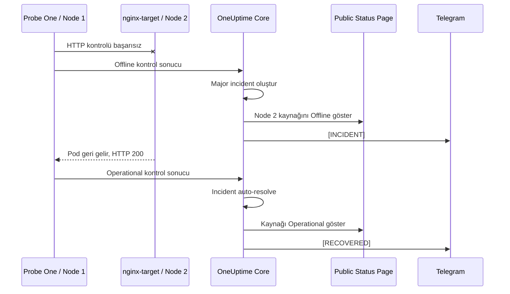
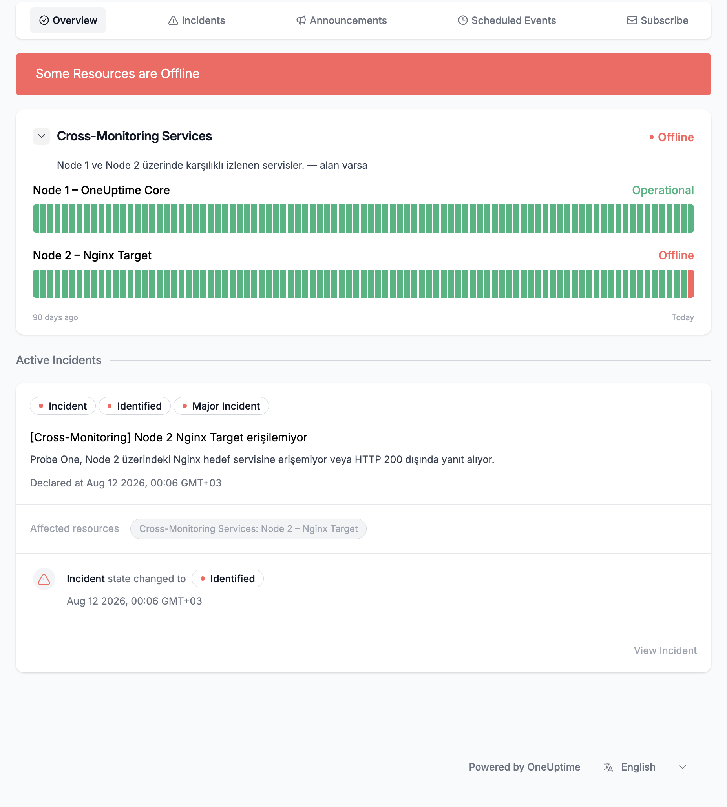
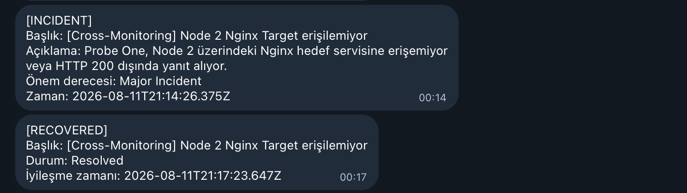

# Aşama 11 — Nginx Kontrollü Kesinti ve Auto-Resolve Testi

## Amaç

Node 1'deki Probe One'ın Node 2 üzerindeki manuel Nginx hedefinin kesintisini
algıladığını ve aşağıdaki zincirin uçtan uca çalıştığını doğrulamak:



`nginx-target` OneUptime Helm chart'ının parçası değildir. Test için manuel
oluşturulan bağımsız bir poddur; bu nedenle silindikten sonra elle yeniden
oluşturulur. `nginx-target-svc` Service nesnesi test boyunca yerinde kalır.

## 11.1 Sağlıklı başlangıcı doğrulama

```bash
kubectl get pod nginx-target -n oneuptime -o wide
kubectl get svc nginx-target-svc -n oneuptime

kubectl get endpointslice -n oneuptime \
  -l kubernetes.io/service-name=nginx-target-svc \
  -o wide
```

Beklenenler:

- Pod `1/1 Running`.
- Pod `oneuptime-m02` üzerinde.
- Service portu `80`.
- EndpointSlice içinde Nginx pod IP'si.
- `Node2-Nginx-Health-Check` ve Status Page kaynağı `Operational`.

Beklenen terminal çıktısının özet yapısı:

```text
NAME           READY   STATUS    RESTARTS   AGE     IP            NODE
nginx-target   1/1     Running   0          <age>   <target-ip>   oneuptime-m02

NAME               TYPE        CLUSTER-IP     PORT(S)   AGE
nginx-target-svc   ClusterIP   <cluster-ip>   80/TCP    <age>

NAME                        ADDRESSTYPE   PORTS   ENDPOINTS    AGE
nginx-target-svc-<suffix>   IPv4          80      <target-ip>  <age>
```

## 11.2 Nginx podunu geçici olarak silme

```bash
kubectl delete pod nginx-target -n oneuptime
```

Beklenen çıktı:

```text
pod "nginx-target" deleted
```

Bu komut yalnızca manuel test podunu siler. Service silinmez. Pod bir Deployment
tarafından yönetilmediği için kendiliğinden yeniden oluşmaz.

Endpoint'in boşaldığını kontrol edin:

```bash
kubectl get endpointslice -n oneuptime \
  -l kubernetes.io/service-name=nginx-target-svc \
  -o wide
```

Kesinti sırasında beklenen çıktı yapısı:

```text
NAME                       ADDRESSTYPE   PORTS     ENDPOINTS   AGE
nginx-target-svc-<suffix>  IPv4          <unset>   <unset>     <age>
```

## 11.3 Kesinti sonuçlarını doğrulama

Bir veya birkaç monitor periyodu bekleyin. Beklenenler:

- `Node2-Nginx-Health-Check` → `Offline`
- Node 2 Status Page kaynağı → `Offline`
- Genel Status Page durumu → `Some Resources are Offline`
- Yeni incident severity → `Major Incident`
- Incident başlığı → `[Cross-Monitoring] Node 2 Nginx Target erişilemiyor`
- Telegram mesajı → `[INCIDENT]`
- Incident workflow run sonucu → `Success`

Node 1 Core ve Node 1 Status Page kaynağı `Operational` kalmalıdır. Bağımsız
watchdog yalnızca Core'u izlediği için bu Nginx kesintisinde `[WATCHDOG] DOWN`
göndermemelidir.



*Şekil 24 — Node 1 Operational kalırken Node 2 Nginx kaynağı Offline olmuş ve
public Status Page üzerinde Major incident görüntülenmiştir.*

Node 2 için gelen `[INCIDENT]` mesajı, iyileşme sonrasında gelen `[RECOVERED]`
mesajıyla birlikte Şekil 25'te gösterilmektedir.

## 11.4 Test sırasında incident'ı elle çözmeyin

Incident açıkken **Resolve** düğmesine basılmamalıdır. Elle `Resolved` yapmak
Recovery workflow'unu çalıştırır ve Nginx hâlâ yokken `[RECOVERED]` mesajı
üretebilir. Bu mesaj yalnızca incident state değişikliğini gösterir; servis
iyileşmesini kanıtlamaz.

Gerçek auto-resolve kanıtı için incident açık bırakılmalı ve hedef pod geri
getirilmelidir.

## 11.5 Nginx podunu geri getirme

```bash
kubectl run nginx-target \
  --image=nginx \
  --restart=Never \
  --overrides='{"spec":{"nodeSelector":{"app":"oneuptime-probe"}}}' \
  -n oneuptime
```

Beklenen çıktı:

```text
pod/nginx-target created
```

Podun hazır olmasını bekleyin:

```bash
kubectl wait --for=condition=Ready pod/nginx-target \
  -n oneuptime \
  --timeout=5m
```

Beklenen çıktı:

```text
pod/nginx-target condition met
```

Yerleşim ve endpoint'i doğrulayın:

```bash
kubectl get pod nginx-target -n oneuptime -o wide

kubectl get endpointslice -n oneuptime \
  -l kubernetes.io/service-name=nginx-target-svc \
  -o wide
```

Beklenen terminal çıktısının özet yapısı:

```text
NAME           READY   STATUS    RESTARTS   AGE     IP            NODE
nginx-target   1/1     Running   0          <age>   <target-ip>   oneuptime-m02

NAME                        ADDRESSTYPE   PORTS   ENDPOINTS    AGE
nginx-target-svc-<suffix>   IPv4          80      <target-ip>  <age>
```

## 11.6 Otomatik iyileşmeyi doğrulama

Birkaç monitor periyodu sonra beklenenler:

- `Node2-Nginx-Health-Check` → `Operational`
- Incident → otomatik `Resolved`
- Telegram → `[RECOVERED]`
- Status Page → `All Resources are Operational`
- Recovery workflow run sonucu → `Success`



*Şekil 25 — Nginx kesintisinde gönderilen `[INCIDENT]` ve monitor iyileştikten
sonra gönderilen `[RECOVERED]` mesajları.*

Status Page'in tekrar tamamen yeşil olduğu ve geçmiş çizgisindeki kısa kırmızı
kesinti diliminin korunduğu nihai görünüm Aşama 13'teki Şekil 30'da
gösterilmektedir.

## Sorun giderme

| Belirti | Kontrol |
|---|---|
| Monitor Offline olmadı | Probe One bağlantısı, monitor URL'si ve kontrol periyodu |
| Service var ama endpoint yok | `nginx-target` pod label'ı ve node durumu |
| Incident oluşmadı | Offline kriteri, kriter sırası ve `Create Incident` ayarı |
| Telegram incident gelmedi | Incident workflow Enabled mı, Runs & Logs sonucu |
| Incident auto-resolve olmadı | Nginx HTTP 200 mü, Operational kriteri ve Auto Resolve ayarı |
| Hedef hâlâ kapalıyken RECOVERED geldi | Incident büyük olasılıkla elle Resolved yapıldı; testi temiz bir incident ile tekrarla |

## Kabul kontrolü

- [ ] Nginx silindiğinde Node 2 monitor Offline oldu.
- [ ] Major incident Status Page'de göründü.
- [ ] `[INCIDENT]` Telegram mesajı geldi.
- [ ] Incident'a elle müdahale edilmedi.
- [ ] Nginx aynı node selector ile geri getirildi.
- [ ] Monitor Operational oldu.
- [ ] Incident otomatik çözüldü.
- [ ] `[RECOVERED]` Telegram mesajı geldi.
- [ ] Watchdog bu testte gereksiz DOWN mesajı göndermedi.

Sonraki adım:
[Aşama 12 — Node 1 Core kesinti testi](12-node1-core-kesinti-testi.md).
