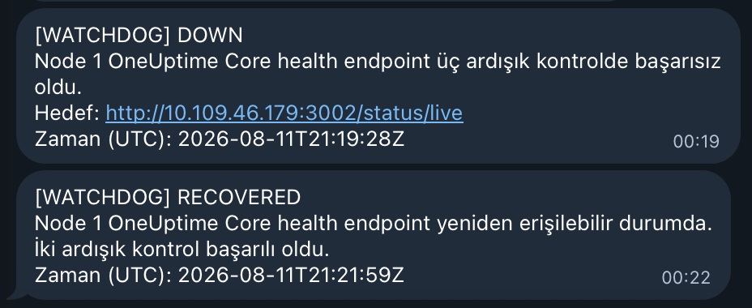

# Aşama 12 — Node 1 Core Kesintisi ve Watchdog Testi

## Amaç

OneUptime Core uygulaması çalışamazken OneUptime Workflow'a bağımlı olmayan Node 2
watchdog'un Telegram'a DOWN ve RECOVERED mesajlarını gönderdiğini doğrulamak.

Gerçek control-plane node container'ı durdurulmaz. Güvenli ve geri alınabilir test
için yalnızca `oneuptime-app` Deployment replica sayısı geçici olarak `0` yapılır.

## 12.1 Test öncesi kontroller

App ve watchdog'un sağlıklı olduğunu doğrulayın:

```bash
kubectl get deployment oneuptime-app node1-watchdog \
  -n oneuptime

kubectl get pods -n oneuptime \
  -l app.kubernetes.io/name=node1-watchdog \
  -o wide
```

Beklenen terminal çıktısının özet yapısı:

```text
NAME               READY   UP-TO-DATE   AVAILABLE   AGE
oneuptime-app      1/1     1            1           <age>
node1-watchdog     1/1     1            1           <age>

NAME                              READY   STATUS    RESTARTS   AGE     IP          NODE
node1-watchdog-<pod-hash>         1/1     Running   0          <age>   <pod-ip>    oneuptime-m02
```

App Deployment'ını yeniden ölçekleyebilecek HPA veya KEDA ScaledObject olup
olmadığını kontrol edin:

```bash
kubectl get hpa,scaledobject -n oneuptime
```

Bu laboratuvar kurulumunda beklenen çıktı:

```text
No resources found in oneuptime namespace.
```

App'i yöneten bir autoscaler varsa test planı gözden geçirilmeden devam
edilmemelidir.

Watchdog bağlantısının başlangıçta HTTP `200` aldığını kontrol edin:

```bash
kubectl exec -n oneuptime deployment/node1-watchdog -- \
  sh -c 'curl -sS -o /dev/null -w "%{http_code}\n" --max-time 10 "http://${ONEUPTIME_APP_SERVICE_HOST}:3002/status/live"'
```

Beklenen çıktı:

```text
200
```

## 12.2 OneUptime App'i geçici olarak durdurma

```bash
kubectl scale deployment/oneuptime-app \
  -n oneuptime \
  --replicas=0
```

Beklenen çıktı:

```text
deployment.apps/oneuptime-app scaled
```

App podunun kapandığını doğrulayın:

```bash
kubectl get pods -n oneuptime -l app=oneuptime-app
```

Pod tamamen kapandıktan sonraki beklenen çıktı:

```text
No resources found in oneuptime namespace.
```

Test sırasında Minikube profili, control-plane node veya veri tabanı podları
durdurulmamalıdır. `kubectl` erişimi açık kalmalıdır.

## 12.3 DOWN bildirimini doğrulama

Watchdog üç ardışık başarısız kontrol bekler. Başlangıç zamanına bağlı olarak
Telegram mesajı yaklaşık 60–90 saniye içinde gelebilir; tasarlanan üst beklenti
yaklaşık 90 saniyedir.

Beklenen Telegram mesaj başlığı:

```text
[WATCHDOG] DOWN
```

Logları kontrol etmek için:

```bash
kubectl logs deployment/node1-watchdog \
  -n oneuptime \
  --tail=50
```

Loglarda üç başarısız kontrol, Telegram gönderimi ve `State changed to DOWN`
satırları görülmelidir. Aynı arıza devam ederken her 30 saniyede yeni DOWN mesajı
gelmemelidir.

Beklenen log yapısı:

```text
<UTC-time> Health check 1/3 failed.
<UTC-time> Health check 2/3 failed.
<UTC-time> Health check 3/3 failed.
<UTC-time> Telegram notification sent.
<UTC-time> State changed to DOWN; duplicate alerts are suppressed.
```

Bu sırada OneUptime arayüzünün veya port-forward bağlantısının yanıt vermemesi
normaldir. OneUptime Core kapalı olduğu için normal `[INCIDENT]` workflow mesajı
gelmeyebilir; bağımsız watchdog'un varlık nedeni budur.

## 12.4 OneUptime App'i geri getirme

DOWN mesajı doğrulandıktan sonra Deployment'ı tekrar tek replica yapın:

```bash
kubectl scale deployment/oneuptime-app \
  -n oneuptime \
  --replicas=1
```

Beklenen çıktı:

```text
deployment.apps/oneuptime-app scaled
```

Rollout'u bekleyin:

```bash
kubectl rollout status deployment/oneuptime-app \
  -n oneuptime \
  --timeout=5m
```

Beklenen çıktı:

```text
deployment "oneuptime-app" successfully rolled out
```

Podun Node 1 üzerinde hazır olduğunu doğrulayın:

```bash
kubectl get pods -n oneuptime \
  -l app=oneuptime-app \
  -o wide
```

Beklenen çıktı yapısı:

```text
NAME                              READY   STATUS    RESTARTS   AGE   IP         NODE
oneuptime-app-<pod-hash>          1/1     Running   0          <age> <pod-ip>   oneuptime
```

## 12.5 RECOVERED bildirimini doğrulama

Watchdog iki ardışık başarılı kontrol bekler. App hazır olduktan sonra en fazla
yaklaşık 60 saniye içinde şu Telegram mesajı gelmelidir:

```text
[WATCHDOG] RECOVERED
```

Loglarda beklenen akış:

```text
Recovery check 1/2 succeeded.
Recovery check 2/2 succeeded.
Telegram notification sent.
State changed to UP.
```



*Şekil 27 — Node 2 watchdog'un gönderdiği `[WATCHDOG] DOWN` ve iki başarılı
kontrol sonrasındaki `[WATCHDOG] RECOVERED` mesajları.*

## 12.6 OneUptime iyileşmesini doğrulama

App geri geldikten sonra:

- OneUptime arayüzü yeniden açılmalı.
- `Node1-App-Health-Check` tekrar `Operational` olmalı.
- Status Page yeniden tamamen yeşil olmalı.
- Probe'lar yeniden sonuç gönderebilmeli.

Core kapalıyken sonuçların işlenememesi nedeniyle gecikmiş bir OneUptime incident
veya workflow mesajı oluşabilir. Bağımsız watchdog mesajıyla birlikte ikinci bir
OneUptime mesajı alınması seçilen yedeklilik politikasında kabul edilir.

## Acil geri alma

Test sırasında beklenmeyen bir sorun oluşursa aşağıdaki komut App'i geri getirir:

```bash
kubectl scale deployment/oneuptime-app -n oneuptime --replicas=1
kubectl rollout status deployment/oneuptime-app -n oneuptime --timeout=5m
```

## Kabul kontrolü

- [ ] App `0` replica yapıldığında watchdog hedefi başarısız oldu.
- [ ] Yaklaşık 90 saniye içinde `[WATCHDOG] DOWN` geldi.
- [ ] Aynı arıza için yinelenen DOWN mesajları gelmedi.
- [ ] App tekrar `1` replica yapıldı ve rollout tamamlandı.
- [ ] İki başarılı kontrol sonrasında `[WATCHDOG] RECOVERED` geldi.
- [ ] OneUptime arayüzü, monitorler ve Status Page iyileşti.

Sonraki adım:
[Aşama 13 — Son kabul kontrolleri](13-son-kabul-kontrolleri.md).
