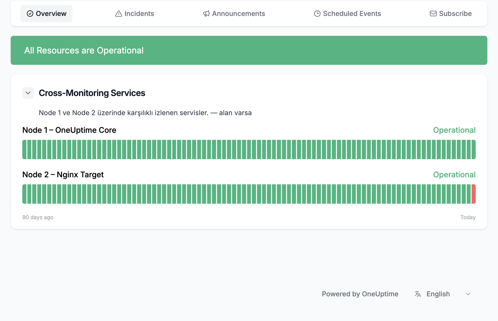
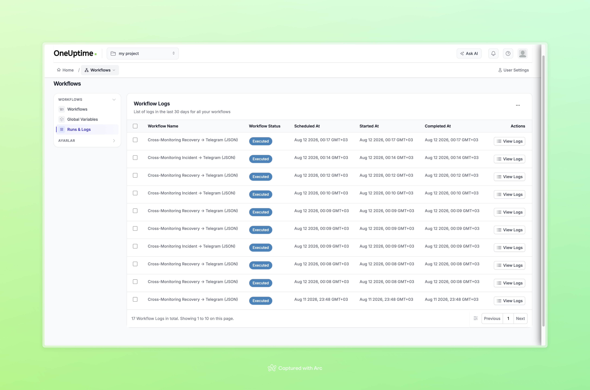

# Aşama 13 — Son Kabul ve Güvenlik Kontrolleri

## Amaç

Kurulum ve kontrollü kesinti testleri tamamlandıktan sonra tüm bileşenlerin
sağlıklı duruma döndüğünü, iki bildirim yolunun çalıştığını ve gerçek
credential'ların dokümana sızmadığını doğrulamak.

## 13.1 Node ve pod durumları

```bash
kubectl get nodes -L app
kubectl get pods -n oneuptime -o wide
```

Beklenen temel yerleşim:

| Bileşen | Beklenen node |
|---|---|
| OneUptime Core ve `oneuptime-app` | `oneuptime` |
| Probe One | `oneuptime` |
| Probe Two | `oneuptime-m02` |
| `nginx-target` | `oneuptime-m02` |
| `node1-watchdog` | `oneuptime-m02` |

Uygulama podları `Running` ve hazır olmalıdır. Tamamlanması amaçlanan migration
Job podunun `Completed` olması hata değildir.

Beklenen terminal çıktısının özet yapısı:

```text
NAME                              READY   STATUS      NODE
oneuptime-app-<hash>              1/1     Running     oneuptime
oneuptime-probe-one-<hash>        1/1     Running     oneuptime
oneuptime-probe-two-<hash>        1/1     Running     oneuptime-m02
nginx-target                      1/1     Running     oneuptime-m02
node1-watchdog-<hash>             1/1     Running     oneuptime-m02
oneuptime-migrate-<revision>      0/1     Completed   oneuptime
```

## 13.2 Deployment ve Helm durumu

```bash
helm status oneuptime -n oneuptime

kubectl get deployment oneuptime-app \
  oneuptime-probe-one \
  oneuptime-probe-two \
  node1-watchdog \
  -n oneuptime
```

Kontroller:

- Helm release durumu `deployed`.
- `oneuptime-app` tekrar `1/1` hazır.
- Her iki probe hazır.
- Watchdog `1/1` hazır.

Beklenen özet:

```text
STATUS: deployed

NAME                   READY   UP-TO-DATE   AVAILABLE
oneuptime-app          1/1     1            1
oneuptime-probe-one    1/1     1            1
oneuptime-probe-two    1/1     1            1
node1-watchdog         1/1     1            1
```

## 13.3 Service ve endpoint durumu

```bash
kubectl get svc -n oneuptime \
  oneuptime-app \
  oneuptime-nginx \
  nginx-target-svc

kubectl get endpointslice -n oneuptime \
  -l kubernetes.io/service-name=oneuptime-app \
  -o wide

kubectl get endpointslice -n oneuptime \
  -l kubernetes.io/service-name=nginx-target-svc \
  -o wide
```

Hem `oneuptime-app` hem de `nginx-target-svc` için hazır endpoint bulunmalıdır.

Beklenen çıktı yapısı:

```text
SERVICE             PORT(S)             READY ENDPOINT
oneuptime-app       3002/TCP            <pod-ip>:3002
oneuptime-nginx     80/TCP               <nginx-ip>:80
nginx-target-svc    80/TCP               <target-ip>:80
```

## 13.4 Monitor ve Status Page kabulü

OneUptime arayüzünde:

- `Node1-App-Health-Check` → `Operational`
- `Node2-Nginx-Health-Check` → `Operational`
- Her iki probe → `Connected`

Public Status Page üzerinde:

- Genel durum → `All Resources are Operational`
- `Node 1 – OneUptime Core` → `Operational`
- `Node 2 – Nginx Target` → `Operational`
- Kontrollü Nginx kesintisine ait geçmiş dilimi görünür olabilir.
- Aktif test incident'ı kalmamalıdır.



*Şekil 30 — Test sonunda iki kaynak tekrar Operational durumdadır. Node 2
geçmişindeki kısa kırmızı dilim kontrollü Nginx kesintisinin kaydıdır.*

## 13.5 Workflow kabulü

Workflows listesinde yalnızca doğrulanmış iki akış açık olmalıdır:

```text
Cross-Monitoring Incident → Telegram    Enabled
Cross-Monitoring Recovery → Telegram    Enabled
```

Runs & Logs altında en az şu başarılı kanıtlar bulunmalıdır:

- Manuel test incident oluşturma → Incident workflow `Success`
- Manuel test incident çözme → Recovery workflow `Success`
- Nginx kesintisi → Incident workflow `Success`
- Nginx iyileşmesi → Recovery workflow `Success`



*Şekil 21 — Nginx kesinti ve iyileşme testleri sırasında yürütülen Incident ve
Recovery workflow kayıtları.*

## 13.6 Telegram kabulü

Telegram sohbetinde aşağıdaki mesaj çiftleri doğrulanmalıdır:

### OneUptime Workflow yolu

```text
[INCIDENT]  Node 2 Nginx Target erişilemiyor
[RECOVERED] Node 2 Nginx Target erişilemiyor
```

### Bağımsız watchdog yolu

```text
[WATCHDOG] DOWN
[WATCHDOG] RECOVERED
```

Nginx kesintisinde watchdog mesajı gelmemesi; Core kesintisinde ise OneUptime
Workflow mesajının gecikmesi veya hiç gelmemesi mimari olarak normaldir.

Gerçek Nginx kesintisinin `[INCIDENT]`/`[RECOVERED]` mesaj çifti Aşama 11'deki
Şekil 25'te; `[WATCHDOG] DOWN`/`[WATCHDOG] RECOVERED` çifti ise Aşama 12'deki
Şekil 27'de gösterilmektedir.

## 13.7 Watchdog son durum kontrolü

```bash
kubectl logs deployment/node1-watchdog \
  -n oneuptime \
  --tail=100
```

Beklenen log geçmişinde:

- Başlangıç hedefi
- Üç başarısız kontrol
- `State changed to DOWN`
- İki recovery kontrolü
- `State changed to UP`

bulunabilir. Son durum `UP` olmalı ve pod çalışmaya devam etmelidir.

Beklenen log akışının özeti:

```text
<UTC-time> Watchdog started. Target: http://<cluster-ip>:3002/status/live
<UTC-time> Health check 1/3 failed.
<UTC-time> Health check 2/3 failed.
<UTC-time> Health check 3/3 failed.
<UTC-time> State changed to DOWN; duplicate alerts are suppressed.
<UTC-time> Recovery check 1/2 succeeded.
<UTC-time> Recovery check 2/2 succeeded.
<UTC-time> State changed to UP.
```

## 13.8 Secret güvenliği

Yalnızca metadata ve anahtar sayılarını kontrol edin:

```bash
kubectl get secret oneuptime-watchdog-telegram \
  -n oneuptime
```

Beklenen `DATA` değeri `2`'dir. `kubectl get secret ... -o yaml` çıktısı rapora
eklenmemelidir.

```text
NAME                            TYPE     DATA   AGE
oneuptime-watchdog-telegram     Opaque   2      <age>
```

Dokümantasyon klasöründe Telegram bot token biçimine benzeyen yanlışlıkla
eklenmiş bir değer olup olmadığını kontrol etmek için:

```bash
rg -n '[0-9]{8,12}:[A-Za-z0-9_-]{30,}' docs/instructions
```

Beklenen sonuç boş çıktıdır.

Ekran görüntülerini ayrıca görsel olarak kontrol edin; metin araması PNG içindeki
yazıları denetleyemez.

## 13.9 Credential açığa çıkarsa

Bot token herhangi bir sohbet, Git dosyası, terminal kaydı veya ekran görüntüsünde
açığa çıkarsa:

1. BotFather üzerinden mevcut token'ı iptal edip yenisini üretin.
2. OneUptime `TELEGRAM_BOT_TOKEN` secret Global Variable değerini güncelleyin.
3. Kubernetes `oneuptime-watchdog-telegram` Secret değerini Aşama 3'teki güvenli
   etkileşimli komutla güncelleyin.
4. Ortam değişkeninin yeni Secret değerini alması için watchdog'u yeniden
   başlatın:

```bash
kubectl rollout restart deployment/node1-watchdog -n oneuptime
kubectl rollout status deployment/node1-watchdog -n oneuptime --timeout=5m
```

5. Güvenli bir Telegram test mesajıyla iki yolu yeniden doğrulayın.

## 13.10 Nihai kabul matrisi

| Kontrol | Başarılı sonuç |
|---|---|
| Status Page | İki kaynak Operational |
| Node 2 Nginx kesintisi | Major incident + `[INCIDENT]` |
| Nginx geri dönüşü | Auto-resolve + `[RECOVERED]` |
| Node 1 App kesintisi | Yaklaşık 90 saniyede `[WATCHDOG] DOWN` |
| Node 1 App geri dönüşü | İki başarılı kontrolde `[WATCHDOG] RECOVERED` |
| Incident Workflow | Enabled, son run `Success` |
| Recovery Workflow | Enabled, son run `Success` |
| Watchdog | Node 2 üzerinde `1/1 Running` |
| Kubernetes Secret | Doğru namespace, iki anahtar |
| Credential güvenliği | Markdown ve görsellerde gerçek değer yok |

## Tamamlanma ölçütü

Aşağıdakilerin tamamı sağlandığında çalışma bitmiş kabul edilir:

- [ ] Tüm temel podlar hazır, migration Job tamamlanmış.
- [ ] İki monitor Online/Operational.
- [ ] Public Status Page tamamen yeşil.
- [ ] Incident ve Recovery workflow'ları açık ve başarılı.
- [ ] Nginx gerçek auto-resolve testi başarılı.
- [ ] Watchdog DOWN ve RECOVERED testi başarılı.
- [ ] Watchdog Node 2 üzerinde çalışıyor.
- [ ] Secret değerleri hiçbir doküman veya görselde bulunmuyor.
