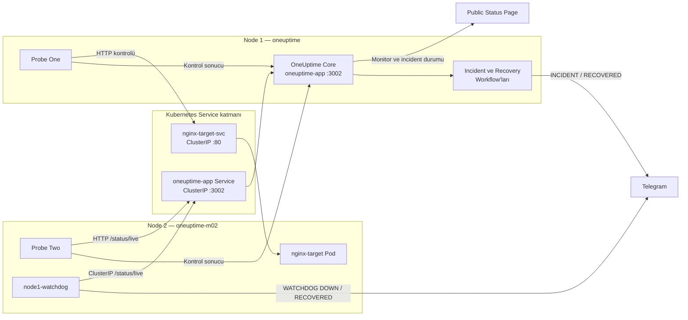
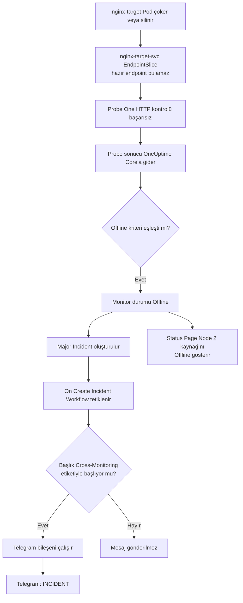
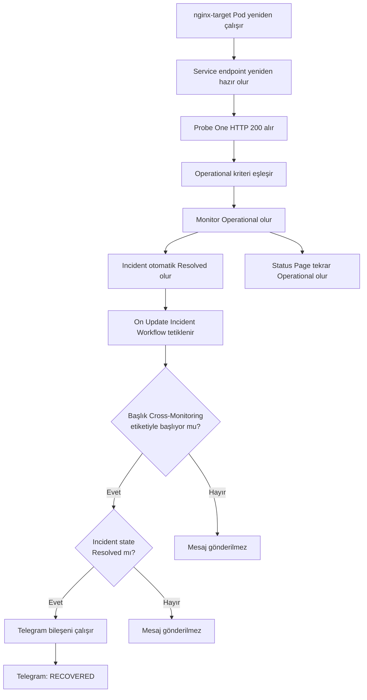
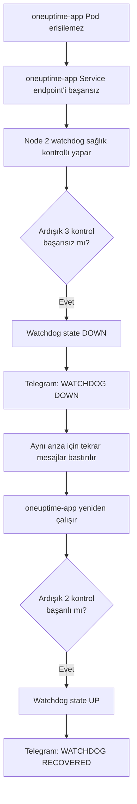

# OneUptime Cross-Monitoring, Incident ve Telegram Bildirim Akışı

Bu klasör, iki node'lu Minikube ortamında kurulan OneUptime cross-monitoring,
public Status Page, otomatik incident, Telegram Workflow ve bağımsız watchdog
yapısını baştan sona açıklar.

Tam uygulama sırası için:
[Aşama 1–13 — Baştan Sona Uygulama Sırası](01-13-uygulama-sirasi.md)

## 1. Kurulan yapı ne yapıyor?

Sistem iki yönlü izleme gerçekleştirir:

- Node 1 üzerindeki **Probe One**, Node 2'deki Nginx hedefini izler.
- Node 2 üzerindeki **Probe Two**, Node 1'deki OneUptime Core sağlık
  endpoint'ini izler.
- OneUptime monitor kriterleri arızayı `Offline` olarak değerlendirir ve incident
  oluşturur.
- Incident ve Recovery Workflow'ları Telegram'a bildirim gönderir.
- Node 1 üzerindeki OneUptime Core tamamen çalışamazsa Node 2'deki bağımsız
  watchdog, OneUptime Workflow motoruna ihtiyaç duymadan Telegram'a mesaj yollar.

## 2. Genel mimari



## 3. Önemli sıra: Workflow doğrudan pod çökmesiyle tetiklenmez

Pod çöktüğünde ilk tetiklenen bileşen Workflow değildir. Normal olay sırası
şöyledir:

```text
Pod veya servis erişilemez olur
→ Probe kontrolü başarısız olur
→ Probe sonucu OneUptime Core'a gönderilir
→ Monitor kriteri sonucu Offline olarak değerlendirir
→ OneUptime incident oluşturur
→ On Create Incident Workflow tetiklenir
→ Telegram'a [INCIDENT] mesajı gider
```

Yani Workflow, Kubernetes pod olayını doğrudan dinlemez. Workflow'un tetikleyicisi
OneUptime içinde oluşturulan **Incident** kaydıdır.

## 4. Bir hedef pod çöktüğünde tam olay akışı

Aşağıdaki örnek, Node 2'deki `nginx-target` podunun çalışamaz hale gelmesini
gösterir.



Adım adım:

1. `nginx-target` podu çöker, silinir veya HTTP `200` vermeyi bırakır.
2. Kubernetes Service, sağlıklı endpoint bulamaz.
3. Node 1'deki Probe One hedefe yaptığı HTTP isteğinde başarısız olur.
4. Probe sonucu OneUptime Core'a iletir.
5. Monitorün ilk kriteri değerlendirilir:
   `Is Online=False OR Response Status Code!=200`.
6. `Node2-Nginx-Health-Check` durumu `Offline` olur.
7. OneUptime, Major severity ile şu incident'ı oluşturur:
   `[Cross-Monitoring] Node 2 Nginx Target erişilemiyor`.
8. Incident public Status Page üzerinde gösterilir.
9. `On Create Incident` trigger'ı Incident Workflow'u başlatır.
10. Workflow başlığın `[Cross-Monitoring]` ile başladığını doğrular.
11. Telegram component'i `[INCIDENT]` mesajını gönderir.

Beklenen Telegram mesaj yapısı:

```text
[INCIDENT]
Başlık: [Cross-Monitoring] Node 2 Nginx Target erişilemiyor
Açıklama: <incident açıklaması>
Önem derecesi: Major Incident
Zaman: <incident oluşturulma zamanı>
```

## 5. Pod veya servis düzeldiğinde iyileşme akışı



Adım adım:

1. Hedef pod yeniden çalışır ve Service endpoint listesine eklenir.
2. Probe sonraki kontrolde HTTP `200` alır.
3. `Is Online=True AND Response Status Code=200` kriteri eşleşir.
4. Monitor `Operational` durumuna döner.
5. Offline kriterinin oluşturduğu incident, `Auto Resolve=Yes` olduğu için
   otomatik `Resolved` olur.
6. `On Update Incident` Recovery Workflow'unu tetikler.
7. İlk koşul `[Cross-Monitoring]` başlığını doğrular.
8. İkinci koşul `currentIncidentState.isResolvedState=true` değerini doğrular.
9. Telegram'a `[RECOVERED]` mesajı gönderilir.
10. Status Page tekrar tamamen yeşil görünür.

Beklenen mesaj yapısı:

```text
[RECOVERED]
Başlık: [Cross-Monitoring] Node 2 Nginx Target erişilemiyor
Durum: Resolved
İyileşme zamanı: <incident güncellenme zamanı>
```

### Auto Resolve hakkında önemli not

Incident açıkken **Resolve** düğmesine elle basılırsa Recovery Workflow çalışır;
ancak bu, hedef podun gerçekten düzeldiğini kanıtlamaz. Gerçek iyileşme testinde
incident'a dokunulmaz, hedef geri getirilir ve incident'ın monitor kriteri
tarafından otomatik çözülmesi beklenir.

## 6. OneUptime Core podu çökerse neden normal Workflow yetmez?

`oneuptime-app` çalışmıyorsa:

- Probe sonuçları Core'a iletilemeyebilir.
- Monitor değerlendirmesi yapılamayabilir.
- Incident oluşturulamayabilir.
- Workflow motoru çalışamayabilir.
- Status Page ve arayüz erişilemez olabilir.

Bu nedenle Node 2'de bağımsız `node1-watchdog` bulunur.

## 7. Core kesintisinde watchdog akışı



Adım adım:

1. Node 1 üzerindeki `oneuptime-app` sağlık endpoint'i yanıt vermez.
2. Node 2 watchdog, Kubernetes tarafından enjekte edilen
   `ONEUPTIME_APP_SERVICE_HOST` ClusterIP adresini kontrol eder.
3. Kontrol 30 saniyede bir yapılır.
4. Üç ardışık hata sonrasında watchdog kendi durumunu `DOWN` yapar.
5. OneUptime Core'a ihtiyaç duymadan Telegram Bot API'ye
   `[WATCHDOG] DOWN` gönderir.
6. Aynı arıza devam ederken tekrar mesaj göndermez.
7. App yeniden çalıştığında watchdog başarılı kontrolleri sayar.
8. İki ardışık başarı sonrasında `[WATCHDOG] RECOVERED` gönderir.
9. Watchdog durumunu yeniden `UP` yapar.

Watchdog hedefe Kubernetes DNS adıyla değil doğrudan Service ClusterIP ortam
değişkeniyle ulaşır. Telegram alan adını ise bağımsız dış DNS sunucularıyla
çözer. Böylece Node 1'deki Core ve cluster DNS süreçlerine olan bağımlılık
azaltılır.

## 8. İki bildirim yolunun farkı

| Özellik | OneUptime Workflow yolu | Bağımsız watchdog yolu |
|---|---|---|
| Çalıştığı yer | OneUptime Core | Node 2 |
| Tetikleyici | Incident create/update | HTTP sağlık kontrol sonucu |
| Kapsam | `[Cross-Monitoring]` incident'ları | Node 1 Core sağlık endpoint'i |
| DOWN eşiği | Monitor kriteri | 3 ardışık hata |
| Recovery eşiği | Monitor Operational + auto-resolve | 2 ardışık başarı |
| Mesajlar | `[INCIDENT]`, `[RECOVERED]` | `[WATCHDOG] DOWN`, `[WATCHDOG] RECOVERED` |
| Core kapalıyken çalışır mı? | Garanti değil | Evet |

Aynı Core arızası için watchdog mesajına ek olarak gecikmiş bir OneUptime
incident mesajı gelmesi mümkündür. Bu, seçilen yedeklilik yaklaşımında kabul
edilir.

## 9. Kullanılan dosyalar

- [Incident Workflow JSON](../../../workflows/oneuptime-incident-telegram-workflow.json)
- [Recovery Workflow JSON](../../../workflows/oneuptime-recovery-telegram-workflow.json)
- [Node 1 Watchdog manifesti](../../../node1-watchdog.yaml)
- [Aşama 1–13 uygulama sırası](01-13-uygulama-sirasi.md)

## 10. Ayrıntılı dokümantasyon

| Konu | Doküman |
|---|---|
| Telegram bot ve Chat ID | [Aşama 1](01-telegram-botu-ve-chat-id.md) |
| OneUptime Global Variables | [Aşama 2](02-oneuptime-global-variables.md) |
| Kubernetes Secret | [Aşama 3](03-kubernetes-telegram-secret.md) |
| Public Status Page | [Aşama 4](04-public-status-page.md) |
| Monitor kriterleri | [Aşama 5](05-monitor-kriterleri-ve-incidentlar.md) |
| Workflow import | [Aşama 6](06-workflow-json-import.md) |
| Incident Workflow testi | [Aşama 7](07-incident-telegram-workflow.md) |
| Recovery Workflow testi | [Aşama 8](08-recovery-telegram-workflow.md) |
| Workflow etkinleştirme | [Aşama 9](09-workflow-etkinlestirme.md) |
| Watchdog kurulumu | [Aşama 10](10-node1-watchdog-kurulumu.md) |
| Nginx kesinti testi | [Aşama 11](11-nginx-kesinti-testi.md) |
| Core kesinti testi | [Aşama 12](12-node1-core-kesinti-testi.md) |
| Son kabul kontrolleri | [Aşama 13](13-son-kabul-kontrolleri.md) |

## 11. Kullanılan kanıt görselleri ve terminal çıktıları

Numaralı arayüz ve Telegram görselleri ilgili aşamaların içinde kullanılmıştır:

- Public Status Page ve kaynak eşleştirmeleri: Aşama 4
- Monitor kriterleri: Aşama 5
- Incident ve Recovery Workflow Builder grafikleri: Aşama 6
- Telegram test mesajları ile Workflow Runs & Logs: Aşama 7–8
- Nginx kesintisi, incident ve recovery kanıtları: Aşama 11
- Watchdog DOWN/RECOVERED mesajları: Aşama 12
- Son Status Page ve Workflow run durumu: Aşama 13

Terminal sonuçları görsel olarak saklanmamıştır. Kubernetes kaynak adları, pod
hash'leri, IP adresleri ve yaş bilgileri her kurulumda değişebildiği için ilgili
aşamalarda `text` kod bloklarıyla **beklenen çıktı yapısı** verilmiştir. Dinamik
alanlar `<pod-hash>`, `<pod-ip>`, `<age>` ve `<UTC-time>` gibi yer tutucularla
gösterilir.

Görseller `docs/tr/instructions/images/` altına eklenmeden önce token, Chat ID,
secret içerikleri, kullanıcı adı ve oturum bilgileri sansürlenmelidir. Kullanılan
numaraların tam eşleştirmesi için [görsel indeksine](images/README.md) bakın.
