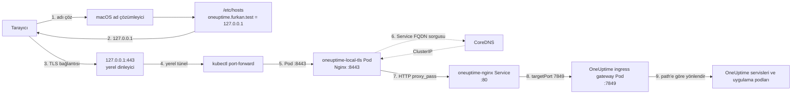
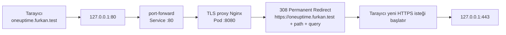
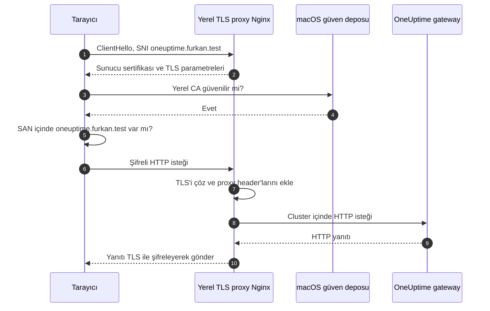
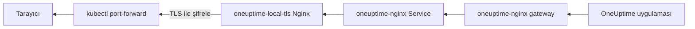
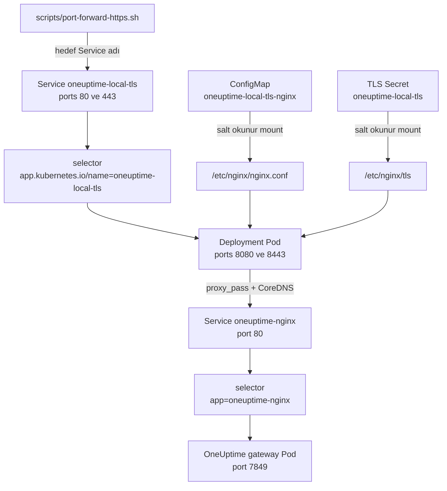
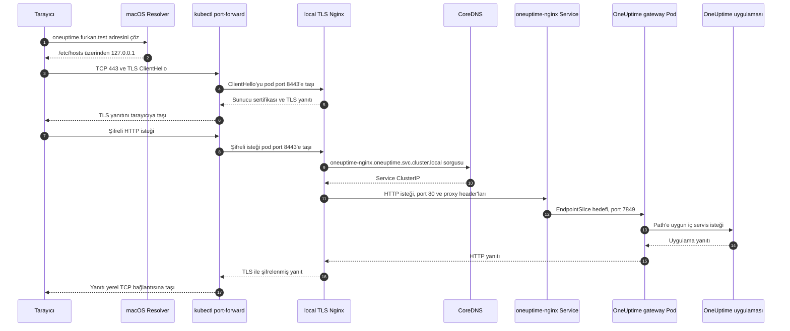

# Yerel DNS, TLS Proxy ve Uygulama Trafik Akışı

Bu belge, tarayıcıya yalnızca `oneuptime.furkan.test` yazıldığı andan OneUptime
uygulamasının yanıt verdiği ana kadar isteğin geçtiği bütün katmanları açıklar.
Kurulum ve sertifika üretme komutlarının ayrıntılı günlüğü için
[Yerel HTTPS ve TLS Sertifikası](LOCAL_HTTPS.md) belgesine bakın.

Probe One'ın aynı sertifikayı cluster içinden izlemesi tarayıcı yolundan
farklıdır. `hostAliases`, ClusterIP ve kesintisiz Probe One rollout ayrıntıları
[TLS Certificate Monitor İçin Probe One Ağ Yapılandırması](TLS_CERTIFICATE_MONITOR_PROBE_ONE.md)
belgesinde açıklanır.

## 1. En kısa özet

Güncel kullanıcı adresi:

```text
https://oneuptime.furkan.test
```

HTTPS isteğinin ana yolu şöyledir:



Bu zincirde iki farklı ad çözümleme vardır:

1. Mac üzerindeki `/etc/hosts`, `oneuptime.furkan.test` adını `127.0.0.1`
   adresine çevirir.
2. TLS proxy podu içindeki CoreDNS, Kubernetes adı olan
   `oneuptime-nginx.oneuptime.svc.cluster.local` değerini Service ClusterIP'sine
   çevirir.

> `/etc/hosts` kaydı teknik olarak bir DNS sunucusu değildir. İşletim
> sisteminin DNS sorgusundan önce kullanabildiği yerel bir ad çözümleme
> kaynağıdır. Bu nedenle kayıt yalnızca bu Mac için geçerlidir.

## 2. Port yazmadan erişim nasıl çalışıyor?

URL'de port yoksa protokolün varsayılan portu kullanılır:

| URL | Kullanılan TCP portu |
|---|---:|
| `http://oneuptime.furkan.test` | `80` |
| `https://oneuptime.furkan.test` | `443` |

`scripts/port-forward-https.sh` her iki portu da açar:

```bash
sudo /opt/homebrew/bin/kubectl \
  --kubeconfig /Users/macbook/.kube/config \
  --context oneuptime \
  --namespace oneuptime \
  port-forward service/oneuptime-local-tls 80:80 443:443
```

Mac üzerinde `80` ve `443`, 1024'ten küçük ayrıcalıklı portlardır. Bu nedenle
port-forward işlemi `sudo` ile başlatılır. Betik root kullanıcısının farklı bir
kubeconfig aramasını önlemek için normal kullanıcının kubeconfig yolunu açıkça
verir.

### Kullanıcı yalnızca alan adını yazarsa

Tarayıcı önce HTTP denemeyi seçerse aşağıdaki yol çalışır:



Nginx kuralı `$request_uri` kullandığı için path ve query string kaybolmaz:

```nginx
return 308 https://oneuptime.furkan.test$request_uri;
```

Örneğin:

```text
http://oneuptime.furkan.test/test-path?check=1
```

şu adrese yönlenir:

```text
https://oneuptime.furkan.test/test-path?check=1
```

Tarayıcı doğrudan HTTPS'i seçerse HTTP yönlendirme adımı atlanır ve bağlantı
doğrudan `127.0.0.1:443` üzerinden başlar.

## 3. Katman katman istek yolu

### 3.1 Tarayıcı ve macOS ad çözümleme

Mac'teki kayıt:

```text
127.0.0.1 oneuptime.furkan.test
```

Kontrol komutu ve doğrulanan çıktı:

```bash
dscacheutil -q host -a name oneuptime.furkan.test
```

```text
name: oneuptime.furkan.test
ip_address: 127.0.0.1
```

Burada dış DNS'e veya internete gidilmez. `127.0.0.1`, isteği aynı Mac'e geri
döndüren loopback adresidir.

`.test` alanı test kullanımı için ayrılmış özel kullanım alanıdır. Rastgele bir
`.furkan` son eki `/etc/hosts` ile çalışabilirdi; ancak standart ve çakışma riski
daha düşük olduğu için `oneuptime.furkan.test` seçildi. Gerçek public alan olan
`oneuptime.com` yerelde ezilmedi.

### 3.2 Yerel TCP dinleyicileri ve port-forward

Port-forward işlemi Mac üzerinde iki dinleyici açar:

```text
127.0.0.1:80   -> oneuptime-local-tls Service port 80
127.0.0.1:443  -> oneuptime-local-tls Service port 443
```

Komutta hedef `service/oneuptime-local-tls` olsa da paket normal bir
ClusterIP/kube-proxy yoluyla Service'e gönderilmez. `kubectl` şu işlemleri yapar:

1. Service selector'ından uygun podu bulur.
2. Service portunu podun `targetPort` değerine çevirir.
3. Kubernetes API sunucusu üzerinden seçilen poda bir port-forward akışı açar.
4. Yerel TCP bağlantısındaki baytları bu akış üzerinden pod portuna taşır.

Bu ayrım hata ayıklarken önemlidir: yerel port-forward çalışırken
`oneuptime-local-tls` Service ClusterIP yoluna paket göndermek zorunda değildir;
ama Service selector'ı, port tanımı ve seçilebilir hazır pod yine doğru olmalıdır.

### 3.3 `oneuptime-local-tls` Service ve pod portları

Port dönüşümü:

| Kullanıcı tarafı | Service portu | Service `targetPort` | Pod container portu | Görev |
|---:|---:|---|---:|---|
| `80` | `80` | `http-redirect` | `8080` | HTTP'yi HTTPS'e yönlendirir |
| `443` | `443` | `https` | `8443` | TLS'i sonlandırır ve reverse proxy yapar |

Service selector'ı:

```text
app.kubernetes.io/name=oneuptime-local-tls
```

Bu selector, aynı label'a sahip TLS proxy podunu seçer. Pod root olmadan UID/GID
`101` ile çalıştığı için container içinde ayrıcalıksız `8080` ve `8443`
portlarını dinler.

### 3.4 TLS el sıkışması



Sertifika Secret'ı pod içine salt okunur bağlanır:

```text
Secret oneuptime-local-tls
  tls.crt -> /etc/nginx/tls/tls.crt
  tls.key -> /etc/nginx/tls/tls.key
```

Sertifikanın SAN alanları:

```text
DNS:oneuptime.furkan.test
DNS:localhost
IP:127.0.0.1
IP:::1
```

TLS yalnızca tarayıcı ile `oneuptime-local-tls` proxy arasında sonlandırılır.
Proxy ile OneUptime'ın cluster içi gateway'i arasındaki bu laboratuvar bağlantısı
HTTP'dir. Bu kurulum uçtan uca servisler arası TLS veya service mesh sağlamaz.

### 3.5 Yerel `nginx.conf` reverse proxy işlemi

Aktif dosya: [`k8s/local-tls/nginx.conf`](../../../k8s/local-tls/nginx.conf)

Temel upstream kuralı:

```nginx
location / {
  proxy_pass http://oneuptime-nginx.oneuptime.svc.cluster.local:80;
  proxy_http_version 1.1;
  proxy_set_header Host $http_host;
  proxy_set_header X-Real-IP $remote_addr;
  proxy_set_header X-Forwarded-For $proxy_add_x_forwarded_for;
  proxy_set_header X-Forwarded-Host $http_host;
  proxy_set_header X-Forwarded-Proto https;
  proxy_set_header Upgrade $http_upgrade;
  proxy_set_header Connection $connection_upgrade;
}
```

Bu blok üç ana iş yapar:

1. TLS'ten çözülmüş HTTP isteğini OneUptime gateway Service'ine gönderir.
2. Dışarıdaki gerçek şema ve host bilgisini proxy header'larıyla korur.
3. WebSocket/upgrade bağlantılarının çalışabilmesi için gerekli header'ları
   geçirir.

| Header | Gönderilen değer | Neden gerekli? |
|---|---|---|
| `Host` | `oneuptime.furkan.test` | OneUptime'ın doğru virtual host/domain davranışını seçmesi |
| `X-Forwarded-Proto` | `https` | Uygulamanın dış isteği HTTPS olarak bilmesi ve HTTP URL üretmemesi |
| `X-Forwarded-Host` | `oneuptime.furkan.test` | Dışarıdan görünen host bilgisini korumak |
| `X-Forwarded-For` | mevcut zincire istemci adresini ekler | Proxy zincirini loglamak |
| `X-Real-IP` | Nginx'in gördüğü kaynak adres | Uygulama loglarına kaynak bilgisi vermek |
| `Upgrade` ve `Connection` | istemciden gelen upgrade bilgisi | WebSocket gibi uzun bağlantıları desteklemek |

Port-forward gerçek ağ kaynağını soyutlayabildiği için uygulama tarafındaki IP
header'ı her zaman fiziksel kullanıcı IP'si olarak değerlendirilmemelidir.

### 3.6 Cluster içi DNS ve OneUptime gateway Service'i

TLS proxy şu FQDN'i kullanır:

```text
oneuptime-nginx.oneuptime.svc.cluster.local
│               │         │   └─ cluster domain
│               │         └──── Service DNS bölümü
│               └────────────── namespace
└────────────────────────────── Service adı
```

Podun DNS resolver'ı bu adı CoreDNS'e sorar. CoreDNS, `oneuptime-nginx`
Service'inin ClusterIP adresini döndürür. Service veri düzlemi de isteği hazır
EndpointSlice içindeki gateway poduna iletir:

```text
oneuptime-nginx Service :80 -> oneuptime-nginx Pod :7849
```

Canlı kontrolde görülen port eşleşmeleri:

| Kubernetes nesnesi | Service portu | Pod hedefi |
|---|---:|---:|
| `oneuptime-local-tls` | `80` | `8080` |
| `oneuptime-local-tls` | `443` | `8443` |
| `oneuptime-nginx` | `80` | `7849` |
| `oneuptime-nginx` | `443` | `7850` |
| `oneuptime-app` | `3002` | `3002` |

Yerel TLS proxy, OneUptime gateway'in `443 -> 7850` yolunu kullanmaz. Daha önce
bu portta TCP bağlantısı kurulsa da geçerli TLS oturumu oluşmadığı görüldüğü için
sertifikayı yöneten ayrı proxy, gateway'in çalışan HTTP `80 -> 7849` yoluna
bağlanır.

### 3.7 Ingress mi, Nginx mi, reverse proxy mi?

Bu kurulumda Kubernetes `Ingress` API nesnesi yoktur. Canlı kontrolün çıktısı:

```text
No resources found in oneuptime namespace.
```

İsimler benzer olsa da roller farklıdır:

| Bileşen | Rol |
|---|---|
| `oneuptime-local-tls` Nginx | Mac'e en yakın edge TLS termination ve reverse proxy |
| `oneuptime-nginx` | OneUptime chart'ının kendi ingress gateway uygulaması |
| Kubernetes `Ingress` nesnesi | Bu laboratuvarda kullanılmıyor |
| Ingress Controller | Bu trafik yolu için ayrıca kurulmadı |

OneUptime chart'ındaki [`oneuptime/templates/nginx.yaml`](../../../oneuptime/templates/nginx.yaml)
gateway Deployment ve Service nesnelerini üretir. Gateway'in ayrıntılı path
kuralları container imajı tarafından çalışma anında hazırlanır; yerel
`k8s/local-tls/nginx.conf` bu kuralları tekrar etmez, bütün path'leri gateway'e
devreder.

### 3.8 Gateway'den uygulamaya

`oneuptime-nginx` podu URL path ve host bilgisine göre isteği uygun OneUptime
servisine gönderir. Örneğin dashboard içeriği ve API/health istekleri aynı dış
alan adından gelebilir fakat gateway arkasında farklı uygulama işlevlerine
yönlenebilir.

Yanıt aynı zincirin tersinden döner:



## 4. Kubernetes nesnelerinin birbirine bağlanması



## 5. Gerçek bir HTTPS isteğinin numaralı sırası



## 6. DNS aşamasında karşılaşılan gerçek problemler

| Problem | Görülen belirti | Kök neden | Uygulanan çözüm |
|---|---|---|---|
| `/etc/hosts` ekleme komutunun ilk AppleScript denemesi başarısız oldu | `syntax error: A real number can’t go after this "\\". (-2740)` | AppleScript içine gömülen shell komutunun kaçış karakterleri hatalıydı | Sistem dosyasının değişmediği doğrulandı; idempotent geçici shell helper ile kayıt eklendi, helper silindi |
| Yönetici yetki penceresi bekledi | Komut çıktı üretmeden bekledi | `/etc/hosts` ve düşük portlar yönetici yetkisi ister | macOS yetki penceresi onaylandı; betikler yetki gereken adımı açıkça gösterir hale getirildi |
| Portsuz HTTPS için `443` açılamadı | `bind: permission denied` ve `unable to listen on any of the requested ports` | macOS'ta `443` ayrıcalıklı porttur | Port-forward `sudo` ve açık `--kubeconfig` ile başlatıldı |
| Yeni port-forward yalnızca `80` portunu açabildi | HTTPS tarafında connection reset/refused görüldü | Önceki root port-forward süreci `443` portunu tutuyordu | `ps` ve `netstat` ile yalnızca bu çalışma sırasında oluşturulan eski PID `62030` bulundu, kapatıldı ve iki port birlikte yeniden açıldı |
| Redirect test URL'si ilk komutta çalışmadı | `zsh:1: no matches found: http://oneuptime.furkan.test/test-path?check=1` | zsh, tırnaksız `?` karakterini glob olarak yorumladı | URL tek tırnak içine alındı |
| Rollout sonrası port-forward koptu | `lost connection to pod` | Bağlı olunan eski TLS proxy podu rollout sırasında silindi | Rollout tamamlandıktan sonra port-forward yeniden başlatıldı |
| Ad başka cihazlarda çözülmedi | Diğer cihazda domain bulunamadı | `/etc/hosts` yalnızca bu Mac'tedir; ortak DNS değildir | Tek makine kapsamı dokümante edildi; başka cihazlar için DNS/hosts ve CA güveni gerektiği belirtildi |
| Alan adı seçimi belirsizdi | `.furkan` veya `oneuptime.com` seçenekleri değerlendirildi | `.furkan` ayrılmış değildir; `oneuptime.com` gerçek public alandır | Test için ayrılmış `.test` altında `oneuptime.furkan.test` kullanıldı |

Bu sorunların çalıştırılan tüm komutları ve çıktıları
[LOCAL_HTTPS.md](LOCAL_HTTPS.md) içindeki uygulama günlüğünde ayrıca bulunur.

## 7. Katmana göre sorun giderme

### 7.1 Ad çözümleme

```bash
dscacheutil -q host -a name oneuptime.furkan.test
```

Beklenen adres `127.0.0.1` olmalıdır. Yanlışsa:

```bash
grep -n 'oneuptime.furkan.test' /etc/hosts
```

### 7.2 HTTP yönlendirmesi

```bash
curl -I 'http://oneuptime.furkan.test/test-path?check=1'
```

Beklenen temel sonuç:

```text
HTTP/1.1 308 Permanent Redirect
Location: https://oneuptime.furkan.test/test-path?check=1
```

### 7.3 Yerel HTTPS ve sertifika

```bash
curl -I https://oneuptime.furkan.test

openssl s_client \
  -connect oneuptime.furkan.test:443 \
  -servername oneuptime.furkan.test \
  -verify_return_error </dev/null
```

`curl` için `HTTP 200`, OpenSSL için `Verify return code: 0 (ok)` beklenir.

### 7.4 Yerel portlar

```bash
sudo lsof -nP -iTCP:80 -sTCP:LISTEN
sudo lsof -nP -iTCP:443 -sTCP:LISTEN
```

Dinleyici yoksa port-forward terminali kapanmıştır. Yeniden başlatın:

```bash
./scripts/port-forward-https.sh
```

### 7.5 TLS proxy Service, pod ve endpoint

```bash
kubectl --context oneuptime -n oneuptime \
  get svc oneuptime-local-tls -o wide

kubectl --context oneuptime -n oneuptime \
  get deploy,pod -l app.kubernetes.io/name=oneuptime-local-tls -o wide

kubectl --context oneuptime -n oneuptime \
  get endpointslice \
  -l kubernetes.io/service-name=oneuptime-local-tls -o wide
```

EndpointSlice boşsa Service'in yönlendirebileceği hazır TLS proxy podu yoktur.

### 7.6 Nginx yapılandırması ve logları

```bash
sed -n '1,220p' k8s/local-tls/nginx.conf

kubectl --context oneuptime -n oneuptime \
  logs deployment/oneuptime-local-tls --tail=100
```

`502 Bad Gateway` görülürse öncelikle upstream Service ve endpoint kontrol
edilmelidir:

```bash
kubectl --context oneuptime -n oneuptime \
  get svc oneuptime-nginx -o wide

kubectl --context oneuptime -n oneuptime \
  get endpointslice \
  -l kubernetes.io/service-name=oneuptime-nginx -o wide
```

### 7.7 OneUptime canonical URL ayarı

```bash
helm --kube-context oneuptime -n oneuptime \
  get values oneuptime
```

Beklenen değerler:

```yaml
host: oneuptime.furkan.test
httpProtocol: https
```

Bu değerler tarayıcı adresiyle uyuşmazsa uygulama yanlış şemada URL üretebilir
ve arayüzde `Network Error` görülebilir.

## 8. Hata belirtisi hangi katmanı gösterir?

| Belirti | Önce bakılacak katman |
|---|---|
| `Could not resolve host` | `/etc/hosts` ve macOS resolver |
| `Connection refused` | Yerel `80/443` dinleyicileri ve port-forward |
| `bind: permission denied` | Düşük port için `sudo` yetkisi |
| Sertifika uyarısı | Yerel CA güveni, SAN ve kullanılan hostname |
| `308` var ama HTTPS açılmıyor | `443` port-forward ve TLS proxy |
| `502 Bad Gateway` | TLS proxy'den `oneuptime-nginx` Service/endpoint yoluna kadar olan bölüm |
| `404` | OneUptime gateway path yönlendirmesi veya istenen URL |
| Arayüz açılıyor fakat API `Network Error` veriyor | Helm `host/httpProtocol` ve proxy header'ları |
| Dashboard kapalı fakat monitorler çalışıyor | Yalnızca yerel port-forward yolu kesik olabilir; cluster içi probe trafiği ayrıdır |

## 9. Başka cihazlar bu alan adını kullanabilir mi?

Mevcut haliyle hayır; bu düzen yalnızca aynı Mac'te çalışır:

- `/etc/hosts` kaydı yalnızca bu Mac'tedir.
- Alan adı `127.0.0.1` adresine gider; başka cihazda bu adres o cihazın kendisidir.
- `kubectl port-forward` varsayılan olarak loopback üzerinde dinler.
- Yerel CA yalnızca bu Mac'in güven deposuna eklenmiştir.

LAN'daki başka cihazlardan erişim istenirse ayrı bir çalışma gerekir:

1. Ortak bir yerel DNS kaydı veya her cihazda hosts kaydı hazırlanır.
2. Alan adı Mac'in LAN IP'sine çözülür.
3. Listener yalnızca loopback yerine güvenli bir LAN adresine açılır.
4. Firewall erişimi sınırlandırılır.
5. Yerel CA her istemciye güvenli biçimde yüklenir veya herkesin güvendiği bir
   sertifika kullanılır.

Bu değişiklik erişim kapsamını büyüttüğü için mevcut tek-makine geliştirme
ayarından otomatik olarak yapılmamıştır.

## 10. Bu trafik ile cross-monitoring trafiğini karıştırmayın

Bu belge kullanıcı dashboard trafiğini açıklar:

```text
Mac -> local DNS/hosts -> port-forward -> TLS proxy -> OneUptime gateway
```

Probe'ların node'lar arasında gönderdiği monitor istekleri port-forward veya
`oneuptime.furkan.test` kullanmaz. Onların yolu ayrı belgede açıklanır:

- [Kubernetes Cross-Monitoring Trafiği ve Service DNS](../genel-mimari/CROSS_MONITORING_TRAFFIC.md)

Port-forward kapansa bile cluster içindeki probe kontrolleri çalışmaya devam
edebilir; yalnızca Mac'teki dashboard erişimi kesilir.

## 11. İlgili dosyalar

| Dosya | Trafikteki görevi |
|---|---|
| [`scripts/port-forward-https.sh`](../../../scripts/port-forward-https.sh) | Mac port `80/443` dinleyicilerini Kubernetes poduna bağlar |
| [`scripts/setup-local-https.sh`](../../../scripts/setup-local-https.sh) | Hosts kaydı, CA/sertifika, Kubernetes kaynakları ve Helm URL ayarını hazırlar |
| [`k8s/local-tls/nginx.conf`](../../../k8s/local-tls/nginx.conf) | HTTP redirect, TLS termination, proxy header'ları ve upstream'i tanımlar |
| [`k8s/local-tls/proxy.yaml`](../../../k8s/local-tls/proxy.yaml) | TLS proxy Deployment ve Service nesnelerini tanımlar |
| [`k8s/local-tls/kustomization.yaml`](../../../k8s/local-tls/kustomization.yaml) | Nginx ConfigMap ve TLS Secret üretimini tanımlar |
| [`values.yaml`](../../../values.yaml) | OneUptime canonical host ve HTTPS protokolünü tanımlar |

## 12. Resmî kaynaklar

- [IANA Special-Use Domain Names](https://www.iana.org/assignments/special-use-domain-names)
- [Kubernetes DNS for Services and Pods](https://kubernetes.io/docs/concepts/services-networking/dns-pod-service/)
- [Kubernetes Service](https://kubernetes.io/docs/concepts/services-networking/service/)
- [kubectl port-forward](https://kubernetes.io/docs/reference/kubectl/generated/kubectl_port-forward/)
