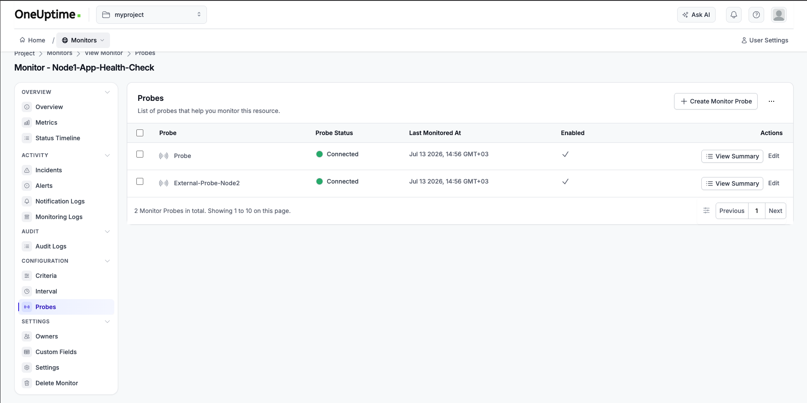
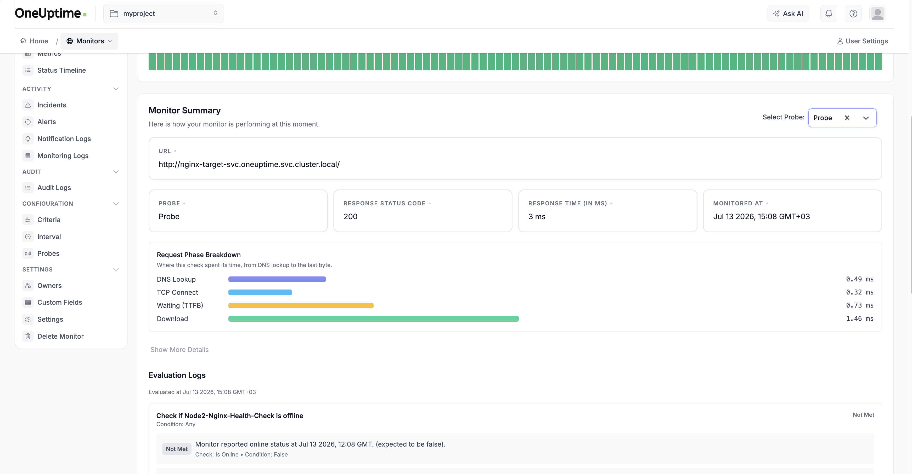
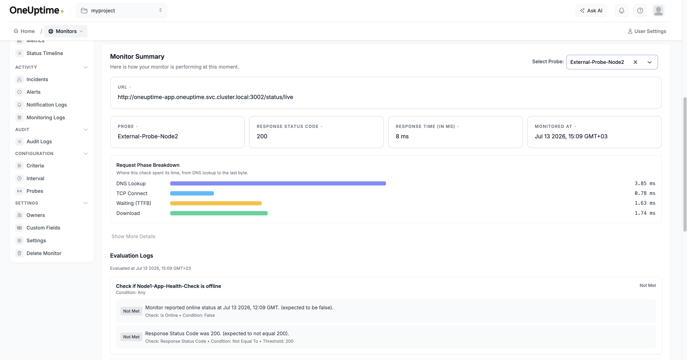

# Dağıtık OneUptime İzleme Kurulumu

Kubernetes üzerinde çalışan iki düğümlü bir OneUptime kümesinin uygulamalı kurulumu. Bu yapılandırmada çekirdek sistem ve varsayılan probe Node 1 üzerinde, harici probe Node 2 üzerinde yer alır ve her düğüm ağ üzerinden karşı tarafı izler.

---

## İçindekiler

1. [Ön Gereksinimler](#1-ön-gereksinimler)
2. [Aşama 1 — Kümenin Hazırlanması](#aşama-1--kümenin-hazırlanması)
3. [Aşama 2 — Düğüm Etiketleme](#aşama-2--düğüm-etiketleme)
4. [Aşama 3 — OneUptime Çekirdek Sisteminin Kurulumu (Node 1)](#aşama-3--oneuptime-çekirdek-sisteminin-kurulumu-node-1)
5. [Aşama 4 — İkinci Probe’un Dağıtılması (Node 2)](#aşama-4--ikinci-probeun-dağıtılması-node-2)
6. [Aşama 5 — Karşılıklı İzleme Yapılandırması](#aşama-5--karşılıklı-izleme-yapılandırması)
7. [Proje Özeti](#proje-özeti)
8. [Teslimat Kontrol Listesi](#teslimat-kontrol-listesi)
9. [Sorun Giderme Günlüğü](#sorun-giderme-günlüğü)

---

## 1. Ön Gereksinimler

Başlamadan önce aşağıdaki araçların yerel makinede kurulu olduğunu doğrulayın:

```bash
docker --version
minikube version
kubectl version --client
helm version
```

---

## Aşama 1 — Kümenin Hazırlanması

### 1.1 Önceki kümeyi temizleyin (varsa)

```bash
minikube delete -p oneuptime
```

> Bu komut yalnızca bu projeye ait Minikube profilini siler. Diğer yerel Minikube kümeleri etkilenmez.

### 1.2 Yeterli kaynakla iki düğümlü bir küme başlatın

```bash
minikube start -p oneuptime --nodes 2 --memory=8192 --cpus=4
kubectl config use-context oneuptime
```

> `--memory` ve `--cpus` değerleri özellikle verildi; bunun nedeni, varsayılan hafif Minikube profillerinde API sunucusunda görülebilen `TLS handshake timeout` gibi kaynak yetersizliği belirtilerini önlemektir.

### 1.3 Doğrulama

```bash
kubectl get nodes
```

Her iki düğümün de `Ready` olduğunu doğrulayın:

```text
NAME            STATUS   ROLES           AGE   VERSION
oneuptime       Ready    control-plane   ...   v1.35.1
oneuptime-m02   Ready    <none>          ...   v1.35.1
```

> `oneuptime` profili kullanıldığında bu rehber düğüm adlarının `oneuptime` ve `oneuptime-m02` olacağını varsayar. Sizde farklı görünürse `kubectl get nodes` ile gerçek adları kontrol edip komutlarda onları kullanın.

---

## Aşama 2 — Düğüm Etiketleme

### 2.1 Her düğümü rolüne göre etiketleyin

```bash
kubectl label nodes oneuptime app=oneuptime-core
kubectl label nodes oneuptime-m02 app=oneuptime-probe
```

### 2.2 Doğrulama

```bash
kubectl get nodes --show-labels
```

`LABELS` sütununda her düğümün doğru etiketi taşıdığını doğrulayın. **Bu çıktı gerekli teslimatlardan biridir.**

---

## Aşama 3 — OneUptime Çekirdek Sisteminin Kurulumu (Node 1)

### 3.1 Helm deposunu ekleyin

```bash
helm repo add oneuptime https://helm-chart.oneuptime.com/
helm repo update
```

### 3.2 Namespace oluşturun

```bash
kubectl create namespace oneuptime
```

### 3.3 Chart’ın varsayılan değerlerini inceleyin (isteğe bağlı, ancak önerilir)

```bash
helm show values oneuptime/oneuptime > default-values.yaml
grep -n "nodeSelector" default-values.yaml
```

Bu, her `nodeSelector` alanının beklediği yapıyı gösterir. Örneğin `postgresql.primary.nodeSelector` ve `redis.master.nodeSelector` gibi alanlar alt bileşene göre değişir.

### 3.4 `values.yaml` dosyasını oluşturun

`all.yaml`, Probe Two ve eski anahtar dahil olmak üzere önceki son dağıtımı kaydeder. Tam küme sıfırlamasından hemen sonra bunu doğrudan kurmayın: o anahtar silinen kümeye aittir. Aşağıdaki temel `values.yaml`, önce çekirdek sistemi, ClickHouse’u, KEDA’yı ve dahili probe’u Node 1 üzerinde başlatır. Probe Two ise ancak panel hazır olduktan ve yeni bir anahtar üretildikten sonra eklenir.

```bash
cat > values.yaml << 'EOF'
host: "oneuptime.furkan.test"
httpProtocol: https

image:
  pullPolicy: IfNotPresent

clickhouse:
  enabled: true
  nodeSelector:
    app: oneuptime-core

keda:
  enabled: true
  nodeSelector:
    app: oneuptime-core

nginx:
  nodeSelector:
    app: oneuptime-core

postgresql:
  primary:
    nodeSelector:
      app: oneuptime-core

redis:
  master:
    nodeSelector:
      app: oneuptime-core

app:
  nodeSelector:
    app: oneuptime-core

worker:
  nodeSelector:
    app: oneuptime-core

migrate:
  nodeSelector:
    app: oneuptime-core

aiAgent:
  nodeSelector:
    app: oneuptime-core

# Panel/probe laboratuvarı için gerekli değil; ayrıca başka bir büyük görüntü indirmesini önler.
runner:
  enabled: false

deployment:
  updateStrategy:
    type: RollingUpdate
    rollingUpdate:
      maxSurge: 0
      maxUnavailable: "100%"

probes:
  one:
    nodeSelector:
      app: oneuptime-core
EOF
```

### 3.5 Chart’ı kurun

```bash
helm install oneuptime oneuptime/oneuptime -n oneuptime -f values.yaml
```

Beklenen çıktı: `STATUS: deployed`

### 3.6 Pod’ların çalıştığını doğrulayın

```bash
kubectl get pods -n oneuptime -w
```

> Pod’ların ayağa kalkması internet bağlantınıza göre birkaç dakika sürebilir. Büyük imajların indirilmesi zaman alabilir.

```bash
kubectl get pods -n oneuptime -o wide
```

Çekirdek pod’ların ve `oneuptime-probe-one` pod’unun `NODE` sütununda `oneuptime` (Node 1) göründüğünü doğrulayın. **Bu çıktı gerekli teslimatlardan biridir.**

### 3.7 Yerel HTTPS'yi etkinleştirin

Yerel sertifikayı üretmek, TLS proxy'yi dağıtmak ve CA'yı macOS kullanıcı
anahtar zincirine güvenilir olarak eklemek için proje kökünde çalıştırın:

```bash
./scripts/setup-local-https.sh --trust
```

Özel anahtarlar Git tarafından yok sayılan `k8s/local-tls/certs/` dizininde
kalır. Ayrıntılar için [Yerel HTTPS ve TLS Sertifikası](LOCAL_HTTPS.md)
rehberine bakın.

---

## Aşama 4 — İkinci Probe’un Dağıtılması (Node 2)

### 4.1 Paneli port-forward ile erişilebilir hale getirin

Servisi doğrulayın:

```bash
kubectl get svc -n oneuptime oneuptime-local-tls
```

Başka bir terminal sekmesinde aşağıdaki komutu çalıştırın; bu sekme açık kalacaktır:

```bash
./scripts/port-forward-https.sh
```

Tarayıcıda şu adresi açın:

```text
https://oneuptime.furkan.test
```

Doğrudan kayıt için şu adresi açın:

```text
https://oneuptime.furkan.test/accounts/register
```

### 4.2 Hesap oluşturun / oturum açın

Kayıt ekranından yeni bir hesap oluşturun ve giriş yapın.

> `values.yaml` içindeki `host: "oneuptime.furkan.test"` ve `httpProtocol: https`
> değerleri tarayıcı adresiyle aynı olmalıdır. Şema veya port farkı kayıt
> sırasında `Network Error` oluşturabilir.

### 4.3 Probe Key alın

- **Project → Products → Monitor → Probes** menüsüne gidin (Probes sekmesi Monitor yan menüsünün en altındadır)
- **Add Probe** düğmesine tıklayın
- Adını `External-Probe-Node2` yapın
- Oluşturun ve üretilen **Probe Key** değerini kopyalayın

> Daha önce `all.yaml` içinde bulunan anahtar artık geçersizdir; çünkü eski Minikube kümesi ve veritabanı silinmiştir. Yalnızca bu yeni panelde üretilen anahtarı kullanın.

### 4.4 `probe2-values.yaml` dosyasını oluşturun

Panelden alınan gerçek anahtarla:

```bash
cat > probe2-values.yaml << 'EOF'
probes:
  two:
    name: "External-Probe-Node2"
    description: "Probe 2 on Node 2"
    enabled: true
    monitoringWorkers: 3
    monitorFetchLimit: 10
    key: "REPLACE_WITH_THE_NEW_PROBE_KEY"
    replicaCount: 1
    ports:
      http: 3874
    nodeSelector:
      app: oneuptime-probe
EOF
```

`REPLACE_WITH_THE_NEW_PROBE_KEY` ifadesini 4.3 adımında kopyaladığınız tam anahtarla değiştirin. Eski anahtarı `all.yaml` içinden yeniden kullanmayın ve yeni anahtarı Git’e eklemeyin.

### 4.5 Release’i ikinci probe’u ekleyecek şekilde yükseltin

```bash
helm upgrade oneuptime oneuptime/oneuptime -n oneuptime -f values.yaml -f probe2-values.yaml
```

> Her iki values dosyası birlikte verilmelidir. `values.yaml`, çekirdek servisleri ve Node 1 yerleşimini korur; `probe2-values.yaml` yalnızca Probe Two’yu ekler.

### 4.6 Yerleşimi doğrulayın

```bash
kubectl get pods -n oneuptime -o wide
```

Yeni `oneuptime-probe-two-...` pod’unun `NODE` sütununda `oneuptime-m02` (Node 2) yazdığını doğrulayın.

**Gerçek sonuç:**

```text
NAME                                    READY   STATUS    RESTARTS   AGE   NODE
oneuptime-probe-one-77f6b787b7-gx9r8    1/1     Running   0          47s   oneuptime
oneuptime-probe-two-57c685c7ff-wqmhf    1/1     Running   0          71s   oneuptime-m02
```

✅ `probe-one` → Node 1, `probe-two` → Node 2. Bu, Aşama 4 yerleşim gereksinimini karşılar.

---

## Aşama 5 — Karşılıklı İzleme Yapılandırması

### 5.1 Her iki probe’un da Online olduğunu doğrulayın

Dashboard → **Probes** sayfası:

- `Probe` (Node 1, varsayılan) → **Connected/Online** ✅
- `External-Probe-Node2` (Node 2) → **Connected/Online** ✅

Aşağıdaki ekran görüntüsü, bir monitorün **Probes** sekmesinden alınmıştır ve her iki probe’un da kayıtlı ve bağlı olduğunu doğrular:


_Varsayılan probe (Node 1) ve External-Probe-Node2 (Node 2) “Connected” durumundadır._

### 5.2 Node 2 üzerinde hafif bir hedef oluşturun

```bash
kubectl run nginx-target --image=nginx --overrides='{"spec": {"nodeSelector": {"app": "oneuptime-probe"}}}' -n oneuptime
kubectl expose pod nginx-target --port=80 --name=nginx-target-svc -n oneuptime
```

**Doğrulama:**

```bash
kubectl get pods -n oneuptime -o wide | grep nginx-target
kubectl get svc -n oneuptime nginx-target-svc
```

`nginx-target` pod’unun `NODE` sütununun `oneuptime-m02` (Node 2) olduğunu doğrulayın.

### 5.3 Monitor 1 oluşturun: Node 1’in probe’u → Node 2’yi izler

Dashboard → **Monitors → Create Monitor**:

| Alan         | Değer                                                 |
| ------------ | ----------------------------------------------------- |
| Monitor Type | Website                                               |
| Monitor Name | `Node2-Nginx-Health-Check`                            |
| URL          | `http://nginx-target-svc.oneuptime.svc.cluster.local` |
| Probe        | **Probe** (Node 1, varsayılan)                        |

✅ Bu monitor, **Node 1’in probe’unun Node 2’nin erişilebilirliğini ağ üzerinden kontrol etmesini** sağlar.

Çalışma tamamlandığında monitor özetinde kullanılan probe ve başarılı yanıt görünür:


_`Node2-Nginx-Health-Check` — “Probe” (Node 1) tarafından servis edildi, `nginx-target-svc` üzerinde 3 ms içinde HTTP 200 döndü._

### 5.4 Monitor 2 oluşturun: Node 2’nin probe’u → Node 1’i izler

Dashboard → **Monitors → Create Monitor**:

| Alan         | Değer                                                               |
| ------------ | ------------------------------------------------------------------- |
| Monitor Type | Website                                                             |
| Monitor Name | `Node1-App-Health-Check`                                            |
| URL          | `http://oneuptime-app.oneuptime.svc.cluster.local:3002/status/live` |
| Probe        | **External-Probe-Node2**                                            |

✅ Bu monitor, **Node 2’nin probe’unun Node 1 üzerindeki çekirdek sistem sağlığını kontrol etmesini** sağlar.

> `/status/live`, chart’ın `startupProbe`/`livenessProbe` tanımlarında da kullanılan sağlık kontrolü yoludur. Önceki OOM/probe log analizlerinde de doğrulandığı gibi, çekirdek sistem sağlığını doğrulamak için doğru uç noktadır.

Aşağıdaki monitor özeti, monitorün `External-Probe-Node2` tarafından servis edildiğini ve Node 1’den sağlıklı yanıt aldığını doğrular:


_`Node1-App-Health-Check` — “External-Probe-Node2” (Node 2) tarafından servis edildi, çekirdek uygulamanın `/status/live` uç noktasından 8 ms içinde HTTP 200 aldı._

### 5.5 Son doğrulama

İki monitor de ayrı ayrı açıldı ve doğrulandı:

- **Durum**: `Operational` / `Online`
- **Monitor Events / Evaluation Logs** başarılı ve geçen kontrolleri gösteriyor

✅ Karşılıklı izleme topolojisi tamamlandı: Node 1 ve Node 2 birbirini iki yönlü izliyor ve bu, tam olarak istenen yapı.

---

## Proje Özeti

| Gereksinim                                              | Durum         |
| ------------------------------------------------------- | ------------- |
| İki düğümlü Kubernetes kümesi (minikube)                | ✅ Tamamlandı |
| Düğüm etiketleme (`oneuptime-core` / `oneuptime-probe`) | ✅ Tamamlandı |
| Çekirdek sistem + varsayılan probe → Node 1             | ✅ Tamamlandı |
| İkinci (harici) probe → Node 2                          | ✅ Tamamlandı |
| Her iki probe da Online                                 | ✅ Tamamlandı |
| Karşılıklı izleme (Node 1 ↔ Node 2)                     | ✅ Tamamlandı |

---

## Teslimat Kontrol Listesi

1. **Terminal çıktısı:**
   - `kubectl get nodes --show-labels`
   - `kubectl get pods -n oneuptime -o wide`
2. **Dashboard ekran görüntüleri:**
   - Her iki probe’un da "Online" olarak listelenmesi (Probes sayfası) — bkz. [5.1](#51-her-iki-probeun-da-online-olduğunu-doğrulayın)
   - `Node2-Nginx-Health-Check` ve `Node1-App-Health-Check` monitor detay/özet sayfaları — bkz. [5.3](#53-monitor-1-oluşturun-node-1in-probeu--node-2yi-izler) ve [5.4](#54-monitor-2-oluşturun-node-2nin-probeu--node-1i-izler)
3. **Karşılaşılan sorunlar ve çözümleri** — aşağıdaki bölüme bakın

---

## Sorun Giderme Günlüğü

| Sorun                                                                                | Kök Neden                                                                                                                                                                                                     | Çözüm                                                                                                                                                                                                                                                                    |
| ------------------------------------------------------------------------------------ | ------------------------------------------------------------------------------------------------------------------------------------------------------------------------------------------------------------- | ------------------------------------------------------------------------------------------------------------------------------------------------------------------------------------------------------------------------------------------------------------------------ |
| Kayıt isteği `Network Error` döndürüyor                                             | Tarayıcı URL'si ile chart'ın şema/host değeri farklı                                                                                                                                                          | `https://oneuptime.furkan.test` kullanıldı; `host: "oneuptime.furkan.test"` ve `httpProtocol: https` ayarlandı                                                                                                                                                            |
| Namespace/pod’lar düzgün silinmiyor / küme kullanılamaz hale geliyor                 | Biriken crash loop’lar ve kaynak tükenmesi                                                                                                                                                                    | Sadece bu proje `minikube delete -p oneuptime` ile sıfırlandı, ardından yeterli kaynakla yeni profil oluşturuldu                                                                                                                                                         |
| `oneuptime-migrate` işi `OOMKilled` oldu                                             | Chart, `NODE_OPTIONS=--max-old-space-size=8096` değerini sabitler (8 GB heap sınırı); bu değer `values.yaml` ile değiştirilemez (bu iş için `env` alanı açılmamış) ve toplam düğüm belleği yetersiz kalıyordu | Docker Desktop bellek tahsisi artırıldı ve düğümler `--memory=8192` ile başlatıldı; migration işi birkaç otomatik denemeden sonra (`backoffLimit: 6`) başarıyla tamamlandı                                                                                               |
| `app` / `nginx` pod’ları rolling update sırasında `OOMKilled` oldu                   | Rolling update sırasında eski ve yeni pod kısa süreli birlikte çalışır; bu da geçici olarak bellek ihtiyacını artırır                                                                                         | Pod’lar kendi kendine toparlandı (restart sayısı arttı); kalıcı çözüm, yeterli düğüm belleği sağlamak ve/veya `deployment.updateStrategy` değerini Recreate benzeri bir ayara almak (`maxSurge: 0`, `maxUnavailable: "100%"`)                                            |
| İkinci probe `Disconnected` kaldı veya yetkisiz göründü, tam sıfırlama sonrası       | Eski `all.yaml` içindeki anahtar silinen veritabanına aitti ve artık geçersizdi                                                                                                                               | Önce temel kurulumu ayağa kaldırın, yeni panelde `External-Probe-Node2` oluşturun, yeni anahtarı `probe2-values.yaml` içine kopyalayın, ardından Aşama 4 Helm yükseltmesini çalıştırın                                                                                   |
| Aynı isimle probe yeniden eklenince veritabanı çakışması (`already exists`) oluşuyor | PostgreSQL PVC, pod çöküşlerinden ve Helm yükseltmelerinden sonra kalır; bu yüzden eski Probe kaydı veritabanında kalabilir. Profil sıfırlaması ise veritabanını tamamen siler.                               | Kümeyi sıfırlamadıysanız mevcut probe kaydının anahtarını kullanın veya aynı isimli yeni bir probe oluşturmadan önce eski satırı kaldırın. `minikube delete -p oneuptime` sonrası yeni bir hesap, probe’lar ve monitor’lar oluşturun çünkü eski veritabanı artık yoktur. |

> **Not:** `minikube delete -p oneuptime` yalnızca `oneuptime` profilini kaldırır. Diğer Minikube profilleri ve `values.yaml` gibi yerel dosyalar etkilenmeden kalır. Bu profilin PostgreSQL verisi de silindiği için Probe Two için yeni bir anahtar yine gereklidir.

> **Genel ders:** Bu chart’ın şema doğrulaması (`values.schema.json`) katıdır. `env`/`NODE_OPTIONS` gibi alanlar hiçbir servis için override edilemez; yalnızca `resources`, `nodeSelector`, `tolerations` ve `affinity` gibi standart Kubernetes alanları özelleştirilebilir. Bu nedenle bellekle ilgili hataları çözmenin en güvenilir yolu, container içi ayarları zorlamak yerine düğümün toplam fiziksel kaynağını artırmaktı.
