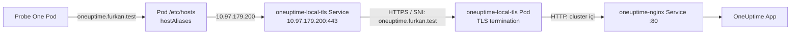

# TLS Certificate Monitor İçin Probe One Ağ Yapılandırması

Bu belge, `oneuptime.furkan.test` yerel TLS sertifikasının bitiş tarihini
OneUptime'ın kendi **SSL Certificate Monitor** türüyle izleyebilmek için
Kubernetes tarafında yapılan Probe One değişikliğini açıklar.

İlk belirtiden kök neden analizine kadar bütün komut, çıktı ve teknik kararlar
[TLS Certificate Monitor ve Probe One Teknik Sorun Giderme Günlüğü](../trouble-shooting/TLS_CERTIFICATE_MONITOR_PROBE_ONE_UYGULAMA_GUNLUGU.md)
belgesinde kronolojik olarak tutulur.

OneUptime panelindeki monitor ve kriter kurulumu ayrı olarak
[Aşama 14 — TLS Certificate Monitor](../instructions/14-tls-certificate-monitor.md)
belgesinde anlatılır.

## 1. Amaç ve kapsam

Monitorün hedefi şudur:

```text
https://oneuptime.furkan.test
```

Bu çalışma kapsamında:

- Yeni proje oluşturulmadı; mevcut OneUptime projesi kullanıldı.
- Mevcut proje içinde bağımsız bir SSL Certificate Monitor tasarlandı.
- Yalnızca `oneuptime-probe-one` için DNS eşleştirmesi eklendi.
- Ana `values.yaml` değiştirilmedi.
- Probe Two değiştirilmedi.
- OneUptime App, Nginx, TLS proxy, Runner ve diğer servisler yeniden
  başlatılmadı.
- Yerel CA, Probe One güven deposuna eklenmedi; bu ayrı bir çalışma olarak
  bırakıldı.

Uygulama 18 Ağustos 2026 tarihinde OneUptime chart `12.0.6` üzerinde yapıldı.

## 2. Sertifikanın başlangıç durumu

Sertifika dosyası şu komutla kontrol edildi:

```bash
openssl x509 \
  -in k8s/local-tls/certs/localhost.crt \
  -noout -subject -issuer -startdate -enddate
```

İlgili sonuç:

```text
subject= /CN=oneuptime.furkan.test
issuer= /CN=OneUptime Local Development CA
notBefore=Aug 17 14:57:40 2026 GMT
notAfter=Nov 19 14:57:40 2028 GMT
```

Uygulama anında sertifikanın bitmesine yaklaşık `824` tam gün kalmıştı. Bu
değer doğal olarak her gün azalır; kalıcı kabul değeri bitiş tarihi olan
`19 Kasım 2028 14:57:40 UTC` olmalıdır.

## 3. Neden Probe One için ayrıca DNS eşleştirmesi gerekti?

Mac üzerindeki tarayıcı bu alan adını yerel `/etc/hosts` kaydıyla çözer:

```text
oneuptime.furkan.test → 127.0.0.1
```

Ancak Kubernetes podları Mac'in `/etc/hosts` dosyasını kullanmaz. Probe One
ayrı bir pod içinde çalıştığı için `oneuptime.furkan.test` adını kendi DNS ve
`/etc/hosts` ortamında çözmesi gerekir.

Tarayıcı için kullanılan `kubectl port-forward` da doğru monitor hedefi
değildir. Port-forward:

- Mac üzerinde geçici bir process'tir.
- Terminal kapanınca sona erer.
- Kubernetes içindeki Probe One'ın kalıcı ağ yolu değildir.

Bu nedenle Probe One, alan adını doğrudan cluster içindeki
`oneuptime-local-tls` Service adresine çözmelidir. Bu yaklaşım hostname ve TLS
SNI değerini `oneuptime.furkan.test` olarak korurken trafiği ClusterIP üzerinden
TLS proxy'ye gönderir.

## 4. Oluşan trafik yolu



Bu yol Mac'teki port-forward process'ine veya router DNS ayarına bağlı değildir.

## 5. Service IP ve çalışan release kontrolü

Önce TLS Service ClusterIP adresi doğrulandı:

```bash
kubectl -n oneuptime get service oneuptime-local-tls \
  -o jsonpath='{.spec.clusterIP}{"\n"}'
```

Sonuç:

```text
10.97.179.200
```

Helm release kontrolü:

```bash
helm list -n oneuptime
```

İlgili durum:

```text
Release: oneuptime
Revision: 5
Status: deployed
Chart: oneuptime-12.0.6
```

Probe One'ın değişiklik öncesi durumu:

```text
Deployment: oneuptime-probe-one
Generation: 5
Replicas: 1
Ready: 1
Host aliases: yok
Strategy: maxSurge=0, maxUnavailable=100%
```

## 6. Neden ana `values.yaml` değiştirilmedi?

Ana `values.yaml`, OneUptime çekirdeği, veri servisleri, Nginx, Runner ve Probe
One gibi birçok bileşenin temel Helm değerlerini içerir. İstenen değişiklik ise
yalnızca Probe One'a aitti.

Bu nedenle bağımsız bir overlay oluşturuldu:

[probe-one-host-alias.yaml](../../../probe-one-host-alias.yaml)

Dosyanın içeriği:

```yaml
# Probe One-only overlay.
# Lets the in-cluster probe resolve the local TLS hostname directly to the
# oneuptime-local-tls Kubernetes Service without changing the base values file.
probes:
  one:
    hostAliases:
      - ip: "10.97.179.200"
        hostnames:
          - "oneuptime.furkan.test"
```

Bu değer yalnızca chart içindeki `probes.one.hostAliases` alanını doldurur.
Probe Two için bir değer içermediğinden Probe Two pod şablonunu değiştirmez.

## 7. Overlay doğrulaması

Önce chart şeması ve render sonucu doğrulandı:

```bash
helm lint ./oneuptime -f probe-one-host-alias.yaml
```

Sonuç:

```text
1 chart(s) linted, 0 chart(s) failed
```

Yalnızca Probe manifestleri render edildi:

```bash
helm template oneuptime ./oneuptime \
  -n oneuptime \
  -f values.yaml \
  -f probe2-values.yaml \
  -f probe-one-host-alias.yaml \
  --show-only templates/probe.yaml
```

Probe One pod şablonunda beklenen bölüm oluştu:

```yaml
hostAliases:
  - hostnames:
      - oneuptime.furkan.test
    ip: 10.97.179.200
```

Probe Two altında `hostAliases` oluşmadı.

## 8. Neden bu aşamada tam Helm upgrade çalıştırılmadı?

Aktif release değerleriyle server-side dry-run yapıldı:

```bash
helm upgrade oneuptime ./oneuptime \
  -n oneuptime \
  --reuse-values \
  -f probe-one-host-alias.yaml \
  --dry-run=server \
  --hide-secret
```

Dry-run, doğru Probe One `hostAliases` alanını üretti. Bununla birlikte chart,
her yeni release revision'ı için adı revision içeren yeni bir migration Job da
render eder:

```text
oneuptime-migrate-<release-revision>
```

Bu değişiklik sırasında istenen sınır "yalnızca Probe One" olduğu için tam Helm
upgrade uygulanmadı. Böylece:

- Yeni migration Job çalıştırılmadı.
- Diğer Helm kaynakları yeniden değerlendirilmedi.
- Helm revision `5` olarak kaldı.
- Canlıda yalnızca `oneuptime-probe-one` Deployment pod şablonu değiştirildi.

Bu seçim kısa vadeli canlı uygulamayı dar kapsamlı tuttu. Kalıcı Helm değeri ise
overlay dosyasında tutuldu; sonraki planlı Helm upgrade'de bu dosyanın ayrıca
verilmesi gerekir.

## 9. Probe One kesintisiz nasıl güncellendi?

Probe One tek replica çalışıyordu. Global rollout stratejisi:

```yaml
maxSurge: 0
maxUnavailable: "100%"
```

olduğu için doğrudan pod şablonu değiştirilseydi önce mevcut Probe One podu
kapatılabilirdi. Kontrollerin devam etmesi için yalnızca bu Deployment üzerinde
geçici bir zero-downtime stratejisi kullanıldı.

### 9.1 Geçici rollout stratejisi

```bash
kubectl -n oneuptime patch deployment oneuptime-probe-one \
  --type merge \
  -p '{"spec":{"strategy":{"type":"RollingUpdate","rollingUpdate":{"maxSurge":1,"maxUnavailable":0}}}}'
```

Sonuç:

```text
deployment.apps/oneuptime-probe-one patched
```

Bu değişiklik pod şablonuna dokunmadığı için tek başına pod restart'ı üretmedi.

### 9.2 Host alias'ın yalnızca Probe One'a uygulanması

```bash
kubectl -n oneuptime patch deployment oneuptime-probe-one \
  --type merge \
  -p '{"spec":{"template":{"spec":{"hostAliases":[{"ip":"10.97.179.200","hostnames":["oneuptime.furkan.test"]}]}}}}'
```

Ardından rollout beklendi:

```bash
kubectl -n oneuptime rollout status \
  deployment/oneuptime-probe-one \
  --timeout=120s
```

Çıktı:

```text
Waiting for deployment "oneuptime-probe-one" rollout to finish:
1 old replicas are pending termination...
deployment "oneuptime-probe-one" successfully rolled out
```

Bu çıktı yeni pod hazır olmadan eski podun kapatılmadığını gösterir.

### 9.3 Eski rollout stratejisinin geri yüklenmesi

Yeni pod hazır olduktan sonra yalnızca geçiş için kullanılan strateji geri
alındı:

```bash
kubectl -n oneuptime patch deployment oneuptime-probe-one \
  --type merge \
  -p '{"spec":{"strategy":{"type":"RollingUpdate","rollingUpdate":{"maxSurge":0,"maxUnavailable":"100%"}}}}'
```

Son durumda:

```text
Replicas: 1
Available: 1
Ready: 1
Strategy: maxSurge=0, maxUnavailable=100%
```

## 10. Uygulama sonrası doğrulamalar

### 10.1 Deployment doğrulaması

```bash
kubectl -n oneuptime get deployment oneuptime-probe-one -o json | \
  jq '{replicas:.spec.replicas,
       available:.status.availableReplicas,
       ready:.status.readyReplicas,
       strategy:.spec.strategy,
       hostAliases:.spec.template.spec.hostAliases}'
```

Sonuç özeti:

```json
{
  "replicas": 1,
  "available": 1,
  "ready": 1,
  "hostAliases": [
    {
      "hostnames": ["oneuptime.furkan.test"],
      "ip": "10.97.179.200"
    }
  ]
}
```

### 10.2 Pod içinden DNS ve TLS testi

Probe One podu içinden Node.js DNS ve TLS istemcisiyle kontrol yapıldı. Testte
sertifika bilgisini okuyabilmek için yalnızca tanılama bağlantısında
`rejectUnauthorized:false` kullanıldı; bu monitor ayarını veya Probe'un genel
TLS doğrulama politikasını kapatmaz.

Özet sonuç:

```text
resolved=10.97.179.200
subject=oneuptime.furkan.test
valid_to=Nov 19 14:57:40 2028 GMT
```

### 10.3 Probe logu

```bash
kubectl -n oneuptime logs deployment/oneuptime-probe-one \
  --since=2m \
  --tail=120
```

Yeni pod normal başlatıldı:

```text
Probe Service - Monitoring workers: 3, Monitor fetch limit: 10
App Version: 12.0.6
```

### 10.4 Diğer servislerin değişmediğinin kontrolü

Uygulama öncesi ve sonrası Deployment generation/ready değerleri karşılaştırıldı.
Yalnızca Probe One generation değeri, rollout stratejisi ve pod şablonu patch'leri
nedeniyle değişti. Aşağıdaki servislerin generation değerleri aynı kaldı:

```text
oneuptime-app
oneuptime-nginx
oneuptime-local-tls
oneuptime-probe-two
oneuptime-runner
keda bileşenleri
```

Helm release de `revision=5`, `status=deployed` olarak kaldı.

## 11. Yerel CA ile ilgili bilinçli sınırlama

Sunucu sertifikası doğrudan self-signed değildir; proje içindeki yerel CA
tarafından imzalanmıştır:

```text
Subject: oneuptime.furkan.test
Issuer: OneUptime Local Development CA
```

Ancak bu CA Probe One container güven deposunda bulunmaz. Doğrulama sonucu:

```text
authorized=false
authorizationError=UNABLE_TO_VERIFY_LEAF_SIGNATURE
```

Bu çalışma kullanıcının isteği doğrultusunda yalnızca `hostAliases` değişikliğini
yaptı. CA güven deposu değiştirilmedi. Bu nedenle monitor kriterlerinde şimdilik
şu filtre kullanılmamalıdır:

```text
Is Not A Valid Certificate = True
```

Bu filtre kullanılırsa, sertifikanın tarihi doğru ve sertifika erişilebilir olsa
bile yerel CA güvenilmediği için monitor hemen `Offline` olabilir. Süre izleme
`Expires In Days`, `Is Expired Certificate`, `Is Request Timeout` ve `Is Online`
ölçümleriyle yapılmalıdır.

## 12. Sonraki Helm upgrade'lerde kalıcılık

Canlı Deployment doğrudan patch edildiği için Helm release'in revision `5`
değerlerinde host alias henüz kayıtlı değildir. Sonraki Helm upgrade veya
rollback sırasında overlay verilmezse canlı host alias kaldırılabilir.

Planlı bir Helm güncellemesinde üç values dosyası birlikte verilmelidir:

```bash
helm upgrade oneuptime ./oneuptime \
  -n oneuptime \
  -f values.yaml \
  -f probe2-values.yaml \
  -f probe-one-host-alias.yaml
```

Bu komut tam Helm release'i değerlendirebildiği ve yeni migration Job
oluşturabildiği için planlı bakım adımı olarak çalıştırılmalıdır.

## 13. ClusterIP değişirse

`10.97.179.200`, mevcut `oneuptime-local-tls` Service nesnesinin ClusterIP
adresidir. Normal Deployment pod restart'larında değişmez. Service silinip
yeniden oluşturulursa değişebilir.

Her tam cluster veya Service yeniden kurulumundan sonra kontrol edin:

```bash
kubectl -n oneuptime get service oneuptime-local-tls \
  -o jsonpath='{.spec.clusterIP}{"\n"}'
```

Yeni IP farklıysa:

1. `probe-one-host-alias.yaml` içindeki `ip` değerini güncelleyin.
2. Planlı Helm upgrade'de overlay'i kullanın veya Probe One'a aynı kontrollü
   patch/rollout işlemini uygulayın.
3. Probe podu içinden hostname'in yeni IP'ye çözüldüğünü doğrulayın.

## 14. Kabul kontrol listesi

- [x] `probe-one-host-alias.yaml` ayrı overlay olarak oluşturuldu.
- [x] Ana `values.yaml` değiştirilmedi.
- [x] Yalnızca Probe One pod şablonuna `hostAliases` eklendi.
- [x] Probe Two değiştirilmedi.
- [x] Yeni Probe One podu hazır olmadan eski pod kapatılmadı.
- [x] Probe One tekrar tek replica ve `1/1 Ready` duruma geldi.
- [x] `oneuptime.furkan.test`, Probe One içinde `10.97.179.200` adresine çözüldü.
- [x] TLS sertifikasının CN ve bitiş tarihi Probe One içinden okunabildi.
- [x] Diğer OneUptime Deployment generation değerleri değişmedi.
- [x] Helm revision değişmedi ve migration Job çalıştırılmadı.
- [ ] Sonraki planlı Helm upgrade'de overlay release değerlerine eklenecek.
- [ ] İstenirse ayrı çalışmada yerel CA, Probe One güven deposuna eklenecek.

## 15. İlgili belgeler

- [Yerel HTTPS ve TLS Sertifikası](LOCAL_HTTPS.md)
- [Yerel DNS, TLS Proxy ve Uygulama Trafiği](LOCAL_DNS_TLS_TRAFFIC.md)
- [Aşama 14 — TLS Certificate Monitor](../instructions/14-tls-certificate-monitor.md)
- [OneUptime SSL Certificate Monitor](https://oneuptime.com/docs/en/monitor/ssl-certificate-monitor)
