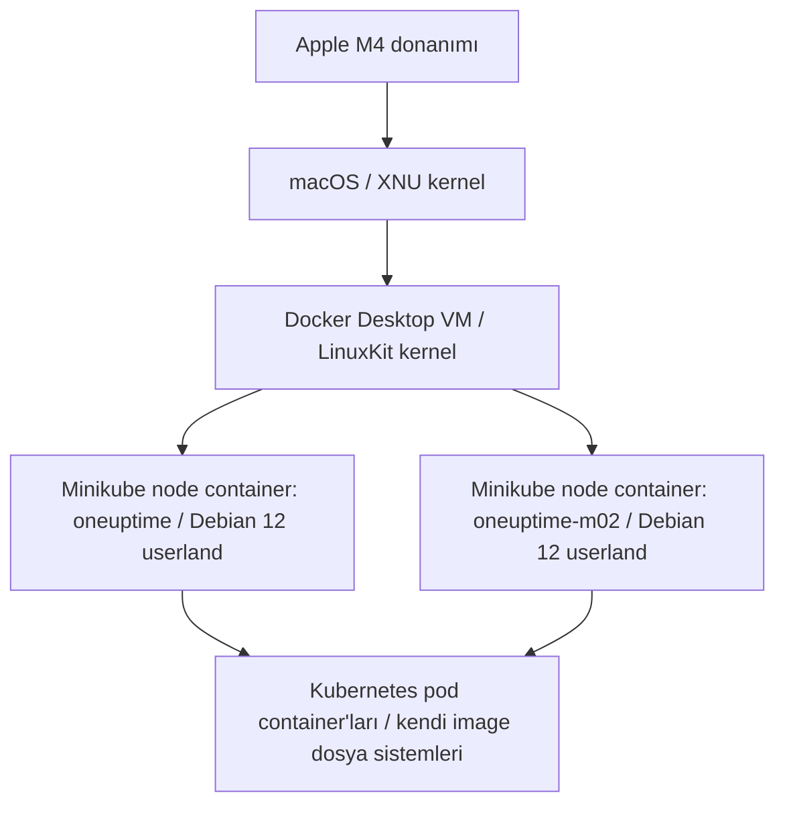

# Linux Ortamını Sıfırdan Anlama: Minikube Node ve Container Dosya Sistemi Rehberi

Bu belge, daha önce Linux üzerinde deploy yapmamış birinin Linux dosya
sistemini, kullanıcı ve izin modelini, process/thread yapısını, namespace ve
cgroup mekanizmalarını, Docker dosya katmanlarını ve Kubernetes node/pod
ilişkisini sıfırdan anlayabilmesi için hazırlanmıştır.

Rehberdeki örnekler bu projedeki gerçek yerel geliştirme ortamından alınmıştır:

```text
MacBook M4
├── macOS
├── Docker Desktop
│   └── LinuxKit sanal makinesi
│       ├── 8 vCPU
│       └── 14 GiB RAM üst sınırı
└── İki node'lu Minikube profili: oneuptime
    ├── oneuptime       → control-plane node
    └── oneuptime-m02   → worker node
```

Komut çıktıları zamanla değişebilir. Bu belgede görülen PID, sayaç, tarih,
bellek kullanımı ve namespace numaraları yalnızca incelenen oturuma aittir.

> Bu rehberdeki inceleme komutları salt okunur olacak şekilde seçilmiştir.
> `/var/lib/docker`, `/var/lib/kubelet`, `/etc` ve benzeri sistem dizinlerindeki
> dosyalar nedenini anlamadan elle değiştirilmemeli veya silinmemelidir.

## 1. Windows dosya düzeninden Linux'a geçiş

Windows geçmişi olan biri için en büyük fark, Linux'ta `C:`, `D:` gibi ayrı
sürücü köklerinin görünmemesidir.

### 1.1 Windows sürücü harfleri ve Linux mount ağacı

Windows:

```text
C:\
D:\
E:\
```

Linux:

```text
/
├── home
├── usr
├── var
├── mnt
└── ...
```

Linux'ta bütün dosya sistemi tek bir `/` kökünün altında görünür. Başka diskler,
ağ diskleri, geçici RAM dosya sistemleri ve Kubernetes volume'leri bu ağacın
belirli noktalarına **mount** edilir:

```text
Fiziksel disk bölümü  → /
İkinci disk           → /mnt/data
NFS paylaşımı         → /srv/shared
Kubernetes PVC        → /var/lib/postgresql/data
tmpfs                 → /run
```

Bir uygulama yalnızca normal bir yol görür. Yolun arkasında fiziksel disk, ağ
depolaması, RAM tabanlı dosya sistemi veya container volume bulunabilir.

### 1.2 Yaklaşık Windows–Linux karşılıkları

Bu tablo birebir teknik eşitlik değil, başlangıç analojisidir:

| Windows kavramı | Yaklaşık Linux karşılığı | Açıklama |
|---|---|---|
| `C:\` | `/` | Dosya sistemi ağacının kökü |
| `C:\Users\Ali` | `/home/ali` | Normal kullanıcının home dizini |
| Administrator profili | `/root` | Root kullanıcısının home dizini |
| `Program Files` | `/usr`, `/opt` | Kurulu programlar ve üçüncü taraf uygulamalar |
| `System32` | `/usr/bin`, `/usr/lib` | Sistem programları ve kütüphaneler; birebir eşit değildir |
| `ProgramData` | `/var/lib` | Uygulamaların değişken/kalıcı çalışma durumu |
| Registry ve `.ini` dosyaları | `/etc` | Sistem ve servis konfigürasyonları |
| `%TEMP%` | `/tmp` | Kısa ömürlü geçici dosyalar |
| Event Viewer/log dosyaları | `/var/log`, journal | Sistem ve uygulama logları |
| Task Manager | `ps`, `top`, `/proc` | Process ve thread görünümü |
| Services | `systemd`, `systemctl` | Servis yaşam döngüsü |
| Device Manager | `/dev`, `/sys` | Cihazların ve kernel görünümünün parçaları |

Linux'ta merkezi ve tek bir Registry zorunluluğu yoktur. Konfigürasyonlar
çoğunlukla okunabilir metin dosyaları, ortam değişkenleri veya servis özelindeki
veritabanlarıyla tutulur.

## 2. İncelenen sistemin gerçek katmanları

Yerel Kubernetes ortamında tek bir “Linux makinesi” yoktur. Birbirinin içine
yerleşmiş birkaç görünüm vardır:



### 2.1 Hangi komut hangi katmana girer?

| Komut/arayüz | Girilen ortam |
|---|---|
| macOS Terminal | macOS kullanıcı alanı |
| Docker Desktop `Exec` → `oneuptime` | Minikube node container'ı |
| `minikube -p oneuptime ssh` | Minikube control-plane node ortamı |
| `minikube -p oneuptime ssh -n oneuptime-m02` | İkinci Minikube node ortamı |
| `kubectl exec ...` | Seçilen pod içindeki uygulama container'ı |

`kubectl exec` ile görülen `/etc`, `/usr` ve `/tmp`, node'un dizinleri değil,
pod image'ının dosya sistemi görünümüdür.

### 2.2 Node container mı, ayrı VM mi?

Bu projede Docker Desktop tek bir LinuxKit VM çalıştırır. Minikube'un iki node'u
bu VM içindeki Docker container'larıdır:

```text
Docker Desktop LinuxKit VM
├── Docker container: oneuptime
└── Docker container: oneuptime-m02
```

Node çıktısında görülen:

```text
OS-IMAGE:       Debian GNU/Linux 12 (bookworm)
KERNEL-VERSION: 7.0.12-linuxkit
```

çelişki değildir. Debian kullanıcı alanıdır; LinuxKit ise paylaşılan kerneldir.

## 3. Kernel, kullanıcı alanı ve system call

Linux sistemi iki ana bölge olarak düşünülebilir:

```text
Kullanıcı alanı
├── Bash
├── ls
├── kubelet
├── Docker daemon
├── PostgreSQL
└── Uygulama process'leri
        ↓ system call
Kernel alanı
├── CPU scheduler
├── Sanal bellek
├── Dosya sistemleri
├── Ağ stack'i
├── Cihaz sürücüleri
├── Namespace
└── Cgroup
        ↓
Donanım veya sanallaştırılmış donanım
```

Bir uygulama diske veya ağa doğrudan erişmez. Kernelden hizmet ister:

```text
Uygulama → open/read/write → Linux kernel → dosya sistemi → disk
Uygulama → send/recv       → Linux kernel → ağ stack'i   → ağ kartı
```

Container kendi kernelini taşımaz. Container içindeki process'ler, içinde
bulundukları Linux ortamının kernelini system call üzerinden kullanır.

### 3.1 Process ve thread

- **Process**, izole sanal bellek ve kaynak ortamıdır.
- **Thread**, process içindeki çalıştırılabilir komut akışıdır.
- Aynı process'in thread'leri kodu, heap'i ve açık dosyaları paylaşır.
- Her thread'in kendi register durumu, program counter'ı ve stack'i vardır.
- Linux scheduler runnable thread'leri CPU'lara yerleştirir.

Bir thread I/O bekliyorsa sleeping/waiting durumuna geçebilir; CPU başka bir
thread'i çalıştırır. Asenkron backend kodunun temel kazancı da budur: Bir async
fonksiyon veritabanı veya ağ cevabı beklerken event loop başka görevleri
ilerletebilir.

## 4. Node'a giriş ve shell prompt'u

Node'a giriş:

```bash
minikube -p oneuptime ssh
```

İncelenen oturumda görülen çıktı:

```text
Linux oneuptime 7.0.12-linuxkit #1 SMP PREEMPT ... aarch64

Debian GNU/Linux comes with ABSOLUTELY NO WARRANTY...
docker@oneuptime:~$
```

Prompt'un parçaları:

```text
docker@oneuptime:~$
│      │          │
│      │          └── $: normal kullanıcı; root çoğunlukla # görür
│      └── hostname
└── kullanıcı adı
```

- `aarch64`, ARM64 mimarisidir.
- `SMP`, kernelin çok işlemcili sistemi desteklediğini gösterir.
- `PREEMPT`, kernelin gerektiğinde çalışan işi kesip daha öncelikli işe geçme
  yeteneğiyle ilgilidir.
- Görülen tarih sistemin açılış zamanı değil, kernel build zamanıdır.

## 5. Yol kavramı: `/`, `~`, mutlak ve göreli yollar

Çalışma dizinini öğrenme:

```bash
pwd
```

Gözlenen çıktı:

```text
/home/docker
```

Yol türleri:

```text
Mutlak yol: /home/docker/file.txt
Göreli yol: file.txt
```

Göreli yol process'in mevcut çalışma dizinine göre çözülür. `~`, shell
tarafından mevcut kullanıcının home dizinine genişletilir:

```text
~      → /home/docker
~/logs → /home/docker/logs
```

Özel dizin girişleri:

```text
.  → mevcut dizin
.. → parent/üst dizin
```

Kök dizinde `/..` tekrar `/` anlamına gelir; kökün üzerinde başka dizin yoktur.

## 6. Kullanıcı, UID, GID ve izin modeli

Kimlik kontrolü:

```bash
id
```

Gözlenen çıktı:

```text
uid=1000(docker) gid=997(docker) groups=997(docker),27(sudo),107(nerdctl),108(buildkit),109(podman)
```

Kernel kullanıcı adından çok sayısal kimliklerle çalışır:

- UID `0`: root/süper kullanıcı.
- UID `1000`: Bu node'daki `docker` kullanıcısı.
- GID `997`: Birincil `docker` grubu.
- `sudo`, `nerdctl`, `buildkit`, `podman`: Ek grup üyelikleri.

Container runtime socket'lerine erişim sağlayan gruplar güçlü yetkilere sahip
olabilir. Yerel geliştirme node'unda bu beklenen olsa da production sunucuda
grup üyelikleri dikkatle verilmelidir.

### 6.1 `/etc/passwd` kaydı

```bash
getent passwd docker root
```

Gözlenen çıktı:

```text
docker:x:1000:997::/home/docker:/bin/bash
root:x:0:0:root:/root:/bin/bash
```

Biçim:

```text
kullanıcı:parola-alanı:UID:GID:açıklama:home:shell
```

`x`, parola doğrulama bilgisinin `/etc/passwd` içinde düz metin tutulmadığını
gösterir. Hash ve parola yaşlandırma bilgileri korumalı `/etc/shadow` dosyasında
bulunabilir.

### 6.2 İzin satırını okuma

Kök dizinden örnek:

```text
drwxr-xr-x 1 root root 4096 ... etc
│            │ │    │    │       └── ad
│            │ │    │    └── raporlanan boyut/metadata
│            │ │    └── grup
│            │ └── owner
│            └── hard-link sayısı
└── tür ve izinler
```

Dosya türleri:

```text
d → directory
- → normal dosya
l → symbolic link
c → character device
b → block device
p → pipe
s → Unix socket
```

İzin grupları:

```text
rwx  r-x  r-x
│    │    └── others
│    └── group
└── owner
```

Normal dosyada:

- `r`: İçeriği okuma.
- `w`: İçeriği değiştirme.
- `x`: Executable olarak çalıştırma.

Dizinde:

- `r`: İsimleri listeleme.
- `w`: Giriş oluşturma, silme veya yeniden adlandırma.
- `x`: Dizini geçme ve alt yola erişme.

Bir dosyayı silme izni çoğunlukla dosyanın kendisinden değil, parent dizinin
`w+x` izinlerinden gelir.

### 6.3 Sayısal izinler

```text
r = 4
w = 2
x = 1
```

Gözlenen çıktı:

```bash
stat -c '%A %a %U:%G %n' / /home /home/docker /root /tmp
```

```text
drwxr-xr-x 755 root:root /
drwxr-xr-x 755 root:root /home
drwxr-xr-x 755 docker:docker /home/docker
drwx------ 700 root:root /root
drwxrwxrwt 1777 root:root /tmp
```

Hesap:

```text
rwx = 4+2+1 = 7
r-x = 4+0+1 = 5
--- = 0
```

Yaygın izinler:

| Mod | Sembolik | Kullanım örneği |
|---:|---|---|
| `644` | `rw-r--r--` | Normal konfigürasyon/metin dosyası |
| `600` | `rw-------` | Özel anahtar veya hassas dosya |
| `755` | `rwxr-xr-x` | Dizin veya executable |
| `700` | `rwx------` | Özel kullanıcı dizini |
| `640` | `rw-r-----` | Sahibin yazdığı, belirli grubun okuduğu dosya |
| `1777` | `rwxrwxrwt` | `/tmp` gibi ortak geçici dizin |

`1777` içindeki öndeki `1`, sticky bit'tir. Herkes `/tmp` altında dosya
oluşturabilir; kullanıcılar normalde birbirlerinin dosyalarını silemez.

### 6.4 Gerçek dosya örnekleri

```text
-rw-r--r-- 644 root:root   /etc/passwd
-rw-r----- 640 root:shadow /etc/shadow
-rwxr-xr-x 755 root:root   /usr/bin/ls
```

- `/etc/passwd`, kullanıcı çözümleme için herkesçe okunabilir.
- `/etc/shadow`, yalnızca root ve `shadow` grubu tarafından okunabilir.
- `/usr/bin/ls`, herkesçe çalıştırılabilir ama yalnızca root tarafından
  değiştirilebilir.

İzin hatasını anlamadan `chmod 777` kullanmak güvenli bir çözüm değildir.

## 7. Linux kök dizin hiyerarşisi

Node'da alınan gerçek kök liste:

```bash
ls -la /
```

```text
drwxr-xr-x   1 root root 4096 ... .
drwxr-xr-x   1 root root 4096 ... ..
-rwxr-xr-x   1 root root    0 ... .dockerenv
-rw-r--r--   1 root root 7772 ... CHANGELOG
lrwxrwxrwx   1 root root    7 ... bin -> usr/bin
drwxr-xr-x   2 root root 4096 ... boot
drwxr-xr-x   2 root root 4096 ... data
drwxr-xr-x  10 root root 3480 ... dev
drwxr-xr-x   1 root root 4096 ... etc
drwxr-xr-x   1 root root 4096 ... home
drwxr-xr-x   1 root root 4096 ... kind
lrwxrwxrwx   1 root root    7 ... lib -> usr/lib
drwxr-xr-x   2 root root 4096 ... media
drwxr-xr-x   2 root root 4096 ... mnt
drwxr-xr-x   1 root root 4096 ... opt
dr-xr-xr-x 469 root root    0 ... proc
drwx------   1 root root 4096 ... root
drwxr-xr-x  17 root root  460 ... run
lrwxrwxrwx   1 root root    8 ... sbin -> usr/sbin
drwxr-xr-x   2 root root 4096 ... srv
dr-xr-xr-x  11 root root    0 ... sys
drwxrwxrwt   5 root root  140 ... tmp
drwxr-xr-x   1 root root 4096 ... usr
drwxr-xr-x  14 root root 4096 ... var
-rw-r--r--   1 root root  142 ... version.json
```

Hızlı görev özeti:

| Dizin | Temel görev |
|---|---|
| `/bin` | `/usr/bin` için uyumluluk symlink'i |
| `/boot` | Geleneksel kernel/bootloader dosyaları |
| `/dev` | Cihaz ve özel giriş/çıkış dosyaları |
| `/etc` | Sistem ve servis konfigürasyonları |
| `/home` | Normal kullanıcı home dizinleri |
| `/lib` | `/usr/lib` için uyumluluk symlink'i |
| `/media` | Takılabilir medya için geleneksel mount noktası |
| `/mnt` | Elle/geçici yapılan mount'lar |
| `/opt` | Kendi ağacıyla kurulan üçüncü taraf uygulamalar |
| `/proc` | Process ve kernel bilgilerinin sanal görünümü |
| `/root` | Root kullanıcısının home dizini |
| `/run` | Boot/container başlangıcından beri geçerli runtime bilgileri |
| `/sbin` | `/usr/sbin` için uyumluluk symlink'i |
| `/srv` | Sunucu servislerinin sunduğu veriler için geleneksel yer |
| `/sys` | Cihaz ve kernel nesne modelinin sanal görünümü |
| `/tmp` | Kısa ömürlü geçici dosyalar |
| `/usr` | Programlar, kütüphaneler ve paylaşılan veriler |
| `/var` | Çalışma sırasında değişen state, log ve cache |

`.dockerenv`, ortamın Docker container'ı olduğuna işaret eden boş bir dosyadır.
Tek başına güvenilir bir güvenlik sınırı veya standart API değildir.

## 8. `/usr`: Programlar, kütüphaneler ve paylaşılan veriler

Node'daki yapı:

```text
/usr/
├── bin
├── games
├── include
├── lib
├── libexec
├── local
├── sbin
├── share
└── src
```

### 8.1 Merged `/usr` ve symlink'ler

Modern Debian yapısında:

```text
/bin  → /usr/bin
/lib  → /usr/lib
/sbin → /usr/sbin
```

Gözlenen çözüm:

```bash
readlink -f /bin/bash
```

```text
/usr/bin/bash
```

Tarihsel olarak sistemin erken boot aşamasında gereken programlar `/bin` ve
`/sbin` altında, diğerleri `/usr` altında tutulurdu. Modern sistemlerde ayrım
büyük ölçüde birleştirilmiş, eski yollar symlink olarak korunmuştur.

### 8.2 `/usr/bin` ve `/usr/sbin`

- `/usr/bin`: `ls`, `bash`, `cat`, `curl` gibi genel executable'lar.
- `/usr/sbin`: Sistem yönetimi ağırlıklı executable'lar.

Bir executable'ın sahibi root olsa da normal kullanıcı onu kendi UID'siyle
çalıştırır. Dosyanın root'a ait olması process'e otomatik root yetkisi vermez.

### 8.3 `/usr/lib` ve `/usr/libexec`

- `/usr/lib`: Dinamik kütüphaneler ve runtime bileşenleri.
- `/usr/libexec`: Başka programların çağırdığı, doğrudan kullanıcı komutu
  olması amaçlanmayan yardımcı executable'lar.

### 8.4 `/usr/share`

CPU mimarisinden bağımsız paylaşılan veriler:

```text
/usr/share/doc
/usr/share/man
/usr/share/locale
/usr/share/zoneinfo
/usr/share/containers
```

İncelenen `/usr/share/containers/containers.conf`, Podman ve Buildah gibi
`containers/common` araçlarının vendor varsayılanlarını taşıyan TOML dosyasıdır.

Konfigürasyon önceliği genel olarak:

```text
/usr/share/containers/containers.conf   → paket/vendor varsayılanı
/etc/containers/containers.conf         → sistem yöneticisi override'ı
~/.config/containers/containers.conf    → rootless kullanıcı override'ı
komut satırı                             → en özel seçim
```

`/usr/share` altındaki vendor dosyası doğrudan düzenlenmemelidir. Sistem
özelleştirmesi `/etc`, kullanıcı özelleştirmesi home altındaki config dizini
üzerinden yapılır.

Aynı dizindeki `seccomp.json`, container process'lerinin kullanabileceği Linux
system call'larını sınırlayan varsayılan güvenlik profilidir.

> Bu node'un Kubernetes runtime'ı `docker://29.2.1` olarak raporlanmıştır.
> `containers.conf` dosyasının bulunması, kubelet tarafından başlatılan bütün
> podların doğrudan bu dosyayla yönetildiği anlamına gelmez.

### 8.5 `/usr/local`, `/opt` ve paket sahibi ayrımı

```text
/usr        → Dağıtım/image/paket yöneticisi tarafından sağlanan
/usr/local  → Sistem yöneticisinin yerel olarak kurduğu
/opt        → Kendi dizin ağacıyla paketlenen üçüncü taraf uygulama
```

Örnek:

```text
/opt/vendor/app
/etc/opt/vendor/app
/var/opt/vendor/app
```

Program, konfigürasyon ve değişken state ayrı tutulabilir.

## 9. Shell komut çözümleme: PATH, alias ve builtin

Gözlenen PATH:

```text
/usr/local/bin:/usr/bin:/bin:/usr/local/games:/usr/games
```

Shell komutu soldan sağa arar:

```text
ls
 ↓
/usr/local/bin/ls var mı?
 ↓ yok
/usr/bin/ls var mı?
 ↓ evet
/usr/bin/ls çalıştırılır
```

`type -a ls bash cd` çıktısı:

```text
ls is aliased to `ls --color=auto'
ls is /usr/bin/ls
ls is /bin/ls
bash is /usr/bin/bash
bash is /bin/bash
cd is a shell builtin
```

- Alias, shell içindeki metinsel kısa tanımdır.
- `/usr/bin/ls`, disk üzerindeki executable'dır.
- `/bin/ls`, symlink nedeniyle aynı executable'a gider.
- `cd`, parent shell'in çalışma dizinini değiştirmesi gerektiği için builtin'dir.

PATH içinde `.` bulunmadığı için mevcut dizindeki script açıkça çalıştırılır:

```bash
./script.sh
```

Bu güvenli bir varsayımdır; mevcut dizindeki sahte bir `ls` dosyasının gerçek
komutun önüne geçmesini önler.

## 10. ELF executable ve dinamik kütüphaneler

Node image'ında `file` aracı yoktu:

```text
-bash: file: command not found
```

Minimal image'lar gereksiz araçları içermeyerek boyutu ve saldırı yüzeyini
azaltır. İnceleme için node'u değiştirip paket kurmak yerine mevcut araçlarla
ELF imzası okundu:

```bash
od -An -tx1 -N20 /usr/bin/ls
```

```text
7f 45 4c 46 02 01 01 00 00 00 00 00 00 00 00 00
03 00 b7 00
```

Çözüm:

| Offset | Değer | Anlam |
|---:|---|---|
| `0–3` | `7f 45 4c 46` | ELF magic; `E L F` |
| `4` | `02` | 64-bit ELF |
| `5` | `01` | Little-endian |
| `6` | `01` | ELF sürüm 1 |
| `16–17` | `03 00` | `ET_DYN`; PIE executable |
| `18–19` | `b7 00` | AArch64 machine ID |

Modern executable'lar PIE olarak derlenebilir ve ASLR ile farklı sanal bellek
adreslerine yerleştirilebilir.

Dinamik bağımlılıklar:

```bash
ldd /usr/bin/ls
```

```text
linux-vdso.so.1 (...)
libselinux.so.1 => /lib/aarch64-linux-gnu/libselinux.so.1 (...)
libc.so.6 => /lib/aarch64-linux-gnu/libc.so.6 (...)
/lib/ld-linux-aarch64.so.1 (...)
libpcre2-8.so.0 => /lib/aarch64-linux-gnu/libpcre2-8.so.0 (...)
```

- `libc.so.6`: C runtime, bellek, metin, dosya ve system-call wrapper'ları.
- `libselinux.so.1`: SELinux label/policy desteği.
- `libpcre2`: Düzenli ifade kütüphanesi; transitif bağımlılık olabilir.
- `ld-linux-aarch64.so.1`: ARM64 dynamic loader.
- `linux-vdso.so.1`: Kernelin process sanal belleğine yerleştirdiği sanal
  yardımcı kütüphane.

Parantez içindeki adresler sanal adreslerdir; fiziksel RAM adresi değildir.
ASLR nedeniyle tekrar çalıştırıldığında değişebilir.

> `ldd` yalnızca güvenilen executable'larda kullanılmalıdır. Bilinmeyen bir
> binary'nin loader davranışını tetiklemek güvenli olmayabilir.

## 11. `/etc`: Sistem ve servis konfigürasyonları

İncelenen temel dosyalar:

```text
-rw-r--r-- root:root /etc/fstab
-rw-r--r-- root:root /etc/group
-rw-r--r-- root:root /etc/hostname
-rw-r--r-- root:root /etc/hosts
lrwxrwxrwx root:root /etc/os-release -> ../usr/lib/os-release
-rw-r--r-- root:root /etc/passwd
-rw-r--r-- root:root /etc/resolv.conf
```

### 11.1 Image dosyaları ve runtime dosyaları

Dosya zamanları iki grubu gösterdi:

```text
Image build zamanından gelen:
  /etc/fstab
  /etc/group
  /etc/passwd
  /etc/os-release

Container başlangıcında hazırlanan:
  /etc/hostname
  /etc/hosts
  /etc/resolv.conf
```

Docker Desktop'ın `/etc` için `MODIFIED` göstermesinin nedenlerinden biri
container runtime'ın bu dosyaları başlangıçta üretmesi veya mount etmesidir.
Bu etiket elle yapılan değişiklik anlamına gelmek zorunda değildir.

### 11.2 `/etc/os-release`

Gözlenen içerik:

```text
PRETTY_NAME="Debian GNU/Linux 12 (bookworm)"
NAME="Debian GNU/Linux"
VERSION_ID="12"
VERSION="12 (bookworm)"
VERSION_CODENAME=bookworm
ID=debian
```

Bu dosya kullanıcı alanı dağıtımını tanımlar. Kernelin LinuxKit olmasıyla
çelişmez:

```text
Debian 12 kullanıcı alanı
        ↓ system call
LinuxKit kernel
```

### 11.3 `/etc/hostname`

```text
oneuptime
```

Diskteki konfigürasyon değeridir. Kernelin aktif UTS namespace hostname değeri:

```bash
cat /proc/sys/kernel/hostname
```

ile okunabilir. İncelenen oturumda o da `oneuptime` dönmüştür.

### 11.4 `/etc/hosts`

DNS'e gitmeden önce kullanılan statik ad–IP eşlemelerini taşır. Docker node'un
hostname ve ağ bilgilerini buraya ekleyebilir. Kubernetes pod'larında kubelet
pod'a özel `/etc/hosts` görünümü oluşturur.

### 11.5 `/etc/resolv.conf`

DNS resolver ayarları:

```text
nameserver
search
options
```

Pod içinde çoğunlukla cluster DNS/CoreDNS adresi ve Kubernetes search domain'leri
görülür. Node ve pod `resolv.conf` dosyaları aynı olmak zorunda değildir.

### 11.6 `/etc/fstab`

Geleneksel Linux sunucusunda boot sırasında disklerin hangi yollara mount
edileceğini tanımlar. Container ortamında gerçek mount'lar Docker/Kubernetes
tarafından dışarıdan hazırlandığı için küçük veya boş olabilir. Gerçek aktif
durum için `findmnt` veya `mount` kullanılır.

## 12. `/var`: Değişken runtime verisi

Temel ayrım:

```text
/usr → Programın kendisi
/etc → Programın konfigürasyonu
/var → Program çalıştıkça değişen state, log ve cache
```

Gözlenen `/var` yapısı:

```text
/var/
├── backups
├── cache
├── data
├── hostpath-provisioner
├── hostpath_pv
├── lib
├── local
├── lock -> /run/lock
├── log
├── mail
├── opt
├── run -> /run
├── spool
└── tmp
```

### 12.1 Standart alt dizinler

| Yol | Görev |
|---|---|
| `/var/lib` | Servislerin kalıcı/değişken çalışma state'i |
| `/var/log` | Geleneksel sistem ve servis logları |
| `/var/cache` | Yeniden üretilebilir cache |
| `/var/spool` | İşlenmeyi bekleyen kuyruk verileri |
| `/var/backups` | Bazı sistem araçlarının yerel kopyaları |
| `/var/tmp` | `/tmp`den daha uzun ömürlü olması beklenen geçici veri |
| `/var/opt` | `/opt` uygulamalarının değişken verisi |
| `/var/local` | `/usr/local` yazılımlarının değişken verisi |

`/var/run` ve `/var/lock`, modern sistemde `/run` ağacına symlink'tir.

### 12.2 Minikube hostPath dizinleri

```text
/var/hostpath-provisioner
/var/hostpath_pv
```

Minikube'un yerel hostPath tabanlı storage provisioner yapısıyla ilişkilidir:

```text
PVC
 ↓
Minikube storage provisioner
 ↓
Node üzerindeki hostPath
 ↓
Pod içine volume mount
```

Bu depolama gerçek çok-node'lu dağıtık storage değildir. Node container'ı veya
profil silindiğinde production seviyesinde dayanıklılık beklenmemelidir.

### 12.3 `/var/lib`: Kubernetes node state'i

Gözlenen dizinler:

```text
/var/lib/
├── apt
├── cni
├── containerd
├── containers
├── cri-dockerd
├── crio
├── dbus
├── docker
├── dpkg
├── kubelet
├── minikube
├── nfs
├── pam
├── sudo
└── systemd
```

Aktif runtime zinciri:


Önemli dizinler:

- `/var/lib/docker`: Image metadata, layer'lar, writable layer, container ve
  Docker volume verileri.
- `/var/lib/containerd`: Content, snapshot, metadata ve runtime state.
- `/var/lib/cri-dockerd`: Kubelet–Docker CRI adaptörünün state'i.
- `/var/lib/kubelet`: Pod, plugin, checkpoint ve volume mount ilişkileri.
- `/var/lib/cni`: CNI/IP allocation gibi ağ plugin state'i.
- `/var/lib/minikube`: Minikube'a özel node state ve konfigürasyonları.
- `/var/lib/apt`, `/var/lib/dpkg`: Debian paket yöneticisi veritabanları.
- `/var/lib/containers`, `/var/lib/crio`: Alternatif runtime desteği için
  bulunabilir; dizinin varlığı servisin aktif olduğunu kanıtlamaz.

`/var/lib/docker` ve `/var/lib/kubelet` elle değiştirilmemelidir. Bu dizinleri
elle temizlemek runtime metadata'sını, pod state'ini ve mount ilişkilerini
bozabilir.

## 13. `/tmp`, `/run` ve `/var/tmp`: Geçici verinin üç görünümü

### 13.1 `/tmp`

Kısa ömürlü geçici dosyalar içindir. İncelenen izin:

```text
drwxrwxrwt root:root /tmp
```

Herkes dosya oluşturabilir; sticky bit kullanıcıların birbirlerinin dosyalarını
silmesini sınırlar.

Container içindeki `/tmp` için kalıcılık varsayılmamalıdır:

```text
Aynı Docker container stop/start → writable layer genellikle kalır
Container silinip yeniden yaratılır → normal writable layer kaybolur
Kubernetes container yeniden yaratılır → container layer kaybolur
Pod içindeki emptyDir             → pod yaşadığı sürece kalabilir
PVC mount                         → PVC yaşam döngüsüne bağlıdır
```

### 13.2 `/run`

Sistem veya container başlangıcından beri geçerli runtime bilgileri:

```text
/run/
├── PID dosyaları
├── Unix socket'leri
├── lock dosyaları
├── servis runtime state'i
└── kullanıcı oturum bilgileri
```

Çoğunlukla tmpfs/RAM tabanlıdır ve yeniden başlangıçta hazırlanır. Kalıcı veri
konumu değildir.

### 13.3 `/var/tmp`

Geleneksel olarak reboot sonrasında `/tmp`den daha uzun süre tutulması beklenen
geçici veriler içindir. Container lifecycle ve mount düzeni bu beklentiyi
değiştirebilir. İş açısından kritik veri yine burada tutulmamalıdır.

## 14. `/proc`: Process ve kernelin sanal dosya görünümü

`/proc` normal disk dizini değildir. Kernel bilgileri dosya gibi sunar:

```text
/proc/
├── 1/                    PID 1 bilgileri
├── <PID>/                Her process için dinamik dizin
├── cpuinfo               CPU görünümü
├── meminfo               Bellek görünümü
├── mounts                Mount tablosu
├── uptime                Kernel uptime
├── sys/                  Ayarlanabilir kernel parametreleri
└── self/                 Okuyan process'e dinamik referans
```

Örnekler:

```bash
cat /proc/sys/kernel/hostname
cat /proc/cpuinfo
cat /proc/meminfo
cat /proc/1/status
```

Bu “dosyalar” okunduğu anda kernel tarafından üretilir. `0 byte` veya olağandışı
boyut göstermeleri normaldir.

`/proc/<PID>` altındaki yaygın girişler:

| Giriş | Anlam |
|---|---|
| `cmdline` | Process komut satırı |
| `environ` | Ortam değişkenleri; hassas veri içerebilir |
| `fd/` | Açık file descriptor'lar |
| `maps` | Sanal bellek mapping'leri |
| `status` | UID, thread ve bellek özeti |
| `ns/` | Namespace referansları |
| `cwd` | Process çalışma dizini symlink'i |
| `exe` | Çalışan executable symlink'i |

`/proc/*/environ`, process argümanları ve Secret mount'ları hassas bilgi
içerebilir; çıktıları paylaşırken sanitize edilmelidir.

## 15. `/sys`: Kernel cihaz modeli ve kontrol yüzeyi

`sysfs`, kerneldeki cihazları ve sürücü modelini hiyerarşik olarak gösterir:

```text
/sys/
├── block       Block cihazlar
├── bus         PCI, USB ve diğer bus'lar
├── class       Ağ, disk, power gibi cihaz sınıfları
├── devices     Kernel cihaz ağacı
├── fs          Dosya sistemi bilgileri
├── kernel      Kernel alt sistemleri
└── module      Yüklü kernel modülleri
```

Container namespace ve yetkileri nedeniyle hosttaki bütün cihazları göremeyebilir.
`/sys` altındaki bazı dosyalar yalnızca bilgi, bazıları kernel ayarıdır. Ne
yaptığını bilmeden yazma yapılmamalıdır.

Cgroup v2 ağacı da çoğunlukla burada mount edilir:

```text
/sys/fs/cgroup
```

## 16. `/dev`: Cihazlar ve özel giriş/çıkış noktaları

Linux birçok cihazı dosya benzeri arayüzle sunar:

```text
/dev/null       Yazılan veriyi yok eder
/dev/zero       Sıfır byte üretir
/dev/random     Rastgele veri sağlar
/dev/urandom    Rastgele veri sağlar
/dev/stdin      Standard input; file descriptor 0
/dev/stdout     Standard output; file descriptor 1
/dev/stderr     Standard error; file descriptor 2
/dev/tty        Terminal cihazı
```

`/dev/stdout` ve `/dev/stderr` normal kalıcı log dosyaları değildir. Process'in
dosya tanımlayıcılarına referanstır.

Container runtime `/dev` görünümünü oluşturur ve yalnızca izin verilen cihazları
container'a sunar. Privileged container çok daha geniş bir cihaz görünümü
alabileceğinden yüksek güvenlik riski taşır.

## 17. Diğer kök dizinler

### 17.1 `/boot`

Geleneksel VM/fiziksel sunucuda kernel image, initramfs ve bootloader verileri
bulunabilir. Node container'ı kendi kernelini boot etmediği için boş veya
önemsiz olabilir; kerneli Docker Desktop Linux VM boot eder.

### 17.2 `/home` ve `/root`

```text
/home/docker → normal docker kullanıcısı
/root        → UID 0 kullanıcısının home dizini
```

`/root`, `/` ile aynı şey değildir:

- `/`: Dosya sistemi kökü.
- `/root`: Root kullanıcısının kişisel home dizini.

### 17.3 `/mnt` ve `/media`

- `/mnt`: Yönetici tarafından elle/geçici mount noktası.
- `/media`: USB gibi takılabilir medyanın otomatik mount'u için geleneksel yer.

Container ortamında çoğunlukla boş olabilir.

### 17.4 `/srv`

Sistemin dışarı sunduğu servis verileri için geleneksel konum:

```text
/srv/www
/srv/ftp
/srv/git
```

Modern uygulamalar `/var/lib`, `/opt` veya uygulamaya özel mount noktaları da
kullanabilir.

### 17.5 `/data`, `/kind`, `kic.txt`, `version.json`

Bunlar evrensel Linux standardının zorunlu parçaları değildir; Minikube
`kicbase` image'ına özgü girdilerdir.

- `/kind`: KIC/Kind tabanlı node araç ve hazırlıklarıyla ilişkili olabilir.
- `/data`: Minikube node başlangıcında eklenen özel veri dizini.
- `kic.txt`, `version.json`, `CHANGELOG`: Base image sürüm/build bilgileri.

Bir yolun kökte bulunması onun standart Linux dizini olduğu anlamına gelmez.
Image üreticisi kendi dizinlerini ekleyebilir.

## 18. Namespace: Process neyi görebilir?

Namespace kaynak miktarını değil, process'in sistem görünümünü izole eder.

| Namespace | İzole ettiği görünüm |
|---|---|
| `pid` | Process ID ağacı |
| `mnt` | Mount ve dosya sistemi görünümü |
| `net` | Ağ arayüzü, IP, route ve port alanı |
| `uts` | Hostname ve domain name |
| `ipc` | Shared memory, semaphore ve message queue |
| `user` | UID/GID ve capability eşlemeleri |
| `cgroup` | Process'in gördüğü cgroup ağacı |
| `time` | Bazı saat offset'leri |

Shell namespace'leri:

```bash
ls -l /proc/$$/ns
```

Gözlenen örnek:

```text
cgroup -> cgroup:[4026533417]
ipc -> ipc:[4026533415]
mnt -> mnt:[4026533413]
net -> net:[4026533418]
pid -> pid:[4026533416]
pid_for_children -> pid:[4026533416]
time -> time:[4026533546]
user -> user:[4026531837]
uts -> uts:[4026533414]
```

Köşeli parantezdeki değer namespace'in kernel kimliğidir. İki process aynı
türde aynı numarayı görüyorsa o namespace'i paylaşır.

Container runtime namespace oluşturmak veya değiştirmek için kernelin
`clone()`, `unshare()` ve `setns()` mekanizmalarını kullanır.

### 18.1 Kubernetes pod paylaşımı

Genel model:

```text
Pod
├── Ortak network namespace
│   ├── Container A
│   └── Container B
├── Pod düzeyinde IPC/UTS görünümü
├── Container'a özel mount namespace'leri
└── Varsayılan olarak ayrı PID namespace'leri
```

Aynı pod'daki container'lar aynı Pod IP ve `localhost` alanını paylaşır. İki
container aynı TCP portunu aynı anda dinleyemez. `shareProcessNamespace: true`
ile PID görünümü ayrıca paylaşılabilir.

## 19. Cgroup: Process ne kadar kaynak kullanabilir?

Zihinsel ayrım:

```text
Namespace  → Neyi görebilir?
Cgroup     → Ne kadar kullanabilir?
Capability → Hangi ayrıcalıklı işi yapabilir?
Seccomp    → Hangi system call'ı yapabilir?
```

Node içinde:

```bash
nproc
```

çıktısı `8` olmuştur. `lscpu` da sekiz online vCPU göstermiştir:

```text
Architecture:           aarch64
CPU(s):                 8
On-line CPU(s) list:    0-7
Vendor ID:              Apple
Thread(s) per core:     1
Core(s) per cluster:    8
```

Fakat cgroup kotası:

```bash
cat /sys/fs/cgroup/cpu.max
```

```text
400000 100000
```

Hesap:

```text
quota / period = 400000 / 100000 = 4 CPU eşdeğeri
```

Node sekiz vCPU görebilir ama sürekli toplam dört CPU zamanı kullanabilir. Bu
CPU pinleme değildir; sekiz CPU üzerinde zaman kotasıdır.

Gözlenen `cpu.stat`:

```text
usage_usec 1773887119
user_usec 1166760490
system_usec 607126628
nr_periods 48544
nr_throttled 389
throttled_usec 62696811
```

Bu sayaçlar cgroup yaşamı boyunca birikir:

- Toplam CPU zamanı yaklaşık 29,6 dakikadır.
- Yaklaşık 19,4 dakika user-space, 10,1 dakika kernel-space'tir.
- Kota periyotlarının yaklaşık `%0,8`inde throttling görülmüştür.
- Kümülatif değer anlık darboğazı göstermez; iki ölçüm arasındaki artış
  karşılaştırılmalıdır.

## 20. Docker dosya katmanları: `MODIFIED`, `ADDED`, `VOLUME`

Docker image salt okunur katmanlardan oluşur. Container başladığında üstüne
yazılabilir bir katman eklenir:

```text
Base image katmanları
        +
Container writable layer
        +
Volume/bind mount/tmpfs
        =
Container'ın gördüğü kök dosya sistemi
```

Docker Desktop etiketleri:

| Etiket | Anlam |
|---|---|
| `ADDED` | Base image'da olmayan giriş container sırasında oluşmuş |
| `MODIFIED` | Image'dan gelen giriş veya altındaki içerik değişmiş |
| `DELETED` | Image girişi container görünümünden silinmiş/whiteout edilmiş |
| `VOLUME` | Yol ayrı volume veya mount kaynağından sağlanıyor |

Bir üst dizin, altına tek dosya eklendiğinde de `MODIFIED` görünebilir. Bu etiket
Linux dosya inode'unun özelliği değildir; Docker Desktop image ile çalışma
katmanını karşılaştırır.

İncelenen node'da:

```text
/data → ADDED
/etc  → MODIFIED
/home → MODIFIED
/kind → MODIFIED
/opt  → MODIFIED
/root → MODIFIED
/usr  → MODIFIED
/var  → VOLUME
```

Örneğin `/etc/hostname`, `/etc/hosts` ve `/etc/resolv.conf` runtime sırasında
hazırlandığı için `/etc` değişmiş görünür. Bu olağan container başlangıç
davranışıdır.

### 20.1 Writable layer kalıcılığı

```text
docker stop/start aynı container
→ writable layer genellikle kalır

docker rm ve yeniden create
→ writable layer kaybolur

Docker named volume/bind mount
→ container yaşam döngüsünden ayrıdır

Kubernetes pod/container yeniden yaratımı
→ container writable layer'a güvenilmez
```

Uygulama verisi volume/PVC gibi açık bir kalıcılık mekanizmasına yazılmalıdır.

## 21. Nginx örneği: `/tmp` ve `/dev`

İncelenen örnek konfigürasyon:

```nginx
pid /tmp/nginx.pid;

events {}

http {
  access_log /dev/stdout;
  error_log /dev/stderr warn;

  client_body_temp_path /tmp/client_temp;
  proxy_temp_path /tmp/proxy_temp;
  fastcgi_temp_path /tmp/fastcgi_temp;
  uwsgi_temp_path /tmp/uwsgi_temp;
  scgi_temp_path /tmp/scgi_temp;
}
```

### 21.1 PID dosyası

`/tmp/nginx.pid`, Nginx master process PID'sini taşır. Kalıcı uygulama verisi
değildir; process başlarken yeniden oluşturulur. Non-root image `/run` altına
yazamıyorsa `/tmp` seçilmiş olabilir.

### 21.2 Geçici buffer dizinleri

- `client_body_temp_path`: Büyük request/upload body'leri.
- `proxy_temp_path`: HTTP upstream cevabı buffer'ları.
- `fastcgi_temp_path`: FastCGI verisi.
- `uwsgi_temp_path`: uWSGI verisi.
- `scgi_temp_path`: SCGI verisi.

Her request mutlaka diske yazılmaz; bellek buffer'ı yetmezse geçici dosya
kullanılabilir. Bu dizinler kalıcı kullanıcı upload deposu değildir.

### 21.3 Stdout ve stderr

```text
Nginx access log → /dev/stdout → fd 1 → container log sistemi
Nginx error log  → /dev/stderr → fd 2 → container log sistemi
```

Bu yapı logların container writable layer'ında dosya olarak kontrolsüz
büyümesini önler. Docker'da `docker logs`, Kubernetes'te `kubectl logs` ile
toplanabilir.

## 22. Node, pod ve volume dosya sistemleri

### 22.1 Node dosya sistemi

`minikube ssh` ile görülen Debian/KIC node ortamı:

```text
/var/lib/kubelet
/var/lib/docker
/var/log
```

### 22.2 Pod container dosya sistemi

`kubectl exec` ile görülen uygulama image'ı:

```text
Image'ın salt okunur katmanları
        +
Container writable layer
        +
Pod volume mount'ları
```

Pod image'ı Alpine, Ubuntu, Debian veya distroless olabilir. Node'un Debian
olması podun da Debian olmasını gerektirmez.

### 22.3 `emptyDir`

```yaml
volumes:
  - name: temp
    emptyDir: {}
```

- Pod oluşturulurken hazırlanır.
- Aynı pod içindeki container yeniden başlarsa kalabilir.
- Pod silinirse veri silinir.
- Kalıcı iş verisi veya backup değildir.

### 22.4 PVC

PVC poddan bağımsız kalıcı storage talebidir:

```text
Pod mountPath
   ↓
PVC
   ↓
PV
   ↓
StorageClass/CSI veya yerel hostPath
```

PVC **otomatik backup değildir**. Şunlara karşı koruma sağlamaz:

- Kullanıcının yanlışlıkla veri silmesi.
- Uygulamanın bozuk veri yazması.
- PVC/PV'nin silinmesi.
- Storage sisteminin veya bölgenin kaybolması.

## 23. Geleneksel Linux deploy, Docker ve Kubernetes karşılaştırması

| Konu | Doğrudan Linux | Docker | Kubernetes |
|---|---|---|---|
| Kod | `/opt/app` veya release dizini | Image içinde | Image içinde |
| Konfigürasyon | `/etc/app` | Env/mount/secret | ConfigMap/Secret/env |
| Kalıcı veri | `/var/lib/app` | Volume/bind mount | PVC veya dış servis |
| Log | `/var/log/app` | stdout/stderr | stdout/stderr + log altyapısı |
| Process yönetimi | systemd | Docker Engine | kubelet/controller'lar |
| Geçici veri | `/tmp` | Writable layer/tmpfs | Writable layer/emptyDir |
| Rollback | Eski release + servis restart | Eski image | Rollout rollback |
| Backup | cron + dump + uzak kopya | Dump + volume/uzak kopya | CronJob/operator/snapshot |

### 23.1 Geleneksel dizin örneği

```text
/opt/myapp                 → uygulama kodu
/etc/myapp/app.env         → konfigürasyon
/var/lib/myapp/uploads     → kalıcı uygulama verisi
/var/log/myapp             → log
/var/backups/myapp         → yerel backup çıktısı
```

### 23.2 Backup, persistence ve disaster recovery

```text
Persistence
→ Process/container/pod yeniden başladığında veri duruyor mu?

Backup
→ Verinin geçmiş bir tarihe ait ayrı kopyası var mı?

Disaster recovery
→ Sunucu/cluster tamamen kaybolduğunda sistem geri kurulabiliyor mu?
```

PostgreSQL çalışırken veri dizinini rastgele kopyalamak tutarsız backup
üretebilir. `pg_dump`, fiziksel backup araçları veya veritabanıyla koordine
snapshot kullanılmalıdır. Backup aynı fiziksel diskteki tek kopya olmamalıdır.

## 24. Güvenli inceleme komutları

### Kimlik ve ortam

```bash
whoami
id
hostname
pwd
cat /etc/os-release
uname -a
```

### Dosyalar ve yollar

```bash
ls -la /
ls -ld / /home /home/docker /root /tmp
stat -c '%A %a %U:%G %n' DOSYA
readlink -f YOL
du -sh DIZIN
df -h
```

`du`, bir dizinin içeriğinin kullandığı alanı; `df`, mount edilmiş dosya
sisteminin toplam/boş alanını gösterir.

### Komut ve executable inceleme

```bash
printf '%s\n' "$PATH"
type -a ls bash cd
command -v KOMUT
od -An -tx1 -N20 /usr/bin/ls
ldd /usr/bin/ls
```

### Process ve thread

```bash
ps aux
ps -eLf
top
cat /proc/1/status
ls -l /proc/$$/fd
```

### Namespace ve mount

```bash
ls -l /proc/$$/ns
findmnt
findmnt -T /var
cat /proc/mounts
```

### Ağ

```bash
ip address
ip route
ss -lntup
cat /etc/resolv.conf
cat /etc/hosts
```

### Cgroup

```bash
cat /sys/fs/cgroup/cpu.max
cat /sys/fs/cgroup/cpu.stat
cat /sys/fs/cgroup/memory.max
cat /sys/fs/cgroup/memory.current
```

## 25. Kaçınılması gereken yaygın hatalar

1. İzin hatasına doğrudan `chmod -R 777` ile cevap vermek.
2. `/var/lib/docker` veya `/var/lib/kubelet` altında elle dosya silmek.
3. Container writable layer'ını kalıcı veri deposu sanmak.
4. PVC'yi backup sanmak.
5. `/tmp` veya `/run` altında kritik veri tutmak.
6. Secret değerlerini process argümanlarında veya paylaşılacak çıktılarda
   göstermek.
7. Canlı veritabanı dizinini uygulamayla koordine olmadan kopyalamak.
8. Node container içine elle paket kurup bunu kalıcı deploy yöntemi sanmak.
9. `nproc` sonucunu cgroup CPU kotasıyla aynı kabul etmek.
10. Container içindeki root'u her koşulda host root ile aynı güvenlik etkisinde
    kabul etmek veya tam tersine tamamen zararsız sanmak.
11. `minikube delete` ile `minikube stop` farkını göz ardı etmek.

Minikube yaşam döngüsü için ayrıca
[OneUptime Minikube Profilini Durdurma ve Yeniden Başlatma](../kurulum/MINIKUBE_START_STOP.md)
belgesine bakın.

## 26. Hızlı zihinsel model

```text
Kernel
→ CPU, RAM, ağ, dosya sistemi ve izolasyonu yönetir.

Process
→ İzole sanal bellek ve kaynak ortamıdır.

Thread
→ CPU üzerinde schedule edilen komut akışıdır.

Namespace
→ Process'in neyi gördüğünü belirler.

Cgroup
→ Process'in ne kadar kaynak kullanabildiğini belirler.

/usr
→ Program ve kütüphaneler.

/etc
→ Konfigürasyon.

/var
→ Çalışma sırasında değişen state ve loglar.

/run ve /tmp
→ Geçici runtime verisi.

/proc, /sys, /dev
→ Kernelin sanal dosya ve cihaz arayüzleri.

Docker image
→ Salt okunur program dosyaları.

Container writable layer
→ Geçici çalışma değişiklikleri.

Volume/PVC
→ Açıkça bağlanan, ayrı yaşam döngüsüne sahip veri alanı.
```

Linux deploy mantığının özeti şudur:

```text
Programı konfigürasyondan ayır.
Konfigürasyonu secret'lardan ayır.
Kalıcı veriyi geçici dosyalardan ayır.
Logları process stdout/stderr akışına veya yönetilen log sistemine gönder.
Kaynak limitlerini ve izinleri açıkça tanımla.
Persistence ile backup'ı birbirine karıştırma.
```

