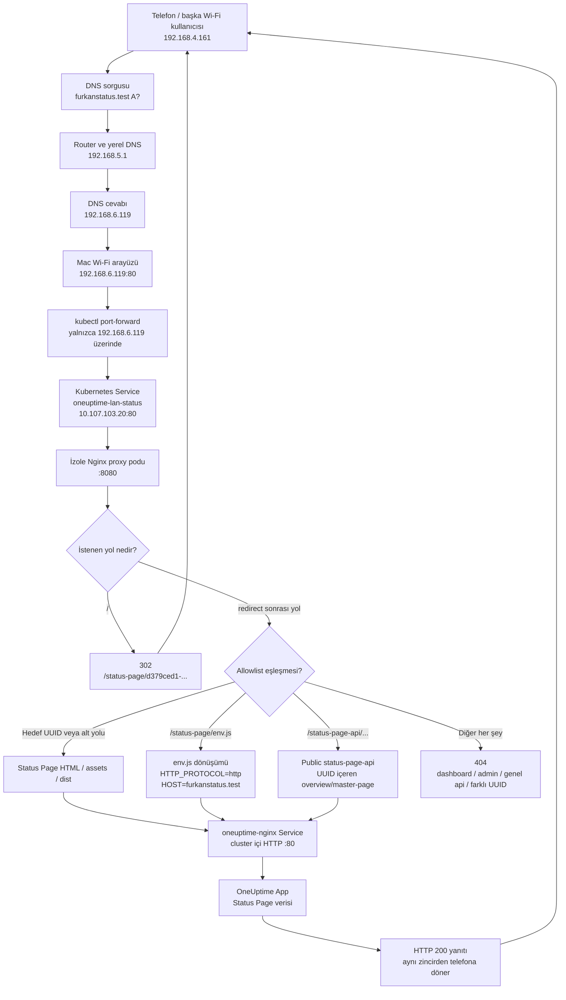

# LAN Status Page Uygulama Günlüğü ve Teknik Açıklama

Bu belge, çalışan OneUptime kurulumundaki tek bir public Status Page'in aynı
Wi-Fi ağına açılması için yapılan incelemeyi, alınan kararları, eklenen proxy
yapılandırmasını, bütün önemli terminal kontrollerini ve son trafik akışını
kronolojik olarak açıklar.

Belgedeki hedef Status Page:

```text
/status-page/d379ced1-bc31-4acc-8252-8f1fb571e5b6
```

LAN için seçilen kısa ad:

```text
http://furkanstatus.test
```

Kurulum sırasında kullanılan önemli ağ değerleri:

| Değer | Sonuç |
|---|---|
| Mac Wi-Fi IPv4 adresi | `192.168.6.119` |
| Telefonun gözlenen IPv4 adresi | `192.168.4.161` |
| Router/default gateway | `192.168.5.1` |
| Ağın DNS sunucusu | `192.168.5.1` |
| DHCP search domain | `lan` |
| Kubernetes context | `oneuptime` |
| Kubernetes namespace | `oneuptime` |
| İzole proxy Service | `oneuptime-lan-status` |
| İzole proxy Service IP | `10.107.103.20` |

> Terminal kontrollerinin bazıları aynı anda çalıştırıldı. Aşağıdaki sıra,
> teknik kararların oluştuğu mantıksal ve kronolojik sıradır. Çok uzun komut
> çıktılarında yalnızca kararı etkileyen satırlar gösterilmiştir.

## 1. Amaç, güvenlik sınırı ve nihai sonuç

Amaç yalnızca OneUptime portunu Wi-Fi ağına açmak değildi. Basitçe mevcut
port-forward komutuna `--address 0.0.0.0` eklemek şu yolların tamamını LAN'a
açabilirdi:

- OneUptime dashboard
- Admin arayüzü
- Identity ve oturum açma yolları
- Genel `/api` yüzeyi
- Telemetry ve probe ingest uçları
- Status Page dışındaki uygulama sayfaları

Bu nedenle mevcut TLS proxy değiştirilmedi. Yanına yalnızca seçilen Status
Page'in ihtiyaç duyduğu yolları izin listesine alan ikinci bir Nginx proxy
eklendi.

Nihai güvenlik davranışı şöyledir:

| İstek | Beklenen davranış |
|---|---|
| `/` | Hedef Status Page'e `302` redirect |
| Hedef Status Page UUID yolu | `200` |
| Hedef sayfanın alt yolları | Upstream'e iletilir |
| `/status-page/assets/...` | Statik dosya için izinli |
| `/status-page/dist/...` | JavaScript bundle için izinli |
| `/status-page/env.js` | LAN host/protokolü için dönüştürülerek izinli |
| `/status-page-api/...` | OneUptime public Status Page API için izinli |
| Farklı bir Status Page UUID yolu | `404` |
| `/dashboard` | `404` |
| `/admin` | `404` |
| Genel `/api/...` | `404` |

İzole proxy Kubernetes içinde `ClusterIP` olarak kaldı. Dış ağ erişimi yalnızca
Mac'in Wi-Fi IP'sine bağlanan kontrollü `kubectl port-forward` işlemiyle
sağlandı.

## 2. Eklenen dosyalar

Bu çalışma sırasında aşağıdaki dosyalar eklendi:

```text
k8s/lan-status/
├── kustomization.yaml
├── nginx.conf
└── proxy.yaml

scripts/
└── port-forward-status-page-lan.sh

docs/tr/kurulum/
└── LAN_STATUS_PAGE.md

docs/tr/trouble-shooting/
└── LAN_STATUS_PAGE_UYGULAMA_GUNLUGU.md
```

Mevcut `k8s/local-tls` dosyaları, OneUptime Helm host değeri ve çalışan ana
gateway değiştirilmedi.

## 3. `nginx.conf` ayrıntılı açıklaması

Dosya:
[`k8s/lan-status/nginx.conf`](../../../k8s/lan-status/nginx.conf)

### 3.1 PID ve geçici dosyalar

```nginx
pid /tmp/nginx.pid;

events {}

http {
  access_log /dev/stdout;
  error_log /dev/stderr warn;

  client_body_temp_path /tmp/client_temp;
  proxy_temp_path /tmp/proxy_temp;
  fastcgi_temp_path /tmp/fastcgi_temp;
  uwsgi_temp_path /tmp/uwsgi_temp;
  scgi_temp_path /tmp/scgi_temp;
```

Container `readOnlyRootFilesystem: true` ile çalıştırıldığı için Nginx'in PID ve
geçici dosyaları yazılabilir `/tmp` volume'una yönlendirilir. Access ve error
loglarının stdout/stderr'e yazılması logları `kubectl logs` ile görünür yapar.

### 3.2 Upgrade/WebSocket bağlantı başlığı

```nginx
map $http_upgrade $connection_upgrade {
  default upgrade;
  '' close;
}
```

İstemci Upgrade başlığı gönderdiğinde upstream bağlantısına `upgrade`, normal
HTTP isteğinde `close` gönderilir. Status Page API'nin uzun bağlantı veya
WebSocket kullanması durumunda proxy hazır kalır.

### 3.3 Listener ve sunucu adı

```nginx
server {
  listen 8080;
  listen [::]:8080;
  server_name furkanstatus.test;

  server_tokens off;
  absolute_redirect off;
```

- Nginx root olmayan `101` kullanıcısıyla çalıştığı için container içinde
  ayrıcalıksız `8080` portunu dinler.
- Kubernetes Service dışarıya `80` sunar ve container `8080` portuna yollar.
- `server_name`, beklenen HTTP Host değerini belgeler; DNS kaydı oluşturmaz.
- `absolute_redirect off`, Nginx'in container içindeki `8080` portunu redirect
  yanıtına yazmasını engeller. Böylece istemci dışarıda port `80` kullanmaya
  devam eder.
- `server_tokens off`, Nginx sürümünün hata yanıtlarında gösterilmesini azaltır.

`absolute_redirect off` ilk sürümde yoktu. Geçici `18082` testinde root isteği
dahili `8080` portuna yönlenince bu ayar eklendi.

### 3.4 Güvenlik başlıkları

```nginx
add_header X-Content-Type-Options nosniff always;
add_header X-Frame-Options SAMEORIGIN always;
add_header Referrer-Policy no-referrer always;
```

- `nosniff`, tarayıcının içerik türü tahmini yapmasını engeller.
- `SAMEORIGIN`, sayfanın başka origin'lerde frame içine alınmasını sınırlar.
- `no-referrer`, farklı isteklere Status Page URL'sinin referrer olarak
  taşınmasını engeller.

### 3.5 Kısa URL redirect'i

```nginx
location = / {
  return 302 /status-page/d379ced1-bc31-4acc-8252-8f1fb571e5b6;
}
```

`http://furkanstatus.test` isteği yalnızca seçilen Status Page'e yönlenir.
Redirect hedefi relative tutulur; istemcinin kullandığı host adı korunur.

### 3.6 `env.js` dönüşümü neden gerekliydi?

OneUptime Status Page HTML'i aşağıdaki runtime dosyasını yükler:

```html
<script src="/status-page/env.js"></script>
```

Mevcut kurulumun orijinal `env.js` değerleri şunlardı:

```json
"HTTP_PROTOCOL":"https"
"HOST":"oneuptime.furkan.test"
```

Bu değerler değiştirilmeden sayfa LAN IP'sinden açılırsa JavaScript API
isteklerini tekrar `https://oneuptime.furkan.test/status-page-api/...` adresine
gönderir. Telefondaki DNS bu adı bilmediği için HTML açılsa bile veri yüklenmez.

Bu nedenle yalnızca `env.js` yanıtı aşağıdaki blokla dönüştürülür:

```nginx
location = /status-page/env.js {
  proxy_pass http://oneuptime-nginx.oneuptime.svc.cluster.local:80;
  proxy_http_version 1.1;
  proxy_set_header Host oneuptime.furkan.test;
  proxy_set_header X-Real-IP $remote_addr;
  proxy_set_header X-Forwarded-For $proxy_add_x_forwarded_for;
  proxy_set_header X-Forwarded-Host $http_host;
  proxy_set_header X-Forwarded-Proto http;
  proxy_set_header Accept-Encoding "";

  sub_filter_once on;
  sub_filter_types application/javascript text/javascript text/plain;
  sub_filter '"HTTP_PROTOCOL":"https"' '"HTTP_PROTOCOL":"http"';
  sub_filter '"HOST":"oneuptime.furkan.test"' '"HOST":"$http_host"';
}
```

Satırların görevleri:

- `proxy_pass`, isteği cluster içindeki mevcut OneUptime gateway'e yollar.
- Upstream `Host` değeri canonical OneUptime host olarak bırakılır.
- `X-Forwarded-Host`, kullanıcının gerçek LAN host adını taşır.
- `X-Forwarded-Proto http`, LAN listener'ın HTTP olduğunu bildirir.
- `Accept-Encoding ""`, upstream'in gzip sıkıştırmasını kapatır; `sub_filter`
  sıkıştırılmış içerik üzerinde değişiklik yapamaz.
- İlk `sub_filter`, API protokolünü `https` yerine `http` yapar.
- İkinci `sub_filter`, sabit OneUptime hostunu istekte gelen `Host` ile
  değiştirir. IP ile açılırsa IP, `furkanstatus.test` ile açılırsa bu ad yazılır.

İlk denemede `sub_filter_types` içinde `text/javascript` yoktu. Testte içerik
değişmeden kaldığı görülünce upstream MIME türüne uygun olarak bu değer eklendi.

### 3.7 Ortak statik dosyalar

```nginx
location ^~ /status-page/assets/ { ... }
location ^~ /status-page/dist/ { ... }
```

Status Page tek HTML dosyasından oluşmaz. Font, Tailwind JavaScript dosyası,
ana bundle ve dinamik chunk dosyaları bu iki prefix altından gelir. Bunlar
olmadan sayfa boş veya biçimsiz görünür.

`^~` prefix eşleşmesi, bu yolların catch-all `404` bloğuna düşmesini engeller.
Dashboard asset yolları izin listesinde olmadığı için açılmaz.

### 3.8 Yalnızca hedef UUID

```nginx
location = /status-page/d379ced1-bc31-4acc-8252-8f1fb571e5b6 { ... }

location ^~ /status-page/d379ced1-bc31-4acc-8252-8f1fb571e5b6/ { ... }
```

İlk blok UUID'nin tam yolunu, ikinci blok RSS, incident ayrıntısı veya istemci
taraflı alt rotalar gibi aynı UUID altında kalan yolları kabul eder. Başka bir
UUID `/status-page/0000...` şeklinde istendiğinde bu iki location eşleşmez ve
sondaki `404` bloğuna düşer.

### 3.9 Public Status Page API

```nginx
location ^~ /status-page-api/ {
  proxy_pass http://oneuptime-nginx.oneuptime.svc.cluster.local:80;
  proxy_http_version 1.1;
  proxy_set_header Host oneuptime.furkan.test;
  proxy_set_header X-Real-IP $remote_addr;
  proxy_set_header X-Forwarded-For $proxy_add_x_forwarded_for;
  proxy_set_header X-Forwarded-Host $http_host;
  proxy_set_header X-Forwarded-Proto http;
  proxy_set_header Upgrade $http_upgrade;
  proxy_set_header Connection $connection_upgrade;
  proxy_read_timeout 3600s;
}
```

Telefon loglarında sayfanın özellikle şu public uçları kullandığı görüldü:

```text
GET  /status-page-api/favicon/d379ced1-bc31-4acc-8252-8f1fb571e5b6
POST /status-page-api/master-page/d379ced1-bc31-4acc-8252-8f1fb571e5b6
POST /status-page-api/overview/d379ced1-bc31-4acc-8252-8f1fb571e5b6
```

Bu prefix genel `/api`, identity veya admin API değildir. Bununla birlikte bu
proxy bir uygulama yetkilendirme katmanı değildir; `status-page-api` zaten
OneUptime'ın public Status Page yüzeyidir. Asıl public/private kuralı OneUptime
Status Page kaydında uygulanmaya devam eder.

### 3.10 Varsayılan ret kuralı

```nginx
location / {
  return 404;
}
```

İzin listesine girmeyen her şey upstream'e ulaşmadan proxy tarafından
reddedilir. Bu blok, yalnızca `kubectl port-forward --address` kullanmaya göre
temel güvenlik farkıdır.

## 4. `proxy.yaml` ayrıntılı açıklaması

Dosya:
[`k8s/lan-status/proxy.yaml`](../../../k8s/lan-status/proxy.yaml)

### 4.1 Deployment

```yaml
apiVersion: apps/v1
kind: Deployment
metadata:
  name: oneuptime-lan-status
```

Mevcut `oneuptime-local-tls` Deployment'ından bağımsız yeni bir workload
oluşturulur. Böylece LAN proxy güncellemesi ana dashboard TLS yoluna dokunmaz.

```yaml
spec:
  replicas: 1
  selector:
    matchLabels:
      app.kubernetes.io/name: oneuptime-lan-status
```

Bir yerel laboratuvar proxy'si için tek replica yeterlidir. Selector ile pod
label'ı aynı tutulur; Service de aynı label üzerinden bu podu bulur.

### 4.2 Pod güvenliği ve node seçimi

```yaml
spec:
  automountServiceAccountToken: false
  nodeSelector:
    app: oneuptime-core
```

- Proxy Kubernetes API çağrısı yapmadığı için ServiceAccount token mount edilmez.
- `nodeSelector`, podu OneUptime core workload'larının bulunduğu node'a koyar.

```yaml
securityContext:
  allowPrivilegeEscalation: false
  capabilities:
    drop:
      - ALL
  readOnlyRootFilesystem: true
  runAsNonRoot: true
  runAsUser: 101
  runAsGroup: 101
  seccompProfile:
    type: RuntimeDefault
```

Container root değildir, Linux capability'lerinin tamamı düşürülür, privilege
escalation kapatılır ve root filesystem salt okunurdur. Nginx yalnızca `/tmp`
volume'una yazabilir.

### 4.3 Port, probe ve kaynaklar

```yaml
ports:
  - name: http
    containerPort: 8080
```

Container ayrıcalıksız `8080` portunu dinler.

```yaml
readinessProbe:
  tcpSocket:
    port: http
livenessProbe:
  tcpSocket:
    port: http
```

- Readiness başarılı olmadan Service podu hazır endpoint olarak kullanmaz.
- Liveness uzun süre port açamazsa container'ı yeniden başlatır.

```yaml
resources:
  requests:
    cpu: 10m
    memory: 16Mi
  limits:
    cpu: 200m
    memory: 128Mi
```

Proxy'nin scheduler talebi küçük tutulur; kontrolsüz kaynak tüketimi limitlerle
sınırlandırılır.

### 4.4 ConfigMap ve `/tmp` volume'ları

```yaml
volumeMounts:
  - name: nginx-config
    mountPath: /etc/nginx/nginx.conf
    subPath: nginx.conf
    readOnly: true
  - name: temporary-files
    mountPath: /tmp
```

Nginx yapılandırması ConfigMap'ten tek dosya olarak salt okunur mount edilir.
Root filesystem salt okunur olduğu için PID ve proxy temp dosyaları `emptyDir`
üzerindeki `/tmp` alanına yazılır.

### 4.5 ClusterIP Service

```yaml
apiVersion: v1
kind: Service
metadata:
  name: oneuptime-lan-status
spec:
  type: ClusterIP
  ports:
    - name: http
      port: 80
      targetPort: http
```

Service yalnızca cluster içinde `80` portu sunar ve podun isimlendirilmiş
`http`, yani `8080` portuna yollar. NodePort veya LoadBalancer kullanılmadığı
için Service kendi başına Wi-Fi ağına açılmaz.

Canlı kontrolde Service IP'si:

```text
10.107.103.20
```

## 5. `kustomization.yaml` ayrıntılı açıklaması

Dosya:
[`k8s/lan-status/kustomization.yaml`](../../../k8s/lan-status/kustomization.yaml)

Dosyanın tamamı:

```yaml
apiVersion: kustomize.config.k8s.io/v1beta1
kind: Kustomization

namespace: oneuptime

resources:
  - proxy.yaml

configMapGenerator:
  - name: oneuptime-lan-status-nginx
    files:
      - nginx.conf

generatorOptions:
  disableNameSuffixHash: true
  labels:
    app.kubernetes.io/name: oneuptime-lan-status
    app.kubernetes.io/part-of: oneuptime
```

Açıklaması:

1. Bütün kaynaklar `oneuptime` namespace'ine yerleştirilir.
2. Deployment ve Service `proxy.yaml` dosyasından alınır.
3. `nginx.conf`, `oneuptime-lan-status-nginx` adlı ConfigMap'e dönüştürülür.
4. Ortak label'lar üretilen ConfigMap'e eklenir.
5. `disableNameSuffixHash: true`, ConfigMap adını sabit tutar.

Sabit ad kullanmanın operasyonel sonucu önemlidir: Deployment manifestindeki
ConfigMap referansı değişmez. Ayrıca `subPath` ile mount edilen ConfigMap dosyası
çalışan container içinde otomatik yenilenmez. Nginx config değişikliğinin hemen
etkinleşmesi istenirse şu komut gerekir:

```bash
kubectl --context oneuptime -n oneuptime \
  rollout restart deployment/oneuptime-lan-status
```

Ancak bir rollout, Service üzerinden seçilmiş mevcut `kubectl port-forward`
oturumunu koparabilir. Son `furkanstatus.test` ad güncellemesinde çalışan telefon
tünelini bozmamak için yalnızca ConfigMap uygulandı ve rollout yapılmadı. Canlı
pod tek server bloğu olduğu için farklı `Host` değerlerini yine aynı allowlist
ile işledi; testte `Host: furkanstatus.test` başarılı oldu. Pod bir sonraki doğal
restartında güncel `server_name` değerini yükleyecektir.

## 6. LAN port-forward betiği

Dosya:
[`scripts/port-forward-status-page-lan.sh`](../../../scripts/port-forward-status-page-lan.sh)

Betiğin görevi Kubernetes Service'i yalnızca Mac'in Wi-Fi IP adresinde
yayınlamaktır.

### 6.1 Strict mode ve varsayılanlar

```bash
set -euo pipefail

KUBE_CONTEXT="${KUBE_CONTEXT:-oneuptime}"
NAMESPACE="${NAMESPACE:-oneuptime}"
WIFI_INTERFACE="${WIFI_INTERFACE:-en0}"
LOCAL_HTTP_PORT="${LOCAL_HTTP_PORT:-80}"
LAN_ADDRESS="${LAN_ADDRESS:-}"
DNS_NAME="${DNS_NAME:-furkanstatus.test}"
```

- Tanımsız değişken ve başarısız komutlarda betik durur.
- Değerler environment variable ile override edilebilir.
- Varsayılan Wi-Fi arayüzü macOS'taki `en0`'dır.

### 6.2 Wi-Fi IP keşfi ve doğrulama

```bash
LAN_ADDRESS="$(ipconfig getifaddr "${WIFI_INTERFACE}" 2>/dev/null || true)"
```

Adres bulunamazsa betik açık hata verir. Kullanıcı gerektiğinde şunu kullanabilir:

```bash
LAN_ADDRESS=192.168.6.119 ./scripts/port-forward-status-page-lan.sh
```

### 6.3 Service ön kontrolü

```bash
kubectl --context oneuptime --namespace oneuptime \
  get service oneuptime-lan-status
```

Service kurulmamışsa port-forward başlamadan hata alınır. Böylece terminal açık
göründüğü halde hedefi olmayan bir tünel oluşmaz.

### 6.4 Neden `--address 192.168.6.119`?

Son komutun temel kısmı:

```bash
kubectl --context oneuptime --namespace oneuptime \
  port-forward --address 192.168.6.119 \
  service/oneuptime-lan-status 80:80
```

- Varsayılan `kubectl port-forward` yalnızca `127.0.0.1` ve `::1` dinler.
- `--address 192.168.6.119` kullanıldığında aynı Wi-Fi ağındaki cihazlar Mac'e
  bağlanabilir.
- `0.0.0.0` kullanılmadığı için Ethernet, VPN veya başka aktif arayüzlerde
  gereksiz listener açılmaz.
- Mac'in `127.0.0.1:80/443` üzerindeki mevcut local HTTPS tüneliyle çakışmaz.

Port `80` ayrıcalıklı olduğu için betik gerektiğinde `sudo` kullanır ve mevcut
kullanıcının kubeconfig yolunu root sürecine açıkça geçirir.

Terminal açık tutulmalıdır. Seçilen proxy podu restart olursa port-forward da
sona erebilir ve betik yeniden çalıştırılmalıdır.

### 6.5 Betik DNS oluşturmaz

Betiğin yazdığı şu satır bilgilendirmedir:

```text
Router DNS kaydi: furkanstatus.test -> 192.168.6.119
```

`kubectl`, Nginx ve macOS listener router'ın DNS tablosunu değiştirmez. `.test`
adının bütün Wi-Fi istemcilerinde çalışması için router üzerinde A/Host Override
kaydı gerekir.

## 7. Terminal işlemleri: kronolojik uygulama ve karar günlüğü

### 7.1 Çalışma ağacını, container'ları ve listener'ları inceleme

İlk amaç mevcut sistemi değiştirmeden hangi bileşenin dışarıya trafik sunduğunu
bulmaktı.

```bash
git status --short
docker ps --format 'table {{.Names}}\t{{.Ports}}\t{{.Status}}'
lsof -nP -iTCP -sTCP:LISTEN | head -n 120
```

İlgili çıktı:

```text
NAMES                   PORTS                                  STATUS
oneuptime               127.0.0.1:...->32443/tcp              Up
oneuptime-m02           127.0.0.1:...->32443/tcp              Up

node ... TCP *:3000 (LISTEN)
```

İlk arama komutundaki shell glob'u eşleşmeyince şu hata da alındı:

```text
zsh:1: no matches found: docker-compose*.yml
```

Karar: Docker portları çoğunlukla loopback'e bağlıydı. `*:3000` tek başına
OneUptime giriş noktası kabul edilmedi; HTTP davranışı ayrıca test edildi.

### 7.2 Mevcut HTTPS Status Page'i doğrulama

```bash
curl -k -sS -o /dev/null -D - --max-time 10 \
  'https://oneuptime.furkan.test/status-page/d379ced1-bc31-4acc-8252-8f1fb571e5b6'
```

Çıktı:

```text
HTTP/1.1 200 OK
Server: nginx/1.31.3
Content-Type: text/html; charset=utf-8
```

Karar: Status Page ve mevcut TLS proxy çalışıyordu. Yeni çalışma bunun yanına
eklenmeli, çalışan HTTPS yolu değiştirilmemeliydi.

### 7.3 `*:3000` listener'ın doğru gateway olmadığını kanıtlama

```bash
curl -sS -o /dev/null -D - --max-time 10 \
  -H 'Host: oneuptime.furkan.test' \
  'http://127.0.0.1:3000/status-page/d379ced1-bc31-4acc-8252-8f1fb571e5b6'
```

Çıktı:

```text
HTTP/1.1 404 Not Found
```

Karar: LAN yayını doğrudan host `3000` portuna bağlanmamalıydı.

### 7.4 Mevcut hosts kaydını kontrol etme

```bash
rg -n 'oneuptime\.furkan\.test|furkanstatus' /etc/hosts
```

Çıktı:

```text
12:127.0.0.1 oneuptime.furkan.test
```

Karar: `oneuptime.furkan.test` yalnızca bu Mac'te loopback'e çözülüyordu. Bu
kayıt Wi-Fi'daki telefonlara dağıtılmaz.

### 7.5 Mevcut local TLS proxy ve port-forward betiklerini okuma

```bash
sed -n '1,260p' scripts/setup-local-https.sh
sed -n '1,220p' scripts/port-forward-https.sh
sed -n '1,280p' k8s/local-tls/nginx.conf
sed -n '1,260p' k8s/local-tls/proxy.yaml
```

Önemli bulgular:

```text
LOCAL_HOST=oneuptime.furkan.test
kubectl ... port-forward service/oneuptime-local-tls 80:80 443:443
```

Mevcut `kubectl port-forward` komutunda `--address` bulunmuyordu. Kubectl
varsayılan olarak yalnızca loopback dinlediği için telefon erişemiyordu.

### 7.6 Mac'in Wi-Fi IP adresini bulma

```bash
ifconfig | rg -n '^[a-z0-9]+:|inet '
```

İlgili çıktı:

```text
en0: flags=...
inet 192.168.6.119 netmask 0xfffffc00 broadcast 192.168.7.255
```

Karar: Listener yalnızca `192.168.6.119` üzerinde açılacaktı. Subnet `/22`
olduğu için `192.168.4.161` adresli telefon da aynı yerel ağdaydı.

### 7.7 HTTP redirect'in mevcut local hostta çalıştığını doğrulama

```bash
curl -sS -o /dev/null -D - --max-time 10 \
  'http://oneuptime.furkan.test/status-page/d379ced1-bc31-4acc-8252-8f1fb571e5b6'
```

Çıktı:

```text
HTTP/1.1 308 Permanent Redirect
Location: https://oneuptime.furkan.test/status-page/d379ced1-bc31-4acc-8252-8f1fb571e5b6
```

Karar: Ana local proxy HTTP'yi HTTPS'e zorluyordu. LAN istemcilerinde aynı HTTPS
tasarımı kullanılırsa her telefona local CA sertifikası kurulması gerekecekti.

### 7.8 Kubernetes API erişimini ve canlı servisleri kontrol etme

İlk sandbox denemesinde yerel Kubernetes API soketine erişim engellendi:

```text
Unable to connect to the server:
dial tcp 127.0.0.1:52759: connect: operation not permitted
```

Salt okunur komut gerekli izinle yeniden çalıştırıldı:

```bash
kubectl --context oneuptime -n oneuptime \
  get svc oneuptime-local-tls oneuptime-nginx -o wide

kubectl --context oneuptime -n oneuptime \
  get pod -l app.kubernetes.io/name=oneuptime-local-tls -o wide
```

İlgili çıktı:

```text
oneuptime-local-tls   ClusterIP      80/TCP,443/TCP
oneuptime-nginx       LoadBalancer   80:31683/TCP,443:31367/TCP
oneuptime-local-tls-...  1/1 Running
```

Karar: Cluster sağlıklıydı. İzole proxy upstream olarak cluster içindeki
`oneuptime-nginx:80` Service'ini kullanabilirdi.

### 7.9 Mevcut sertifikanın LAN adlarını kapsamadığını kontrol etme

```bash
openssl x509 -in k8s/local-tls/certs/localhost.crt \
  -noout -subject -issuer -dates

openssl x509 -in k8s/local-tls/certs/localhost.crt -noout -text |
  rg -A2 'Subject Alternative Name'
```

Çıktı:

```text
subject= /CN=oneuptime.furkan.test
issuer= /CN=OneUptime Local Development CA
DNS:oneuptime.furkan.test, DNS:localhost,
IP Address:127.0.0.1, IP Address:::1
```

Karar: Sertifika `furkanstatus`, `furkanstatus.local`, `furkanstatus.test` veya
`192.168.6.119` için geçerli değildi. LAN için HTTP seçilerek bütün istemcilere
CA yükleme zorunluluğu kaldırıldı.

### 7.10 `kubectl port-forward --address` desteğini doğrulama

```bash
kubectl port-forward --help | sed -n '1,180p'
```

İlgili çıktı:

```text
--address=[localhost]
Addresses to listen on (comma separated)

kubectl port-forward --address 0.0.0.0 pod/mypod 8888:5000
```

Karar: Wi-Fi IP'sine özel bind teknik olarak destekleniyordu. `0.0.0.0` yerine
tek IP kullanılacaktı.

### 7.11 Doğrudan LAN IP'sinin henüz dinlenmediğini doğrulama

```bash
curl -k -sS -o /dev/null -D - --max-time 10 \
  'https://192.168.6.119/status-page/d379ced1-bc31-4acc-8252-8f1fb571e5b6'

curl -sS -o /dev/null -D - --max-time 10 \
  'http://192.168.6.119/status-page/d379ced1-bc31-4acc-8252-8f1fb571e5b6'
```

Çıktı:

```text
Failed to connect to 192.168.6.119 port 443
Failed to connect to 192.168.6.119 port 80
```

Karar: Mevcut tünel yalnızca loopback'teydi; Wi-Fi listener ayrıca açılmalıydı.

### 7.12 Status Page HTML bağımlılıklarını inceleme

```bash
curl -k -sS --max-time 10 \
  'https://oneuptime.furkan.test/status-page/d379ced1-bc31-4acc-8252-8f1fb571e5b6'
```

HTML içindeki önemli yollar:

```html
<script src="/status-page/env.js"></script>
<link rel="icon" href="/status-page-api/favicon/d379ced1-bc31-4acc-8252-8f1fb571e5b6">
<link rel="preload" href="/status-page/assets/fonts/InterVariable.woff2">
<script src="/status-page/assets/js/tailwind-3.4.5.js"></script>
<script type="module" src="/status-page/dist/Index.js"></script>
```

Karar: Yalnızca UUID HTML yoluna izin vermek yeterli değildi. Ortak assets,
dist, env.js ve public Status Page API yolları da gerekliydi.

### 7.13 `env.js` içeriğini inceleme

```bash
curl -k -sS --max-time 10 \
  'https://oneuptime.furkan.test/status-page/env.js'
```

İlgili çıktı:

```text
"HTTP_PROTOCOL":"https"
"HOST":"oneuptime.furkan.test"
"STATUS_PAGE_CNAME_RECORD":""
```

Karar: LAN hostundan açılan JavaScript yanlış hosta dönmesin diye yalnızca
runtime config yanıtı proxy katmanında değiştirilecekti.

### 7.14 OneUptime gateway'in gerçek route'larını inceleme

```bash
kubectl --context oneuptime -n oneuptime \
  exec deployment/oneuptime-nginx -- nginx -T
```

Çok uzun çıktının ilgili kısmı:

```nginx
location /status-page { ... }

location /status-page-api/ {
  rewrite ^/status-page-api/(.*)$ /api/status-page/$1 break;
  proxy_pass http://backend_app;
}

location /status-page-sso-api/ { ... }
location /status-page-oidc-api/ { ... }
location /status-page-identity-api/ { ... }
location /dashboard { ... }
location /admin { ... }
location /api { ... }
```

Karar: Yeni edge proxy yalnızca `/status-page`, gerekli statik yollar ve
`/status-page-api` prefix'ini geçirecek; dashboard/admin/genel API'yi
geçirmeyecekti.

### 7.15 Frontend bundle'ın URL üretimini inceleme

Bundle dosyaları çalışan gateway içinden salt okunur alındı:

```bash
kubectl --context oneuptime -n oneuptime \
  exec deployment/oneuptime-nginx -- \
  wget -qO- http://127.0.0.1:7849/status-page/dist/chunk-BZK3XGKP.js |
  rg -n -C 8 'StatusPageApiRoute|StatusPageCNameRecord|HTTP_PROTOCOL|HOST ='
```

İlgili çıktı:

```javascript
var StatusPageApiRoute = new Route("/status-page-api");
var HTTP_PROTOCOL = env("HTTP_PROTOCOL") === "https" ? ...;
var HOST = env("HOST") || "";
var STATUS_PAGE_HOSTNAME = Hostname.fromString(HOST);
var STATUS_PAGE_API_URL = new URL2(
  HTTP_PROTOCOL,
  STATUS_PAGE_HOSTNAME,
  new Route(StatusPageApiRoute.toString())
);
```

Karar: `env.js` host/protokol dönüşümünün gerekli olduğu bundle koduyla da
kanıtlandı.

### 7.16 İzole proxy dosyalarını oluşturma

Bu incelemelerden sonra şu dosyalar patch ile oluşturuldu:

```text
k8s/lan-status/nginx.conf
k8s/lan-status/proxy.yaml
k8s/lan-status/kustomization.yaml
scripts/port-forward-status-page-lan.sh
docs/tr/kurulum/LAN_STATUS_PAGE.md
```

Karar ilkeleri:

- Mevcut `oneuptime-local-tls` değiştirilmedi.
- Yeni Service `ClusterIP` kaldı.
- Nginx allowlist uyguladı.
- LAN tüneli yalnızca Wi-Fi IP'sini dinledi.
- HTTP kullanıldı; local CA dağıtımı gerekmedi.

### 7.17 Render ve shell doğrulamaları

```bash
chmod +x scripts/port-forward-status-page-lan.sh
bash -n scripts/port-forward-status-page-lan.sh
git diff --check
kubectl kustomize k8s/lan-status
```

Sonuç:

- Bash syntax hatası yoktu.
- Whitespace/diff hatası yoktu.
- Kustomize geçerli ConfigMap, Service ve Deployment üretti.

Ek olarak `shellcheck` arandı:

```bash
command -v shellcheck
```

Çıktı:

```text
shellcheck not installed
```

Bu nedenle shell doğrulaması `bash -n` ile sınırlı kaldı.

### 7.18 Kubernetes'e ilk uygulama

```bash
kubectl --context oneuptime apply -k k8s/lan-status

kubectl --context oneuptime -n oneuptime \
  rollout status deployment/oneuptime-lan-status --timeout=180s
```

Çıktı:

```text
configmap/oneuptime-lan-status-nginx created
service/oneuptime-lan-status created
deployment.apps/oneuptime-lan-status created
deployment "oneuptime-lan-status" successfully rolled out
```

Karar: Mevcut OneUptime Deployment'larına dokunmadan yeni proxy hazırdı.

### 7.19 İlk allowlist testleri

Testler proxy podunun içinden yapıldı:

```bash
kubectl --context oneuptime -n oneuptime \
  exec deployment/oneuptime-lan-status -- \
  curl -sS -o /dev/null -w '%{http_code}\n' \
  -H 'Host: furkanstatus' \
  http://127.0.0.1:8080/status-page/d379ced1-bc31-4acc-8252-8f1fb571e5b6
```

Politika sonuçları:

```text
root                 302
target status page   200
other status page    404
dashboard            404
general api          404
```

Karar: Path allowlist doğru çalışıyordu.

### 7.20 İlk `env.js` testinin başarısız olması

```bash
kubectl --context oneuptime -n oneuptime \
  exec deployment/oneuptime-lan-status -- \
  curl -sS -H 'Host: furkanstatus' \
  http://127.0.0.1:8080/status-page/env.js
```

Beklenen değişiklik oluşmadı:

```text
"HTTP_PROTOCOL":"https"
"HOST":"oneuptime.furkan.test"
```

Sebep: Upstream dosyanın MIME türü `text/javascript` idi; ilk
`sub_filter_types` listesi bu türü içermiyordu.

Düzeltme:

```nginx
sub_filter_types application/javascript text/javascript text/plain;
```

Ardından:

```bash
kubectl --context oneuptime apply -k k8s/lan-status
kubectl --context oneuptime -n oneuptime \
  rollout restart deployment/oneuptime-lan-status
kubectl --context oneuptime -n oneuptime \
  rollout status deployment/oneuptime-lan-status --timeout=180s
```

Yeniden test:

```bash
kubectl --context oneuptime -n oneuptime \
  exec deployment/oneuptime-lan-status -- \
  curl -sS -H 'Host: furkanstatus' \
  http://127.0.0.1:8080/status-page/env.js |
  rg -o '"HTTP_PROTOCOL":"[^"]+"|"HOST":"[^"]+"'
```

Çıktı:

```text
"HTTP_PROTOCOL":"http"
"HOST":"furkanstatus"
```

Karar: Frontend artık API çağrılarını LAN origin'ine yapacaktı.

### 7.21 Gerçek Wi-Fi IP'sinde geçici port testi

Standart port `80` testinden önce root gerektirmeyen `18082` kullanıldı:

```bash
kubectl --context oneuptime -n oneuptime \
  port-forward --address 192.168.6.119 \
  service/oneuptime-lan-status 18082:80
```

Çıktı:

```text
Forwarding from 192.168.6.119:18082 -> 8080
```

İlk root testi:

```bash
curl -sS -o /dev/null \
  -w 'root=%{http_code} redirect=%{redirect_url}\n' \
  -H 'Host: furkanstatus:18082' \
  http://192.168.6.119:18082/
```

İlk çıktı:

```text
root=302 redirect=http://furkanstatus:8080/status-page/d379ced1-bc31-4acc-8252-8f1fb571e5b6
```

Sorun: Nginx dış port yerine kendi dinlediği `8080` portunu absolute redirect'e
yazmıştı.

Düzeltme:

```nginx
absolute_redirect off;
```

### 7.22 Rollout sırasında geçici port-forward'un kopması

Config düzeltmesinden sonra proxy Deployment yeniden başlatıldı. Service'e
başlatılan mevcut port-forward eski podu seçmişti. Eski pod sonlanınca şu hata
alındı:

```text
error forwarding port 8080 to pod ...:
Error response from daemon: No such container
error: lost connection to pod
```

Karar: Bu beklenen bir `kubectl port-forward` yaşam döngüsü davranışıydı.
Geçici tünel kapatılıp yeni pod için tekrar başlatıldı.

### 7.23 Düzeltilmiş LAN testi

Tünel yeniden başlatıldı ve şu kontroller yapıldı:

```bash
curl -sS -o /dev/null \
  -w 'root=%{http_code} location=%{redirect_url}\n' \
  -H 'Host: furkanstatus:18082' \
  http://192.168.6.119:18082/

curl -sS -o /dev/null -w 'status_page=%{http_code}\n' \
  -H 'Host: furkanstatus:18082' \
  http://192.168.6.119:18082/status-page/d379ced1-bc31-4acc-8252-8f1fb571e5b6

curl -sS -o /dev/null -w 'other_status_page=%{http_code}\n' \
  -H 'Host: furkanstatus:18082' \
  http://192.168.6.119:18082/status-page/00000000-0000-0000-0000-000000000000

curl -sS -o /dev/null -w 'dashboard=%{http_code}\n' \
  -H 'Host: furkanstatus:18082' \
  http://192.168.6.119:18082/dashboard
```

Çıktı:

```text
root=302
status_page=200
other_status_page=404
dashboard=404
"HTTP_PROTOCOL":"http"
"HOST":"furkanstatus:18082"
```

Karar: Wi-Fi interface bind, redirect, hedef sayfa, ret politikası ve runtime
host dönüşümü birlikte çalışıyordu. Test tüneli `Ctrl+C` ile kapatıldı.

### 7.24 Mevcut HTTPS yolunun etkilenmediğini doğrulama

```bash
curl -k -sS -o /dev/null -w '%{http_code}\n' --max-time 5 \
  'https://oneuptime.furkan.test/status-page/d379ced1-bc31-4acc-8252-8f1fb571e5b6'
```

Çıktı:

```text
200
```

Karar: Yeni LAN Deployment'ı mevcut local HTTPS erişimini bozmamıştı.

### 7.25 Canlı Deployment ve log kontrolü

```bash
kubectl --context oneuptime -n oneuptime \
  get deployment/oneuptime-lan-status service/oneuptime-lan-status -o wide

kubectl --context oneuptime -n oneuptime \
  logs deployment/oneuptime-lan-status --tail=100
```

İlgili çıktı:

```text
deployment.apps/oneuptime-lan-status   1/1   1   1
service/oneuptime-lan-status   ClusterIP   10.107.103.20   80/TCP

GET /                                                   302
GET /status-page/d379ced1-bc31-4acc-8252-8f1fb571e5b6  200
GET /status-page/00000000-0000-0000-0000-000000000000  404
GET /dashboard                                          404
GET /status-page/env.js                                 200
```

Karar: Deployment hazırdı ve loglar allowlist testleriyle uyumluydu.

### 7.26 Telefonun IP ile yaptığı gerçek istekleri inceleme

Telefon doğrudan aşağıdaki URL ile bağlandı:

```text
http://192.168.6.119/status-page/d379ced1-bc31-4acc-8252-8f1fb571e5b6
```

Log kontrolü:

```bash
kubectl --context oneuptime -n oneuptime \
  logs deployment/oneuptime-lan-status --since=15m --timestamps
```

İlgili iPhone logları:

```text
GET  /status-page/d379ced1-bc31-4acc-8252-8f1fb571e5b6 200
GET  /status-page/env.js                                200
GET  /status-page/dist/Index.js                         200
GET  /status-page/assets/fonts/InterVariable.woff2      200
GET  /status-page/assets/js/tailwind-3.4.5.js           200
GET  /status-page/dist/chunk-RGN752JE.js                200
GET  /status-page/dist/chunk-BZK3XGKP.js                200
GET  /status-page-api/favicon/d379ced1-...              200
POST /status-page-api/master-page/d379ced1-...          200
POST /status-page-api/overview/d379ced1-...             200
```

User-Agent:

```text
Mozilla/5.0 (iPhone; CPU iPhone OS 18_7 like Mac OS X) ... Safari/604.1
```

Karar: Telefon → Mac → port-forward → proxy → OneUptime zinciri eksiksiz
çalışıyordu. Geriye yalnızca isim çözümleme kalmıştı.

### 7.27 `connection reset by peer` mesajını değerlendirme

Kullanıcı terminalinde şu mesaj görüldü:

```text
error copying from local connection to remote stream:
read tcp4 192.168.6.119:80->192.168.4.161:64015:
read: connection reset by peer
```

Bu sırada Nginx loglarında `furkanstatus` root isteği yoktu; IP ile açılan
sayfanın önceki bağlantıları ise başarılı `200` yanıtları almıştı.

Karar: Reset mesajı upstream veya proxy çökmesi değildi. Safari'nin daha önce
açtığı keep-alive/preconnect soketini kendi tarafından kapatmasıydı. Asıl
`furkanstatus` problemi HTTP katmanına ulaşmadan önceki DNS çözümlemesiydi.

### 7.28 `Host: furkanstatus` ile proxy davranışını DNS'ten bağımsız test etme

```bash
curl -sS -D - -o /dev/null --max-time 10 \
  -H 'Host: furkanstatus' http://192.168.6.119/

curl -sS -L -o /dev/null \
  -w 'final=%{http_code} url=%{url_effective}\n' \
  --max-time 10 -H 'Host: furkanstatus' http://192.168.6.119/
```

Çıktı:

```text
HTTP/1.1 302 Moved Temporarily
Location: /status-page/d379ced1-bc31-4acc-8252-8f1fb571e5b6

final=200
```

Karar: Nginx `furkanstatus` Host başlığını doğru işliyordu. DNS adı IP'ye
çözülseydi uygulama çalışacaktı.

### 7.29 DNS'te çıplak `furkanstatus` adını arama

```bash
dscacheutil -q host -a name furkanstatus
dig +short furkanstatus
```

Çıktı boştu.

Ardından doğrudan isimle istek denendi:

```bash
curl -sS -L -o /dev/null \
  -w 'code=%{http_code} ip=%{remote_ip} url=%{url_effective}\n' \
  --max-time 5 http://furkanstatus/
```

Çıktı:

```text
curl: (6) Could not resolve host: furkanstatus
code=000 ip= url=http://furkanstatus/
```

Karar: `server_name furkanstatus` DNS kaydı üretmiyordu. Router kaydı veya mDNS
gibi ayrı bir isim çözümleme mekanizması gerekiyordu.

### 7.30 Geçici Bonjour/mDNS deneyi

Önce araç seçenekleri kontrol edildi:

```bash
dns-sd -h
```

İlgili kullanım:

```text
dns-sd -P <Name> <Type> <Domain> <Port> <Host> <IP> [<TXT>...]
```

İlk kısıtlı deneme mDNSResponder'a erişemedi:

```text
DNSServiceCreateConnection returned -65563
```

Komut gerekli yerel izinle yeniden çalıştırıldı:

```bash
dns-sd -P furkanstatus _http._tcp local. 80 \
  furkanstatus.local. 192.168.6.119 \
  'path=/status-page/d379ced1-bc31-4acc-8252-8f1fb571e5b6'
```

Çıktı:

```text
Registering Service furkanstatus._http._tcp.local.
host furkanstatus.local. port 80
Got a reply for record furkanstatus.local.:
Name now registered and active
```

Karar: `.local` adı Bonjour ile router DNS olmadan yayınlanabiliyordu.

### 7.31 Kullanıcının özellikle belirttiği `.local` çözümleme ve ping testi

Çalıştırılan komut:

```bash
dscacheutil -q host -a name furkanstatus.local
ping -c 1 -W 1000 furkanstatus.local
```

Çıktı:

```text
name: furkanstatus.local
ip_address: 192.168.6.119

PING furkanstatus.local (192.168.6.119): 56 data bytes
64 bytes from 192.168.6.119: icmp_seq=0 ttl=64 time=0.118 ms
1 packets transmitted, 1 packets received, 0.0% packet loss
```

Yorum:

- `dscacheutil`, macOS sistem resolver'ının adı hangi IP'ye çevirdiğini gösterdi.
- Sonuç `192.168.6.119` olduğu için mDNS kaydı doğru yayınlanmıştı.
- Ping dönüşü ağ erişiminin de bulunduğunu gösterdi.

### 7.32 Kullanıcının özellikle belirttiği `.local` HTTP testi

Çalıştırılan komut:

```bash
curl -sS -L -o /dev/null \
  -w 'code=%{http_code} ip=%{remote_ip} url=%{url_effective}\n' \
  --max-time 10 http://furkanstatus.local/
```

Parametreler:

- `-sS`: progress çıktısını gizler, hataları gösterir.
- `-L`: root `302` redirect'ini takip eder.
- `-o /dev/null`: response body'yi yazdırmaz.
- `-w`: HTTP kodu, bağlanılan IP ve final URL'yi yazdırır.
- `--max-time 10`: istek için üst zaman sınırı koyar.

Çıktı:

```text
code=200 ip=192.168.6.119 \
url=http://furkanstatus.local/status-page/d379ced1-bc31-4acc-8252-8f1fb571e5b6
```

Karar: DNS/mDNS, TCP port 80, root redirect ve Status Page birlikte başarıyla
çalışıyordu.

### 7.33 `.local` yayını varken çıplak adın tekrar test edilmesi

Çalıştırılan komutlar:

```bash
dscacheutil -q host -a name furkanstatus

curl -sS -L -o /dev/null \
  -w 'code=%{http_code} ip=%{remote_ip} url=%{url_effective}\n' \
  --max-time 5 http://furkanstatus/
```

Çıktı:

```text
# dscacheutil çıktısı yok

curl: (6) Could not resolve host: furkanstatus
code=000 ip= url=http://furkanstatus/
```

Karar: mDNS yalnızca `.local` namespace'ini çözer. `furkanstatus.local`
çalışırken `furkanstatus` otomatik olarak çalışmaz. Geçici `dns-sd` yayını test
sonunda `Ctrl+C` ile kapatıldı.

### 7.34 Son adın `furkanstatus.test` olarak değiştirilmesi

Kullanıcı tercihi üzerine yapılandırmadaki beklenen ad değiştirildi:

```nginx
server_name furkanstatus.test;
```

Port-forward betiğinin bilgilendirme varsayılanı da değiştirildi:

```bash
DNS_NAME="${DNS_NAME:-furkanstatus.test}"
```

`.test` mDNS/Bonjour alanı olmadığı için geçici `.local` yayın mantığı son
dosyalarda tutulmadı. Router DNS zorunluluğu dokümana yazıldı.

ConfigMap çalışan telefon port-forward'unu bozmadan uygulandı:

```bash
kubectl --context oneuptime apply -k k8s/lan-status
```

Çıktı:

```text
configmap/oneuptime-lan-status-nginx configured
service/oneuptime-lan-status unchanged
deployment.apps/oneuptime-lan-status unchanged
```

Bu aşamada bilinçli olarak rollout yapılmadı; rollout seçilmiş poda bağlı aktif
port-forward'u koparabilirdi.

### 7.35 `furkanstatus.test` Host davranışını DNS'ten bağımsız doğrulama

DNS kaydı oluşmadan host routing'i sınamak için IP'ye bağlanıp Host başlığı elle
verildi:

```bash
curl -sS -L -o /dev/null \
  -w 'code=%{http_code} url=%{url_effective}\n' \
  --max-time 10 \
  -H 'Host: furkanstatus.test' \
  http://192.168.6.119/

curl -sS -H 'Host: furkanstatus.test' \
  http://192.168.6.119/status-page/env.js |
  rg -o '"HTTP_PROTOCOL":"[^"]+"|"HOST":"[^"]+"'
```

Çıktı:

```text
code=200
"HTTP_PROTOCOL":"http"
"HOST":"furkanstatus.test"
```

Karar: HTTP ve proxy tarafı `.test` adına hazırdı. Eksik kalan tek bileşen
router DNS kaydıydı.

### 7.36 `furkanstatus.test` DNS kaydının henüz olmadığını doğrulama

```bash
dscacheutil -q host -a name furkanstatus.test
dig +short furkanstatus.test
```

Çıktı boştu.

Karar: Repository veya Kubernetes değişikliği DNS'i tamamlayamaz. Router'ın
yerel DNS tablosunda şu kayıt ayrıca oluşturulmalıdır:

```text
furkanstatus.test -> 192.168.6.119
```

### 7.37 Router ve DNS sunucusunu belirleme

```bash
route -n get default | sed -n '1,24p'

scutil --dns |
  rg -n 'resolver #|nameserver\[[0-9]+\]|search domain\[[0-9]+\]|domain' |
  head -n 120
```

Çıktı:

```text
gateway: 192.168.5.1
interface: en0

search domain[0] : lan
nameserver[0] : 192.168.5.1
```

Karar:

- Router yönetim adresi büyük olasılıkla `http://192.168.5.1`.
- Aynı router istemcilere DNS hizmeti veriyor.
- Router arayüzünde Local DNS, DNS Host Override veya Static DNS bölümünde tam
  `furkanstatus.test` A kaydı oluşturulmalı.
- Yalnızca DHCP hostname özelliği varsa router adı `furkanstatus.lan` olarak
  üretebilir; `.test` için FQDN override desteği gerekir.
- Mac'in IP'si değişmemesi için DHCP reservation önerilir.

### 7.38 Diğer yardımcı ve negatif terminal kontrolleri

Ana karar zincirinin dışında kalan, fakat yanlış yorumları elemekte kullanılan
yardımcı kontroller de aşağıdadır.

#### Process bilgisinin kısıtlı ortamda okunamaması

```bash
ps -p 91851 -o pid=,ppid=,command=
```

Çıktı:

```text
operation not permitted: ps
```

Bu hata OneUptime hatası değildi; komutun çalıştırıldığı kısıtlı ortamın process
görünürlüğüyle ilgiliydi. Listener bilgisi `lsof`, HTTP davranışı ise `curl` ile
ayrıca doğrulandığı için teşhisi engellemedi.

#### İlk route sorgusunun kısıtlı ortamda reddedilmesi

```bash
route -n get default
```

İlk çıktı:

```text
route: socket: Operation not permitted
```

Komut daha sonra gerekli salt okunur ağ izniyle tekrar çalıştırıldı ve gateway
`192.168.5.1` bulundu.

#### LibreSSL sürümünde `openssl x509 -ext` seçeneğinin bulunmaması

İlk deneme:

```bash
openssl x509 -in k8s/local-tls/certs/localhost.crt \
  -noout -subject -issuer -dates -ext subjectAltName
```

Çıktı:

```text
unknown option -ext
```

macOS LibreSSL sürümünde bu seçenek olmadığı için sertifika metni yazdırılıp
SAN bölümü `rg` ile seçildi:

```bash
openssl x509 -in k8s/local-tls/certs/localhost.crt -noout -text |
  rg -A2 'Subject Alternative Name'
```

#### DNS'i atlayarak farklı SNI/Host denemesi

```bash
curl -k -sS -o /dev/null -D - --max-time 10 \
  --resolve 'furkanstatus:443:127.0.0.1' \
  'https://furkanstatus/status-page/d379ced1-bc31-4acc-8252-8f1fb571e5b6'
```

Yanıt `200` oldu. Ancak `-k` sertifika doğrulamasını kapattığı ve `--resolve`
DNS'i elle bypass ettiği için bu test `furkanstatus` DNS'inin veya TLS
sertifikasının hazır olduğu anlamına gelmiyordu. Yalnızca mevcut TLS Nginx'in
farklı Host/SNI isteğine içerik döndürebildiğini gösterdi.

#### LAN IP'sinde HTTPS listener olmadığını doğrulama

```bash
curl -k -sS -o /dev/null -w 'https_lan=%{http_code}\n' \
  --max-time 5 \
  https://192.168.6.119/status-page/d379ced1-bc31-4acc-8252-8f1fb571e5b6
```

Çıktı:

```text
Failed to connect to 192.168.6.119 port 443
https_lan=000
```

Bu sonuç LAN tasarımının yalnızca HTTP `80` listener'ı sunduğunu doğruladı.

#### Port 80 için yönetici yetkisi kontrolü

Standart HTTP portunu otomasyon içinden parola istemeden açmanın mümkün olup
olmadığı kontrol edildi:

```bash
sudo -n true
```

Çıktı:

```text
sudo: a password is required
```

Karar: Parola otomatik girilmedi. Kullanıcının kendi Terminal'inde
`./scripts/port-forward-status-page-lan.sh` çalıştırması ve macOS parolasını
girmesi gerektiği açıkça belirtildi.

#### Yanlış `kubectl get` kaynak sözdiziminin düzeltilmesi

İlk birleşik sorgu Kubernetes tarafından yanlış ayrıştırıldı ve şu hata oluştu:

```text
Error from server (NotFound): deployments.apps "service" not found
```

Kaynaklar `TYPE/NAME` biçimiyle tekrar sorgulandı:

```bash
kubectl --context oneuptime -n oneuptime \
  get deployment/oneuptime-lan-status \
  service/oneuptime-lan-status -o wide
```

Doğru çıktı Deployment'ın `1/1`, Service'in `ClusterIP` ve `80/TCP` olduğunu
gösterdi.

## 8. Güncel kurulum ve çalıştırma adımları

Kubernetes tarafı zaten uygulanmıştır. Baştan yeniden kurulum gerekirse:

```bash
kubectl --context oneuptime apply -k k8s/lan-status

kubectl --context oneuptime -n oneuptime \
  rollout status deployment/oneuptime-lan-status --timeout=180s
```

Mac'te LAN listener'ı başlatmak için ayrı terminalde:

```bash
./scripts/port-forward-status-page-lan.sh
```

Beklenen özet:

```text
Status page LAN erisimi: http://192.168.6.119
Router DNS kaydi: furkanstatus.test -> 192.168.6.119
DNS hazir oldugunda: http://furkanstatus.test
Forwarding from 192.168.6.119:80 -> 8080
```

Router üzerinde:

```text
Type/Record: A veya DNS Host Override
Name/FQDN:   furkanstatus.test
Address:     192.168.6.119
```

Telefon DNS önbelleğini yenilemek için Wi-Fi kapatılıp açılabilir. VPN, özel DNS
veya DNS-over-HTTPS profili router DNS'ini atlıyorsa test sırasında kapatılmalıdır.

## 9. Kabul ve sorun giderme komutları

### 9.1 DNS

```bash
dscacheutil -q host -a name furkanstatus.test
dig +short furkanstatus.test
```

Beklenen:

```text
name: furkanstatus.test
ip_address: 192.168.6.119
```

### 9.2 Kısa URL

```bash
curl -sS -L -o /dev/null \
  -w 'code=%{http_code} ip=%{remote_ip} url=%{url_effective}\n' \
  --max-time 10 http://furkanstatus.test/
```

Beklenen:

```text
code=200 ip=192.168.6.119
url=http://furkanstatus.test/status-page/d379ced1-bc31-4acc-8252-8f1fb571e5b6
```

### 9.3 İzinli sayfa ve engellenen yollar

```bash
curl -sS -o /dev/null -w '%{http_code}\n' \
  http://furkanstatus.test/status-page/d379ced1-bc31-4acc-8252-8f1fb571e5b6

curl -sS -o /dev/null -w '%{http_code}\n' \
  http://furkanstatus.test/status-page/00000000-0000-0000-0000-000000000000

curl -sS -o /dev/null -w '%{http_code}\n' \
  http://furkanstatus.test/dashboard

curl -sS -o /dev/null -w '%{http_code}\n' \
  http://furkanstatus.test/api/status/live
```

Beklenen sıra:

```text
200
404
404
404
```

### 9.4 Runtime host

```bash
curl -sS http://furkanstatus.test/status-page/env.js |
  rg -o '"HTTP_PROTOCOL":"[^"]+"|"HOST":"[^"]+"'
```

Beklenen:

```text
"HTTP_PROTOCOL":"http"
"HOST":"furkanstatus.test"
```

### 9.5 Kubernetes durumu ve loglar

```bash
kubectl --context oneuptime -n oneuptime \
  get deployment/oneuptime-lan-status service/oneuptime-lan-status -o wide

kubectl --context oneuptime -n oneuptime \
  logs deployment/oneuptime-lan-status --since=10m --timestamps
```

## 10. Örnek: ağdaki başka bir kullanıcının trafik akışı

Örnek kullanıcı aynı Wi-Fi ağında `192.168.4.161` IP adresli bir telefonla
Safari'ye şu adresi yazar:

```text
http://furkanstatus.test
```


