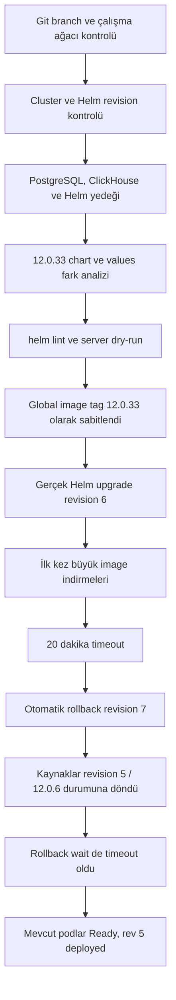

# OneUptime 12.0.6 → 12.0.33 Helm Yükseltme Uygulama Günlüğü

Bu belge, 4 Eylül 2026 tarihinde yerel iki node'lu Minikube ortamında yapılan
OneUptime `12.0.6` sürümünden `12.0.33` sürümüne yükseltme denemesinin teknik ve
kronolojik kaydıdır.

Belgenin amacı yalnızca başarılı komutları göstermek değildir. Her adım için şu
sorular cevaplanır:

1. Hangi komut çalıştırıldı?
2. Çalıştırılmadan önce hangi sonuç bekleniyordu?
3. Gerçekte hangi çıktı alındı?
4. Çıktıdan hangi teknik karar çıkarıldı?
5. Hata oluştuysa kök neden neydi ve sonraki denemede ne değişecek?

> **Son durum:** Yükseltme başarıyla tamamlanmadı. Çalışan sistem halen Helm
> revision `5`, chart/app `12.0.6` üzerindedir. Revision `6` yükseltme denemesi
> timeout oldu; revision `7` otomatik rollback işlemi kaynakları revision 5'e
> geri döndürdü fakat kendisi de wait timeout nedeniyle `failed` olarak
> kaydedildi. Bütün mevcut podlar `Ready`, rollback migration Job'ı `Complete`
> ve Probe One host alias ayarı mevcuttur. Bu belgedeki ikinci yükseltme komutu
> henüz çalıştırılmamıştır.

## 1. Kapsam ve ortam

| Alan | Değer |
|---|---|
| Tarih | 4 Eylül 2026 |
| Git branch | `upgrade/oneuptime-12.0.33` |
| Kubernetes context | `oneuptime` |
| Minikube profil adı | `oneuptime` |
| Namespace | `oneuptime` |
| Helm release | `oneuptime` |
| Başlangıç revision | `5` |
| Başlangıç chart/app | `12.0.6` |
| Hedef chart/app | `12.0.33` |
| Helm istemcisi | `v4.2.1` |
| Node 1 | `oneuptime` |
| Node 2 | `oneuptime-m02` |
| Probe One node | `oneuptime` |
| Probe Two node | `oneuptime-m02` |

`12.0.6 → 12.0.33` bir major sürüm atlaması değildir. Her iki sürüm de `12.x`
major sürümündedir. Yapılan işlem aradaki patch sürümlerini tek tek kurmadan
doğrudan en güncel patch sürümüne geçme denemesidir.

## 2. Dosyalar ve sorumlulukları

Yükseltme komutunda üç values dosyası birlikte kullanıldı:

```text
values.yaml
probe2-values.yaml
probe-one-host-alias.yaml
```

### 2.1 `values.yaml`

Temel OneUptime kurulumu, node yerleşimleri, veri servisleri, KEDA, Runner ve
global image ayarları burada bulunur.

Bu çalışma sırasında aşağıdaki sürüm sabitlemesi eklendi:

```yaml
image:
  # Pin every OneUptime component to the Helm release version. This avoids
  # reusing a stale local `:release` image when pullPolicy is IfNotPresent.
  tag: "12.0.33"
  pullPolicy: IfNotPresent
```

Bunun nedeni chart'ın varsayılan olarak hareketli `:release` tag'ini
kullanmasıdır. `pullPolicy: IfNotPresent` ile hareketli tag kullanılırsa node
üzerindeki daha eski image yeniden kullanılabilir. Helm chart sürümü 12.0.33
olsa bile çalışan container binary'sinin gerçekten 12.0.33 olduğu garanti
edilemez. Sabit tag bu belirsizliği kaldırır.

### 2.2 `probe2-values.yaml`

Probe Two'yu Node 2 üzerinde etkinleştiren values overlay'idir. Bu dosyada
Probe anahtarı bulunduğu için belgeye gerçek anahtar kopyalanmamıştır.

İlgili yapı:

```yaml
probes:
  two:
    enabled: true
    nodeSelector:
      app: oneuptime-probe
```

### 2.3 `probe-one-host-alias.yaml`

Yalnızca Probe One'a aşağıdaki hostname eşlemesini verir:

```yaml
probes:
  one:
    hostAliases:
      - ip: "10.97.179.200"
        hostnames:
          - "oneuptime.furkan.test"
```

Bu dosya bir Kubernetes Deployment manifesti değildir; Helm values
overlay'idir. Bu nedenle şu komut **çalıştırılmamalıdır**:

```bash
kubectl apply -f probe-one-host-alias.yaml
```

Doğru kullanım, dosyayı Helm komutuna `-f` ile vermektir:

```bash
helm upgrade ... \
  -f values.yaml \
  -f probe2-values.yaml \
  -f probe-one-host-alias.yaml
```

Helm bu değerleri chart'ın `templates/probe.yaml` şablonuyla birleştirir ve
Probe One Deployment pod şablonuna `hostAliases` olarak yazar.

## 3. İşlem akışının özeti



## 4. Kurulum/yükseltme öncesi kontroller

### 4.1 Git branch ve çalışma ağacı

Komut:

```bash
git status --short --branch
git log -1 --oneline --decorate
```

Beklenen:

- Yükseltme çalışmasının `main` üzerinde yapılmaması.
- Çalışma ağacında önceden var olan ilgisiz değişiklik bulunmaması.

Alınan ilk çıktı:

```text
## upgrade/oneuptime-12.0.33
83dd6e7 (HEAD -> upgrade/oneuptime-12.0.33, origin/main, origin/HEAD, main) linux environment manuel configuration for kubernet services
```

Karar:

- Doğru feature branch üzerindeydik.
- Başlangıç commit'i `main` ile aynıydı.
- Yükseltme dosya değişiklikleri bu branch'te izole edilebilirdi.

Yükseltme hazırlığından sonra Git durumu:

```text
## upgrade/oneuptime-12.0.33
 M values.yaml
```

Bu değişiklik `image.tag: "12.0.33"` eklenmesidir. Henüz commit edilmemiştir.

### 4.2 Kubernetes context ve Minikube profil adı

İlk komutlar:

```bash
kubectl config current-context
minikube status
```

Alınan çıktı:

```text
oneuptime
* Profile "minikube" not found. Run "minikube profile list" to view all profiles.
```

Yorum:

- Kubernetes context doğru olarak `oneuptime` idi.
- `minikube status` profil belirtilmeden çalıştırıldığında varsayılan olarak
  `minikube` adlı profili aradı.
- Bu kurulumun profil adı `oneuptime` olduğu için Minikube komutlarında
  `-p oneuptime` kullanılmalıdır.

Sonraki node komutlarının başarılı örneği:

```bash
minikube -p oneuptime ssh -- 'df -h /var/lib/docker'
```

Bu komutun başarılı çalışması doğru profilin `oneuptime` olduğunu ayrıca
kanıtladı.

### 4.3 Helm sürümü ve Helm 4 bayrak farkı

Komut:

```bash
helm version --short
```

Çıktı:

```text
v4.2.1+gd591a19
```

İlk release listeleme denemesi:

```bash
helm -n oneuptime list --all
```

Çıktı:

```text
Error: unknown flag: --all
```

Kök neden:

- Kullanılan istemci Helm 4'tür.
- Eski örneklerde görülen `helm list --all` bayrağı bu sürümde geçerli değildir.

Kullanılan doğru komut:

```bash
helm --kube-context oneuptime -n oneuptime list
```

Çıktı:

```text
NAME       NAMESPACE  REVISION  STATUS    CHART             APP VERSION
oneuptime  oneuptime  5         deployed  oneuptime-12.0.6  12.0.6
```

Karar:

- Yükseltme öncesinde release sağlıklı ve `deployed` durumundaydı.
- Geri dönüş hedefi revision `5` olarak belirlendi.

### 4.4 Başlangıç pod durumu

Komut:

```bash
kubectl --context oneuptime -n oneuptime get pods,jobs -o wide
```

Beklenen:

- Yükseltmeden önce bütün temel podların `Running` ve `Ready` olması.
- Önceden var olan bir `CrashLoopBackOff`, `Pending` veya `ImagePullBackOff`
  durumunun yükseltme hatasıyla karıştırılmaması.

İlgili çıktı:

```text
oneuptime-app-647fc5fc94-zsndx          1/1  Running
oneuptime-clickhouse-shard0-0           1/1  Running
oneuptime-nginx-f6994cc9-cl78s          1/1  Running
oneuptime-postgresql-0                  1/1  Running
oneuptime-probe-one-6f8b4f9556-5w2tv   1/1  Running
oneuptime-probe-two-8586775f88-cjqtw    1/1  Running
oneuptime-redis-0                       1/1  Running
oneuptime-runner-784c6bfc55-b2sfn      1/1  Running
```

Karar: başlangıç sistemi sağlıklıydı; daha sonra oluşan problem eski bir pod
arızası değildi.

### 4.5 Helm geçmişi

Komut:

```bash
helm --kube-context oneuptime -n oneuptime history oneuptime
```

Başlangıç çıktısı:

```text
REVISION  STATUS      CHART             APP VERSION  DESCRIPTION
1         superseded  oneuptime-12.0.6  12.0.6      Install complete
2         superseded  oneuptime-12.0.6  12.0.6      Upgrade complete
3         superseded  oneuptime-12.0.6  12.0.6      Upgrade complete
4         superseded  oneuptime-12.0.6  12.0.6      Upgrade complete
5         deployed    oneuptime-12.0.6  12.0.6      Upgrade complete
```

Revision 5'in son başarılı sürüm olduğu doğrulandı.

### 4.6 Kalıcı disk kontrolü

Komut:

```bash
kubectl --context oneuptime -n oneuptime get pvc,pv -o wide
```

İlgili çıktı:

```text
data-oneuptime-clickhouse-shard0-0  Bound  25Gi  RWO
data-oneuptime-postgresql-0         Bound  25Gi  RWO
```

StatefulSet tanımlarında ayrıca şu retention ayarı görüldü:

```yaml
persistentVolumeClaimRetentionPolicy:
  whenDeleted: Retain
  whenScaled: Retain
```

Karar:

- PostgreSQL ve ClickHouse verisi pod yaşam döngüsünden bağımsız PVC'lerdeydi.
- Yine de PVC bir yedek değildir; bu nedenle mantıksal veritabanı yedekleri
  ayrıca alındı.

## 5. Yükseltme öncesi yedekleme

Yedekler repo içine yazılmadı. İzinleri kısıtlı geçici dizin kullanıldı:

```text
/private/tmp/oneuptime-pre-upgrade-12.0.33.fLnJR3
```

> `/private/tmp` kalıcı arşiv değildir. Makine temizliği veya yeniden başlatma
> sonrasında silinebilir. İkinci yükseltme denemesinden önce gerekli görülürse
> bu dizin güvenli ve kalıcı bir yedek konumuna taşınmalıdır. Helm values ve
> manifest dosyaları gizli değer içerebileceğinden Git'e eklenmemelidir.

### 5.1 Veritabanı boyutlarını belirleme

PostgreSQL:

```bash
kubectl --context oneuptime -n oneuptime exec oneuptime-postgresql-0 -- \
  psql -U postgres -d oneuptimedb -Atc \
  'SELECT pg_size_pretty(pg_database_size(current_database()));'
```

Çıktı:

```text
56 MB
```

ClickHouse:

```bash
kubectl --context oneuptime -n oneuptime exec \
  oneuptime-clickhouse-shard0-0 -- du -sh /var/lib/clickhouse
```

Çıktı:

```text
270M  /var/lib/clickhouse
```

Karar: veri hacmi yerel mantıksal yedek için uygundu.

### 5.2 PostgreSQL mantıksal yedeği

Pod içinde custom-format dump oluşturuldu:

```bash
kubectl --context oneuptime -n oneuptime exec oneuptime-postgresql-0 -- \
  pg_dump -U postgres -d oneuptimedb -Fc \
  -f /tmp/oneuptime-pre-upgrade-12.0.6.dump
```

Komut `exit=0` ile sessiz tamamlandı.

Host tarafına kopyalama:

```bash
kubectl --context oneuptime -n oneuptime cp \
  oneuptime-postgresql-0:/tmp/oneuptime-pre-upgrade-12.0.6.dump \
  /private/tmp/oneuptime-pre-upgrade-12.0.33.fLnJR3/postgres-oneuptimedb-12.0.6.dump
```

Kopyalama çıktısındaki aşağıdaki satır hata değildir; `kubectl cp` içindeki tar
işleminin mutlak yolu normalize ettiğini belirtir:

```text
tar: Removing leading `/' from member names
```

Boyut ve checksum:

```text
2.9M  postgres-oneuptimedb-12.0.6.dump
SHA-256: 4001de61bbc7cf6a2a9e7de0e38d667957e312a47780df4a08e297d849209f8f
```

Yedek kataloğu restore işlemi yapmadan okundu:

```bash
kubectl --context oneuptime -n oneuptime exec oneuptime-postgresql-0 -- \
  sh -c 'pg_restore -l /tmp/oneuptime-pre-upgrade-12.0.6.dump | tail -n 5'
```

Çıktıda son foreign-key kayıtları görüldü. Bu, custom-format arşivin
`pg_restore` tarafından okunabildiğini gösterdi.

### 5.3 Helm values, manifest ve history yedeği

Çalışan revision 5'in değerleri:

```bash
helm --kube-context oneuptime -n oneuptime get values oneuptime --all -o yaml \
  > /private/tmp/oneuptime-pre-upgrade-12.0.33.fLnJR3/helm-values-revision-5.yaml
```

Manifest:

```bash
helm --kube-context oneuptime -n oneuptime get manifest oneuptime \
  > /private/tmp/oneuptime-pre-upgrade-12.0.33.fLnJR3/helm-manifest-revision-5.yaml
```

History:

```bash
helm --kube-context oneuptime -n oneuptime history oneuptime -o yaml \
  > /private/tmp/oneuptime-pre-upgrade-12.0.33.fLnJR3/helm-history-before-upgrade.yaml
```

Dosya boyutları:

```text
helm-history-before-upgrade.yaml   802 B
helm-manifest-revision-5.yaml      861 KB
helm-values-revision-5.yaml        31 KB
```

Dosyalar `chmod 600`, üst dizin `chmod 700` ile sınırlandı.

### 5.4 ClickHouse yedeği: ilk hata — izin verilmeyen yol

Önce sürüm ve veritabanları kontrol edildi:

```bash
kubectl --context oneuptime -n oneuptime exec \
  oneuptime-clickhouse-shard0-0 -- sh -c \
  'clickhouse-client --user "$CLICKHOUSE_USER" \
    --password "$CLICKHOUSE_PASSWORD" \
    --query "SELECT version(); SHOW DATABASES"'
```

Çıktı:

```text
26.7.3.19
INFORMATION_SCHEMA
default
information_schema
oneuptime
system
```

İlk backup denemesi `/tmp` hedefine yapıldı:

```bash
kubectl --context oneuptime -n oneuptime exec \
  oneuptime-clickhouse-shard0-0 -- sh -c \
  'clickhouse-client --user "$CLICKHOUSE_USER" \
    --password "$CLICKHOUSE_PASSWORD" \
    --query "BACKUP DATABASE oneuptime TO \
    File('\''/tmp/oneuptime-clickhouse-12.0.6.zip'\'')"'
```

Hata:

```text
Code: 36. DB::Exception: Path '/tmp/oneuptime-clickhouse-12.0.6.zip'
is not allowed for backups, see the 'backups.allowed_path'
configuration parameter. (BAD_ARGUMENTS)
```

Kök neden:

- ClickHouse güvenlik nedeniyle her dosya sistemine backup yazmaz.
- `/tmp` izin verilen backup yolu değildi.
- Bu hata veri değiştirmedi; backup başlamadan reddedildi.

### 5.5 ClickHouse yedeği: ikinci hata — dizin sahipliği

İzinli varsayılan yol kullanıldı:

```text
/var/lib/clickhouse/backups
```

Ancak ilk denemede dizin `root:root` olarak oluştu. ClickHouse sunucu prosesi
`.lock` dosyasını yazamadı:

```text
Code: 76. Cannot open file
/var/lib/clickhouse/backups/oneuptime-clickhouse-12.0.6.zip.lock:
errno: 13, strerror: Permission denied. (CANNOT_OPEN_FILE)
```

Sahiplik kontrolü:

```bash
kubectl --context oneuptime -n oneuptime exec \
  oneuptime-clickhouse-shard0-0 -- sh -c \
  'id; ls -ld /var/lib/clickhouse /var/lib/clickhouse/backups'
```

Çıktı:

```text
uid=0(root) gid=0(root) groups=0(root)
drwxrwxrwx ... clickhouse clickhouse /var/lib/clickhouse
drwxr-xr-x ... root       root       /var/lib/clickhouse/backups
```

Yalnızca yeni oluşturulan backup dizininin sahibi düzeltildi:

```bash
kubectl --context oneuptime -n oneuptime exec \
  oneuptime-clickhouse-shard0-0 -- \
  chown clickhouse:clickhouse /var/lib/clickhouse/backups
```

### 5.6 ClickHouse yedeğinin başarılı sonucu

Backup komutu doğru izinli yolda yeniden çalıştırıldı:

```bash
kubectl --context oneuptime -n oneuptime exec \
  oneuptime-clickhouse-shard0-0 -- sh -c \
  'clickhouse-client --user "$CLICKHOUSE_USER" \
    --password "$CLICKHOUSE_PASSWORD" \
    --query "BACKUP DATABASE oneuptime TO \
    File('\''/var/lib/clickhouse/backups/oneuptime-clickhouse-12.0.6.zip'\'')"'
```

Çıktı:

```text
36e1a4e5-43c6-4c74-bc1c-542d188bb08a  BACKUP_CREATED
```

Host tarafına kopyalama:

```bash
kubectl --context oneuptime -n oneuptime cp \
  oneuptime-clickhouse-shard0-0:/var/lib/clickhouse/backups/oneuptime-clickhouse-12.0.6.zip \
  /private/tmp/oneuptime-pre-upgrade-12.0.33.fLnJR3/clickhouse-oneuptime-12.0.6.zip
```

Doğrulama:

```bash
shasum -a 256 \
  /private/tmp/oneuptime-pre-upgrade-12.0.33.fLnJR3/clickhouse-oneuptime-12.0.6.zip

unzip -t \
  /private/tmp/oneuptime-pre-upgrade-12.0.33.fLnJR3/clickhouse-oneuptime-12.0.6.zip
```

Çıktı:

```text
Boyut: 516 KB
SHA-256: 51d58b1b83e95f1542efb6c960b7f69ccae9b3815e07350127dde44fee88c699
No errors detected in compressed data
```

Her iki yedek dosyasının checksum'ı dokümantasyonun son kontrolünde dosya
adlarıyla birlikte yeniden doğrulandı:

```bash
shasum -a 256 \
  /private/tmp/oneuptime-pre-upgrade-12.0.33.fLnJR3/postgres-oneuptimedb-12.0.6.dump \
  /private/tmp/oneuptime-pre-upgrade-12.0.33.fLnJR3/clickhouse-oneuptime-12.0.6.zip
```

Alınan çıktı:

```text
4001de61bbc7cf6a2a9e7de0e38d667957e312a47780df4a08e297d849209f8f  /private/tmp/oneuptime-pre-upgrade-12.0.33.fLnJR3/postgres-oneuptimedb-12.0.6.dump
51d58b1b83e95f1542efb6c960b7f69ccae9b3815e07350127dde44fee88c699  /private/tmp/oneuptime-pre-upgrade-12.0.33.fLnJR3/clickhouse-oneuptime-12.0.6.zip
```

Bu kontrol, iki checksum'ın yanlış dosya adıyla kaydedilmediğini ve yedeklerin
belgeleme sırasında hâlâ değişmeden durduğunu gösterdi.

## 6. Yeni chart ve `values.yaml` fark analizi

### 6.1 Helm deposunu yenileme

Komut:

```bash
helm repo update oneuptime
```

Çıktı:

```text
...Successfully got an update from the "oneuptime" chart repository
Update Complete.
```

### 6.2 En güncel sürümü doğrulama

Komut:

```bash
helm search repo oneuptime/oneuptime --versions | sed -n '1,12p'
```

İlk satırlar:

```text
oneuptime/oneuptime  12.0.33  12.0.33
oneuptime/oneuptime  12.0.32  12.0.32
oneuptime/oneuptime  12.0.31  12.0.31
```

Karar: çalışma anında en güncel resmî chart `12.0.33` idi.

### 6.3 Chart'ı repo içine kurmadan geçici dizine indirme

```bash
mktemp -d /private/tmp/oneuptime-chart-12.0.33.XXXXXX
```

Oluşan dizin:

```text
/private/tmp/oneuptime-chart-12.0.33.9sXoyd
```

Chart indirme:

```bash
helm pull oneuptime/oneuptime \
  --version 12.0.33 \
  --untar \
  --untardir /private/tmp/oneuptime-chart-12.0.33.9sXoyd
```

Bu yaklaşımın amacı mevcut, Git tarafından ignore edilen `./oneuptime`
12.0.6 chart klasörünü yükseltme tamamlanmadan silmemekti.

### 6.4 Values anahtarlarının makineyle karşılaştırılması

Eski ve yeni `values.yaml` dosyaları recursive olarak karşılaştırıldı.

İlk Ruby komutu `YAML.unsafe_load_file` kullandı ve ortamın eski Psych sürümü
nedeniyle hata verdi:

```text
undefined method `unsafe_load_file' for Psych:Module (NoMethodError)
```

Bu Kubernetes veya OneUptime hatası değildir. Yerel Ruby/Psych API farkıdır.
Komut `YAML.load(File.read(...))` kullanacak şekilde düzeltildi.

Özet sonuç:

```text
new=78
removed=28
type_changes=1
```

Öne çıkan yeni parametre grupları:

- `extraEnv`, `extraVolumes`, `extraVolumeMounts`
- App, worker, migrate, nginx, runner, probe ve telemetry-writer bileşenlerine
  özel ek environment/volume alanları
- Probe container security context capability ve seccomp alanları
- Probe One private-network, SNMP, network-device ve synthetic-monitor limitleri
- Source-map boyut ve retention limitleri
- Webhook private-network allowlist
- On-call calendar feed rate limitleri
- PostgreSQL operator tuning parametreleri
- Google Tag Manager ve marketing webhook alanları

Tam olarak eklenen kritik Probe One anahtarlarından bazıları:

```text
probes.one.allowPrivateNetworkMonitors
probes.one.automountServiceAccountToken
probes.one.existingSecret.name
probes.one.existingSecret.passwordKey
probes.one.extraEnv
probes.one.extraVolumeMounts
probes.one.extraVolumes
probes.one.networkDevicePollConcurrency
probes.one.snmpGetChunkSize
probes.one.syntheticMonitorChromiumSandboxEnabled
probes.one.syntheticMonitorMaxConcurrency
probes.one.syntheticMonitorMaxDiskBytes
probes.one.syntheticMonitorMaxProcessTreeRssBytes
probes.one.syntheticMonitorTempStorageSizeLimit
```

Kaldırılan 28 anahtarın tamamı eski marketing reklam entegrasyonu alanlarıydı
(`googleAds`, `linkedInConversions`, `metaConversions`, `microsoftAds`,
`redditAds`). Bizim üç override dosyamız bunları kullanmıyordu.

Tek type/default değişikliği:

```text
keda.enabled: true -> false
```

Bizim `values.yaml` dosyamız açık biçimde şunu içerdiği için KEDA kapanmadı:

```yaml
keda:
  enabled: true
```

### 6.5 Chart lint

Komut:

```bash
helm lint /private/tmp/oneuptime-chart-12.0.33.9sXoyd/oneuptime \
  -f values.yaml \
  -f probe2-values.yaml \
  -f probe-one-host-alias.yaml \
  --strict
```

Çıktı:

```text
1 chart(s) linted, 0 chart(s) failed
```

Karar:

- Üç override dosyası 12.0.33 values şemasıyla uyumluydu.
- Probe One host alias alanı chart tarafından kabul edildi.
- Kaldırılan eski anahtarlardan hiçbiri bizim override'larımızda yoktu.

### 6.6 Image tag'lerinin Docker Hub'da varlığını kontrol etme

Her public repository için Docker Hub API sorgulandı:

```bash
curl -sS --fail -o /dev/null -w 'app: http=%{http_code}\n' \
  https://hub.docker.com/v2/repositories/oneuptime/app/tags/12.0.33
```

Aynı kontrol `nginx`, `probe`, `runner` ve `test` için tekrarlandı.

Çıktı:

```text
app: http=200
nginx: http=200
probe: http=200
runner: http=200
test: http=200
```

Karar:

- Image repository'leri public olduğu için Docker kullanıcı adı/parolası
  gerekmedi.
- Beş bileşenin de versioned tag'i mevcuttu.
- `values.yaml` içinde global `image.tag: "12.0.33"` güvenle kullanılabilirdi.

### 6.7 Render edilen image'ları doğrulama

```bash
helm template oneuptime \
  /private/tmp/oneuptime-chart-12.0.33.9sXoyd/oneuptime \
  --namespace oneuptime \
  -f values.yaml \
  -f probe2-values.yaml \
  -f probe-one-host-alias.yaml \
  --include-crds \
  > /private/tmp/oneuptime-pre-upgrade-12.0.33.fLnJR3/proposed-manifest-12.0.33.yaml
```

Render içindeki benzersiz OneUptime image'ları:

```text
oneuptime/app:12.0.33
oneuptime/nginx:12.0.33
oneuptime/probe:12.0.33
oneuptime/runner:12.0.33
oneuptime/test:12.0.33
```

Eski ve yeni manifest boyut farkı:

```text
336 insertions(+), 199 deletions(-)
```

### 6.8 Kubernetes server-side Helm dry-run

Komut:

```bash
helm --kube-context oneuptime upgrade oneuptime \
  /private/tmp/oneuptime-chart-12.0.33.9sXoyd/oneuptime \
  --namespace oneuptime \
  --reset-values \
  -f values.yaml \
  -f probe2-values.yaml \
  -f probe-one-host-alias.yaml \
  --dry-run=server \
  --hide-secret \
  --timeout 15m \
  > /private/tmp/oneuptime-pre-upgrade-12.0.33.fLnJR3/helm-server-dry-run-12.0.33.txt
```

Sonuç:

```text
exit=0
STATUS: pending-upgrade
```

Dry-run çıktısında bütün hedef image'lar `12.0.33` olarak görüldü. Bu aşama
cluster durumunu değiştirmedi.

## 7. Gerçek yükseltme denemesi — revision 6

### 7.1 Çalıştırılan komut

```bash
helm --kube-context oneuptime upgrade oneuptime \
  /private/tmp/oneuptime-chart-12.0.33.9sXoyd/oneuptime \
  --namespace oneuptime \
  --reset-values \
  -f values.yaml \
  -f probe2-values.yaml \
  -f probe-one-host-alias.yaml \
  --rollback-on-failure \
  --cleanup-on-fail \
  --wait=legacy \
  --wait-for-jobs \
  --timeout 20m \
  --history-max 10
```

Beklenen:

1. Revision 6 oluşturulması.
2. Migration Job'ın tamamlanması.
3. App, Nginx, Probe One, Probe Two ve Runner'ın 12.0.33 image'larıyla
   `Ready` olması.
4. Herhangi bir hata halinde Helm'in revision 5'e otomatik rollback yapması.

### 7.2 Rollout başlangıcında görülen durum

Komut:

```bash
kubectl --context oneuptime -n oneuptime get pods,jobs -o wide
```

İlk ilgili çıktı:

```text
oneuptime-app-f986bcf4d-6gx9x         0/1  ContainerCreating
oneuptime-migrate-6-p87nj             0/1  Init:0/1
oneuptime-nginx-844db76646-2svwx      0/1  ContainerCreating
oneuptime-probe-one-7bb9b488b5-6k7sp  0/1  ContainerCreating
oneuptime-probe-two-5c84cb7b8c-whkb9  0/1  ContainerCreating
oneuptime-runner-dd4b68c7c-zgxp8      0/1  ContainerCreating
```

Migration Job:

```text
oneuptime-migrate-6  Running  0/1
image: docker.io/oneuptime/app:12.0.33
```

Bu sırada PostgreSQL ve ClickHouse StatefulSet podları yeni chart pod
template'i nedeniyle yeniden oluşturuldu. PVC'ler silinmedi. Her ikisi de kısa
sürede yeniden `Ready` oldu.

### 7.3 Image pull olayları ve gerçek boyutlar

Kubernetes event kontrolü:

```bash
kubectl --context oneuptime -n oneuptime get events \
  --sort-by=.lastTimestamp | tail -n 30
```

İlk olaylar:

```text
Pulling image "docker.io/oneuptime/app:12.0.33"
Pulling image "docker.io/oneuptime/nginx:12.0.33"
Pulling image "docker.io/oneuptime/probe:12.0.33"
Pulling image "docker.io/oneuptime/runner:12.0.33"
```

Docker authentication veya rate-limit hatası görülmedi. Aşağıdaki hata
durumlarından hiçbiri oluşmadı:

```text
ErrImagePull
ImagePullBackOff
unauthorized
toomanyrequests
no space left on device
```

Tamamlanan image event'leri:

```text
app:   2,083,669,608 byte, 7m55.552s
probe: 3,247,211,038 byte, 13m37.139s
nginx: 1,287,726,505 byte, gerçek pull 5m55.283s,
       kuyruk dahil 13m50.831s
```

Node disk kontrolü:

```bash
minikube -p oneuptime ssh -- 'df -h /var/lib/docker'
```

Çıktı:

```text
Filesystem  Size  Used  Avail  Use%  Mounted on
/dev/vda1   126G   82G    38G   69%  /var
```

İkinci node da aynı disk kapasitesini gösterdi. Kök neden disk yetersizliği
değildi.

### 7.4 Migration podunun `Init:0/1` durumunda beklemesi

Migration pod event'i:

```text
Pulling image "docker.io/oneuptime/app:12.0.33"
```

App image kontrol-plane node'a indikten sonra CRI deposu kontrol edildi:

```bash
minikube -p oneuptime ssh -- \
  'sudo crictl images | grep oneuptime/app'
```

Çıktı:

```text
oneuptime/app  12.0.33  399b3679a9b8d  2.08GB
oneuptime/app  release  eb458bc1d2efc  2.03GB
```

Pod pull policy kontrolü:

```bash
kubectl --context oneuptime -n oneuptime get pod \
  oneuptime-migrate-6-2b69d \
  -o jsonpath='{.spec.initContainers[0].image}{"\n"}{.spec.initContainers[0].imagePullPolicy}{"\n"}'
```

Çıktı:

```text
docker.io/oneuptime/app:12.0.33
IfNotPresent
```

Yorum:

- Image CRI deposunda vardı.
- Ancak kubelet daha önce başlatılmış pull isteklerini seri bir kuyrukta
  işliyordu.
- Event'in eski `Pulling` durumunda kalması Docker parolası problemi değildi.

### 7.5 Migration podunu yeniden oluşturma denemesi

Takılmış pull isteğini bırakıp yerel image'ı kullanması amacıyla yalnızca geçici
Job podu silindi:

```bash
kubectl --context oneuptime -n oneuptime delete pod \
  oneuptime-migrate-6-p87nj --wait=true
```

Çıktı:

```text
pod "oneuptime-migrate-6-p87nj" deleted from oneuptime namespace
```

Job controller yeni pod oluşturdu:

```text
oneuptime-migrate-6-2b69d  0/1  Init:0/1
```

Ancak yeni podun image isteği de mevcut seri kuyruğun sonuna girdi. Bu işlem
kök nedeni çözmedi ve ilk denemede süre kazandırmadı.

Sonraki denemede bu pod silme adımı tekrarlanmamalıdır. Doğru yaklaşım bütün
image'ları önceden cache'e almak ve Helm wait stratejisini düzeltmektir.

### 7.6 Eksik image'ları önceden cache'e alma

Kontrol-plane node için:

```bash
minikube -p oneuptime ssh -- \
  'docker pull docker.io/oneuptime/probe:12.0.33'

minikube -p oneuptime ssh -- \
  'docker pull docker.io/oneuptime/runner:12.0.33'
```

Sonuçlar:

```text
probe digest:  sha256:e410b33ac56149dbaacb1d18926e06fc8dd1c67f4d12db5b18051a5508d9a10e
runner digest: sha256:0c055710f745d7094045cbabfdee2518b62dfd129fc4920289e1f4a646a1a0a0
Status: Downloaded newer image
```

Bu komutlar public Docker Hub repository'lerinden çalıştı; Docker login veya
parola kullanılmadı.

## 8. Timeout ve rollback analizi

### 8.1 Revision 6 yükseltme timeout'u

Helm çıktısı:

```text
level=WARN msg="upgrade failed" name=oneuptime error="context deadline exceeded"
```

Nihai komut çıktısı:

```text
Error: UPGRADE FAILED: an error occurred while rolling back the release.
original upgrade error: context deadline exceeded:
release oneuptime failed: context deadline exceeded
```

Revision 6'nın temel başarısızlık nedeni:

- 12.0.33 image'ları node'larda ilk kez indiriliyordu.
- Image'lar 1.2–3.2 GB aralığındaydı.
- Kubelet pull kuyruğu ve ağ hızı nedeniyle migration, Probe One ve Runner
  20 dakikalık Helm timeout içinde hazır olamadı.
- Bir Docker kimlik doğrulama hatası oluşmadı.
- Bir values şema hatası oluşmadı.
- Bir Kubernetes manifest doğrulama hatası oluşmadı.
- Disk alanı problemi oluşmadı.

### 8.2 Rollback neden ayrıca timeout oldu?

İlk komutta şu seçenek kullanılmıştı:

```text
--wait=legacy
```

OneUptime Nginx Service durumu:

```bash
kubectl --context oneuptime -n oneuptime get service oneuptime-nginx -o wide
```

Çıktı:

```text
NAME              TYPE          CLUSTER-IP       EXTERNAL-IP  PORT(S)
oneuptime-nginx   LoadBalancer  10.109.199.202   <pending>    80:31683/TCP,443:31367/TCP
```

Minikube ortamında haricî load balancer controller/tunnel olmadığı için
`EXTERNAL-IP <pending>` kalması bu kurulumda normaldir. Uygulamaya port-forward
ve yerel proxy üzerinden erişilmektedir.

`--wait=legacy`, LoadBalancer external IP dahil legacy readiness şartlarını
bekledi. Kaynaklar revision 5'e dönüp bütün podlar `Ready` olsa bile bu koşul
sağlanmadı. Böylece otomatik rollback işlemi de aynı timeout sınırına ulaştı.

Bu nedenle iki ayrı timeout vardır:

1. Revision 6: büyük image indirmeleri ve Job/pod readiness süresi.
2. Revision 7: rollback kaynakları sağlıklı olmasına rağmen Minikube
   LoadBalancer external IP'sini bekleyen legacy wait stratejisi.

### 8.3 Helm revision geçmişinin son durumu

Helm release Secret etiketleri doğrudan Kubernetes'ten kontrol edildi:

```bash
kubectl --context oneuptime -n oneuptime get secret \
  -l owner=helm,name=oneuptime \
  -o custom-columns=NAME:.metadata.name,STATUS:.metadata.labels.status,VERSION:.metadata.labels.version \
  --sort-by=.metadata.creationTimestamp
```

Çıktı:

```text
sh.helm.release.v1.oneuptime.v1  superseded  1
sh.helm.release.v1.oneuptime.v2  superseded  2
sh.helm.release.v1.oneuptime.v3  superseded  3
sh.helm.release.v1.oneuptime.v4  superseded  4
sh.helm.release.v1.oneuptime.v5  deployed    5
sh.helm.release.v1.oneuptime.v6  failed      6
sh.helm.release.v1.oneuptime.v7  failed      7
```

Kritik yorum:

- Revision 5 hâlâ tek `deployed` release'tir.
- Revision 6 başarısız 12.0.33 denemesidir.
- Revision 7 başarısız olarak kaydedilen rollback operasyonudur.
- Revision 7'nin `failed` olması, revision 5 workloadlarının çalışmadığı
  anlamına gelmez.
- Canlı workloadlar gerçekten revision 5 template/image ayarlarına dönmüştür.

## 9. Rollback sonrasında pod ve Probe kontrolleri

### 9.1 Bütün podlar

Komut:

```bash
kubectl --context oneuptime -n oneuptime get pods,jobs -o wide
```

Son ilgili durum:

```text
oneuptime-app-647fc5fc94-pk4p2          1/1  Running
oneuptime-clickhouse-shard0-0           1/1  Running
oneuptime-migrate-5-9cb87               0/1  Completed
oneuptime-nginx-f6994cc9-8wshj          1/1  Running
oneuptime-postgresql-0                  1/1  Running
oneuptime-probe-one-6f8b4f9556-mbkqk   1/1  Running
oneuptime-probe-two-8586775f88-2vfz2    1/1  Running
oneuptime-redis-0                       1/1  Running
oneuptime-runner-784c6bfc55-szkzc      1/1  Running
```

`oneuptime-migrate-5` için `Completed` beklenen ve başarılı durumdur:

```text
STATUS: Complete
COMPLETIONS: 1/1
DURATION: 82s
```

### 9.2 Canlı image'lar

Komut:

```bash
kubectl --context oneuptime -n oneuptime get deployment \
  oneuptime-app \
  oneuptime-nginx \
  oneuptime-probe-one \
  oneuptime-probe-two \
  oneuptime-runner \
  -o jsonpath='{range .items[*]}{.metadata.name}{"\t"}{.spec.template.spec.containers[0].image}{"\n"}{end}'
```

Çıktı:

```text
oneuptime-app        docker.io/oneuptime/app:release
oneuptime-nginx      docker.io/oneuptime/nginx:release
oneuptime-probe-one  docker.io/oneuptime/probe:release
oneuptime-probe-two  docker.io/oneuptime/probe:release
oneuptime-runner     docker.io/oneuptime/runner:release
```

Bu revision 5 / 12.0.6 manifestine dönüşü gösterir. Node'da 12.0.33 image'larının
cache'te bulunması, canlı podların otomatik olarak 12.0.33 kullandığı anlamına
gelmez.

### 9.3 Probe One host alias doğrulaması

Komut:

```bash
kubectl --context oneuptime -n oneuptime get deployment \
  oneuptime-probe-one \
  -o jsonpath='{.spec.template.spec.hostAliases}{"\n"}'
```

Çıktı:

```json
[{"hostnames":["oneuptime.furkan.test"],"ip":"10.97.179.200"}]
```

Karar:

- Rollback sonrasında Probe One alias ayarı korunmuştur.
- TLS Certificate Monitor için cluster içi hostname yolu devam etmektedir.
- Probe One'ı yeniden ayağa kaldırmak için ayrı bir `kubectl apply` komutu
  gerekmedi.

### 9.4 Probe'lar gerçekte nasıl yeniden ayağa kalktı?

Bu denemede Probe Deploymentları manuel `kubectl apply` ile oluşturulmadı.
Yaşam döngüsünü Helm yönetti:

1. `helm upgrade`, `probe2-values.yaml` ve
   `probe-one-host-alias.yaml` değerlerini chart'a verdi.
2. Helm yeni `oneuptime-probe-one` ve `oneuptime-probe-two` Deployment pod
   template'lerini uyguladı.
3. Deployment controller eski ReplicaSet'i scale down, yeni ReplicaSet'i scale
   up etti.
4. Timeout sonrası rollback aynı Deploymentları revision 5 pod template'ine
   geri döndürdü.
5. Kubernetes Deployment controller yeni revision 5 podlarını otomatik
   oluşturdu.

Gözlem için kullanılan komut:

```bash
kubectl --context oneuptime -n oneuptime get pods,jobs -w
```

Bu komut kaynak oluşturmaz; yalnızca değişiklikleri canlı izler.

Probe podunu elle silmek gerekirse Deployment controller yeniden oluşturur,
ancak normal upgrade prosedüründe bu gerekli değildir:

```bash
kubectl --context oneuptime -n oneuptime delete pod <probe-pod-adı>
```

Bu komut yalnızca açık bir teşhis gerekçesi varsa kullanılmalıdır. Bir values
değişikliğini kalıcılaştırmanın yolu pod silmek değil Helm overlay'ini upgrade
komutuna dahil etmektir.

## 10. Bu denemede değişen ve değişmeyen şeyler

### Değişenler

- Git branch üzerinde `values.yaml` dosyasına `image.tag: "12.0.33"` eklendi.
- Helm history'de başarısız revision 6 ve revision 7 kayıtları oluştu.
- 12.0.33 image'ları Minikube node cache'lerine indirildi.
- PostgreSQL ve ClickHouse podları rollout/rollback sırasında yeniden başladı.
- Doğrulanmış PostgreSQL, ClickHouse ve Helm yedekleri oluşturuldu.

### Değişmeyenler

- Kalıcı PostgreSQL ve ClickHouse PVC'leri silinmedi.
- Çalışan release halen revision 5'tir.
- Canlı chart/app halen 12.0.6'dır.
- Probe One host alias korunmuştur.
- Probe Two tekrar `Ready` durumundadır.
- OneUptime kaynak kod reposu çekilmemiştir.
- `main` branch değiştirilmemiştir.
- İkinci bir 12.0.33 upgrade komutu çalıştırılmamıştır.

## 11. Kök neden özeti

| Belirti | Kök neden | Kanıt |
|---|---|---|
| Podlar uzun süre `ContainerCreating` | İlk kez indirilen çok büyük 12.0.33 image'ları | Kubernetes `Pulled` event süreleri ve byte boyutları |
| Migration `Init:0/1` bekledi | Kubelet'in seri image-pull kuyruğunda app image isteği | Pod event'i, `IfNotPresent`, CRI image kontrolü |
| Revision 6 başarısız | `--timeout 20m` image indirme süresinden kısa kaldı | `context deadline exceeded` |
| Revision 7 rollback kaydı failed | `--wait=legacy` Minikube LoadBalancer external IP bekledi | `oneuptime-nginx EXTERNAL-IP <pending>` ve bütün podların Ready olması |
| Docker parolası sorunu sanılması | Gerçekte auth hatası yoktu; repo public | Tag API HTTP 200 ve başarılı image pull digest'leri |
| ClickHouse `/tmp` backup hatası | Yol `backups.allowed_path` dışında | Code 36 `BAD_ARGUMENTS` |
| ClickHouse izin hatası | Backup dizini `root:root` idi | Code 76 ve `ls -ld` çıktısı |

## 12. Sonraki yükseltme öncesi kabul listesi

Aşağıdaki maddeler ikinci denemeden önce yeniden kontrol edilmelidir:

- [ ] `git branch --show-current` sonucu `upgrade/oneuptime-12.0.33`.
- [ ] `git diff -- values.yaml` yalnızca beklenen image tag değişikliğini
      gösteriyor.
- [ ] Helm revision 5 `deployed`, revision 6/7 `failed`.
- [ ] Bütün mevcut podlar `Ready`; migrate-5 `Complete`.
- [ ] PostgreSQL ve ClickHouse yedek dosyaları hâlâ mevcut ve checksumları doğru.
- [ ] Kontrol-plane node'da app, nginx, probe ve runner 12.0.33 image'ları cache'te.
- [ ] Node 2'de probe 12.0.33 image'ı cache'te.
- [ ] 12.0.33 chart geçici dizini hâlâ mevcut; değilse resmî Helm reposundan
      yeniden indirildi.
- [ ] `helm lint` tekrar `0 failed`.
- [ ] `probe-one-host-alias.yaml` upgrade komutunda bulunuyor.
- [ ] `--wait=legacy` kullanılmıyor.

## 13. Sonraki deneme için önerilen komutlar — HENÜZ ÇALIŞTIRILMADI

Bu bölüm bir olay kaydı değil, bir sonraki aşamanın önerisidir. Aşağıdaki
komutlar bu belge yazılırken çalıştırılmamıştır.

### 13.1 Cache kontrolü

Kontrol-plane:

```bash
minikube -p oneuptime ssh -- \
  'sudo crictl images | grep -E "oneuptime/(app|nginx|probe|runner).*12.0.33"'
```

Node 2:

```bash
minikube -p oneuptime ssh -n oneuptime-m02 -- \
  'sudo crictl images | grep -E "oneuptime/probe.*12.0.33"'
```

### 13.2 Tekrar lint ve server dry-run

```bash
helm lint /private/tmp/oneuptime-chart-12.0.33.9sXoyd/oneuptime \
  -f values.yaml \
  -f probe2-values.yaml \
  -f probe-one-host-alias.yaml \
  --strict
```

```bash
helm --kube-context oneuptime upgrade oneuptime \
  /private/tmp/oneuptime-chart-12.0.33.9sXoyd/oneuptime \
  --namespace oneuptime \
  --reset-values \
  -f values.yaml \
  -f probe2-values.yaml \
  -f probe-one-host-alias.yaml \
  --dry-run=server \
  --hide-secret \
  --timeout 45m
```

### 13.3 Önerilen gerçek upgrade yaklaşımı

Minikube LoadBalancer'ın `<pending>` durumu nedeniyle `--wait=legacy`
kullanılmamalıdır. Chart'ta `migrate.hook: false` olduğu için migration async
Job olarak oluşur. Helm yalnızca uygulama işlemini başlatmalı; gerçek kabul
`kubectl` komutlarıyla ayrı yapılmalıdır.

Önerilen komut:

```bash
helm --kube-context oneuptime upgrade oneuptime \
  /private/tmp/oneuptime-chart-12.0.33.9sXoyd/oneuptime \
  --namespace oneuptime \
  --reset-values \
  -f values.yaml \
  -f probe2-values.yaml \
  -f probe-one-host-alias.yaml \
  --rollback-on-failure \
  --cleanup-on-fail \
  --wait=hookOnly \
  --timeout 45m \
  --history-max 10
```

Burada `--wait=hookOnly` açıkça verilerek Helm 4'ün
`--rollback-on-failure` nedeniyle başka bir wait stratejisine geçmesi
engellenir. Migration async olduğu için Helm dönüşünden sonra ayrıca
izlenmelidir.

### 13.4 Upgrade sonrası manuel rollout kontrolleri

```bash
kubectl --context oneuptime -n oneuptime rollout status \
  deployment/oneuptime-app --timeout=20m

kubectl --context oneuptime -n oneuptime rollout status \
  deployment/oneuptime-nginx --timeout=20m

kubectl --context oneuptime -n oneuptime rollout status \
  deployment/oneuptime-probe-one --timeout=20m

kubectl --context oneuptime -n oneuptime rollout status \
  deployment/oneuptime-probe-two --timeout=20m

kubectl --context oneuptime -n oneuptime rollout status \
  deployment/oneuptime-runner --timeout=20m
```

Yeni migration Job adını bulma:

```bash
kubectl --context oneuptime -n oneuptime get jobs \
  -l app.kubernetes.io/component=migrate \
  --sort-by=.metadata.creationTimestamp
```

Sonra bulunan yeni revision için:

```bash
kubectl --context oneuptime -n oneuptime wait \
  --for=condition=complete \
  job/oneuptime-migrate-<revision> \
  --timeout=20m
```

Migration logu:

```bash
kubectl --context oneuptime -n oneuptime logs \
  job/oneuptime-migrate-<revision> \
  --all-containers=true
```

### 13.5 Probe One kalıcı ayar kontrolü

```bash
kubectl --context oneuptime -n oneuptime get deployment \
  oneuptime-probe-one \
  -o jsonpath='{.spec.template.spec.hostAliases}{"\n"}'
```

Beklenen:

```json
[{"hostnames":["oneuptime.furkan.test"],"ip":"10.97.179.200"}]
```

Probe One podunun `/etc/hosts` kontrolü:

```bash
PROBE_ONE_POD=$(kubectl --context oneuptime -n oneuptime get pod \
  -l app=oneuptime-probe-one \
  -o jsonpath='{.items[0].metadata.name}')

kubectl --context oneuptime -n oneuptime exec "$PROBE_ONE_POD" -- \
  getent hosts oneuptime.furkan.test
```

Beklenen IP:

```text
10.97.179.200
```

### 13.6 Image ve Helm sürüm kabulü

```bash
helm --kube-context oneuptime -n oneuptime list
helm --kube-context oneuptime -n oneuptime history oneuptime
```

Beklenen yeni release:

```text
CHART: oneuptime-12.0.33
APP VERSION: 12.0.33
STATUS: deployed
```

Canlı Deployment image'ları:

```bash
kubectl --context oneuptime -n oneuptime get deployment \
  oneuptime-app oneuptime-nginx oneuptime-probe-one \
  oneuptime-probe-two oneuptime-runner \
  -o jsonpath='{range .items[*]}{.metadata.name}{"\t"}{.spec.template.spec.containers[0].image}{"\n"}{end}'
```

Her OneUptime image'ının `:12.0.33` ile bitmesi gerekir.

## 14. Geri dönüş yaklaşımı

İkinci deneme sonrasında uygulama veya migration kabul testleri başarısız olursa
önce yeni revision durumu ve migration etkisi değerlendirilmelidir. Basit Helm
rollback komutu:

```bash
helm --kube-context oneuptime rollback oneuptime 5 \
  --namespace oneuptime \
  --wait=hookOnly \
  --timeout 20m
```

Veritabanı migration'ı geriye uyumlu değilse yalnızca Helm rollback yeterli
olmayabilir. Böyle bir durumda bu çalışmada alınan PostgreSQL ve ClickHouse
yedeklerinden kontrollü restore planı uygulanmalıdır. Restore komutları ayrıca
doğrulanmadan canlı veritabanında çalıştırılmamalıdır.

## 15. Güvenlik notları

- `probe2-values.yaml` içindeki Probe key belgeye yazılmadı.
- Helm `--dry-run` çıktısı Secret içerebildiği için `--hide-secret` kullanıldı.
- Helm values/manifest yedekleri Git'e eklenmedi ve izinleri `600` yapıldı.
- Docker kullanıcı adı veya parolası kullanılmadı; OneUptime image'ları public
  olarak indirildi.
- PostgreSQL ve ClickHouse şifreleri terminal çıktısına basılmadı; container
  environment değişkenleri içinde kullanıldı.
- `/private/tmp` yedek dizini hassas kabul edilmelidir.

## 16. Sonuç

İlk yükseltme denemesi values uyumsuzluğu, uygulama hatası veya Docker
kimlik doğrulama problemi nedeniyle değil, ilk image indirmelerinin çok uzun
sürmesi ve Minikube ile uyumsuz `--wait=legacy` seçimi nedeniyle tamamlanamadı.

Rollback sonunda:

- Revision 5 halen `deployed`.
- Revision 6 ve 7 `failed` geçmiş kaydı olarak duruyor.
- Bütün 12.0.6 podları sağlıklı.
- PostgreSQL ve ClickHouse verileri erişilebilir.
- Probe One ve Probe Two `Ready`.
- Probe One host alias doğru.
- 12.0.33 image'larının büyük kısmı/ilgili node kopyaları cache'e alınmış
  durumda.
- İkinci yükseltme bilinçli olarak çalıştırılmadı.

Bir sonraki adım, bu belgedeki kabul listesini yeniden doğruladıktan sonra
legacy LoadBalancer beklemesini kullanmadan ikinci 12.0.33 yükseltme denemesini
başlatmaktır.
