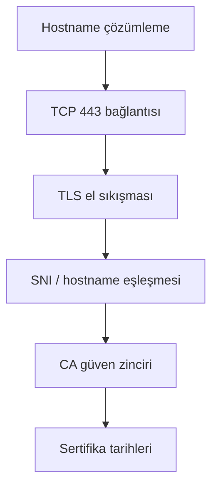

# TLS Certificate Monitor ve Probe One Teknik Sorun Giderme Günlüğü

Bu belge, `oneuptime.furkan.test` TLS sertifikasının OneUptime SSL Certificate
Monitor ile izlenmesi sırasında karşılaşılan erişim problemini, problemin hangi
ağ katmanında olduğunun nasıl kanıtlandığını ve Probe One'a `hostAliases`
eklenerek nasıl çözüldüğünü kronolojik ve teknik olarak açıklar.

Bu dosya bir kullanıcı arayüzü kurulum rehberi değildir. Amaç her adımda şu üç
soruyu terminal kanıtlarıyla yanıtlamaktır:

1. Hangi komut çalıştırıldı?
2. Hangi sonuç alındı?
3. Bu sonuçtan hangi teknik karar çıkarıldı?

Paneldeki monitor kriterleri için
[Aşama 14 — TLS Certificate Monitor](../instructions/14-tls-certificate-monitor.md),
kalıcı kurulum özeti için
[TLS Certificate Monitor İçin Probe One Ağ Yapılandırması](../kurulum/TLS_CERTIFICATE_MONITOR_PROBE_ONE.md)
belgelerine bakın.

## 1. Olay özeti

İzlenmek istenen hedef:

```text
https://oneuptime.furkan.test
```

Sertifikayı kontrol edecek bileşen:

```text
Deployment: oneuptime-probe-one
Namespace: oneuptime
Node: oneuptime
```

Bulunan temel problem:

```text
oneuptime.furkan.test
        ↓ alias yokken
127.0.0.1
        ↓ pod içindeki loopback
Probe podunun kendisi :443
        ↓
ECONNREFUSED
```

Uygulanan çözüm:

```text
oneuptime.furkan.test
        ↓ probes.one.hostAliases
10.97.179.200
        ↓
oneuptime-local-tls Service :443
        ↓
TLS sertifikası okunur
```

Önemli teknik ayrım: Probe Kubernetes ağı üzerinden TLS Service'e
ulaşabiliyordu. Ulaşılamayan şey Service'in kendisi değil, monitorün kullanacağı
hostname üzerinden doğru Service adresine giden yoldu.

## 2. Ortamın olay anındaki durumu

| Bileşen | Değer |
|---|---|
| Kubernetes context | `oneuptime` |
| Namespace | `oneuptime` |
| Helm release | `oneuptime` |
| Helm revision | `5` |
| Chart | `oneuptime-12.0.6` |
| Probe One replica | `1` |
| TLS Service | `oneuptime-local-tls` |
| TLS Service ClusterIP | `10.97.179.200` |
| TLS hostname | `oneuptime.furkan.test` |
| Sertifika bitiş tarihi | `19 Kasım 2028 14:57:40 UTC` |

Uygulama tarihi 18 Ağustos 2026 idi. O anda sertifikanın yaklaşık `824` tam gün
geçerliliği kalmıştı.

## 3. Teşhis modeli: DNS, TCP ve TLS birbirinden ayrıldı

Bir SSL monitor başarısız olduğunda yalnızca `curl çalışmıyor` sonucuna bakmak
yeterli değildir. Sorun aşağıdaki katmanlardan herhangi birinde olabilir:



Bu olayda katmanlar ayrı ayrı test edildi:

| Katman | Sonuç |
|---|---|
| Hostname çözümleme | Alias yokken yanlış olarak `127.0.0.1` |
| TCP/443, hostname ile | `ECONNREFUSED 127.0.0.1:443` |
| TCP/443, ClusterIP ile | Başarılı |
| TLS sertifikasını sunma | Başarılı |
| Sertifika CN/SNI | `oneuptime.furkan.test` ile doğru |
| Sertifika tarihi | Okunabildi, 2028-11-19 |
| CA doğrulaması | `UNABLE_TO_VERIFY_LEAF_SIGNATURE` |

Son satır DNS probleminden farklı, ikinci bir konudur. Kullanıcının talebi
yalnızca `hostAliases` olduğu için CA güven deposu bu aşamada değiştirilmedi.

## 4. Kronolojik terminal ve karar günlüğü

### 4.1 Sertifikanın gerçekten var olduğunu ve tarihini doğrulama

İlk olarak yerel dosyanın hangi sertifika olduğu kontrol edildi:

```bash
openssl x509 \
  -in k8s/local-tls/certs/localhost.crt \
  -noout -subject -issuer -startdate -enddate
```

Çıktı:

```text
subject= /CN=oneuptime.furkan.test
issuer= /CN=OneUptime Local Development CA
notBefore=Aug 17 14:57:40 2026 GMT
notAfter=Nov 19 14:57:40 2028 GMT
```

Karar:

- Monitor hedefi `oneuptime.furkan.test` olmalıydı.
- Sertifika tarih verisi yerel dosyada mevcuttu.
- Sertifika doğrudan self-signed leaf değildi; yerel geliştirme CA'sı tarafından
  imzalanmıştı.
- Sorun "sertifika dosyası yok" değildi.

### 4.2 Mac üzerindeki hostname çözümlemesini kontrol etme

```bash
dscacheutil -q host -a name oneuptime.furkan.test
```

Çıktı:

```text
name: oneuptime.furkan.test
ip_address: 127.0.0.1
```

Karar:

- Bu kayıt Mac'in kendi yerel çözümleme ortamına aitti.
- Mac'teki `127.0.0.1`, Mac üzerinde çalışan port-forward listener'ına gider.
- Aynı `127.0.0.1` bir Kubernetes podu içinde kullanılırsa o podun kendisini
  gösterir; Mac'i veya TLS Service'i göstermez.
- Bu nedenle tarayıcıda çalışan adresin Probe podunda otomatik olarak çalışacağı
  varsayılamazdı.

### 4.3 Yerel port-forward bağımlılığını fark etme

Mac üzerinde yapılan HTTPS kontrolü, 443 port-forward process'i kapalı olduğunda
bağlantı kuramadı:

```bash
curl -sS -L -o /dev/null \
  -w 'code=%{http_code} ip=%{remote_ip} url=%{url_effective}\n' \
  --max-time 10 \
  https://oneuptime.furkan.test/
```

İlgili sonuç:

```text
127.0.0.1:443 bağlantısı kurulamadı
```

Karar:

- Mac tarayıcı yolu kalıcı monitor ağı olarak kullanılamazdı.
- Monitorün çalışması bir terminalde açık tutulan `kubectl port-forward`
  process'ine bağlı olmamalıydı.
- Probe, Kubernetes içindeki TLS Service'e doğrudan ulaşmalıydı.

### 4.4 TLS Service'in gerçek ClusterIP adresini bulma

```bash
kubectl -n oneuptime get service oneuptime-local-tls \
  -o jsonpath='{.spec.clusterIP}{"\n"}'
```

Çıktı:

```text
10.97.179.200
```

Service portları ayrıca kontrol edildi:

```bash
kubectl -n oneuptime get service oneuptime-local-tls -o wide
```

İlgili sonuç:

```text
NAME                    TYPE        CLUSTER-IP      PORT(S)
oneuptime-local-tls     ClusterIP   10.97.179.200  80/TCP,443/TCP
```

Karar:

- Probe için kalıcı hedef Mac loopback'i değil, bu ClusterIP olmalıydı.
- Sertifika hostname doğrulaması ve SNI için URL yine
  `https://oneuptime.furkan.test` kalmalıydı.
- Yalnızca adın çözüldüğü IP değiştirilmeliydi.

### 4.5 Probe One pod şablonunda alias olmadığını kanıtlama

Canlı Deployment kontrol edildi:

```bash
kubectl -n oneuptime get deployment oneuptime-probe-one -o json | \
  jq '{name:.metadata.name,
       generation:.metadata.generation,
       replicas:.spec.replicas,
       ready:.status.readyReplicas,
       strategy:.spec.strategy,
       hostAliases:(.spec.template.spec.hostAliases // null)}'
```

Değişiklik öncesi ilgili çıktı:

```json
{
  "name": "oneuptime-probe-one",
  "generation": 5,
  "replicas": 1,
  "ready": 1,
  "strategy": {
    "rollingUpdate": {
      "maxSurge": 0,
      "maxUnavailable": "100%"
    },
    "type": "RollingUpdate"
  },
  "hostAliases": null
}
```

Eski ReplicaSet kayıtları da daha sonra tarihsel kanıt olarak kontrol edildi:

```bash
kubectl -n oneuptime get replicasets \
  -l app=oneuptime-probe-one \
  -o json | \
  jq -r '.items | sort_by(.metadata.creationTimestamp)[] |
    {name:.metadata.name,
     replicas:(.spec.replicas // 0),
     hostAliases:(.spec.template.spec.hostAliases // null)}'
```

Host alias öncesindeki son ReplicaSet dahil eski kayıtların özeti:

```text
oneuptime-probe-one-76f48c7bf8   hostAliases=null
oneuptime-probe-one-64cb8f8dbc   hostAliases=null
```

Host alias sonrasındaki ReplicaSet:

```text
oneuptime-probe-one-6f8b4f9556
hostAliases=[oneuptime.furkan.test → 10.97.179.200]
```

Karar:

- Probe One poduna özel bir hostname eşleştirmesi gerçekten yoktu.
- Sorun Helm values veya canlı Deployment seviyesinde somut olarak görüldü.

### 4.6 Alias olmayan probe ortamında hatayı tekrar üretme

Değişiklik sonrasında eski pod artık çalışmadığı için, aynı DNS koşulunu koruyan
ve `hostAliases=null` olan Probe Two salt okunur karşılaştırma noktası olarak
kullanıldı.

Önce Probe Two şablonu doğrulandı:

```bash
kubectl -n oneuptime get deployment oneuptime-probe-two -o json | \
  jq '{ready:.status.readyReplicas,
       hostAliases:(.spec.template.spec.hostAliases // null)}'
```

Çıktı:

```json
{
  "ready": 1,
  "hostAliases": null
}
```

Pod içindeki Node.js resolver ile hostname kontrol edildi:

```bash
kubectl -n oneuptime exec deployment/oneuptime-probe-two -- \
  node -e \
  'require("dns").lookup("oneuptime.furkan.test",(e,a)=>console.log(e||a))'
```

Çıktı:

```text
127.0.0.1
```

Ardından aynı poddan gerçek TLS TCP bağlantısı denendi:

```bash
kubectl -n oneuptime exec deployment/oneuptime-probe-two -- \
  node -e '
    const tls=require("tls");
    const s=tls.connect({
      host:"oneuptime.furkan.test",
      port:443,
      servername:"oneuptime.furkan.test",
      rejectUnauthorized:false
    });
    s.on("error",e=>console.log({
      code:e.code,
      address:e.address,
      port:e.port,
      message:e.message
    }));
  '
```

Çıktı:

```json
{
  "code": "ECONNREFUSED",
  "address": "127.0.0.1",
  "port": 443,
  "message": "connect ECONNREFUSED 127.0.0.1:443"
}
```

Karar:

- Hostname tamamen çözümsüz değildi; daha yanıltıcı biçimde yanlış adrese
  çözülüyordu.
- `127.0.0.1:443`, probe container'ın kendi loopback adresiydi.
- Probe container içinde 443 dinleyen TLS proxy bulunmadığı için bağlantı
  reddediliyordu.
- Monitor URL'sini değiştirmek yerine hostname → ClusterIP eşleştirmesi
  düzeltilmeliydi.

### 4.7 DNS probleminden bağımsız olarak Service ağını test etme

Hostname çözümlemesini atlayıp doğrudan ClusterIP'ye bağlanıldı. Sertifikanın
doğru hostname ile sunulması için SNI ayrıca `servername` alanında verildi:

```bash
kubectl -n oneuptime exec deployment/oneuptime-probe-one -- \
  node -e '
    const tls=require("tls");
    const s=tls.connect({
      host:"10.97.179.200",
      port:443,
      servername:"oneuptime.furkan.test",
      rejectUnauthorized:false
    },()=>{
      const c=s.getPeerCertificate();
      console.log({
        authorized:s.authorized,
        authorizationError:s.authorizationError,
        subject:c.subject,
        issuer:c.issuer,
        valid_from:c.valid_from,
        valid_to:c.valid_to
      });
      s.end();
    });
  '
```

Çıktı:

```json
{
  "authorized": false,
  "authorizationError": "UNABLE_TO_VERIFY_LEAF_SIGNATURE",
  "subject": {
    "CN": "oneuptime.furkan.test"
  },
  "issuer": {
    "CN": "OneUptime Local Development CA"
  },
  "valid_from": "Aug 17 14:57:40 2026 GMT",
  "valid_to": "Nov 19 14:57:40 2028 GMT"
}
```

`rejectUnauthorized:false` yalnızca tanılama testinde sertifika bilgisini
okuyabilmek için kullanıldı. Probe'un kalıcı TLS doğrulaması kapatılmadı.

Karar:

- ClusterIP'ye TCP bağlantısı başarılıydı.
- TLS proxy doğru sertifikayı sunuyordu.
- SNI/Certificate CN doğruydu.
- Asıl erişim problemi Kubernetes NetworkPolicy, Service endpoint veya TLS proxy
  değildi.
- Birinci sorun hostname'in `127.0.0.1` adresine çözülmesiydi.
- İkinci ve bağımsız sorun yerel CA'nın Probe container tarafından
  güvenilmemesiydi.

### 4.8 Kök nedenin kesinleştirilmesi

Kanıtlar bir araya getirildiğinde:

| Test | Sonuç | Anlamı |
|---|---|---|
| Mac resolver | `127.0.0.1` | Ad yalnızca yerel loopback kullanımına göre ayarlı |
| Probe şablonu | `hostAliases=null` | Cluster içi override yok |
| Alias'sız probe resolver | `127.0.0.1` | Pod yanlışlıkla kendisine yönleniyor |
| Hostname ile TCP | `ECONNREFUSED` | Pod loopback `:443` üzerinde servis yok |
| ClusterIP ile TCP/TLS | Başarılı | Service ve pod ağı sağlıklı |
| Sertifika okuma | Başarılı | TLS proxy doğru sertifikayı sunuyor |
| CA doğrulama | Başarısız | Yerel CA ayrıca güven deposuna eklenmemiş |

Kök neden:

```text
oneuptime.furkan.test adının Probe podu içinde TLS Service ClusterIP'sine
çözülmemesi.
```

Seçilen düzeltme:

```text
probes.one.hostAliases ile yalnızca Probe One podunun /etc/hosts dosyasına
10.97.179.200 oneuptime.furkan.test satırını eklemek.
```

## 5. Chart'ın `hostAliases` desteğini doğrulama

Değer doğrudan Kubernetes Deployment'a elle yazılmadan önce chart'ın bu alanı
resmî values yapısı içinde desteklediği kontrol edildi.

```bash
rg -n -C 5 \
  'probes\.one\.hostAliases|hostAliases' \
  oneuptime/templates \
  oneuptime/values.schema.json \
  oneuptime/values.yaml
```

Şema sonucu:

```json
"hostAliases": {
  "type": ["array", "null"]
}
```

`oneuptime/templates/probe.yaml` içindeki ilgili template:

```yaml
{{- if $val.hostAliases }}
hostAliases:
  {{- toYaml $val.hostAliases | nindent 8 }}
{{- else if $.Values.hostAliases }}
hostAliases:
  {{- toYaml $.Values.hostAliases | nindent 8 }}
{{- end }}
```

Karar:

- Chart, probe bazında `hostAliases` destekliyordu.
- `probes.one.hostAliases`, global `hostAliases` yerine daha dar kapsamlıydı.
- Global alan kullanılmadığı için App, Nginx, Worker veya Probe Two etkilenmedi.

## 6. Ayrı overlay dosyasının oluşturulması

Kullanıcı ana `values.yaml` dosyasını değiştirmek istemedi. Bunun nedeni bu
dosyanın çekirdek servislerin tamamını tanımlaması ve yapılan değişikliğin yalnızca
Probe One'a ait olmasıydı.

Oluşturulan dosya:

[probe-one-host-alias.yaml](../../../probe-one-host-alias.yaml)

İçerik:

```yaml
# Probe One-only overlay.
# Lets the in-cluster probe resolve the local TLS hostname directly to the
# oneuptime-local-tls Kubernetes Service without changing the base values file.
probes:
  one:
    hostAliases:
      - ip: "10.97.179.200"
        hostnames:
          - "oneuptime.furkan.test"
```

Teknik etkisi Kubernetes podunda şu satırın oluşmasıdır:

```text
10.97.179.200 oneuptime.furkan.test
```

## 7. Overlay render ve şema kontrolleri

### 7.1 Helm lint

```bash
helm lint ./oneuptime -f probe-one-host-alias.yaml
```

Çıktı:

```text
==> Linting ./oneuptime

1 chart(s) linted, 0 chart(s) failed
```

Karar: Overlay YAML ve chart şeması tarafından kabul edildi.

### 7.2 Yalnızca probe template'ini render etme

```bash
helm template oneuptime ./oneuptime \
  -n oneuptime \
  -f values.yaml \
  -f probe2-values.yaml \
  -f probe-one-host-alias.yaml \
  --show-only templates/probe.yaml
```

Probe One için oluşan bölüm:

```yaml
hostAliases:
  - hostnames:
      - oneuptime.furkan.test
    ip: 10.97.179.200
```

Probe Two için bu alan oluşmadı.

Karar:

- Overlay doğru probe'a uygulanıyordu.
- `probe2-values.yaml` içindeki Probe Two yapılandırması korunuyordu.
- Herhangi bir Probe Key terminal çıktısına veya belgeye yazdırılmadı.

## 8. Aktif Helm release ve rollout riskinin incelenmesi

### 8.1 Release kontrolü

```bash
helm list -n oneuptime -o json | \
  jq 'map({name,revision,status,chart,app_version})'
```

Çıktı:

```json
[
  {
    "name": "oneuptime",
    "revision": "5",
    "status": "deployed",
    "chart": "oneuptime-12.0.6",
    "app_version": "12.0.6"
  }
]
```

### 8.2 Probe One replica ve rollout stratejisi

```bash
kubectl -n oneuptime get deployment oneuptime-probe-one -o json | \
  jq '{replicas:.spec.replicas,
       available:.status.availableReplicas,
       ready:.status.readyReplicas,
       strategy:.spec.strategy}'
```

Çıktı:

```json
{
  "replicas": 1,
  "available": 1,
  "ready": 1,
  "strategy": {
    "rollingUpdate": {
      "maxSurge": 0,
      "maxUnavailable": "100%"
    },
    "type": "RollingUpdate"
  }
}
```

Karar:

- Probe One tek replica idi.
- `maxSurge=0` yeni podun eskisiyle aynı anda çalışmasını engelliyordu.
- `maxUnavailable=100%` rollout sırasında mevcut tek podun önce kapanmasına izin
  veriyordu.
- Doğrudan pod template patch'i kısa bir monitor kontrol boşluğu oluşturabilirdi.

## 9. Tam Helm upgrade neden uygulanmadı?

Önce server-side dry-run yapıldı:

```bash
helm upgrade oneuptime ./oneuptime \
  -n oneuptime \
  --reuse-values \
  -f probe-one-host-alias.yaml \
  --dry-run=server \
  --hide-secret
```

Dry-run sonucu Probe One `hostAliases` doğru render edildi. Ancak chart içindeki
migration Job adı release revision'a bağlıydı:

```yaml
name: oneuptime-migrate-{{ .Release.Revision }}
```

Yeni Helm revision, yalnızca host alias değişse bile yeni bir migration Job
render ediyordu.

Karar:

- Kullanıcının kapsamı "yalnızca Probe One" idi.
- Bu aşamada tam Helm release uygulanmadı.
- Yeni migration Job çalıştırılmadı.
- Diğer chart kaynaklarının yeniden değerlendirilmesi engellendi.
- Overlay dosyası sonraki planlı Helm upgrade için kalıcı kaynak olarak bırakıldı.
- Canlı değişiklik yalnızca `oneuptime-probe-one` Deployment'ına uygulandı.

## 10. Probe One'ın kesintisiz güncellenmesi

### 10.1 Geçici zero-downtime rollout stratejisi

```bash
kubectl -n oneuptime patch deployment oneuptime-probe-one \
  --type merge \
  -p '{"spec":{"strategy":{"type":"RollingUpdate","rollingUpdate":{"maxSurge":1,"maxUnavailable":0}}}}'
```

Çıktı:

```text
deployment.apps/oneuptime-probe-one patched
```

Kontrol:

```json
{
  "generation": 6,
  "strategy": {
    "rollingUpdate": {
      "maxSurge": 1,
      "maxUnavailable": 0
    },
    "type": "RollingUpdate"
  },
  "ready": 1
}
```

Teknik neden:

- `maxSurge=1`, yeni Probe One podunun eski pod çalışırken oluşturulmasına izin
  verdi.
- `maxUnavailable=0`, yeni pod Ready olmadan eski podun kapatılmasını engelledi.
- Strateji alanı pod template'in parçası olmadığı için bu ilk patch tek başına
  pod restart'ı oluşturmadı.

### 10.2 Host alias patch'i

```bash
kubectl -n oneuptime patch deployment oneuptime-probe-one \
  --type merge \
  -p '{"spec":{"template":{"spec":{"hostAliases":[{"ip":"10.97.179.200","hostnames":["oneuptime.furkan.test"]}]}}}}'
```

Çıktı:

```text
deployment.apps/oneuptime-probe-one patched
```

### 10.3 Rollout'u izleme

```bash
kubectl -n oneuptime rollout status \
  deployment/oneuptime-probe-one \
  --timeout=120s
```

Çıktı:

```text
Waiting for deployment "oneuptime-probe-one" rollout to finish:
1 old replicas are pending termination...
Waiting for deployment "oneuptime-probe-one" rollout to finish:
1 old replicas are pending termination...
deployment "oneuptime-probe-one" successfully rolled out
```

Yorum:

- Eski pod hemen kapatılmadı.
- Yeni pod Ready olduktan sonra eski replica sonlandırıldı.
- Deployment seviyesinde kullanılabilir Probe One replica sayısı sıfıra düşmedi.

### 10.4 Geçici stratejiyi geri alma

```bash
kubectl -n oneuptime patch deployment oneuptime-probe-one \
  --type merge \
  -p '{"spec":{"strategy":{"type":"RollingUpdate","rollingUpdate":{"maxSurge":0,"maxUnavailable":"100%"}}}}'
```

Çıktı:

```text
deployment.apps/oneuptime-probe-one patched
```

Karar: Global kurulumun seçilmiş eski rollout davranışı kalıcı olarak
değiştirilmedi; zero-downtime ayarı yalnızca bu geçişte kullanıldı.

## 11. Çözüm sonrası teknik doğrulamalar

### 11.1 Deployment durumu

```bash
kubectl -n oneuptime get deployment oneuptime-probe-one -o json | \
  jq '{generation:.metadata.generation,
       replicas:.spec.replicas,
       available:.status.availableReplicas,
       ready:.status.readyReplicas,
       strategy:.spec.strategy,
       hostAliases:.spec.template.spec.hostAliases}'
```

Çıktı:

```json
{
  "generation": 8,
  "replicas": 1,
  "available": 1,
  "ready": 1,
  "strategy": {
    "rollingUpdate": {
      "maxSurge": 0,
      "maxUnavailable": "100%"
    },
    "type": "RollingUpdate"
  },
  "hostAliases": [
    {
      "hostnames": [
        "oneuptime.furkan.test"
      ],
      "ip": "10.97.179.200"
    }
  ]
}
```

### 11.2 Yeni pod durumu

```bash
kubectl -n oneuptime get pods \
  -l app=oneuptime-probe-one \
  -o wide
```

Çıktı:

```text
NAME                                   READY   STATUS    RESTARTS   NODE
oneuptime-probe-one-6f8b4f9556-5w2tv  1/1     Running   0          oneuptime
```

### 11.3 Pod `/etc/hosts` kaydı

```bash
kubectl -n oneuptime exec deployment/oneuptime-probe-one -- \
  grep oneuptime.furkan.test /etc/hosts
```

Çıktı:

```text
10.97.179.200 oneuptime.furkan.test
```

### 11.4 DNS ve TLS'nin birlikte doğrulanması

```bash
kubectl -n oneuptime exec deployment/oneuptime-probe-one -- \
  node -e '
    const dns=require("dns");
    const tls=require("tls");
    dns.lookup("oneuptime.furkan.test",(e,a)=>{
      console.log("resolved="+(e?e.code:a));
      if(e) process.exit(1);
      const s=tls.connect({
        host:"oneuptime.furkan.test",
        port:443,
        servername:"oneuptime.furkan.test",
        rejectUnauthorized:false
      },()=>{
        const c=s.getPeerCertificate();
        console.log("remote="+s.remoteAddress+":"+s.remotePort);
        console.log("subject="+c.subject.CN);
        console.log("valid_to="+c.valid_to);
        s.end();
      });
      s.on("error",x=>{
        console.error(x.message);
        process.exit(2);
      });
    });
  '
```

Çıktı:

```text
resolved=10.97.179.200
remote=10.97.179.200:443
subject=oneuptime.furkan.test
valid_to=Nov 19 14:57:40 2028 GMT
```

Karar:

- Hostname artık doğru ClusterIP'ye çözülüyordu.
- TCP bağlantısı doğru Service'in 443 portuna gidiyordu.
- TLS proxy beklenen sertifikayı sunuyordu.
- Monitor, Mac port-forward kapalı olsa bile cluster içinden sertifikayı
  okuyabilecek ağ yoluna sahipti.

### 11.5 Probe başlangıç logu

```bash
kubectl -n oneuptime logs deployment/oneuptime-probe-one \
  --since=2m \
  --tail=120
```

İlgili çıktı:

```text
Probe Service - Monitoring workers: 3, Monitor fetch limit: 10,
Script timeout: 60000ms / 60000ms, Retry limit: 3
App Version: 12.0.6
```

TLS ortamı ayrıca şunu gösterdi:

```text
nodeExtraCaCerts: null
certificateVerificationDisabled: false
```

Yorum:

- Probe normal başlatıldı.
- Genel sertifika doğrulaması kapatılmadı.
- Yerel CA için ek güven sertifikası yüklenmemişti.

### 11.6 Diğer Deployment'ların etkilenmediğini doğrulama

Uygulama öncesi generation/ready özeti:

```text
oneuptime-app          generation=7 ready=1
oneuptime-local-tls    generation=5 ready=1
oneuptime-nginx        generation=5 ready=1
oneuptime-probe-one    generation=5 ready=1
oneuptime-probe-two    generation=4 ready=1
oneuptime-runner       generation=5 ready=1
```

Uygulama sonrası:

```text
oneuptime-app          generation=7 ready=1
oneuptime-local-tls    generation=5 ready=1
oneuptime-nginx        generation=5 ready=1
oneuptime-probe-one    generation=8 ready=1
oneuptime-probe-two    generation=4 ready=1
oneuptime-runner       generation=5 ready=1
```

Karar:

- Yalnızca Probe One generation değeri değişti.
- App, Nginx, TLS proxy, Probe Two ve Runner rollout olmadı.
- Helm listesinde revision hâlâ `5` olduğu için tam Helm upgrade çalışmadığı da
  doğrulandı.

## 12. CA hatası neden `hostAliases` probleminden ayrıdır?

Alias düzeltildikten sonra ağ yolu çalışmasına rağmen tam CA doğrulaması şu
hatayı üretebilir:

```text
UNABLE_TO_VERIFY_LEAF_SIGNATURE
```

Bu hata şu anlama gelir:

- TLS sunucusuna ulaşıldı.
- Sunucu sertifikası alındı.
- Sertifika tarihleri okunabildi.
- Ancak imzalayan `OneUptime Local Development CA`, Node.js container güven
  deposunda bulunamadı.

Bu hata şu anlama gelmez:

- Service ulaşılamıyor.
- DNS bozuk.
- Sertifika süresi dolmuş.
- TLS proxy sertifika sunmuyor.

Bu nedenle monitor kriterlerinden aşağıdaki filtre çıkarıldı:

```text
Is Not A Valid Certificate = True
```

Yerel CA Probe One güven deposuna ayrıca eklenene kadar süre monitorü şu
ölçümleri kullanır:

```text
Expires In Days
Is Expired Certificate
Is Request Timeout
Is Online
```

## 13. Monitor kriterlerinde bulunan ikinci yapılandırma hatası

İlk arayüz denemesinde aynı Offline kriterinde şu filtreler `Any` ile
birleştirilmişti:

```text
Is Not A Valid Certificate = True
OR Expires In Days < 30
OR Expires In Days < 7
```

Bu yapı iki nedenle yanlıştı:

1. Yerel CA güvenilmediği için ilk filtre sürekli eşleşebilirdi.
2. `<30`, `<7` koşulunu tamamen kapsar; monitor 29 gün kaldığında bile doğrudan
   Offline olurdu.

Teknik düzeltme:

```text
Kriter 1: <7 veya expired veya timeout → Offline
Kriter 2: <30                         → Degraded
Kriter 3: >=30 AND online             → Operational
```

Offline kriteri Degraded kriterinden önce tutulur; çünkü 5 gün kaldığında hem
`<7` hem `<30` doğrudur ve ilk eşleşen kriter sonucu üretir.

## 14. Helm kalıcılığı ve configuration drift

Canlı Deployment `kubectl patch` ile değiştirildi. Overlay dosyası diskte
bulunsa da mevcut Helm revision `5` bu yeni değeri kendi release values verisi
olarak henüz kaydetmez.

Sonuç:

- Mevcut canlı pod doğru çalışır.
- `kubectl rollout restart deployment/oneuptime-probe-one` aynı Deployment pod
  template'ini kullandığı için alias'ı korur.
- Fakat sonraki `helm upgrade` veya `helm rollback`, overlay verilmezse alias'ı
  kaldırabilir.

Planlı Helm komutu:

```bash
helm upgrade oneuptime ./oneuptime \
  -n oneuptime \
  -f values.yaml \
  -f probe2-values.yaml \
  -f probe-one-host-alias.yaml
```

Bu komut chart'ın diğer kaynaklarını ve migration Job davranışını da
değerlendirebildiği için planlı bakım sırasında çalıştırılmalıdır.

## 15. ClusterIP değişikliği riski

`hostAliases` içinde Service DNS adı değil doğrudan `10.97.179.200` bulunduğu
için Service silinip yeniden oluşturulursa IP değişebilir.

Normal pod restart'ı ClusterIP'yi değiştirmez. Aşağıdaki durumlarda tekrar
kontrol edilmelidir:

- `oneuptime-local-tls` Service silinip yeniden yaratılırsa
- Minikube profili tamamen silinirse
- Namespace yeniden kurulursa
- Kustomize ile Service yeni ad altında oluşturulursa

Kontrol:

```bash
kubectl -n oneuptime get service oneuptime-local-tls \
  -o jsonpath='{.spec.clusterIP}{"\n"}'
```

Yeni IP farklıysa `probe-one-host-alias.yaml` ve canlı Deployment aynı yeni IP
ile güncellenmelidir.

## 16. Hızlı arıza matrisi

| Belirti | Kontrol | Muhtemel katman | Çözüm |
|---|---|---|---|
| `ECONNREFUSED 127.0.0.1:443` | Pod içi `dns.lookup` | Yanlış hostname çözümleme | Probe One `hostAliases` |
| `ENOTFOUND` / `EAI_AGAIN` | Pod DNS ve `/etc/resolv.conf` | DNS | Alias veya cluster DNS incelemesi |
| `ETIMEDOUT 10.97.179.200:443` | Service endpoint ve NetworkPolicy | Kubernetes ağı | Endpoint/pod/port kontrolü |
| Sertifika okunuyor, `UNABLE_TO_VERIFY_LEAF_SIGNATURE` | Issuer ve trust store | CA güveni | Yerel CA'yı Probe trust store'a ekleme |
| Sertifika CN farklı | SNI ve monitor URL | Hostname/SNI | URL ve `servername` düzeltme |
| Monitor 824 gün varken Offline | Criteria listesi | Yanlış valid-certificate kriteri | `Is Not A Valid Certificate` filtresini kaldırma |
| 29 gün kala Offline | Criteria sırası/kartı | `<30` yanlış kartta | `<30` değerini Degraded kartına taşıma |
| Helm upgrade sonrası alias kayboldu | Deployment pod template | Overlay komuta verilmedi | `-f probe-one-host-alias.yaml` kullanma |
| Port-forward kapanınca monitor durdu | Monitor resolved IP | Monitor Mac loopback'e bağlı | ClusterIP host alias yolunu kullanma |

## 17. Güvenli tekrar kontrol komutları

### Service IP

```bash
kubectl -n oneuptime get svc oneuptime-local-tls -o wide
```

### Probe One alias

```bash
kubectl -n oneuptime get deployment oneuptime-probe-one -o json | \
  jq '.spec.template.spec.hostAliases'
```

### Pod içindeki gerçek hosts satırı

```bash
kubectl -n oneuptime exec deployment/oneuptime-probe-one -- \
  grep oneuptime.furkan.test /etc/hosts
```

### Probe One sağlığı

```bash
kubectl -n oneuptime get deployment oneuptime-probe-one
kubectl -n oneuptime get pods -l app=oneuptime-probe-one -o wide
kubectl -n oneuptime logs deployment/oneuptime-probe-one --tail=100
```

### Sertifika dosyasının tarihi

```bash
openssl x509 \
  -in k8s/local-tls/certs/localhost.crt \
  -noout -subject -issuer -dates
```

### Diğer Deployment'ların rollout olmadığını kontrol etme

```bash
kubectl -n oneuptime get deployment -o json | \
  jq -r '.items[] |
    [.metadata.name,
     (.metadata.generation|tostring),
     (.status.readyReplicas // 0|tostring)] |
    @tsv' | sort
```

## 18. Geri alma yöntemi

Canlı değişiklik geri alınacaksa önce monitorün bu hostname yoluna bağımlı olduğu
unutulmamalıdır. Geri alma Probe One podunu yeniden oluşturur.

Önce overlay dosyasındaki `hostAliases` alanını kaldırın veya overlay'i sonraki
Helm işleminde kullanmayın. Canlı Deployment'tan alanı kaldırmak için JSON patch:

```bash
kubectl -n oneuptime patch deployment oneuptime-probe-one \
  --type json \
  -p='[{"op":"remove","path":"/spec/template/spec/hostAliases"}]'
```

Ardından:

```bash
kubectl -n oneuptime rollout status \
  deployment/oneuptime-probe-one \
  --timeout=120s
```

Bu komut yalnızca bilinçli geri alma gerektiğinde kullanılmalıdır. Alias
kaldırıldıktan sonra monitor URL'si tekrar `127.0.0.1:443` yoluna düşebilir ve
SSL monitor başarısız olur.

## 19. Nihai teknik sonuç

Problem ilk bakışta "Probe sertifikaya ulaşamıyor" şeklindeydi. Katmanlı test
sonucunda daha kesin tanım şu oldu:

```text
Probe, TLS Service ClusterIP'sine ulaşabiliyor ve sertifikayı okuyabiliyordu;
fakat oneuptime.furkan.test hostname'i pod içinde 127.0.0.1'e çözüldüğü için
monitorün gerçek hostname yolu Probe podunun kendi 443 portunda reddediliyordu.
```

`probes.one.hostAliases` ile hostname doğrudan `10.97.179.200` adresine
eşlendi. Yeni Probe One podu eski pod hazırken oluşturuldu, DNS ve TLS pod
içinden doğrulandı, diğer Deployment'lar değiştirilmedi ve Helm revision
artırılmadı.

Çözüm sonrası doğrulanan zincir:

```text
Probe One
→ /etc/hosts: oneuptime.furkan.test = 10.97.179.200
→ oneuptime-local-tls Service :443
→ TLS handshake
→ CN: oneuptime.furkan.test
→ NotAfter: 19 Kasım 2028 14:57:40 UTC
```

